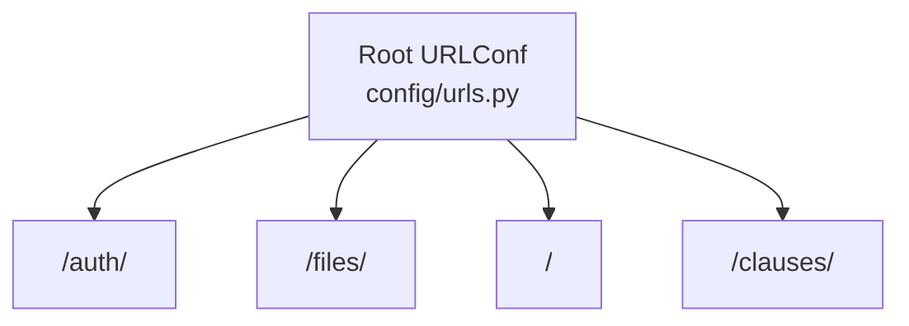
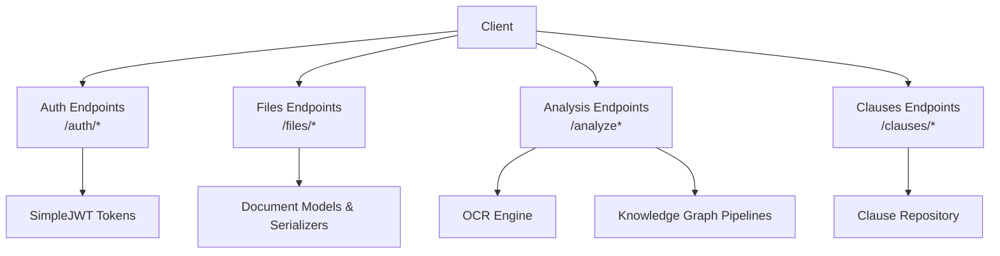
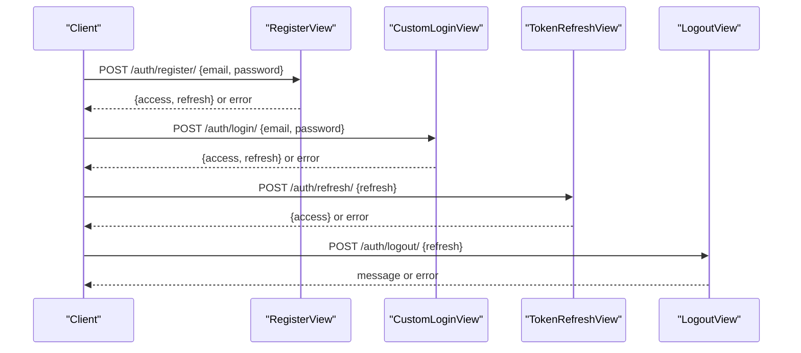
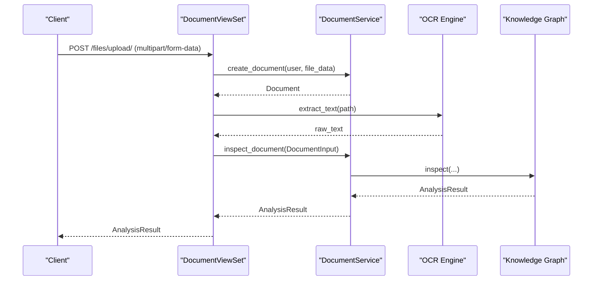
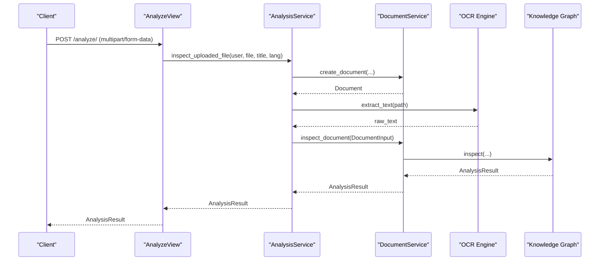
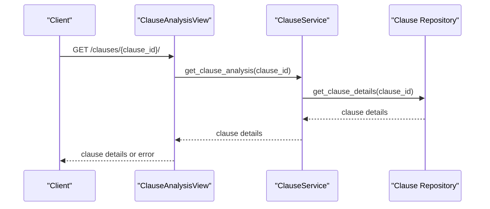
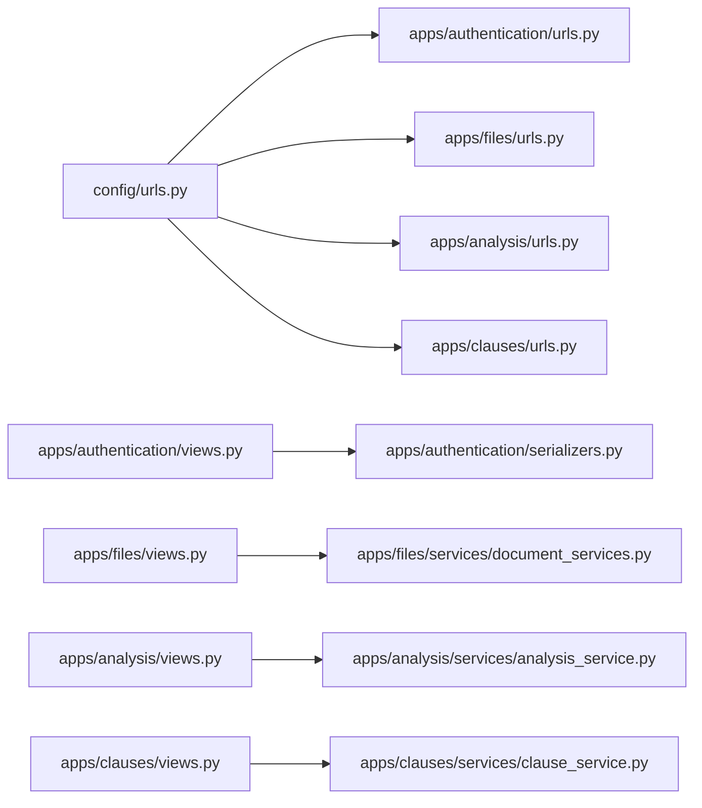
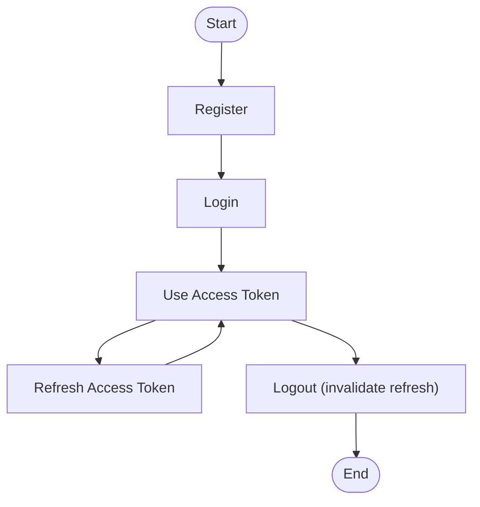

# API Reference

<cite>
**Referenced Files in This Document**
- [config/urls.py](file://config/urls.py)
- [apps/authentication/urls.py](file://apps/authentication/urls.py)
- [apps/authentication/views.py](file://apps/authentication/views.py)
- [apps/authentication/serializers.py](file://apps/authentication/serializers.py)
- [apps/files/urls.py](file://apps/files/urls.py)
- [apps/files/views.py](file://apps/files/views.py)
- [apps/files/models.py](file://apps/files/models.py)
- [apps/files/serializers.py](file://apps/files/serializers.py)
- [apps/files/services/document_services.py](file://apps/files/services/document_services.py)
- [apps/analysis/urls.py](file://apps/analysis/urls.py)
- [apps/analysis/views.py](file://apps/analysis/views.py)
- [apps/clauses/urls.py](file://apps/clauses/urls.py)
- [apps/clauses/views.py](file://apps/clauses/views.py)
- [apps/clauses/services/clause_service.py](file://apps/clauses/services/clause_service.py)
</cite>

## Table of Contents
1. [Introduction](#introduction)
2. [Project Structure](#project-structure)
3. [Core Components](#core-components)
4. [Architecture Overview](#architecture-overview)
5. [Detailed Component Analysis](#detailed-component-analysis)
6. [Dependency Analysis](#dependency-analysis)
7. [Performance Considerations](#performance-considerations)
8. [Troubleshooting Guide](#troubleshooting-guide)
9. [Conclusion](#conclusion)
10. [Appendices](#appendices)

## Introduction
This document provides a comprehensive API reference for Veritas Shield’s RESTful endpoints. It covers authentication, document management, clause analysis, and related workflows. For each endpoint, you will find HTTP methods, URL patterns, request/response schemas, authentication requirements, error codes, and practical curl examples. It also documents rate limiting, pagination strategies, API versioning approach, authentication flows, session/token management, security considerations, CORS configuration, and monitoring approaches.

## Project Structure
The API is organized by app namespaces under the main URL router. The primary routes are:
- Authentication endpoints: /auth/
- Document management endpoints: /files/
- Analysis endpoints: /
- Clause analysis endpoints: /clauses/

**Diagram sources**
- [config/urls.py:23-30](file://config/urls.py#L23-L30)
- [apps/authentication/urls.py:8-14](file://apps/authentication/urls.py#L8-L14)
- [apps/files/urls.py:6-28](file://apps/files/urls.py#L6-L28)
- [apps/analysis/urls.py:5-8](file://apps/analysis/urls.py#L5-L8)
- [apps/clauses/urls.py:5-11](file://apps/clauses/urls.py#L5-L11)

**Section sources**
- [config/urls.py:23-30](file://config/urls.py#L23-L30)

## Core Components
- Authentication: JWT-based login, registration, logout, and refresh using SimpleJWT.
- Documents: CRUD operations on documents with upload and clause retrieval.
- Analysis: Document inspection (OCR + AI analysis) and saving analysis into the knowledge graph.
- Clauses: Retrieval of clause analysis including conflicts and similar clauses.

Key permissions:
- Authentication endpoints: open or require authenticated access depending on action.
- Documents: admin-only CRUD; authenticated access for clause retrieval.
- Analysis: authenticated access.
- Clauses: authenticated access.

**Section sources**
- [apps/authentication/views.py:14-74](file://apps/authentication/views.py#L14-L74)
- [apps/files/views.py:11-35](file://apps/files/views.py#L11-L35)
- [apps/analysis/views.py:15-100](file://apps/analysis/views.py#L15-L100)
- [apps/clauses/views.py:9-31](file://apps/clauses/views.py#L9-L31)

## Architecture Overview
High-level API flow:
- Clients authenticate to obtain tokens.
- Clients upload documents or trigger analysis.
- Backend orchestrates OCR, AI inspection, and knowledge graph insertion.
- Clients query clause analysis and document-related clauses.

**Diagram sources**
- [apps/authentication/views.py:72-74](file://apps/authentication/views.py#L72-L74)
- [apps/files/services/document_services.py:16-126](file://apps/files/services/document_services.py#L16-L126)
- [apps/clauses/services/clause_service.py:4-20](file://apps/clauses/services/clause_service.py#L4-L20)

## Detailed Component Analysis

### Authentication Endpoints
- Base path: /auth/
- Methods and URLs:
  - POST /auth/register/
  - POST /auth/login/
  - POST /auth/logout/
  - POST /auth/refresh/

Authentication flow:
- Registration creates a user and returns access and refresh tokens.
- Login exchanges credentials for a JWT pair.
- Logout invalidates the refresh token by blacklisting it.
- Refresh obtains a new access token using the refresh token.

**Diagram sources**
- [apps/authentication/urls.py:8-14](file://apps/authentication/urls.py#L8-L14)
- [apps/authentication/views.py:14-74](file://apps/authentication/views.py#L14-L74)
- [apps/authentication/serializers.py:4-6](file://apps/authentication/serializers.py#L4-L6)

Endpoint details:
- POST /auth/register/
  - Request body: { email, password }
  - Response: { access, refresh } on success; error on failure.
  - Errors: 400 (missing data or duplicate email), 500 (creation failed).
- POST /auth/login/
  - Request body: { email, password }
  - Response: { access, refresh } on success; error on failure.
  - Errors: 400/401 on invalid credentials.
- POST /auth/logout/
  - Request body: { refresh }
  - Response: message on success; error on failure.
  - Errors: 400 (missing refresh), 400 (invalid token), 205 reset on success.
- POST /auth/refresh/
  - Request body: { refresh }
  - Response: { access } on success; error on failure.
  - Errors: 400 on invalid/expired token.

curl examples:
- Register: curl -X POST https://host/auth/register/ -H "Content-Type: application/json" -d '{"email":"user@example.com","password":"pass"}'
- Login: curl -X POST https://host/auth/login/ -H "Content-Type: application/json" -d '{"email":"user@example.com","password":"pass"}'
- Refresh: curl -X POST https://host/auth/refresh/ -H "Content-Type: application/json" -d '{"refresh":"<your_refresh_token>"}'
- Logout: curl -X POST https://host/auth/logout/ -H "Content-Type: application/json" -d '{"refresh":"<your_refresh_token>"}'

Security notes:
- Use HTTPS in production.
- Store refresh tokens securely; consider short-lived access tokens and long-lived refresh tokens.
- Invalidate refresh tokens on logout.

**Section sources**
- [apps/authentication/urls.py:8-14](file://apps/authentication/urls.py#L8-L14)
- [apps/authentication/views.py:14-74](file://apps/authentication/views.py#L14-L74)
- [apps/authentication/serializers.py:4-6](file://apps/authentication/serializers.py#L4-L6)

### Document Management Endpoints
- Base path: /files/
- Methods and URLs:
  - GET /files/documents/
  - POST /files/documents/
  - POST /files/upload/
  - GET /files/documents/{id}/
  - PUT /files/documents/{id}/
  - DELETE /files/documents/{id}/
  - GET /files/documents/{doc_id}/clauses/

Permissions:
- Document CRUD: admin-only.
- Document clauses retrieval: authenticated.

**Diagram sources**
- [apps/files/urls.py:6-28](file://apps/files/urls.py#L6-L28)
- [apps/files/views.py:11-35](file://apps/files/views.py#L11-L35)
- [apps/files/services/document_services.py:16-126](file://apps/files/services/document_services.py#L16-L126)

Endpoint details:
- GET /files/documents/
  - Query parameters: none defined in current URLConf; pagination depends on DRF defaults.
  - Response: paginated list of documents (fields per serializer).
  - Errors: 401 if not authenticated; 403 if not admin.
- POST /files/documents/
  - Request body: fields allowed by DocumentCreateSerializer.
  - Response: created document (fields per serializer).
  - Errors: 400 on validation; 401 if not authenticated; 403 if not admin.
- POST /files/upload/
  - Request body: multipart/form-data with file and optional title/language.
  - Response: analysis result (OCR + AI inspection).
  - Errors: 400 (no file or validation), 500 (inspection failed).
- GET /files/documents/{id}/
  - Response: document details (fields per serializer).
  - Errors: 404 if not found; 401/403 otherwise.
- PUT /files/documents/{id}/
  - Response: updated document.
  - Errors: 404/400/401/403.
- DELETE /files/documents/{id}/
  - Response: empty on success.
  - Errors: 404/401/403.
- GET /files/documents/{doc_id}/clauses/
  - Response: list of clauses for the document.
  - Errors: 404 if clauses not found; 401 if not authenticated.

curl examples:
- Upload: curl -X POST https://host/files/upload/ -H "Authorization: Bearer <access>" -F "file=@/path/to/doc.pdf" -F "title=Contract Q3" -F "language=en"
- List: curl -X GET https://host/files/documents/?page=1&page_size=20 -H "Authorization: Bearer <access>"
- Get clauses: curl -X GET https://host/files/documents/123/clauses/ -H "Authorization: Bearer <access>"

Response schemas:
- Document fields: id, file, user, file_extension, uploaded_at, signed_at, lang, raw_text, confidence, title.
- Analysis result: shape returned by inspection pipeline (see services).

**Section sources**
- [apps/files/urls.py:6-28](file://apps/files/urls.py#L6-L28)
- [apps/files/views.py:11-35](file://apps/files/views.py#L11-L35)
- [apps/files/serializers.py:6-61](file://apps/files/serializers.py#L6-L61)
- [apps/files/models.py:5-18](file://apps/files/models.py#L5-L18)
- [apps/files/services/document_services.py:16-126](file://apps/files/services/document_services.py#L16-L126)

### Analysis Endpoints
- Base path: / (under analysis app)
- Methods and URLs:
  - POST /analyze/
  - POST /analyze/save/

Permissions: authenticated.

**Diagram sources**
- [apps/analysis/urls.py:5-8](file://apps/analysis/urls.py#L5-L8)
- [apps/analysis/views.py:15-100](file://apps/analysis/views.py#L15-L100)
- [apps/analysis/services/analysis_service.py:18-90](file://apps/analysis/services/analysis_service.py#L18-L90)
- [apps/files/services/document_services.py:16-126](file://apps/files/services/document_services.py#L16-L126)

Endpoint details:
- POST /analyze/
  - Request body: multipart/form-data with file and optional title, language.
  - Response: analysis result (OCR + AI inspection).
  - Errors: 400 (validation/no file), 500 (failure).
- POST /analyze/save/
  - Request body: { doc_id }.
  - Response: analysis result (insertion into knowledge graph).
  - Errors: 400 (business rule), 404 (document not found), 500 (failure).

curl examples:
- Analyze: curl -X POST https://host/analyze/ -H "Authorization: Bearer <access>" -F "file=@/path/to/doc.pdf" -F "title=Contract Q3" -F "language=en"
- Save: curl -X POST https://host/analyze/save/ -H "Authorization: Bearer <access>" -H "Content-Type: application/json" -d '{"doc_id":123}'

**Section sources**
- [apps/analysis/urls.py:5-8](file://apps/analysis/urls.py#L5-L8)
- [apps/analysis/views.py:15-100](file://apps/analysis/views.py#L15-L100)
- [apps/analysis/services/analysis_service.py:18-90](file://apps/analysis/services/analysis_service.py#L18-L90)

### Clause Analysis Endpoints
- Base path: /clauses/
- Methods and URLs:
  - GET /clauses/{clause_id}/

Permissions: authenticated.

**Diagram sources**
- [apps/clauses/urls.py:5-11](file://apps/clauses/urls.py#L5-L11)
- [apps/clauses/views.py:9-31](file://apps/clauses/views.py#L9-L31)
- [apps/clauses/services/clause_service.py:4-20](file://apps/clauses/services/clause_service.py#L4-L20)

Endpoint details:
- GET /clauses/{clause_id}/
  - Response: clause analysis including conflicts and similar clauses.
  - Errors: 404 if not found; 401 if not authenticated.

curl example:
- Get clause analysis: curl -X GET https://host/clauses/456/ -H "Authorization: Bearer <access>"

**Section sources**
- [apps/clauses/urls.py:5-11](file://apps/clauses/urls.py#L5-L11)
- [apps/clauses/views.py:9-31](file://apps/clauses/views.py#L9-L31)
- [apps/clauses/services/clause_service.py:4-20](file://apps/clauses/services/clause_service.py#L4-L20)

## Dependency Analysis
- URL routing delegates to app-specific routers.
- Views depend on serializers and services.
- Services integrate OCR and knowledge graph pipelines.
- Authentication uses SimpleJWT with a custom serializer.

**Diagram sources**
- [config/urls.py:23-30](file://config/urls.py#L23-L30)
- [apps/authentication/urls.py:8-14](file://apps/authentication/urls.py#L8-L14)
- [apps/files/urls.py:6-28](file://apps/files/urls.py#L6-L28)
- [apps/analysis/urls.py:5-8](file://apps/analysis/urls.py#L5-L8)
- [apps/clauses/urls.py:5-11](file://apps/clauses/urls.py#L5-L11)
- [apps/authentication/views.py:72-74](file://apps/authentication/views.py#L72-L74)
- [apps/files/views.py:11-35](file://apps/files/views.py#L11-L35)
- [apps/analysis/views.py:15-100](file://apps/analysis/views.py#L15-L100)
- [apps/clauses/views.py:9-31](file://apps/clauses/views.py#L9-L31)

**Section sources**
- [config/urls.py:23-30](file://config/urls.py#L23-L30)
- [apps/authentication/views.py:72-74](file://apps/authentication/views.py#L72-L74)
- [apps/files/views.py:11-35](file://apps/files/views.py#L11-L35)
- [apps/analysis/views.py:15-100](file://apps/analysis/views.py#L15-L100)
- [apps/clauses/views.py:9-31](file://apps/clauses/views.py#L9-L31)

## Performance Considerations
- Pagination: DRF default pagination applies to list endpoints; configure page_size and max_page_size in settings if needed.
- Rate limiting: Not implemented in the current codebase; consider adding throttling policies at the view level or via middleware.
- Concurrency: OCR and graph insertion are CPU-bound; scale horizontally and queue async tasks if throughput increases.
- Caching: Cache clause retrieval results where appropriate to reduce DB load.

[No sources needed since this section provides general guidance]

## Troubleshooting Guide
Common errors and resolutions:
- Authentication failures:
  - 401 Unauthorized: Missing or invalid Authorization header.
  - 403 Forbidden: Insufficient permissions (admin required for document CRUD).
  - 400 Bad Request: Invalid credentials or missing refresh token on logout.
- Document operations:
  - 404 Not Found: Document or clause not found.
  - 400 Bad Request: Validation errors or missing file for upload.
  - 500 Internal Server Error: OCR or analysis pipeline failure.
- Logout:
  - Ensure refresh token is valid and present.

**Section sources**
- [apps/authentication/views.py:45-74](file://apps/authentication/views.py#L45-L74)
- [apps/files/views.py:17-35](file://apps/files/views.py#L17-L35)
- [apps/analysis/views.py:22-56](file://apps/analysis/views.py#L22-L56)
- [apps/clauses/views.py:16-31](file://apps/clauses/views.py#L16-L31)

## Conclusion
Veritas Shield exposes a clear set of REST endpoints for authentication, document lifecycle, OCR-driven analysis, and clause insights. The API follows JWT-based authentication, uses DRF serializers for validation, and integrates OCR and knowledge graph pipelines. Adopt the recommended security and operational practices to ensure robust deployments.

[No sources needed since this section summarizes without analyzing specific files]

## Appendices

### Authentication Flow and Session Management
- Registration: receive initial tokens.
- Login: obtain access/refresh pair.
- Access token usage: attach Authorization: Bearer <access> to protected endpoints.
- Token refresh: use refresh endpoint to renew access.
- Logout: blacklist refresh token to invalidate sessions.

[No sources needed since this diagram shows conceptual workflow, not actual code structure]

### CORS Configuration
- Configure allowed origins, methods, and headers in Django settings for cross-origin requests.
- Enable credentials if sending cookies or Authorization headers.

[No sources needed since this section provides general guidance]

### Monitoring Approaches
- Track request latency, error rates, and token issuance/refresh counts.
- Instrument views and services to capture timing and exceptions.
- Log authentication events and document operations for auditability.

[No sources needed since this section provides general guidance]