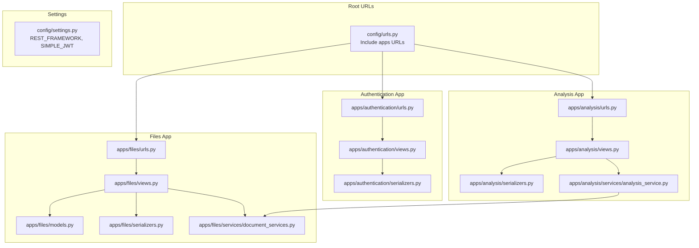
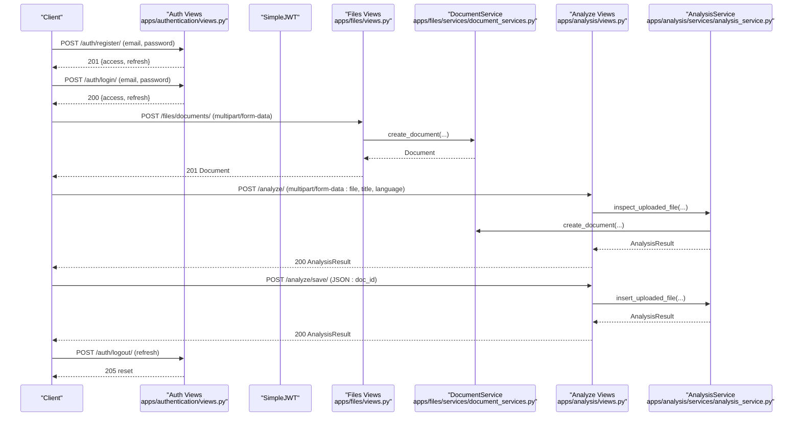
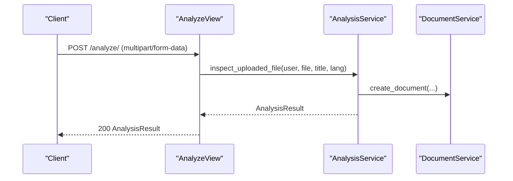
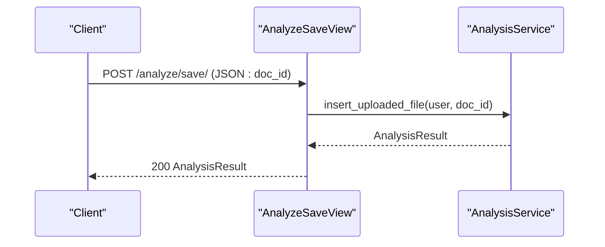
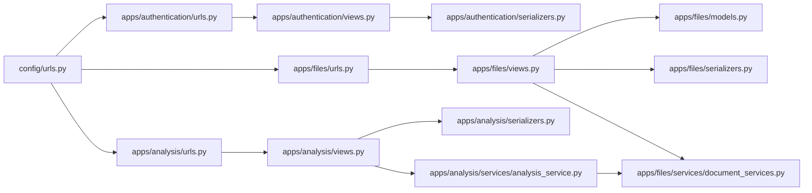
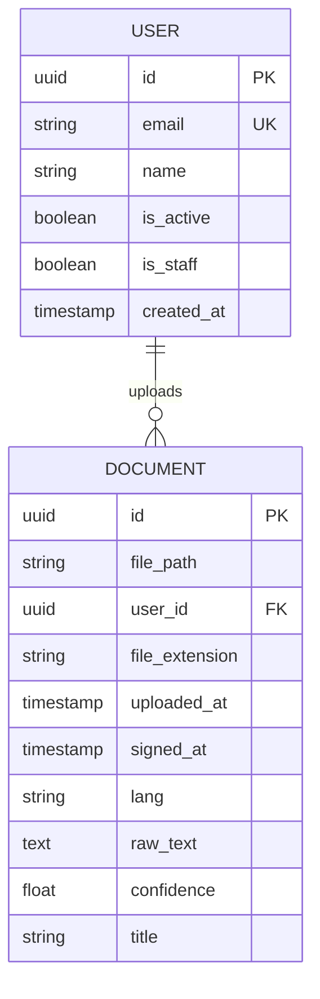

# API Reference

<cite>
**Referenced Files in This Document**
- [config/urls.py](file://config/urls.py)
- [config/settings.py](file://config/settings.py)
- [apps/authentication/views.py](file://apps/authentication/views.py)
- [apps/authentication/urls.py](file://apps/authentication/urls.py)
- [apps/authentication/serializers.py](file://apps/authentication/serializers.py)
- [apps/files/views.py](file://apps/files/views.py)
- [apps/files/urls.py](file://apps/files/urls.py)
- [apps/files/models.py](file://apps/files/models.py)
- [apps/files/serializers.py](file://apps/files/serializers.py)
- [apps/analysis/views.py](file://apps/analysis/views.py)
- [apps/analysis/urls.py](file://apps/analysis/urls.py)
- [apps/analysis/serializers.py](file://apps/analysis/serializers.py)
- [apps/analysis/services/analysis_service.py](file://apps/analysis/services/analysis_service.py)
- [apps/files/services/document_services.py](file://apps/files/services/document_services.py)
- [apps/users/models.py](file://apps/users/models.py)
</cite>

## Table of Contents
1. [Introduction](#introduction)
2. [Project Structure](#project-structure)
3. [Core Components](#core-components)
4. [Architecture Overview](#architecture-overview)
5. [Detailed Component Analysis](#detailed-component-analysis)
6. [Dependency Analysis](#dependency-analysis)
7. [Performance Considerations](#performance-considerations)
8. [Troubleshooting Guide](#troubleshooting-guide)
9. [Conclusion](#conclusion)
10. [Appendices](#appendices)

## Introduction
This document provides a comprehensive API reference for the VeritasShield backend. It covers authentication endpoints, document management endpoints, and analysis endpoints. For each endpoint, you will find:
- Endpoint URL and HTTP method
- Authentication requirements (Bearer JWT)
- Request and response schemas
- Parameter validation rules
- cURL examples
- Client implementation guidelines

The backend is built with Django and Django REST Framework, using Django REST Framework SimpleJWT for authentication and blacklisting for logout. Media files are served under the configured MEDIA URL.

## Project Structure
The API is organized by app:
- Authentication: user registration, login, logout, and token refresh
- Files: document CRUD and upload
- Analysis: document inspection and saving results to the knowledge graph

**Diagram sources**
- [config/urls.py:23-30](file://config/urls.py#L23-L30)
- [apps/authentication/urls.py:8-14](file://apps/authentication/urls.py#L8-L14)
- [apps/files/urls.py:6-23](file://apps/files/urls.py#L6-L23)
- [apps/analysis/urls.py:5-8](file://apps/analysis/urls.py#L5-L8)
- [config/settings.py:125-143](file://config/settings.py#L125-L143)

**Section sources**
- [config/urls.py:23-30](file://config/urls.py#L23-L30)
- [config/settings.py:125-143](file://config/settings.py#L125-L143)

## Core Components
- Authentication endpoints
  - POST /auth/login/
  - POST /auth/register/
  - POST /auth/logout/
  - POST /auth/refresh/
- Document management endpoints
  - GET /files/documents/
  - POST /files/documents/ (multipart/form-data)
  - GET /files/documents/{id}/
  - PUT /files/documents/{id}/
  - DELETE /files/documents/{id}/
  - POST /files/upload/ (multipart/form-data)
- Analysis endpoints
  - POST /analyze/
  - POST /analyze/save/

Authentication is handled via Bearer JWT tokens. The default renderer is JSON, and parsers support JSON and multipart/form-data.

**Section sources**
- [apps/authentication/urls.py:8-14](file://apps/authentication/urls.py#L8-L14)
- [apps/files/urls.py:6-23](file://apps/files/urls.py#L6-L23)
- [apps/analysis/urls.py:5-8](file://apps/analysis/urls.py#L5-L8)
- [config/settings.py:125-143](file://config/settings.py#L125-L143)

## Architecture Overview
High-level flow for authentication and analysis:

**Diagram sources**
- [apps/authentication/views.py:14-74](file://apps/authentication/views.py#L14-L74)
- [apps/files/views.py:8-12](file://apps/files/views.py#L8-L12)
- [apps/files/services/document_services.py:83-110](file://apps/files/services/document_services.py#L83-L110)
- [apps/analysis/views.py:15-100](file://apps/analysis/views.py#L15-L100)
- [apps/analysis/services/analysis_service.py:18-50](file://apps/analysis/services/analysis_service.py#L18-L50)

## Detailed Component Analysis

### Authentication Endpoints

#### POST /auth/register/
- Description: Registers a new user and returns JWT tokens.
- Authentication: Not required.
- Request body:
  - email: string, required
  - password: string, required
- Response:
  - 201 Created: { access: string, refresh: string }
  - 400 Bad Request: { error: string } (missing data or email exists)
  - 500 Internal Server Error: { error: string } (creation failed)
- cURL example:
  - curl -X POST http://localhost:8000/auth/register/ -H "Content-Type: application/json" -d '{"email":"user@example.com","password":"pass"}'
- Client implementation guidelines:
  - On success, store both access and refresh tokens.
  - Use access token for subsequent authenticated requests.

**Section sources**
- [apps/authentication/views.py:14-42](file://apps/authentication/views.py#L14-L42)
- [apps/authentication/urls.py:11](file://apps/authentication/urls.py#L11)
- [apps/authentication/serializers.py:4-5](file://apps/authentication/serializers.py#L4-L5)

#### POST /auth/login/
- Description: Logs in a user and returns JWT tokens.
- Authentication: Not required.
- Request body:
  - email: string, required
  - password: string, required
- Response:
  - 200 OK: { access: string, refresh: string }
  - 401 Unauthorized: authentication fails
- cURL example:
  - curl -X POST http://localhost:8000/auth/login/ -H "Content-Type: application/json" -d '{"email":"user@example.com","password":"pass"}'
- Client implementation guidelines:
  - On success, store both access and refresh tokens.
  - Use access token for subsequent authenticated requests.

**Section sources**
- [apps/authentication/views.py:72-74](file://apps/authentication/views.py#L72-L74)
- [apps/authentication/urls.py:9](file://apps/authentication/urls.py#L9)
- [apps/authentication/serializers.py:4-5](file://apps/authentication/serializers.py#L4-L5)

#### POST /auth/logout/
- Description: Terminates the current session by blacklisting the refresh token.
- Authentication: Bearer JWT required.
- Request body:
  - refresh: string, required
- Response:
  - 205 Reset Content: { message: string }
  - 400 Bad Request: { error: string } (invalid or missing refresh token)
- cURL example:
  - curl -X POST http://localhost:8000/auth/logout/ -H "Authorization: Bearer <access>" -H "Content-Type: application/json" -d '{"refresh":"<refresh>"}'
- Client implementation guidelines:
  - Send the refresh token received during login/register.
  - Clear stored tokens after successful logout.

**Section sources**
- [apps/authentication/views.py:45-69](file://apps/authentication/views.py#L45-L69)
- [apps/authentication/urls.py:10](file://apps/authentication/urls.py#L10)

#### POST /auth/refresh/
- Description: Refreshes the access token using a valid refresh token.
- Authentication: Not required.
- Request body:
  - refresh: string, required
- Response:
  - 200 OK: { access: string }
  - 401 Unauthorized: invalid or expired refresh token
- cURL example:
  - curl -X POST http://localhost:8000/auth/refresh/ -H "Content-Type: application/json" -d '{"refresh":"<refresh>"}'

**Section sources**
- [apps/authentication/urls.py:12](file://apps/authentication/urls.py#L12)

### Document Management Endpoints

#### GET /files/documents/
- Description: Lists all documents (admin-only).
- Authentication: Bearer JWT required.
- Response:
  - 200 OK: Array of documents
- cURL example:
  - curl -X GET http://localhost:8000/files/documents/ -H "Authorization: Bearer <access>"

**Section sources**
- [apps/files/urls.py:8-11](file://apps/files/urls.py#L8-L11)
- [apps/files/views.py:8-12](file://apps/files/views.py#L8-L12)

#### POST /files/documents/
- Description: Creates a new document (admin-only).
- Authentication: Bearer JWT required.
- Request body (multipart/form-data):
  - file: file, required
  - title: string, optional
  - lang: string, optional, default "en"
- Response:
  - 201 Created: Document object
  - 400 Bad Request: Validation errors
- cURL example:
  - curl -X POST http://localhost:8000/files/documents/ -H "Authorization: Bearer <access>" -F "file=@/path/to/file.pdf" -F "title=Contract A" -F "lang=en"
- Notes:
  - Supported file types are validated in the serializer.

**Section sources**
- [apps/files/urls.py:8-11](file://apps/files/urls.py#L8-L11)
- [apps/files/views.py:8-12](file://apps/files/views.py#L8-L12)
- [apps/files/serializers.py:48-52](file://apps/files/serializers.py#L48-L52)

#### GET /files/documents/{id}/
- Description: Retrieves a document by ID (admin-only).
- Authentication: Bearer JWT required.
- Response:
  - 200 OK: Document object
  - 404 Not Found: Document does not exist
- cURL example:
  - curl -X GET http://localhost:8000/files/documents/1/ -H "Authorization: Bearer <access>"

**Section sources**
- [apps/files/urls.py:16-22](file://apps/files/urls.py#L16-L22)
- [apps/files/views.py:8-12](file://apps/files/views.py#L8-L12)

#### PUT /files/documents/{id}/
- Description: Updates a document by ID (admin-only).
- Authentication: Bearer JWT required.
- Response:
  - 200 OK: Updated document object
  - 404 Not Found: Document does not exist
- cURL example:
  - curl -X PUT http://localhost:8000/files/documents/1/ -H "Authorization: Bearer <access>" -H "Content-Type: application/json" -d '{"title":"Updated Title"}'

**Section sources**
- [apps/files/urls.py:16-22](file://apps/files/urls.py#L16-L22)
- [apps/files/views.py:8-12](file://apps/files/views.py#L8-L12)

#### DELETE /files/documents/{id}/
- Description: Deletes a document by ID (admin-only).
- Authentication: Bearer JWT required.
- Response:
  - 204 No Content
  - 404 Not Found: Document does not exist
- cURL example:
  - curl -X DELETE http://localhost:8000/files/documents/1/ -H "Authorization: Bearer <access>"

**Section sources**
- [apps/files/urls.py:16-22](file://apps/files/urls.py#L16-L22)
- [apps/files/views.py:8-12](file://apps/files/views.py#L8-L12)

#### POST /files/upload/
- Description: Uploads a file (admin-only).
- Authentication: Bearer JWT required.
- Request body (multipart/form-data):
  - file: file, required
  - title: string, optional
  - lang: string, optional, default "en"
- Response:
  - 201 Created: Document object
  - 400 Bad Request: Validation errors
- cURL example:
  - curl -X POST http://localhost:8000/files/upload/ -H "Authorization: Bearer <access>" -F "file=@/path/to/file.pdf"

**Section sources**
- [apps/files/urls.py:12-15](file://apps/files/urls.py#L12-L15)
- [apps/files/views.py:8-12](file://apps/files/views.py#L8-L12)
- [apps/files/serializers.py:48-52](file://apps/files/serializers.py#L48-L52)

### Analysis Endpoints

#### POST /analyze/
- Description: Initiates analysis workflow: upload -> OCR -> analyze -> return result.
- Authentication: Bearer JWT required.
- Request body (multipart/form-data):
  - file: file, required
  - title: string, optional
  - language: string, optional, default "en"
- Response:
  - 200 OK: AnalysisResult object
  - 400 Bad Request: Validation errors or missing file
  - 500 Internal Server Error: Analysis failed
- cURL example:
  - curl -X POST http://localhost:8000/analyze/ -H "Authorization: Bearer <access>" -F "file=@/path/to/file.pdf" -F "title=Contract A" -F "language=en"
- Notes:
  - The service extracts text and performs inspection using external AI/OCR pipelines.

**Diagram sources**
- [apps/analysis/views.py:22-56](file://apps/analysis/views.py#L22-L56)
- [apps/analysis/services/analysis_service.py:18-50](file://apps/analysis/services/analysis_service.py#L18-L50)
- [apps/files/services/document_services.py:83-110](file://apps/files/services/document_services.py#L83-L110)

**Section sources**
- [apps/analysis/views.py:15-57](file://apps/analysis/views.py#L15-L57)
- [apps/analysis/urls.py:6](file://apps/analysis/urls.py#L6)
- [apps/analysis/serializers.py:77-84](file://apps/analysis/serializers.py#L77-L84)

#### POST /analyze/save/
- Description: Saves/inserts analysis for an existing document into the knowledge graph.
- Authentication: Bearer JWT required.
- Request body (JSON):
  - doc_id: integer, required
- Response:
  - 200 OK: AnalysisResult object
  - 400 Bad Request: Missing raw_text or invalid input
  - 404 Not Found: Document does not exist
  - 500 Internal Server Error: Insertion failed
- cURL example:
  - curl -X POST http://localhost:8000/analyze/save/ -H "Authorization: Bearer <access>" -H "Content-Type: application/json" -d '{"doc_id":1}'
- Notes:
  - Requires that the document has raw_text (obtained from /analyze/).

**Diagram sources**
- [apps/analysis/views.py:66-99](file://apps/analysis/views.py#L66-L99)
- [apps/analysis/services/analysis_service.py:52-80](file://apps/analysis/services/analysis_service.py#L52-L80)

**Section sources**
- [apps/analysis/views.py:59-99](file://apps/analysis/views.py#L59-L99)
- [apps/analysis/urls.py:7](file://apps/analysis/urls.py#L7)
- [apps/analysis/serializers.py:87-93](file://apps/analysis/serializers.py#L87-L93)

### Request/Response Schemas

#### Authentication
- POST /auth/register/
  - Request: { email: string, password: string }
  - Response: { access: string, refresh: string }
- POST /auth/login/
  - Request: { email: string, password: string }
  - Response: { access: string, refresh: string }
- POST /auth/logout/
  - Request: { refresh: string }
  - Response: { message: string }
- POST /auth/refresh/
  - Request: { refresh: string }
  - Response: { access: string }

#### Documents
- POST /files/documents/ (create)
  - Request: multipart/form-data { file: file, title?: string, lang?: string }
  - Response: Document object
- GET /files/documents/
  - Response: Array of Document objects
- GET /files/documents/{id}/
  - Response: Document object
- PUT /files/documents/{id}/
  - Request: JSON { title?: string, ... }
  - Response: Document object
- DELETE /files/documents/{id}/
  - Response: 204 No Content
- POST /files/upload/
  - Request: multipart/form-data { file: file, title?: string, lang?: string }
  - Response: Document object

#### Analysis
- POST /analyze/
  - Request: multipart/form-data { file: file, title?: string, language?: string }
  - Response: AnalysisResult object
- POST /analyze/save/
  - Request: JSON { doc_id: integer }
  - Response: AnalysisResult object

#### AnalysisResult (response)
- document_id: integer
- doc_type: string
- clauses: array of Clause
- similar_pairs: array of SimilarityMatch
- conflicts: array of Conflict

##### Clause
- clause_id: integer
- clause_text: string
- clause_type: string

##### SimilarityMatch
- new_clause_id: integer
- new_clause_text: string
- existing_clause_id: integer
- existing_clause_text: string
- existing_doc_title: string
- score: number (0.0 to 1.0)

##### Conflict
- new_clause_id: integer
- new_clause_text: string
- existing_clause_id: integer
- existing_clause_text: string
- existing_doc_title: string
- score: number (0.0 to 1.0)
- reason: string

**Section sources**
- [apps/analysis/serializers.py:53-70](file://apps/analysis/serializers.py#L53-L70)
- [apps/analysis/serializers.py:8-46](file://apps/analysis/serializers.py#L8-L46)
- [apps/files/serializers.py:6-29](file://apps/files/serializers.py#L6-L29)

### Parameter Validation Rules
- Authentication
  - email: required for login/register; must be unique for register
  - password: required for register/login
- Documents
  - file: required for upload; supported extensions validated by serializer
  - title: optional; defaults to filename if not provided
  - lang: optional; defaults to "en"
- Analysis
  - /analyze/: file is required; title and language are optional
  - /analyze/save/: doc_id is required; document must have raw_text

**Section sources**
- [apps/authentication/views.py:19-27](file://apps/authentication/views.py#L19-L27)
- [apps/files/serializers.py:48-52](file://apps/files/serializers.py#L48-L52)
- [apps/analysis/serializers.py:77-84](file://apps/analysis/serializers.py#L77-L84)
- [apps/analysis/serializers.py:87-93](file://apps/analysis/serializers.py#L87-L93)
- [apps/analysis/services/analysis_service.py:62-65](file://apps/analysis/services/analysis_service.py#L62-L65)

### Error Response Codes
- 400 Bad Request
  - Missing or invalid parameters
  - Unsupported file type
  - Invalid or missing refresh token
- 401 Unauthorized
  - Invalid credentials or missing/invalid JWT
- 404 Not Found
  - Document not found
- 403 Forbidden
  - Access restricted to admin users for document endpoints
- 500 Internal Server Error
  - Analysis or insertion failure

**Section sources**
- [apps/authentication/views.py:20-27](file://apps/authentication/views.py#L20-L27)
- [apps/authentication/views.py:52-56](file://apps/authentication/views.py#L52-L56)
- [apps/authentication/views.py:66-69](file://apps/authentication/views.py#L66-L69)
- [apps/analysis/views.py:34-38](file://apps/analysis/views.py#L34-L38)
- [apps/analysis/views.py:89-94](file://apps/analysis/views.py#L89-L94)
- [apps/analysis/views.py:52-56](file://apps/analysis/views.py#L52-L56)
- [apps/analysis/views.py:95-99](file://apps/analysis/views.py#L95-L99)
- [apps/files/views.py:8-12](file://apps/files/views.py#L8-L12)

### Authentication Requirements and Bearer Tokens
- All protected endpoints require Authorization: Bearer <access-token>.
- Access tokens are short-lived; use the refresh endpoint to obtain a new access token.
- Logout invalidates the refresh token by blacklisting.

**Section sources**
- [config/settings.py:125-143](file://config/settings.py#L125-L143)
- [apps/authentication/views.py:45-69](file://apps/authentication/views.py#L45-L69)

### cURL Examples
- Register
  - curl -X POST http://localhost:8000/auth/register/ -H "Content-Type: application/json" -d '{"email":"user@example.com","password":"pass"}'
- Login
  - curl -X POST http://localhost:8000/auth/login/ -H "Content-Type: application/json" -d '{"email":"user@example.com","password":"pass"}'
- Logout
  - curl -X POST http://localhost:8000/auth/logout/ -H "Authorization: Bearer <access>" -H "Content-Type: application/json" -d '{"refresh":"<refresh>"}'
- Upload document
  - curl -X POST http://localhost:8000/files/documents/ -H "Authorization: Bearer <access>" -F "file=@/path/to/file.pdf" -F "title=Contract A" -F "lang=en"
- Analyze
  - curl -X POST http://localhost:8000/analyze/ -H "Authorization: Bearer <access>" -F "file=@/path/to/file.pdf" -F "title=Contract A" -F "language=en"
- Save analysis
  - curl -X POST http://localhost:8000/analyze/save/ -H "Authorization: Bearer <access>" -H "Content-Type: application/json" -d '{"doc_id":1}'

[No sources needed since this section aggregates previously cited examples]

## Dependency Analysis
Key dependencies and relationships:
- URL routing delegates to app-specific URL patterns.
- Views depend on serializers for validation and on services for business logic.
- Services depend on external AI/OCR pipelines and the knowledge graph connection.
- Settings configure JWT authentication, parser/renderers, and media serving.

**Diagram sources**
- [config/urls.py:23-30](file://config/urls.py#L23-L30)
- [apps/authentication/urls.py:8-14](file://apps/authentication/urls.py#L8-L14)
- [apps/files/urls.py:6-23](file://apps/files/urls.py#L6-L23)
- [apps/analysis/urls.py:5-8](file://apps/analysis/urls.py#L5-L8)

**Section sources**
- [config/urls.py:23-30](file://config/urls.py#L23-L30)
- [apps/files/services/document_services.py:14-21](file://apps/files/services/document_services.py#L14-L21)
- [apps/analysis/services/analysis_service.py:12-13](file://apps/analysis/services/analysis_service.py#L12-L13)

## Performance Considerations
- Use pagination for listing documents if the dataset grows large.
- Optimize OCR and AI pipeline calls; consider asynchronous processing for long-running tasks.
- Cache frequently accessed metadata where appropriate.
- Monitor token lifetimes and refresh strategies to minimize re-authentication overhead.

[No sources needed since this section provides general guidance]

## Troubleshooting Guide
- 400 Bad Request on login/register:
  - Verify email and password presence.
  - Ensure email uniqueness for registration.
- 400 Bad Request on document upload:
  - Confirm multipart/form-data encoding.
  - Check file extension support.
- 400 Bad Request on /analyze/save/:
  - Ensure the document was inspected first to populate raw_text.
- 401 Unauthorized:
  - Obtain a fresh access token using the refresh endpoint.
- 403 Forbidden:
  - Document endpoints are admin-only; ensure the user has staff privileges.
- 404 Not Found:
  - Verify the document ID exists.

**Section sources**
- [apps/authentication/views.py:19-27](file://apps/authentication/views.py#L19-L27)
- [apps/files/serializers.py:48-52](file://apps/files/serializers.py#L48-L52)
- [apps/analysis/views.py:34-38](file://apps/analysis/views.py#L34-L38)
- [apps/analysis/views.py:89-94](file://apps/analysis/views.py#L89-L94)
- [apps/analysis/services/analysis_service.py:62-65](file://apps/analysis/services/analysis_service.py#L62-L65)

## Conclusion
This API reference outlines all endpoints, schemas, validations, and operational guidance for VeritasShield. Use Bearer JWT tokens for authentication, multipart/form-data for uploads, and JSON for structured requests. For production, consider adding rate limiting, input sanitization, and async processing for heavy operations.

[No sources needed since this section summarizes without analyzing specific files]

## Appendices

### Data Models Overview

**Diagram sources**
- [apps/users/models.py:29-45](file://apps/users/models.py#L29-L45)
- [apps/files/models.py:5-17](file://apps/files/models.py#L5-L17)