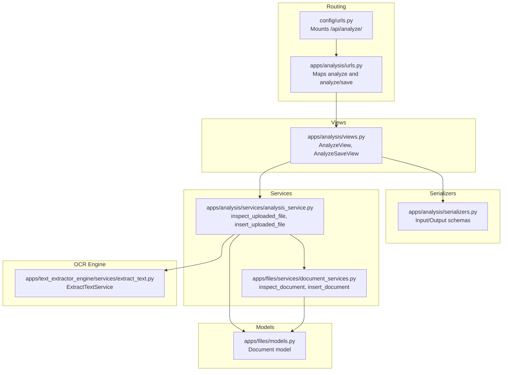
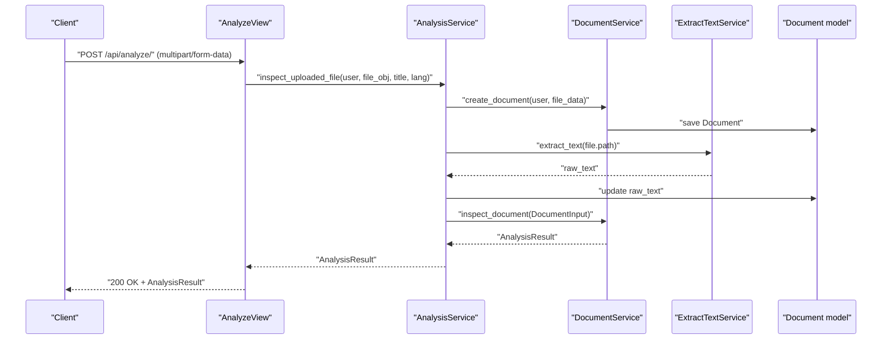
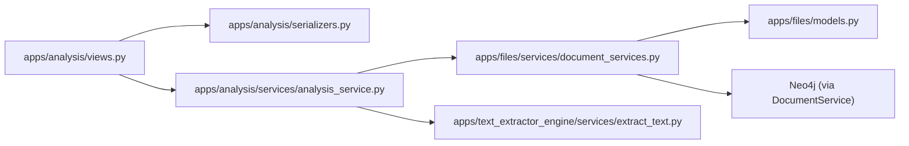

# Analysis Workflow Endpoints

<cite>
**Referenced Files in This Document**
- [urls.py](file://config/urls.py)
- [urls.py](file://apps/analysis/urls.py)
- [views.py](file://apps/analysis/views.py)
- [serializers.py](file://apps/analysis/serializers.py)
- [analysis_service.py](file://apps/analysis/services/analysis_service.py)
- [document_services.py](file://apps/files/services/document_services.py)
- [models.py](file://apps/files/models.py)
- [extract_text.py](file://apps/text_extractor_engine/services/extract_text.py)
- [views.py](file://apps/clauses/views.py)
- [urls.py](file://apps/clauses/urls.py)
</cite>

## Table of Contents
1. [Introduction](#introduction)
2. [Project Structure](#project-structure)
3. [Core Components](#core-components)
4. [Architecture Overview](#architecture-overview)
5. [Detailed Component Analysis](#detailed-component-analysis)
6. [Dependency Analysis](#dependency-analysis)
7. [Performance Considerations](#performance-considerations)
8. [Troubleshooting Guide](#troubleshooting-guide)
9. [Conclusion](#conclusion)

## Introduction
This document describes the contract analysis workflow endpoints exposed by the backend. It covers:
- POST /api/analyze/: Initiates a full analysis pipeline that uploads a document, performs OCR extraction, runs inspection, and returns structured results.
- POST /api/analyze/save/: Saves an already-inspected document into the knowledge graph.
- GET /clauses/{clause_id}/: Retrieves clause-level analysis results (conflicts and similar clauses).

The documentation includes request validation rules, response schemas, error handling, and integration details with OCR and Neo4j.

## Project Structure
The analysis workflow spans several modules:
- URL routing mounts the analysis endpoints under /api/analyze/.
- Views implement request validation and orchestrate service calls.
- Serializers define input and output schemas.
- Services coordinate OCR, inspection, and Neo4j insertion.
- The files app manages documents and integrates with OCR and Neo4j via DocumentService.

**Diagram sources**
- [urls.py:23-30](file://config/urls.py#L23-L30)
- [urls.py:5-8](file://apps/analysis/urls.py#L5-L8)
- [views.py:15-100](file://apps/analysis/views.py#L15-L100)
- [serializers.py:53-93](file://apps/analysis/serializers.py#L53-L93)
- [analysis_service.py:16-81](file://apps/analysis/services/analysis_service.py#L16-L81)
- [document_services.py:14-124](file://apps/files/services/document_services.py#L14-L124)
- [models.py:5-17](file://apps/files/models.py#L5-L17)
- [extract_text.py:5-28](file://apps/text_extractor_engine/services/extract_text.py#L5-L28)

**Section sources**
- [urls.py:23-30](file://config/urls.py#L23-L30)
- [urls.py:5-8](file://apps/analysis/urls.py#L5-L8)

## Core Components
- AnalyzeView: Validates multipart/form-data, orchestrates document creation, OCR extraction, and inspection, returning structured analysis results.
- AnalyzeSaveView: Validates JSON input, ensures the document has raw_text, and inserts the document into the knowledge graph.
- Serializers: Define input validation and output schemas for clauses, similarities, conflicts, and the main analysis result.
- AnalysisService: Implements the core workflow for inspection and insertion, coordinating OCR and DocumentService.
- DocumentService: Integrates OCR-extracted text with AI pipelines and Neo4j for clause extraction, classification, similarity detection, and conflict detection.
- Document model: Stores file metadata, OCR text, language, and related attributes.

**Section sources**
- [views.py:15-100](file://apps/analysis/views.py#L15-L100)
- [serializers.py:53-93](file://apps/analysis/serializers.py#L53-L93)
- [analysis_service.py:16-81](file://apps/analysis/services/analysis_service.py#L16-L81)
- [document_services.py:14-124](file://apps/files/services/document_services.py#L14-L124)
- [models.py:5-17](file://apps/files/models.py#L5-L17)

## Architecture Overview
The analysis workflow consists of three stages:
1. Upload and OCR: The view validates multipart/form-data, creates a Document, extracts text via OCR, and updates the database.
2. Inspection: The service constructs a DocumentInput and calls inspection logic to produce clauses, similar pairs, and conflicts.
3. Knowledge Graph Insertion: The save endpoint triggers insertion into Neo4j, returning the same structured result.

**Diagram sources**
- [views.py:22-56](file://apps/analysis/views.py#L22-L56)
- [analysis_service.py:19-50](file://apps/analysis/services/analysis_service.py#L19-L50)
- [document_services.py:46-62](file://apps/files/services/document_services.py#L46-L62)
- [extract_text.py:10-27](file://apps/text_extractor_engine/services/extract_text.py#L10-L27)
- [models.py:5-17](file://apps/files/models.py#L5-L17)

## Detailed Component Analysis

### POST /api/analyze/
Purpose: Upload a document, perform OCR, run inspection, and return structured analysis results.

- Authentication: Requires IsAuthenticated.
- Request format: multipart/form-data
  - file: Required. The contract file to analyze.
  - title: Optional. Defaults to filename if omitted.
  - language: Optional. Defaults to en.
- Validation rules:
  - file is required.
  - title and language are optional with defaults.
- Processing steps:
  1. Validate input using DocumentUploadInputSerializer.
  2. Create Document via DocumentService.create_document.
  3. Extract raw_text using ExtractTextService.
  4. Update Document.raw_text and save.
  5. Build DocumentInput and call DocumentService.inspect_document.
  6. Serialize result with AnalysisResultSerializer.
- Response: 200 OK with AnalysisResult object.
- Errors:
  - 400 Bad Request: Invalid input or missing file.
  - 500 Internal Server Error: General failure during inspection.

Response schema (AnalysisResult):
- document_id: integer
- doc_type: string
- clauses: array of Clause objects
- similar_pairs: array of SimilarityMatch objects
- conflicts: array of Conflict objects

Clause object:
- clause_id: integer
- clause_text: string
- clause_type: string

SimilarityMatch object:
- new_clause_id: integer
- new_clause_text: string
- existing_clause_id: integer
- existing_clause_text: string
- existing_doc_title: string
- score: number (0.0–1.0)

Conflict object:
- new_clause_id: integer
- new_clause_text: string
- existing_clause_id: integer
- existing_clause_text: string
- existing_doc_title: string
- score: number (0.0–1.0)
- reason: string

Processing time expectations:
- Determined by OCR processing and AI pipeline execution. Typical latency increases with file size and page count.

**Section sources**
- [views.py:22-56](file://apps/analysis/views.py#L22-L56)
- [serializers.py:77-84](file://apps/analysis/serializers.py#L77-L84)
- [serializers.py:53-70](file://apps/analysis/serializers.py#L53-L70)
- [analysis_service.py:19-50](file://apps/analysis/services/analysis_service.py#L19-L50)
- [document_services.py:46-62](file://apps/files/services/document_services.py#L46-L62)
- [extract_text.py:10-27](file://apps/text_extractor_engine/services/extract_text.py#L10-L27)
- [models.py:5-17](file://apps/files/models.py#L5-L17)

### POST /api/analyze/save/
Purpose: Save an already-inspected document into the knowledge graph.

- Authentication: Requires IsAuthenticated.
- Request format: JSON
  - doc_id: Required. The identifier of the document that was previously inspected.
- Validation rules:
  - doc_id must be an integer.
- Preconditions:
  - The document must have raw_text populated (set during inspection).
- Processing steps:
  1. Validate input using DocumentSaveInputSerializer.
  2. Fetch Document by doc_id.
  3. Raise ValueError if raw_text is missing.
  4. Build DocumentInput and call DocumentService.insert_document.
- Response: 200 OK with AnalysisResult object.
- Errors:
  - 400 Bad Request: Missing raw_text or invalid input.
  - 404 Not Found: Document does not exist.
  - 500 Internal Server Error: General failure during insertion.

Response schema: Same as POST /api/analyze/.

**Section sources**
- [views.py:66-99](file://apps/analysis/views.py#L66-L99)
- [serializers.py:87-93](file://apps/analysis/serializers.py#L87-L93)
- [analysis_service.py:53-80](file://apps/analysis/services/analysis_service.py#L53-L80)
- [document_services.py:22-44](file://apps/files/services/document_services.py#L22-L44)
- [models.py:5-17](file://apps/files/models.py#L5-L17)

### GET /clauses/{clause_id}/
Purpose: Retrieve clause-level analysis results including conflicts and similar clauses.

- Authentication: Requires IsAuthenticated.
- Path parameter:
  - clause_id: Required. The identifier of the clause to analyze.
- Processing steps:
  - Fetch clause analysis via ClauseService.get_clause_analysis.
- Response: 200 OK with clause analysis data.
- Errors:
  - 404 Not Found: Clause not found.

Note: This endpoint is mounted under /clauses/, not /api/analyze/.

**Section sources**
- [views.py:16-30](file://apps/clauses/views.py#L16-L30)
- [urls.py:6-11](file://apps/clauses/urls.py#L6-L11)

## Dependency Analysis
Key dependencies and integrations:
- Django URL routing mounts analysis endpoints under /api/analyze/.
- Views depend on serializers for validation and on AnalysisService for orchestration.
- AnalysisService depends on DocumentService for OCR integration and AI pipeline execution, and on ExtractTextService for text extraction.
- DocumentService integrates with Neo4j via Neo4jConnection and uses AI pipelines for clause extraction, classification, similarity, and conflict detection.
- Document model stores file metadata and OCR text.

**Diagram sources**
- [views.py:15-100](file://apps/analysis/views.py#L15-L100)
- [serializers.py:53-93](file://apps/analysis/serializers.py#L53-L93)
- [analysis_service.py:16-81](file://apps/analysis/services/analysis_service.py#L16-L81)
- [document_services.py:14-124](file://apps/files/services/document_services.py#L14-L124)
- [models.py:5-17](file://apps/files/models.py#L5-L17)
- [extract_text.py:5-28](file://apps/text_extractor_engine/services/extract_text.py#L5-L28)

**Section sources**
- [urls.py:27-27](file://config/urls.py#L27-L27)
- [urls.py:5-8](file://apps/analysis/urls.py#L5-L8)
- [views.py:15-100](file://apps/analysis/views.py#L15-L100)
- [analysis_service.py:16-81](file://apps/analysis/services/analysis_service.py#L16-L81)
- [document_services.py:14-124](file://apps/files/services/document_services.py#L14-L124)

## Performance Considerations
- OCR cost: PDFs are converted to images and processed via OCR; larger files and more pages increase latency.
- AI pipeline cost: Similarity and conflict detection involve embeddings and graph operations; performance scales with the number of clauses and existing knowledge graph size.
- Recommendations:
  - Batch large files when possible.
  - Monitor OCR and Neo4j resource utilization.
  - Consider caching frequently accessed clauses or precomputing embeddings where feasible.

## Troubleshooting Guide
Common issues and resolutions:
- Missing file in multipart/form-data:
  - Symptom: 400 Bad Request indicating no file provided.
  - Resolution: Ensure the form includes a field named file.
- Invalid input validation:
  - Symptom: 400 Bad Request with serializer errors.
  - Resolution: Verify file, title, and language fields conform to expected types.
- Document not found for save:
  - Symptom: 404 Not Found.
  - Resolution: Confirm doc_id exists and refers to an existing document.
- Missing raw_text for save:
  - Symptom: 400 Bad Request indicating raw_text is required.
  - Resolution: Run inspection first to populate raw_text.
- General server error:
  - Symptom: 500 Internal Server Error.
  - Resolution: Check OCR extraction and Neo4j connectivity; review logs for pipeline failures.

**Section sources**
- [views.py:34-38](file://apps/analysis/views.py#L34-L38)
- [views.py:72-74](file://apps/analysis/views.py#L72-L74)
- [views.py:88-99](file://apps/analysis/views.py#L88-L99)
- [analysis_service.py:62-65](file://apps/analysis/services/analysis_service.py#L62-L65)

## Conclusion
The analysis workflow provides a robust pipeline for contract analysis:
- Upload and OCR ingestion via POST /api/analyze/.
- Structured inspection results with clauses, similarity matches, and conflicts.
- Knowledge graph insertion via POST /api/analyze/save/.
- Clause-level retrieval via GET /clauses/{clause_id}/.

The provided serializers and services define clear contracts for input validation and output formatting, while integration with OCR and Neo4j enables scalable analysis and conflict detection.