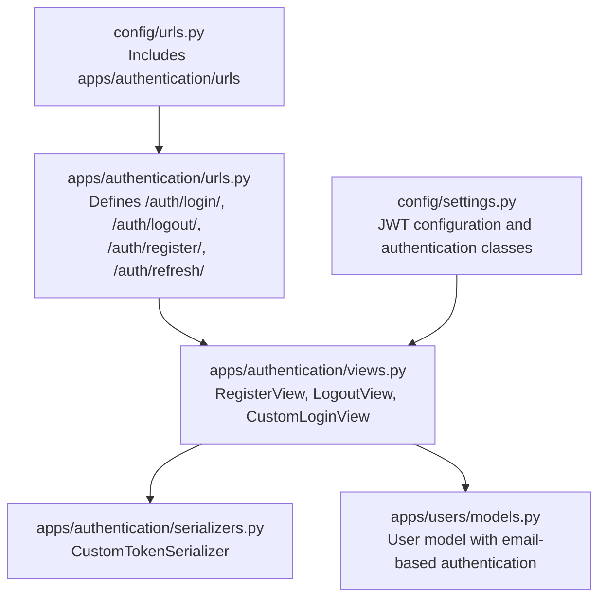
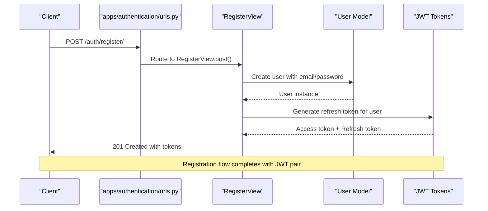
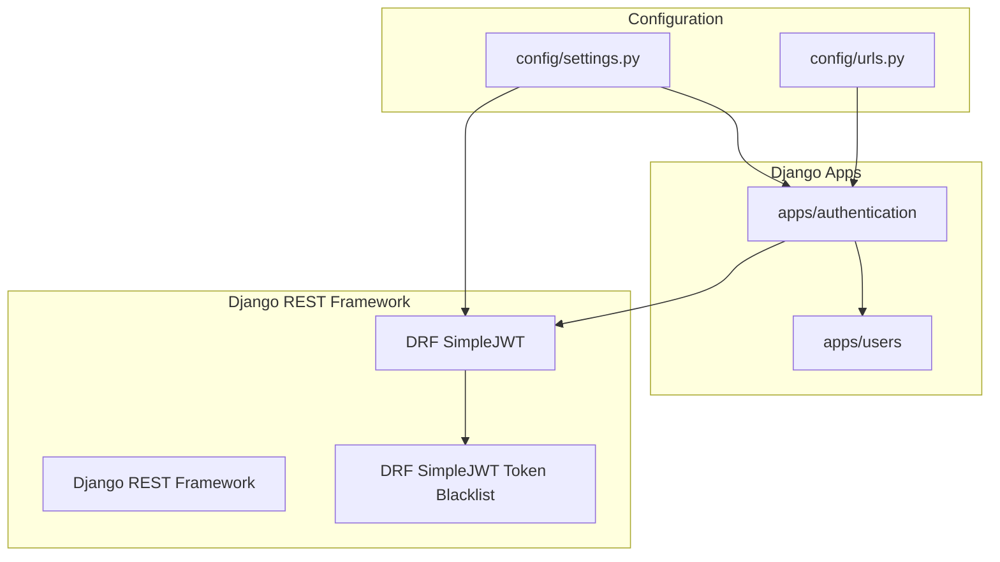

# Authentication Endpoints

<cite>
**Referenced Files in This Document**
- [apps/authentication/views.py](file://apps/authentication/views.py)
- [apps/authentication/urls.py](file://apps/authentication/urls.py)
- [apps/authentication/serializers.py](file://apps/authentication/serializers.py)
- [apps/users/models.py](file://apps/users/models.py)
- [config/urls.py](file://config/urls.py)
- [config/settings.py](file://config/settings.py)
</cite>

## Table of Contents
1. [Introduction](#introduction)
2. [Project Structure](#project-structure)
3. [Core Components](#core-components)
4. [Architecture Overview](#architecture-overview)
5. [Detailed Component Analysis](#detailed-component-analysis)
6. [Dependency Analysis](#dependency-analysis)
7. [Performance Considerations](#performance-considerations)
8. [Troubleshooting Guide](#troubleshooting-guide)
9. [Conclusion](#conclusion)

## Introduction
This document provides comprehensive API documentation for the authentication endpoints in the Veritas Shield backend. It covers user registration, login, logout, and JWT refresh token handling, including request/response schemas, error handling, cURL examples, and authentication header requirements.

## Project Structure
The authentication endpoints are organized under the `apps/authentication` Django app. The URL routing is configured to expose endpoints under the `/auth/` base path.



**Diagram sources**
- [config/urls.py:26](file://config/urls.py#L26)
- [apps/authentication/urls.py:8-14](file://apps/authentication/urls.py#L8-L14)
- [apps/authentication/views.py:14-73](file://apps/authentication/views.py#L14-L73)
- [apps/authentication/serializers.py:4-5](file://apps/authentication/serializers.py#L4-L5)
- [apps/users/models.py:29-45](file://apps/users/models.py#L29-L45)
- [config/settings.py:125-144](file://config/settings.py#L125-L144)

**Section sources**
- [config/urls.py:23-30](file://config/urls.py#L23-L30)
- [apps/authentication/urls.py:8-14](file://apps/authentication/urls.py#L8-L14)

## Core Components
The authentication module consists of four primary components:
- RegisterView: Handles user registration with email/password
- LogoutView: Manages session termination via refresh token blacklisting
- CustomLoginView: Implements JWT pair token generation with email-based authentication
- CustomTokenSerializer: Extends TokenObtainPairSerializer to use email as the username field

Key JWT configuration includes:
- Access token lifetime: 60 minutes
- Refresh token lifetime: 7 days
- Authentication header type: Bearer

**Section sources**
- [apps/authentication/views.py:14-73](file://apps/authentication/views.py#L14-L73)
- [apps/authentication/serializers.py:4-5](file://apps/authentication/serializers.py#L4-L5)
- [config/settings.py:139-143](file://config/settings.py#L139-L143)

## Architecture Overview
The authentication flow integrates Django REST Framework with Django REST Framework SimpleJWT for token-based authentication.



**Diagram sources**
- [apps/authentication/urls.py:11](file://apps/authentication/urls.py#L11)
- [apps/authentication/views.py:14-42](file://apps/authentication/views.py#L14-L42)
- [apps/users/models.py:11-19](file://apps/users/models.py#L11-L19)

## Detailed Component Analysis

### POST /auth/register/
Endpoint for user registration with email and password.

**Request Schema**
- Content-Type: application/json
- Body fields:
  - email: string (required)
  - password: string (required)

**Response Format**
- Status: 201 Created
- Body:
  - access: string (JWT access token)
  - refresh: string (JWT refresh token)

**Error Responses**
- 400 Bad Request: Missing data
- 400 Bad Request: Email already exists  
- 500 Internal Server Error: User creation failed

**cURL Example**
```bash
curl -X POST http://localhost:8000/auth/register/ \
  -H "Content-Type: application/json" \
  -d '{"email":"user@example.com","password":"securepassword"}'
```

**Section sources**
- [apps/authentication/views.py:14-42](file://apps/authentication/views.py#L14-L42)

### POST /auth/login/
Endpoint for user authentication returning JWT token pair.

**Request Schema**
- Content-Type: application/json
- Body fields:
  - email: string (required)
  - password: string (required)

**Response Format**
- Status: 200 OK
- Body:
  - access: string (JWT access token)
  - refresh: string (JWT refresh token)

**Authentication Header Requirements**
- No authentication required for login
- Subsequent requests require Authorization: Bearer <access_token>

**cURL Example**
```bash
curl -X POST http://localhost:8000/auth/login/ \
  -H "Content-Type: application/json" \
  -d '{"email":"user@example.com","password":"securepassword"}'
```

**Section sources**
- [apps/authentication/views.py:72-73](file://apps/authentication/views.py#L72-L73)
- [apps/authentication/serializers.py:4-5](file://apps/authentication/serializers.py#L4-L5)
- [config/settings.py:125-128](file://config/settings.py#L125-L128)

### POST /auth/logout/
Endpoint for session termination via refresh token invalidation.

**Request Schema**
- Content-Type: application/json
- Body fields:
  - refresh: string (required)

**Response Format**
- Status: 205 Reset Content
- Body:
  - message: string (success confirmation)

**Error Responses**
- 400 Bad Request: Refresh token required
- 400 Bad Request: Invalid token

**Authentication Header Requirements**
- Requires Authorization: Bearer <access_token> (due to IsAuthenticated permission)

**cURL Example**
```bash
curl -X POST http://localhost:8000/auth/logout/ \
  -H "Content-Type: application/json" \
  -H "Authorization: Bearer <access_token>" \
  -d '{"refresh":"<refresh_token_from_login>"}'
```

**Section sources**
- [apps/authentication/views.py:45-69](file://apps/authentication/views.py#L45-L69)

### POST /auth/refresh/
Endpoint for refreshing JWT access tokens using refresh tokens.

**Request Schema**
- Content-Type: application/json
- Body fields:
  - refresh: string (required)

**Response Format**
- Status: 200 OK
- Body:
  - access: string (new JWT access token)

**Authentication Header Requirements**
- No authentication required for refresh

**cURL Example**
```bash
curl -X POST http://localhost:8000/auth/refresh/ \
  -H "Content-Type: application/json" \
  -d '{"refresh":"<refresh_token_from_login>"}'
```

**Section sources**
- [apps/authentication/urls.py:12](file://apps/authentication/urls.py#L12)

## Dependency Analysis
The authentication endpoints depend on several key components:



**Diagram sources**
- [config/settings.py:33](file://config/settings.py#L33)
- [config/settings.py:125-143](file://config/settings.py#L125-L143)
- [config/urls.py:26](file://config/urls.py#L26)
- [apps/authentication/urls.py:6](file://apps/authentication/urls.py#L6)

**Section sources**
- [config/settings.py:26-40](file://config/settings.py#L26-L40)
- [config/settings.py:125-143](file://config/settings.py#L125-L143)

## Performance Considerations
- Token lifetimes are configured for optimal security/performance balance
- Refresh token blacklisting enables immediate logout capability
- User creation validates email uniqueness to prevent duplicate accounts
- JWT configuration uses efficient token generation and validation

## Troubleshooting Guide

### Common Issues and Solutions
**Registration Failures**
- Duplicate email: Check if email already exists in database
- Missing credentials: Ensure both email and password are provided
- User creation errors: Verify database connectivity and permissions

**Login Problems**
- Invalid credentials: Confirm email/password combination
- Authentication middleware issues: Verify JWT authentication is enabled
- Email-based login: Ensure email is used as username field

**Logout Issues**
- Missing refresh token: Provide refresh token in request body
- Invalid token format: Ensure refresh token is valid and unexpired
- Permission errors: Include Authorization header with access token

**Token Refresh Problems**
- Expired refresh tokens: Generate new tokens after expiration
- Invalid token format: Verify refresh token integrity
- Configuration mismatches: Check JWT settings consistency

**Section sources**
- [apps/authentication/views.py:19-35](file://apps/authentication/views.py#L19-L35)
- [apps/authentication/views.py:52-69](file://apps/authentication/views.py#L52-L69)
- [config/settings.py:139-143](file://config/settings.py#L139-L143)

## Conclusion
The authentication system provides a secure, standards-compliant JWT-based authentication solution with comprehensive error handling and clear API contracts. The endpoints support modern authentication workflows including registration, login, logout, and token refresh while maintaining security through proper token lifecycle management.