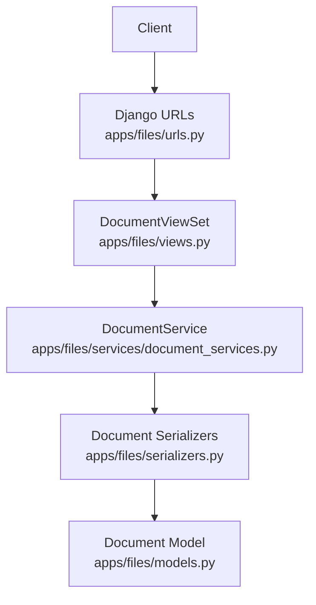
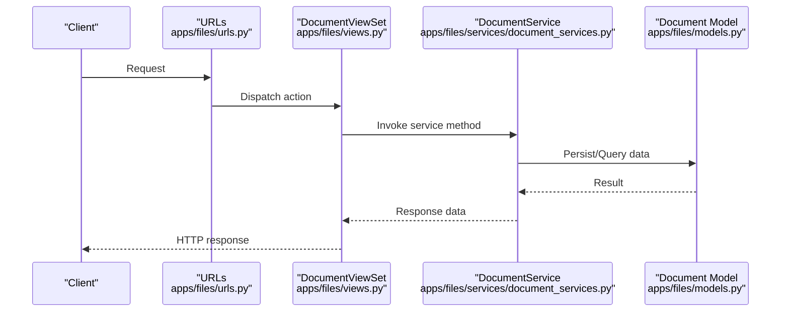
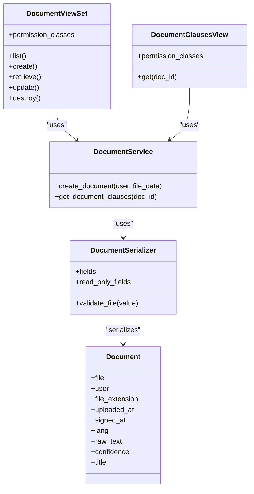

# Document Management Endpoints

<cite>
**Referenced Files in This Document**
- [urls.py](file://apps/files/urls.py)
- [views.py](file://apps/files/views.py)
- [models.py](file://apps/files/models.py)
- [serializers.py](file://apps/files/serializers.py)
- [document_services.py](file://apps/files/services/document_services.py)
- [settings.py](file://config/settings.py)
</cite>

## Table of Contents
1. [Introduction](#introduction)
2. [Project Structure](#project-structure)
3. [Core Components](#core-components)
4. [Architecture Overview](#architecture-overview)
5. [Detailed Component Analysis](#detailed-component-analysis)
6. [Dependency Analysis](#dependency-analysis)
7. [Performance Considerations](#performance-considerations)
8. [Troubleshooting Guide](#troubleshooting-guide)
9. [Conclusion](#conclusion)

## Introduction
This document provides comprehensive API documentation for the document management endpoints. It covers listing, uploading, retrieving, updating, deleting, and clause extraction for documents. It also details validation rules, supported formats, access control requirements, and error responses.

## Project Structure
The document management functionality is implemented within the files app. The URL routing exposes endpoints for listing and creating documents, uploading files, retrieving/updating/deleting specific documents, and fetching clauses associated with a document. The views delegate to a service layer for processing and persisting document data.

**Diagram sources**
- [urls.py:6-28](file://apps/files/urls.py#L6-L28)
- [views.py:11-14](file://apps/files/views.py#L11-L14)
- [document_services.py:14-124](file://apps/files/services/document_services.py#L14-L124)
- [models.py:5-17](file://apps/files/models.py#L5-L17)
- [serializers.py:6-61](file://apps/files/serializers.py#L6-L61)

**Section sources**
- [urls.py:1-29](file://apps/files/urls.py#L1-L29)
- [views.py:1-35](file://apps/files/views.py#L1-L35)
- [models.py:1-18](file://apps/files/models.py#L1-L18)
- [serializers.py:1-61](file://apps/files/serializers.py#L1-L61)
- [document_services.py:1-124](file://apps/files/services/document_services.py#L1-L124)

## Core Components
- URL routing defines the endpoints and maps them to view actions.
- Views implement permission enforcement and delegate to services for processing.
- Services encapsulate business logic for document creation, inspection, and clause retrieval.
- Serializers define the data contract for requests and responses.
- Model defines the persisted document entity and its fields.

Key access control:
- Document management endpoints require administrative privileges.
- Clause retrieval requires authenticated users.

Supported file formats:
- PDF and images (JPG, PNG, JPEG) are validated by the serializer.

**Section sources**
- [urls.py:6-28](file://apps/files/urls.py#L6-L28)
- [views.py:11-14](file://apps/files/views.py#L11-L14)
- [serializers.py:48-52](file://apps/files/serializers.py#L48-L52)
- [document_services.py:14-124](file://apps/files/services/document_services.py#L14-L124)

## Architecture Overview
The API follows a layered architecture:
- Presentation layer: Django URLs and DRF views.
- Application layer: ViewSet actions and service methods.
- Domain layer: Serializers and models.

**Diagram sources**
- [urls.py:6-28](file://apps/files/urls.py#L6-L28)
- [views.py:11-14](file://apps/files/views.py#L11-L14)
- [document_services.py:83-110](file://apps/files/services/document_services.py#L83-L110)
- [models.py:5-17](file://apps/files/models.py#L5-L17)

## Detailed Component Analysis

### Endpoint: GET /files/documents/
- Purpose: List all documents.
- Authentication: Admin required.
- Pagination: Not explicitly configured in the provided code; defaults apply.
- Filtering: Not explicitly configured in the provided code; defaults apply.
- Response: Array of document objects with fields: id, file, user, file_extension, uploaded_at, signed_at, lang, raw_text, confidence, title.

Notes:
- The viewset uses a generic list action; specific pagination/filtering behavior depends on DRF defaults and global settings.

**Section sources**
- [urls.py:7-11](file://apps/files/urls.py#L7-L11)
- [views.py:11-14](file://apps/files/views.py#L11-L14)
- [serializers.py:6-30](file://apps/files/serializers.py#L6-L30)

### Endpoint: POST /files/documents/
- Purpose: Create a new document.
- Authentication: Admin required.
- Request body: Form-encoded multipart data with fields:
  - file: Required. Supported formats: PDF, JPG, PNG, JPEG.
  - title: Optional.
  - lang: Optional.
- Validation:
  - File extension validation enforces supported formats.
  - Other fields validated by serializer.
- Response: Document object including computed fields (e.g., uploaded_at, confidence) and read-only fields.

**Section sources**
- [urls.py:7-11](file://apps/files/urls.py#L7-L11)
- [views.py:11-14](file://apps/files/views.py#L11-L14)
- [serializers.py:32-61](file://apps/files/serializers.py#L32-L61)
- [document_services.py:83-110](file://apps/files/services/document_services.py#L83-L110)

### Endpoint: POST /files/upload/
- Purpose: Upload a document file.
- Authentication: Admin required.
- Request body: Multipart form data with file field.
- Validation: Same as POST /files/documents/.
- Response: Document object including computed fields.

Note: This endpoint is mapped to a custom "upload" action on the viewset.

**Section sources**
- [urls.py:12-15](file://apps/files/urls.py#L12-L15)
- [views.py:11-14](file://apps/files/views.py#L11-L14)
- [serializers.py:48-52](file://apps/files/serializers.py#L48-L52)

### Endpoint: GET /files/documents/{id}/
- Purpose: Retrieve a specific document by ID.
- Authentication: Admin required.
- Response: Single document object with all fields.

**Section sources**
- [urls.py:16-22](file://apps/files/urls.py#L16-L22)
- [views.py:11-14](file://apps/files/views.py#L11-L14)
- [serializers.py:6-30](file://apps/files/serializers.py#L6-L30)

### Endpoint: PUT /files/documents/{id}/
- Purpose: Update a specific document by ID.
- Authentication: Admin required.
- Request body: Form-encoded multipart data with updatable fields.
- Response: Updated document object.

**Section sources**
- [urls.py:16-22](file://apps/files/urls.py#L16-L22)
- [views.py:11-14](file://apps/files/views.py#L11-L14)
- [serializers.py:6-30](file://apps/files/serializers.py#L6-L30)

### Endpoint: DELETE /files/documents/{id}/
- Purpose: Delete a specific document by ID.
- Authentication: Admin required.
- Behavior: Deletion cascades to related records as defined by the model’s foreign key constraints.

**Section sources**
- [urls.py:16-22](file://apps/files/urls.py#L16-L22)
- [views.py:11-14](file://apps/files/views.py#L11-L14)
- [models.py:7-10](file://apps/files/models.py#L7-L10)

### Endpoint: GET /files/documents/{id}/clauses/
- Purpose: Retrieve clauses associated with a document.
- Authentication: Requires authenticated user.
- Response: Array of clause objects.

**Section sources**
- [urls.py:23-27](file://apps/files/urls.py#L23-L27)
- [views.py:17-35](file://apps/files/views.py#L17-L35)
- [document_services.py:112-122](file://apps/files/services/document_services.py#L112-L122)

## Dependency Analysis
The following diagram shows the relationships among components involved in document management:

**Diagram sources**
- [views.py:11-35](file://apps/files/views.py#L11-L35)
- [document_services.py:14-124](file://apps/files/services/document_services.py#L14-L124)
- [serializers.py:6-61](file://apps/files/serializers.py#L6-L61)
- [models.py:5-17](file://apps/files/models.py#L5-L17)

**Section sources**
- [views.py:1-35](file://apps/files/views.py#L1-L35)
- [document_services.py:1-124](file://apps/files/services/document_services.py#L1-L124)
- [serializers.py:1-61](file://apps/files/serializers.py#L1-L61)
- [models.py:1-18](file://apps/files/models.py#L1-L18)

## Performance Considerations
- File size limits: Not enforced in the provided code. Configure appropriate limits at the web server or framework level.
- Pagination and filtering: Not explicitly configured for listing endpoints; consider adding pagination and filtering to improve scalability.
- Background processing: Large document processing (e.g., OCR, text extraction) should be offloaded to background tasks to avoid blocking requests.

## Troubleshooting Guide
Common errors and resolutions:
- Unsupported file type:
  - Cause: File extension not in supported formats.
  - Resolution: Ensure the file is PDF or image (JPG, PNG, JPEG).
- Validation errors during upload:
  - Cause: Serializer validation failures.
  - Resolution: Verify required fields and supported formats.
- Access denied:
  - Cause: Missing admin privileges or authentication.
  - Resolution: Authenticate as an admin user for document management endpoints; ensure authentication for clause retrieval.
- Document not found:
  - Cause: Invalid ID or record does not exist.
  - Resolution: Confirm the document ID and existence.

**Section sources**
- [serializers.py:48-52](file://apps/files/serializers.py#L48-L52)
- [views.py:11-14](file://apps/files/views.py#L11-L14)
- [views.py:22-35](file://apps/files/views.py#L22-L35)

## Conclusion
The document management endpoints provide a robust foundation for CRUD operations on documents with strong validation for supported file formats and clear access control policies. Extending the implementation with explicit pagination, filtering, and configurable file size limits will further enhance reliability and scalability.