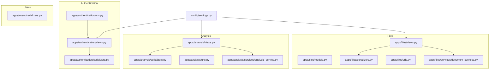
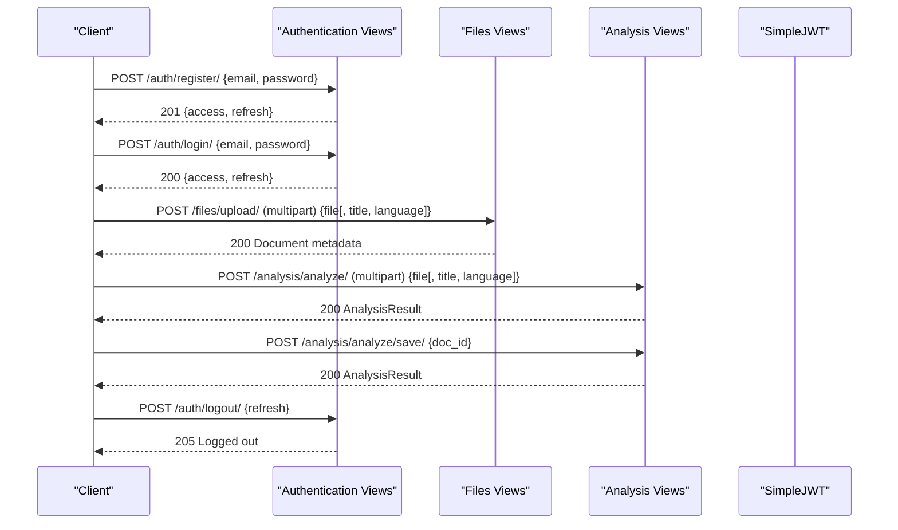
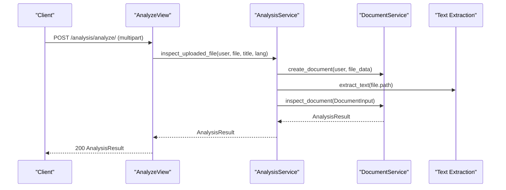
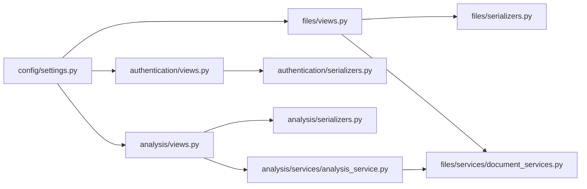

# Request & Response Schemas

<cite>
**Referenced Files in This Document**
- [authentication/views.py](file://apps/authentication/views.py)
- [authentication/serializers.py](file://apps/authentication/serializers.py)
- [authentication/urls.py](file://apps/authentication/urls.py)
- [users/serializers.py](file://apps/users/serializers.py)
- [files/models.py](file://apps/files/models.py)
- [files/serializers.py](file://apps/files/serializers.py)
- [files/views.py](file://apps/files/views.py)
- [files/urls.py](file://apps/files/urls.py)
- [files/services/document_services.py](file://apps/files/services/document_services.py)
- [analysis/serializers.py](file://apps/analysis/serializers.py)
- [analysis/views.py](file://apps/analysis/views.py)
- [analysis/urls.py](file://apps/analysis/urls.py)
- [analysis/services/analysis_service.py](file://apps/analysis/services/analysis_service.py)
- [config/settings.py](file://config/settings.py)
</cite>

## Table of Contents
1. [Introduction](#introduction)
2. [Project Structure](#project-structure)
3. [Core Components](#core-components)
4. [Architecture Overview](#architecture-overview)
5. [Detailed Component Analysis](#detailed-component-analysis)
6. [Dependency Analysis](#dependency-analysis)
7. [Performance Considerations](#performance-considerations)
8. [Troubleshooting Guide](#troubleshooting-guide)
9. [Conclusion](#conclusion)
10. [Appendices](#appendices)

## Introduction
This document defines API request and response schemas across all endpoint groups in the backend. It covers:
- Authentication: registration, login, logout, and JWT token lifetimes
- Documents: upload, metadata, and clause retrieval
- Analysis: inspection workflow, save workflow, and result structures
- Error response formats and validation constraints

All schemas are derived from serializers, views, models, and configuration files present in the repository.

## Project Structure
The API is organized by domain apps:
- Authentication app: registration, login, logout, JWT configuration
- Users app: user model and serialization
- Files app: document model, upload, and clause retrieval
- Analysis app: analysis workflows and result structures
- Settings: global REST framework and JWT configuration

**Diagram sources**
- [authentication/urls.py:1-15](file://apps/authentication/urls.py#L1-L15)
- [authentication/views.py:1-74](file://apps/authentication/views.py#L1-L74)
- [authentication/serializers.py:1-6](file://apps/authentication/serializers.py#L1-L6)
- [users/serializers.py:1-14](file://apps/users/serializers.py#L1-L14)
- [files/models.py:1-18](file://apps/files/models.py#L1-L18)
- [files/serializers.py:1-61](file://apps/files/serializers.py#L1-L61)
- [files/views.py:1-35](file://apps/files/views.py#L1-L35)
- [files/urls.py:1-29](file://apps/files/urls.py#L1-L29)
- [files/services/document_services.py:1-124](file://apps/files/services/document_services.py#L1-L124)
- [analysis/serializers.py:1-93](file://apps/analysis/serializers.py#L1-L93)
- [analysis/views.py:1-100](file://apps/analysis/views.py#L1-L100)
- [analysis/urls.py:1-9](file://apps/analysis/urls.py#L1-L9)
- [analysis/services/analysis_service.py:1-81](file://apps/analysis/services/analysis_service.py#L1-L81)
- [config/settings.py:125-141](file://config/settings.py#L125-L141)

**Section sources**
- [authentication/urls.py:1-15](file://apps/authentication/urls.py#L1-L15)
- [files/urls.py:1-29](file://apps/files/urls.py#L1-L29)
- [analysis/urls.py:1-9](file://apps/analysis/urls.py#L1-L9)
- [config/settings.py:125-141](file://config/settings.py#L125-L141)

## Core Components
- Authentication endpoints: register, login, logout, token refresh
- Document endpoints: list/create/retrieve/update/delete documents; upload endpoint; clauses retrieval
- Analysis endpoints: analyze (inspect), analyze/save (insert)
- Global configuration: JWT authentication, parsers, renderers

**Section sources**
- [authentication/views.py:14-74](file://apps/authentication/views.py#L14-L74)
- [files/views.py:11-35](file://apps/files/views.py#L11-L35)
- [analysis/views.py:15-100](file://apps/analysis/views.py#L15-L100)
- [config/settings.py:125-141](file://config/settings.py#L125-L141)

## Architecture Overview
The system uses Django REST Framework with JWT authentication. Requests are parsed as JSON or multipart/form-data. Serializers define schemas for validation and response rendering.

**Diagram sources**
- [authentication/views.py:14-74](file://apps/authentication/views.py#L14-L74)
- [files/views.py:11-35](file://apps/files/views.py#L11-L35)
- [analysis/views.py:15-100](file://apps/analysis/views.py#L15-L100)
- [authentication/urls.py:1-15](file://apps/authentication/urls.py#L1-L15)
- [files/urls.py:1-29](file://apps/files/urls.py#L1-L29)
- [analysis/urls.py:1-9](file://apps/analysis/urls.py#L1-L9)

## Detailed Component Analysis

### Authentication Schemas
Endpoints:
- POST /auth/register/
- POST /auth/login/
- POST /auth/logout/
- POST /auth/refresh/

Requests and Responses:
- Registration
  - Request: { email, password }
  - Response: { access, refresh }
  - Validation: email and password required; email uniqueness enforced
- Login
  - Request: { email, password } (uses email as username field)
  - Response: { access, refresh }
- Logout
  - Request: { refresh }
  - Response: { message }
  - Validation: refresh token required; invalid tokens return error
- Token Refresh
  - Request: { refresh }
  - Response: { access }

Error responses:
- Missing data, email exists, user creation failed, invalid token, refresh required

JWT lifetimes:
- Access token lifetime and refresh token lifetime configured in settings

**Section sources**
- [authentication/views.py:14-74](file://apps/authentication/views.py#L14-L74)
- [authentication/serializers.py:4-6](file://apps/authentication/serializers.py#L4-L6)
- [authentication/urls.py:1-15](file://apps/authentication/urls.py#L1-L15)
- [config/settings.py:139-141](file://config/settings.py#L139-L141)

### Documents Schemas
Models:
- Document fields: file, user, file_extension, uploaded_at, signed_at, lang, raw_text, confidence, title

Serializers:
- DocumentSerializer: exposes id, file, user, file_extension, uploaded_at, signed_at, lang, raw_text, confidence, title; several fields are read-only
- DocumentCreateSerializer: accepts file, title, lang, file_extension, uploaded_at; read-only fields include id, uploaded_at, user, raw_text, confidence, signed_at; validates supported file extensions

Views:
- DocumentViewSet: supports list/create/retrieve/update/destroy; admin-only
- DocumentClausesView: returns clauses for a document by doc_id

URLs:
- /files/documents/ (list/create)
- /files/documents/{pk}/ (retrieve/update/destroy)
- /files/documents/{doc_id}/clauses/ (clauses)

File upload request (multipart/form-data):
- Required: file
- Optional: title, language
- Validation: file extension must be pdf/jpg/png/jpeg

Document metadata response:
- Includes id, file, user, file_extension, uploaded_at, signed_at, lang, raw_text, confidence, title

Clauses retrieval:
- Response: list of clause dictionaries (returned by service)

**Section sources**
- [files/models.py:5-18](file://apps/files/models.py#L5-L18)
- [files/serializers.py:6-61](file://apps/files/serializers.py#L6-L61)
- [files/views.py:11-35](file://apps/files/views.py#L11-L35)
- [files/urls.py:1-29](file://apps/files/urls.py#L1-L29)
- [files/services/document_services.py:112-122](file://apps/files/services/document_services.py#L112-L122)

### Analysis Workflow Schemas
Endpoints:
- POST /analysis/analyze/
- POST /analysis/analyze/save/

Workflow steps:
- Analyze: upload file -> OCR -> analyze -> return AnalysisResult
- Save: fetch document -> validate text -> insert/analyze -> return AnalysisResult

Inputs:
- Analyze input (multipart/form-data): file (required), title (optional), language (optional, defaults to en)
- Save input (JSON): doc_id (required)

Outputs:
- AnalysisResult: document_id, doc_type, clauses, similar_pairs, conflicts

Nested structures:
- Clause: clause_id, clause_text, clause_type
- SimilarityMatch: new_clause_id, new_clause_text, existing_clause_id, existing_clause_text, existing_doc_title, score (0.0–1.0)
- Conflict: same as SimilarityMatch plus reason

Validation constraints:
- score constrained to [0.0, 1.0]
- language defaults to "en" when omitted
- doc_id must reference an existing document

Error responses:
- Missing file, invalid input, analysis failed, insertion failed, document not found, missing raw_text

**Diagram sources**
- [analysis/views.py:22-56](file://apps/analysis/views.py#L22-L56)
- [analysis/services/analysis_service.py:19-50](file://apps/analysis/services/analysis_service.py#L19-L50)
- [files/services/document_services.py:46-62](file://apps/files/services/document_services.py#L46-L62)

**Section sources**
- [analysis/serializers.py:8-93](file://apps/analysis/serializers.py#L8-L93)
- [analysis/views.py:22-100](file://apps/analysis/views.py#L22-L100)
- [analysis/services/analysis_service.py:19-81](file://apps/analysis/services/analysis_service.py#L19-L81)
- [files/services/document_services.py:46-62](file://apps/files/services/document_services.py#L46-L62)

### Error Response Structures
Common error shape:
- { error, details? }

Specific cases:
- Authentication: missing data, email exists, user creation failed, invalid token, refresh required
- Files: unsupported file type, clauses not found
- Analysis: no file provided, analysis failed, insertion failed, document not found, missing raw_text

Status codes:
- 400 Bad Request for validation and business logic errors
- 404 Not Found for missing resources
- 500 Internal Server Error for unexpected failures
- 205 Reset Content for successful logout

**Section sources**
- [authentication/views.py:19-42](file://apps/authentication/views.py#L19-L42)
- [authentication/views.py:52-69](file://apps/authentication/views.py#L52-L69)
- [files/serializers.py:48-52](file://apps/files/serializers.py#L48-L52)
- [files/views.py:33-34](file://apps/files/views.py#L33-L34)
- [analysis/views.py:34-38](file://apps/analysis/views.py#L34-L38)
- [analysis/views.py:91-99](file://apps/analysis/views.py#L91-L99)

## Dependency Analysis
Key dependencies:
- REST framework configuration enables JSON and multipart parsing and JWT authentication
- Authentication views depend on SimpleJWT for tokens
- Files views depend on Document serializers and services
- Analysis views depend on AnalysisService and DocumentService
- DocumentService orchestrates AI/OCR and knowledge graph operations

**Diagram sources**
- [config/settings.py:125-141](file://config/settings.py#L125-L141)
- [authentication/views.py:1-74](file://apps/authentication/views.py#L1-L74)
- [files/views.py:1-35](file://apps/files/views.py#L1-L35)
- [analysis/views.py:1-100](file://apps/analysis/views.py#L1-L100)
- [files/serializers.py:1-61](file://apps/files/serializers.py#L1-L61)
- [files/services/document_services.py:1-124](file://apps/files/services/document_services.py#L1-L124)
- [analysis/serializers.py:1-93](file://apps/analysis/serializers.py#L1-L93)
- [analysis/services/analysis_service.py:1-81](file://apps/analysis/services/analysis_service.py#L1-L81)
- [authentication/serializers.py:1-6](file://apps/authentication/serializers.py#L1-L6)

**Section sources**
- [config/settings.py:125-141](file://config/settings.py#L125-L141)
- [authentication/views.py:1-74](file://apps/authentication/views.py#L1-L74)
- [files/views.py:1-35](file://apps/files/views.py#L1-L35)
- [analysis/views.py:1-100](file://apps/analysis/views.py#L1-L100)

## Performance Considerations
- Prefer multipart/form-data for file uploads to avoid base64 overhead
- Keep language parameter aligned with OCR pipeline expectations
- Cache or reuse tokens to minimize repeated login calls
- Validate file types early to fail fast

## Troubleshooting Guide
- Registration fails with “Missing data” or “Email already exists”: ensure both email and password are provided and email is unique
- Login fails: confirm credentials and that email is used as the username field
- Logout fails: ensure refresh token is provided and valid
- Upload fails: verify file extension is supported and content type is multipart/form-data
- Analyze fails: check that a file is included and language is valid
- Save fails: ensure doc_id references an existing document with raw_text populated

**Section sources**
- [authentication/views.py:19-42](file://apps/authentication/views.py#L19-L42)
- [authentication/views.py:52-69](file://apps/authentication/views.py#L52-L69)
- [files/serializers.py:48-52](file://apps/files/serializers.py#L48-L52)
- [analysis/views.py:34-38](file://apps/analysis/views.py#L34-L38)
- [analysis/services/analysis_service.py:62-65](file://apps/analysis/services/analysis_service.py#L62-L65)

## Conclusion
This document consolidates request and response schemas across authentication, documents, and analysis domains. All schemas are validated by serializers and enforced by views and services. Use the provided inputs and outputs to integrate clients and ensure robust error handling.

## Appendices

### Endpoint Reference
- Authentication
  - POST /auth/register/ → { access, refresh }
  - POST /auth/login/ → { access, refresh }
  - POST /auth/logout/ → { message }
  - POST /auth/refresh/ → { access }
- Files
  - POST /files/upload/ → Document metadata
  - GET /files/documents/{doc_id}/clauses/ → clauses
- Analysis
  - POST /analysis/analyze/ → AnalysisResult
  - POST /analysis/analyze/save/ → AnalysisResult

**Section sources**
- [authentication/urls.py:1-15](file://apps/authentication/urls.py#L1-L15)
- [files/urls.py:1-29](file://apps/files/urls.py#L1-L29)
- [analysis/urls.py:1-9](file://apps/analysis/urls.py#L1-L9)