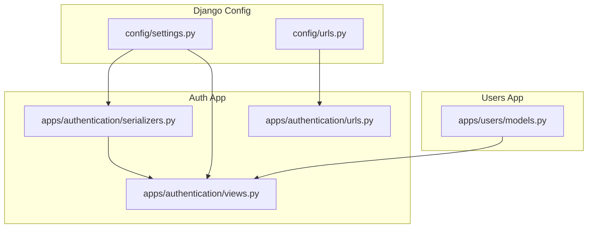
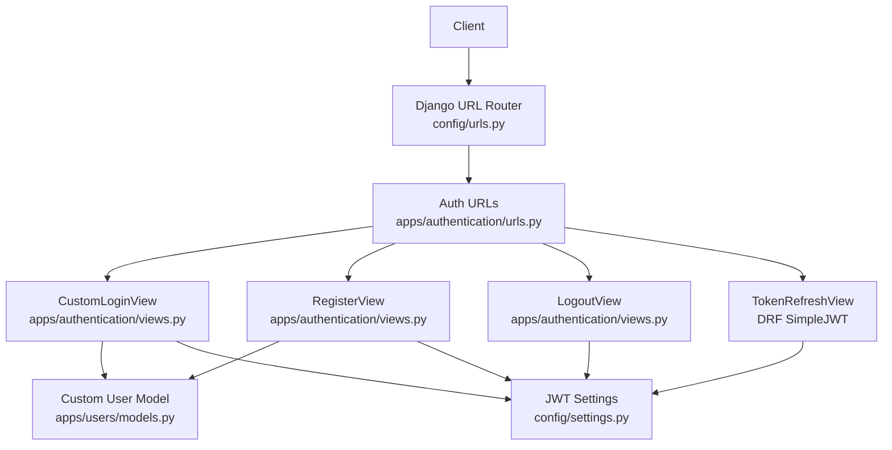
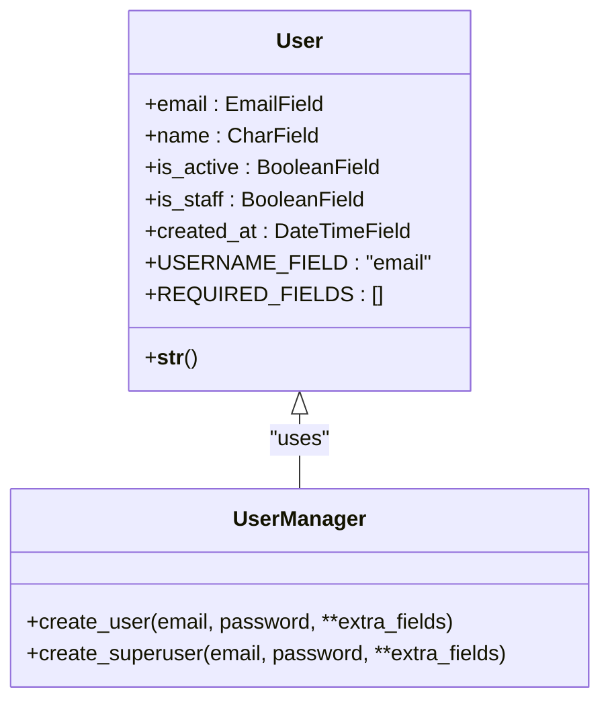
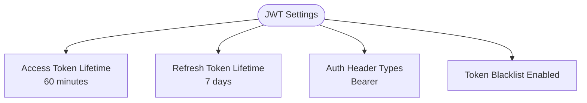
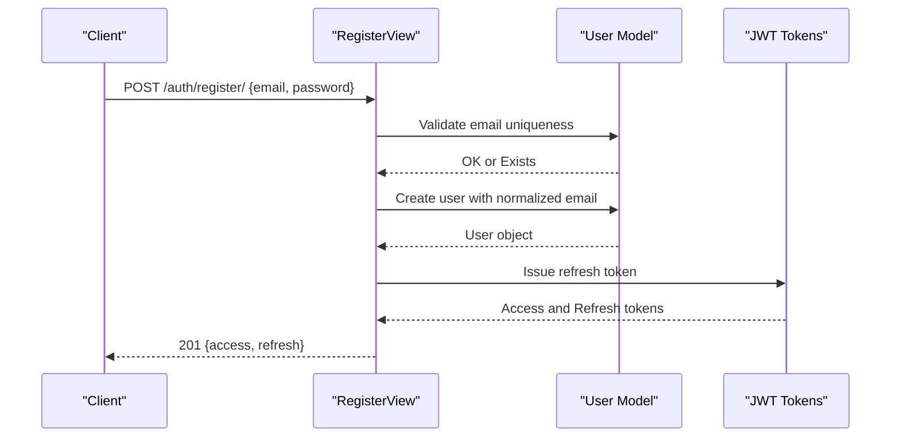
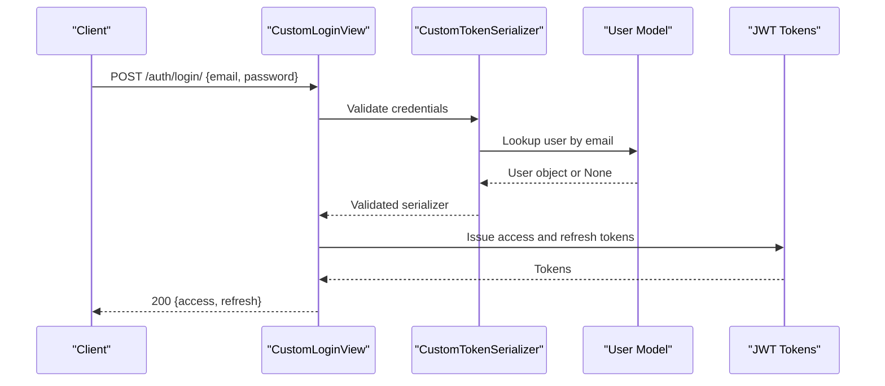
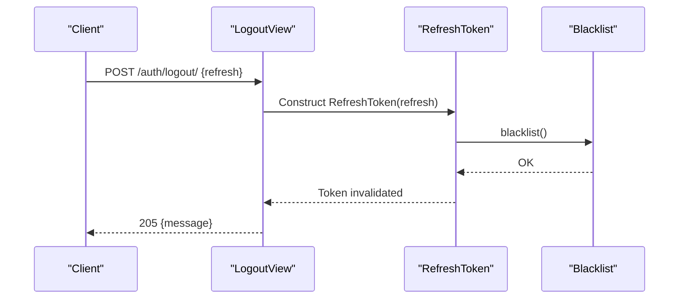
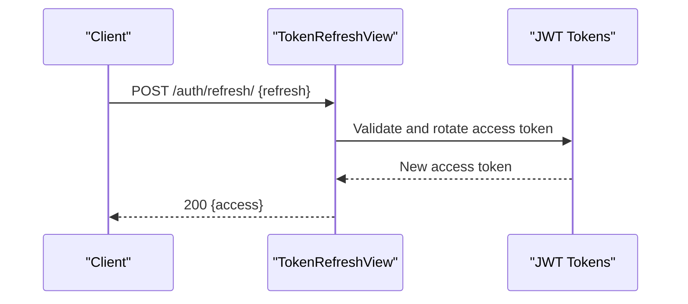
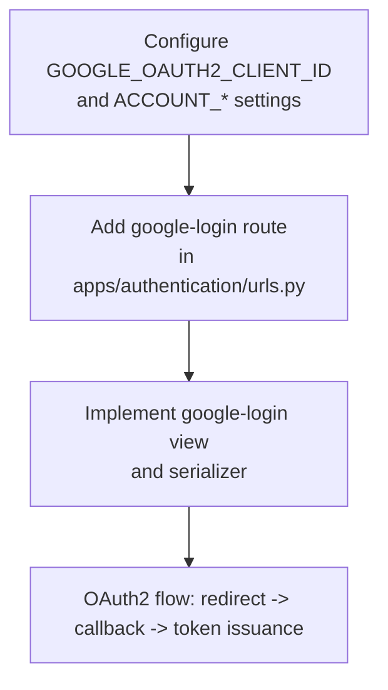
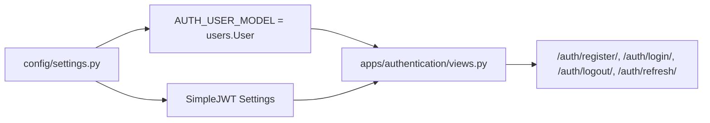

# Authentication System

<cite>
**Referenced Files in This Document**
- [settings.py](file://config/settings.py)
- [urls.py](file://config/urls.py)
- [models.py](file://apps/users/models.py)
- [serializers.py](file://apps/authentication/serializers.py)
- [views.py](file://apps/authentication/views.py)
- [urls.py](file://apps/authentication/urls.py)
</cite>

## Table of Contents
1. [Introduction](#introduction)
2. [Project Structure](#project-structure)
3. [Core Components](#core-components)
4. [Architecture Overview](#architecture-overview)
5. [Detailed Component Analysis](#detailed-component-analysis)
6. [Dependency Analysis](#dependency-analysis)
7. [Performance Considerations](#performance-considerations)
8. [Troubleshooting Guide](#troubleshooting-guide)
9. [Conclusion](#conclusion)
10. [Appendices](#appendices)

## Introduction
This document describes the authentication system for VeritasShield, focusing on JWT-based authentication with email-based user identification. It covers the registration, login, logout, and token refresh flows, the custom User model, endpoint schemas, error handling, JWT configuration, and the integration points for Google OAuth2. It also provides security considerations, token management best practices, and practical guidance for client-side implementation and debugging.

## Project Structure
The authentication system spans two primary modules:
- apps/users: Defines the custom User model and email-based authentication.
- apps/authentication: Implements registration, login, logout, and refresh endpoints backed by Django REST Framework and Django REST Framework SimpleJWT.

Key configuration ties:
- Global Django settings define JWT lifetimes, header types, and the custom AUTH_USER_MODEL.
- URL routing mounts the authentication endpoints under /auth/.

**Diagram sources**
- [settings.py:124-143](file://config/settings.py#L124-L143)
- [urls.py:23-30](file://config/urls.py#L23-L30)
- [models.py:29-46](file://apps/users/models.py#L29-L46)
- [serializers.py:4-6](file://apps/authentication/serializers.py#L4-L6)
- [views.py:14-74](file://apps/authentication/views.py#L14-L74)
- [urls.py:8-14](file://apps/authentication/urls.py#L8-L14)

**Section sources**
- [settings.py:124-143](file://config/settings.py#L124-L143)
- [urls.py:23-30](file://config/urls.py#L23-L30)
- [models.py:29-46](file://apps/users/models.py#L29-L46)
- [serializers.py:4-6](file://apps/authentication/serializers.py#L4-L6)
- [views.py:14-74](file://apps/authentication/views.py#L14-L74)
- [urls.py:8-14](file://apps/authentication/urls.py#L8-L14)

## Core Components
- Custom User Model (email-based): The system uses a custom User model with email as the unique identifier and USERNAME_FIELD. This enables email-based authentication across the platform.
- JWT Configuration: Access tokens expire after 60 minutes; refresh tokens expire after 7 days. The accepted Authorization header type is Bearer.
- Authentication Views:
  - RegisterView: Creates a new user and returns initial access and refresh tokens.
  - CustomLoginView: Returns short-lived access and long-lived refresh tokens for existing users.
  - LogoutView: Accepts a refresh token and blacklists it to invalidate sessions.
  - TokenRefreshView: Exchanges a valid refresh token for a new access token.
- Google OAuth2 Integration: Client ID is configured, and a placeholder route exists for future Google OAuth2 login implementation.

**Section sources**
- [models.py:29-46](file://apps/users/models.py#L29-L46)
- [settings.py:138-142](file://config/settings.py#L138-L142)
- [views.py:14-74](file://apps/authentication/views.py#L14-L74)
- [urls.py:8-14](file://apps/authentication/urls.py#L8-L14)
- [settings.py:145-153](file://config/settings.py#L145-L153)

## Architecture Overview
The authentication flow integrates Django’s authentication middleware with DRF and SimpleJWT. Requests are validated against the custom User model and JWT policies, and responses conform to JSON.

**Diagram sources**
- [urls.py:23-30](file://config/urls.py#L23-L30)
- [urls.py:8-14](file://apps/authentication/urls.py#L8-L14)
- [views.py:14-74](file://apps/authentication/views.py#L14-L74)
- [models.py:29-46](file://apps/users/models.py#L29-L46)
- [settings.py:138-142](file://config/settings.py#L138-L142)

## Detailed Component Analysis

### Custom User Model (Email-Based Authentication)
- Purpose: Replace username with email for authentication.
- Key attributes:
  - Unique email field.
  - USERNAME_FIELD set to email.
  - UserManager enforces email presence and normalizes email during creation.
- Behavior:
  - Superuser creation supported via UserManager.
  - Compatible with Django permissions and admin.

**Diagram sources**
- [models.py:29-46](file://apps/users/models.py#L29-L46)
- [models.py:9-26](file://apps/users/models.py#L9-L26)

**Section sources**
- [models.py:29-46](file://apps/users/models.py#L29-L46)
- [models.py:9-26](file://apps/users/models.py#L9-L26)

### JWT Configuration and Token Lifetimes
- Access token lifetime: 60 minutes.
- Refresh token lifetime: 7 days.
- Accepted Authorization header type: Bearer.
- Blacklist app enabled for token invalidation on logout.

**Diagram sources**
- [settings.py:138-142](file://config/settings.py#L138-L142)

**Section sources**
- [settings.py:138-142](file://config/settings.py#L138-L142)

### Authentication Endpoints

#### POST /auth/register/
- Purpose: Register a new user with email and password.
- Request body:
  - email: string (required)
  - password: string (required)
- Success response (201 Created):
  - access: string (JWT access token)
  - refresh: string (JWT refresh token)
- Error responses:
  - 400 Bad Request: Missing data or email already exists.
  - 500 Internal Server Error: User creation failure.

**Diagram sources**
- [views.py:14-42](file://apps/authentication/views.py#L14-L42)
- [models.py:9-26](file://apps/users/models.py#L9-L26)

**Section sources**
- [views.py:14-42](file://apps/authentication/views.py#L14-L42)

#### POST /auth/login/
- Purpose: Authenticate an existing user and return JWT tokens.
- Request body:
  - email: string (required)
  - password: string (required)
- Success response (200 OK):
  - access: string (JWT access token)
  - refresh: string (JWT refresh token)
- Error responses:
  - 400 Bad Request: Missing credentials.
  - 401 Unauthorized: Invalid credentials.

**Diagram sources**
- [views.py:72-74](file://apps/authentication/views.py#L72-L74)
- [serializers.py:4-6](file://apps/authentication/serializers.py#L4-L6)
- [models.py:29-46](file://apps/users/models.py#L29-L46)

**Section sources**
- [views.py:72-74](file://apps/authentication/views.py#L72-L74)
- [serializers.py:4-6](file://apps/authentication/serializers.py#L4-L6)

#### POST /auth/logout/
- Purpose: Invalidate the provided refresh token.
- Request body:
  - refresh: string (required)
- Success response (205 Reset Content):
  - message: string (confirmation)
- Error responses:
  - 400 Bad Request: Missing refresh token or invalid token.

**Diagram sources**
- [views.py:45-69](file://apps/authentication/views.py#L45-L69)

**Section sources**
- [views.py:45-69](file://apps/authentication/views.py#L45-L69)

#### POST /auth/refresh/
- Purpose: Exchange a valid refresh token for a new access token.
- Request body:
  - refresh: string (required)
- Success response (200 OK):
  - access: string (new JWT access token)
- Error responses:
  - 400 Bad Request: Missing or invalid refresh token.

**Diagram sources**
- [urls.py:12](file://apps/authentication/urls.py#L12)
- [views.py:72-74](file://apps/authentication/views.py#L72-L74)

**Section sources**
- [urls.py:12](file://apps/authentication/urls.py#L12)
- [views.py:72-74](file://apps/authentication/views.py#L72-L74)

### Google OAuth2 Integration
- Configuration:
  - GOOGLE_OAUTH2_CLIENT_ID is present in settings.
  - ACCOUNT_* settings indicate email-based authentication and that usernames are not required.
- Implementation status:
  - Placeholder route exists for google-login in authentication URLs.
  - No implementation is currently present in views or serializers.

**Diagram sources**
- [settings.py:145-153](file://config/settings.py#L145-L153)
- [urls.py:13](file://apps/authentication/urls.py#L13)

**Section sources**
- [settings.py:145-153](file://config/settings.py#L145-L153)
- [urls.py:13](file://apps/authentication/urls.py#L13)

## Dependency Analysis
- Authentication depends on:
  - Custom User model for identity resolution.
  - DRF SimpleJWT for token issuance and validation.
  - Token blacklist app for logout invalidation.
- Routing:
  - Root URL includes /auth/ which mounts authentication endpoints.

**Diagram sources**
- [settings.py:124-143](file://config/settings.py#L124-L143)
- [models.py:29-46](file://apps/users/models.py#L29-L46)
- [views.py:14-74](file://apps/authentication/views.py#L14-L74)
- [urls.py:8-14](file://apps/authentication/urls.py#L8-L14)

**Section sources**
- [settings.py:124-143](file://config/settings.py#L124-L143)
- [models.py:29-46](file://apps/users/models.py#L29-L46)
- [views.py:14-74](file://apps/authentication/views.py#L14-L74)
- [urls.py:8-14](file://apps/authentication/urls.py#L8-L14)

## Performance Considerations
- Token lifetimes:
  - Short access token lifetime reduces exposure windows but increases refresh frequency.
  - Long refresh token lifetime improves UX but requires robust blacklist management.
- Storage:
  - Store refresh tokens securely (e.g., httpOnly cookies) to mitigate XSS risks.
  - Keep access tokens in memory only (e.g., in volatile storage) to minimize persistence.
- Rate limiting:
  - Apply rate limits on registration/login endpoints to deter brute force attacks.
- Network:
  - Prefer HTTPS in production to protect tokens in transit.

## Troubleshooting Guide
Common issues and resolutions:
- Invalid credentials on login:
  - Verify email and password match the User model records.
  - Confirm CUSTOM LOGIN VIEW uses the custom serializer with email-based field.
- Registration failures:
  - Ensure email is unique and not empty.
  - Check user creation path and database connectivity.
- Logout not working:
  - Confirm refresh token is provided and valid.
  - Ensure blacklist app is installed and migrations applied.
- Token expiration:
  - Use refresh endpoint before access token expiry.
  - Adjust SIMPLE_JWT lifetimes if needed.
- CORS and headers:
  - Ensure Authorization header uses Bearer type as configured.
  - Configure frontend to send the correct header and origin policies.

**Section sources**
- [views.py:14-42](file://apps/authentication/views.py#L14-L42)
- [views.py:45-69](file://apps/authentication/views.py#L45-L69)
- [views.py:72-74](file://apps/authentication/views.py#L72-L74)
- [settings.py:138-142](file://config/settings.py#L138-L142)

## Conclusion
VeritasShield’s authentication system leverages a custom email-based User model and DRF SimpleJWT to provide secure, standards-compliant token-based authentication. The design supports registration, login, logout, and refresh with clear lifetimes and header types. The Google OAuth2 integration is partially configured and ready for implementation. Following the recommended security practices and client-side storage strategies will help maintain a robust and resilient authentication layer.

## Appendices

### Endpoint Reference Summary
- POST /auth/register/
  - Body: { email, password }
  - Responses: 201 { access, refresh }, 400, 500
- POST /auth/login/
  - Body: { email, password }
  - Responses: 200 { access, refresh }, 400, 401
- POST /auth/logout/
  - Body: { refresh }
  - Responses: 205, 400
- POST /auth/refresh/
  - Body: { refresh }
  - Responses: 200 { access }, 400

### Client-Side Implementation Guidance
- Store tokens:
  - Access token: memory-only (e.g., in volatile frontend state).
  - Refresh token: httpOnly cookie or secure storage with minimal exposure.
- Send requests:
  - Authorization header: Bearer <access_token>.
  - Include CSRF token if applicable.
- Token lifecycle:
  - On 401 Unauthorized, attempt refresh using the refresh endpoint.
  - On successful refresh, retry the original request.
- Logout:
  - Call /auth/logout/ with the refresh token.
  - Clear stored tokens and redirect to login.

### Security Best Practices
- Enforce HTTPS in production.
- Use short access token lifetimes and secure refresh token storage.
- Implement rate limiting and monitoring for authentication endpoints.
- Regularly rotate SECRET_KEY and JWT signing keys.
- Audit token usage and monitor for anomalies.