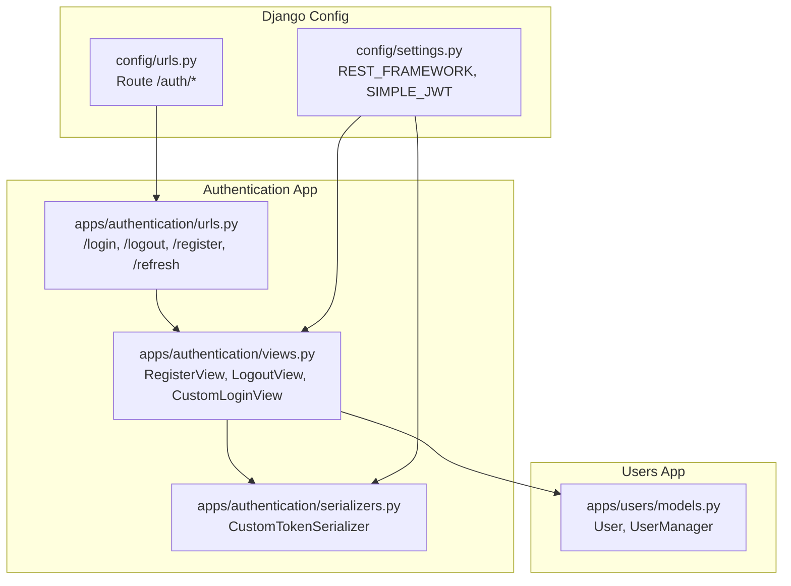
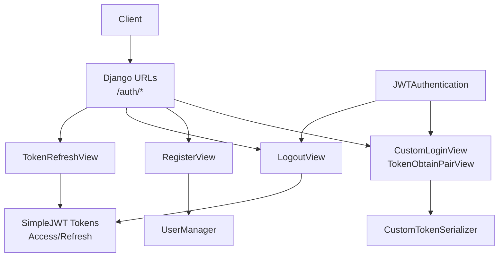
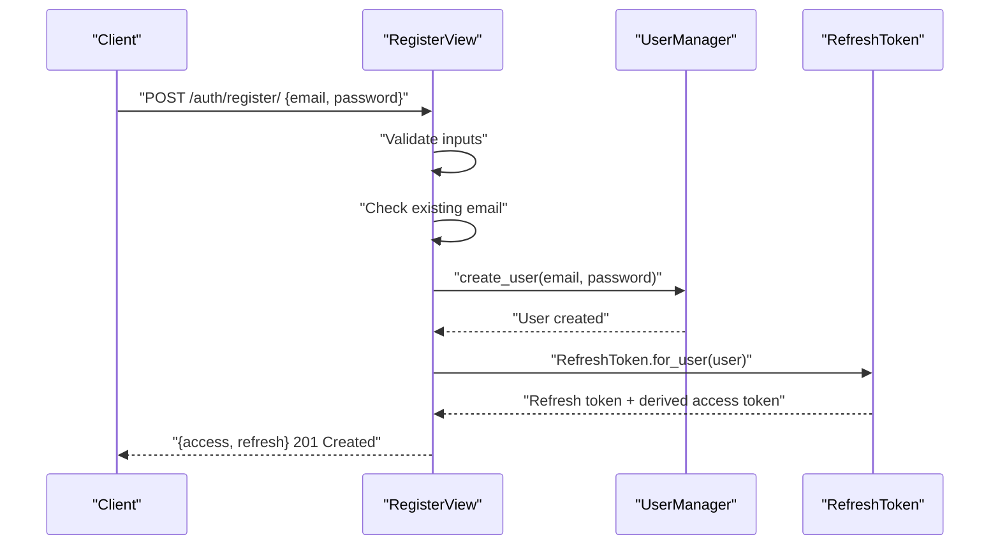
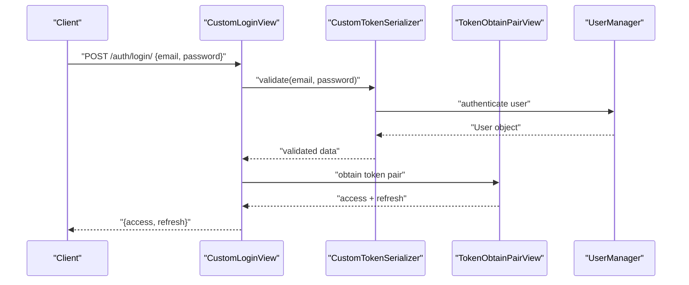
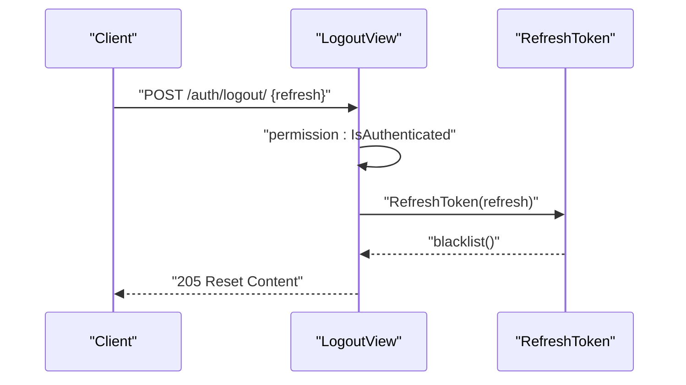
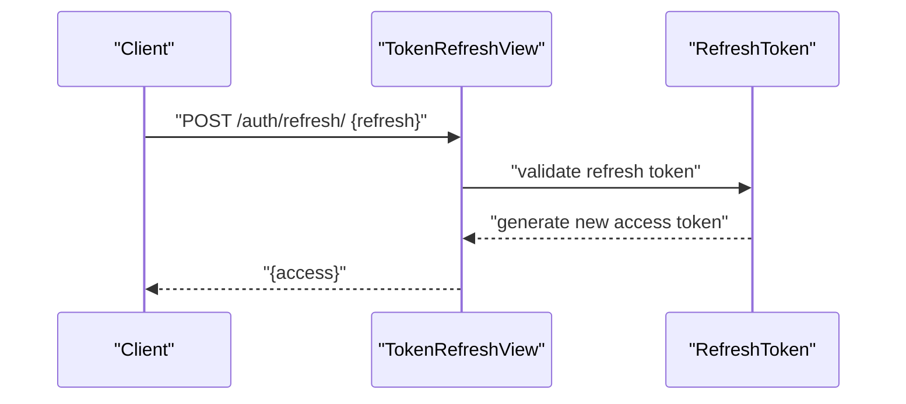
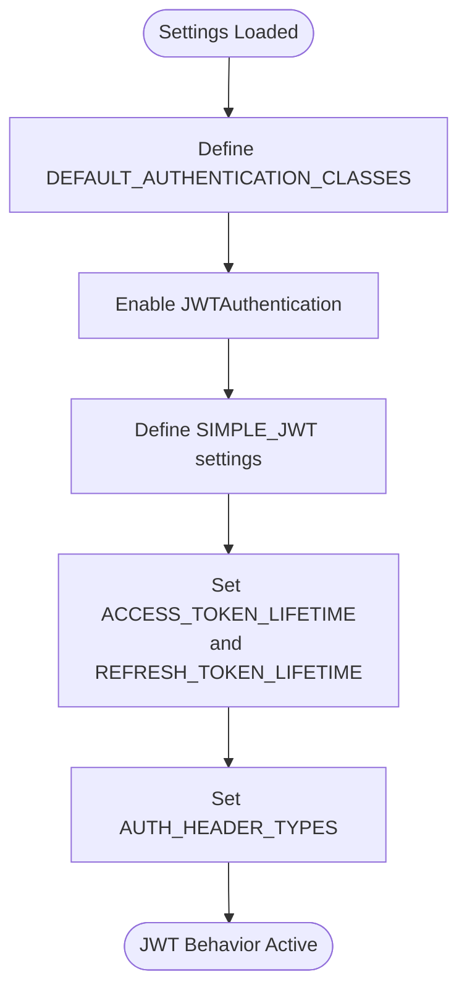
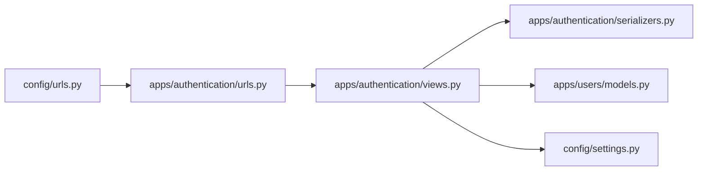

# JWT Authentication Flow

<cite>
**Referenced Files in This Document**
- [views.py](file://apps/authentication/views.py)
- [serializers.py](file://apps/authentication/serializers.py)
- [urls.py](file://apps/authentication/urls.py)
- [settings.py](file://config/settings.py)
- [urls.py](file://config/urls.py)
- [models.py](file://apps/users/models.py)
</cite>

## Table of Contents
1. [Introduction](#introduction)
2. [Project Structure](#project-structure)
3. [Core Components](#core-components)
4. [Architecture Overview](#architecture-overview)
5. [Detailed Component Analysis](#detailed-component-analysis)
6. [Dependency Analysis](#dependency-analysis)
7. [Performance Considerations](#performance-considerations)
8. [Troubleshooting Guide](#troubleshooting-guide)
9. [Conclusion](#conclusion)

## Introduction
This document explains the JWT authentication flow in VeritasShield. It covers the complete lifecycle: user registration with email and password, login using JWT tokens, logout with token blacklisting, and token refresh. It documents the CustomLoginView implementation built on TokenObtainPairView and the CustomTokenSerializer, along with JWT configuration for token lifetimes, header types, and refresh token management. Step-by-step authentication flow diagrams illustrate request/response sequences, and practical guidance is provided for client-side token handling, storage, renewal, error handling, and security best practices.

## Project Structure
The authentication subsystem is organized under apps/authentication with dedicated views, serializers, and URL routing. The Django REST framework integrates with Django’s authentication middleware and the SimpleJWT library for JWT handling. The global settings define JWT behavior and authentication defaults.

**Diagram sources**
- [settings.py:125-143](file://config/settings.py#L125-L143)
- [urls.py:23-30](file://config/urls.py#L23-L30)
- [urls.py:8-14](file://apps/authentication/urls.py#L8-L14)
- [views.py:14-73](file://apps/authentication/views.py#L14-L73)
- [serializers.py:4-5](file://apps/authentication/serializers.py#L4-L5)
- [models.py:9-45](file://apps/users/models.py#L9-L45)

**Section sources**
- [settings.py:125-143](file://config/settings.py#L125-L143)
- [urls.py:23-30](file://config/urls.py#L23-L30)
- [urls.py:8-14](file://apps/authentication/urls.py#L8-L14)
- [views.py:14-73](file://apps/authentication/views.py#L14-L73)
- [serializers.py:4-5](file://apps/authentication/serializers.py#L4-L5)
- [models.py:9-45](file://apps/users/models.py#L9-L45)

## Core Components
- RegisterView: Creates a new user with email and password, then issues both access and refresh tokens.
- LogoutView: Accepts a refresh token and blacklists it to invalidate sessions.
- CustomLoginView: Extends TokenObtainPairView and uses CustomTokenSerializer to authenticate via email.
- CustomTokenSerializer: Overrides the username field to use email for login.
- JWT Settings: Configure access/refresh lifetimes and accepted header types.

Key behaviors:
- Registration returns both access and refresh tokens immediately after successful user creation.
- Login returns a pair of access and refresh tokens.
- Logout requires a refresh token and blacklists it.
- TokenRefreshView handles refresh requests to obtain a new access token using a valid refresh token.

**Section sources**
- [views.py:14-42](file://apps/authentication/views.py#L14-L42)
- [views.py:45-69](file://apps/authentication/views.py#L45-L69)
- [views.py:72-73](file://apps/authentication/views.py#L72-L73)
- [serializers.py:4-5](file://apps/authentication/serializers.py#L4-L5)
- [settings.py:139-142](file://config/settings.py#L139-L142)

## Architecture Overview
The authentication flow integrates Django REST framework with SimpleJWT. Requests are routed under /auth/, validated by JWTAuthentication, and handled by custom views and serializers.

**Diagram sources**
- [urls.py:8-14](file://apps/authentication/urls.py#L8-L14)
- [views.py:72-73](file://apps/authentication/views.py#L72-L73)
- [views.py:14-42](file://apps/authentication/views.py#L14-L42)
- [views.py:45-69](file://apps/authentication/views.py#L45-L69)
- [serializers.py:4-5](file://apps/authentication/serializers.py#L4-L5)
- [settings.py:125-128](file://config/settings.py#L125-L128)
- [models.py:9-25](file://apps/users/models.py#L9-L25)

## Detailed Component Analysis

### Registration Flow
- Endpoint: POST /auth/register/
- Request body: email, password
- Behavior:
  - Validates presence of email and password.
  - Checks for existing email.
  - Creates user via UserManager.
  - Issues a refresh token and extracts the associated access token.
  - Returns both tokens.

**Diagram sources**
- [views.py:14-42](file://apps/authentication/views.py#L14-L42)
- [models.py:9-25](file://apps/users/models.py#L9-L25)

**Section sources**
- [views.py:14-42](file://apps/authentication/views.py#L14-L42)
- [models.py:9-25](file://apps/users/models.py#L9-L25)

### Login Flow
- Endpoint: POST /auth/login/
- Request body: email, password
- Behavior:
  - Uses CustomTokenSerializer to authenticate with email as the username field.
  - Returns a token pair (access and refresh).

**Diagram sources**
- [views.py:72-73](file://apps/authentication/views.py#L72-L73)
- [serializers.py:4-5](file://apps/authentication/serializers.py#L4-L5)
- [models.py:9-25](file://apps/users/models.py#L9-L25)

**Section sources**
- [views.py:72-73](file://apps/authentication/views.py#L72-L73)
- [serializers.py:4-5](file://apps/authentication/serializers.py#L4-L5)
- [models.py:9-25](file://apps/users/models.py#L9-L25)

### Logout Flow
- Endpoint: POST /auth/logout/
- Request body: refresh
- Behavior:
  - Requires an authenticated request.
  - Accepts a refresh token and blacklists it.
  - Returns reset content on success.

**Diagram sources**
- [views.py:45-69](file://apps/authentication/views.py#L45-L69)

**Section sources**
- [views.py:45-69](file://apps/authentication/views.py#L45-L69)

### Token Refresh Flow
- Endpoint: POST /auth/refresh/
- Request body: refresh
- Behavior:
  - Uses TokenRefreshView to accept a valid refresh token and return a new access token.

**Diagram sources**
- [urls.py](file://apps/authentication/urls.py#L12)
- [views.py](file://apps/authentication/views.py#L6)

**Section sources**
- [urls.py](file://apps/authentication/urls.py#L12)
- [views.py](file://apps/authentication/views.py#L6)

### JWT Configuration
- Access token lifetime: 60 minutes
- Refresh token lifetime: 7 days
- Accepted header type: Bearer
- Global authentication class: JWTAuthentication
- Token blacklist app included for refresh token invalidation

**Diagram sources**
- [settings.py:125-143](file://config/settings.py#L125-L143)

**Section sources**
- [settings.py:125-143](file://config/settings.py#L125-L143)

## Dependency Analysis
- CustomLoginView depends on CustomTokenSerializer to authenticate using email.
- RegisterView depends on UserManager to create users and on RefreshToken to issue tokens.
- LogoutView depends on RefreshToken to blacklist tokens.
- URL routing under /auth/ exposes all endpoints.
- JWT settings configure authentication globally.

**Diagram sources**
- [views.py:14-73](file://apps/authentication/views.py#L14-L73)
- [serializers.py:4-5](file://apps/authentication/serializers.py#L4-L5)
- [models.py:9-45](file://apps/users/models.py#L9-L45)
- [urls.py:8-14](file://apps/authentication/urls.py#L8-L14)
- [urls.py:23-30](file://config/urls.py#L23-L30)
- [settings.py:125-143](file://config/settings.py#L125-L143)

**Section sources**
- [views.py:14-73](file://apps/authentication/views.py#L14-L73)
- [serializers.py:4-5](file://apps/authentication/serializers.py#L4-L5)
- [models.py:9-45](file://apps/users/models.py#L9-L45)
- [urls.py:8-14](file://apps/authentication/urls.py#L8-L14)
- [urls.py:23-30](file://config/urls.py#L23-L30)
- [settings.py:125-143](file://config/settings.py#L125-L143)

## Performance Considerations
- Token lifetimes are set to balance security and UX. Shorter access tokens reduce exposure windows; refresh tokens enable long-lived sessions.
- Using token blacklisting ensures immediate invalidation upon logout.
- Keep refresh tokens secure and avoid storing them longer than necessary.

[No sources needed since this section provides general guidance]

## Troubleshooting Guide
Common issues and resolutions:
- Invalid token during logout:
  - Symptom: 400 Bad Request with “Invalid token”.
  - Cause: Malformed or revoked refresh token.
  - Resolution: Ensure the refresh token is valid and not previously blacklisted.
- Missing refresh token on logout:
  - Symptom: 400 Bad Request with “Refresh token required”.
  - Cause: Missing refresh field in request body.
  - Resolution: Provide refresh token in request body.
- Expired tokens:
  - Symptom: Authentication errors when using access tokens after expiration.
  - Resolution: Use /auth/refresh/ with a valid refresh token to obtain a new access token.
- Blacklisted tokens:
  - Symptom: Subsequent requests fail after logout.
  - Cause: Refresh token was blacklisted.
  - Resolution: Obtain a new token pair via login or refresh.

**Section sources**
- [views.py:48-69](file://apps/authentication/views.py#L48-L69)

## Conclusion
VeritasShield implements a robust JWT authentication flow using Django REST framework and SimpleJWT. The system supports user registration, login, logout with token blacklisting, and refresh token management. Configuration in settings defines token lifetimes and accepted header types, while custom views and serializers tailor authentication to use email as the username field. Following the documented flows and best practices ensures secure and reliable authentication across client and server interactions.