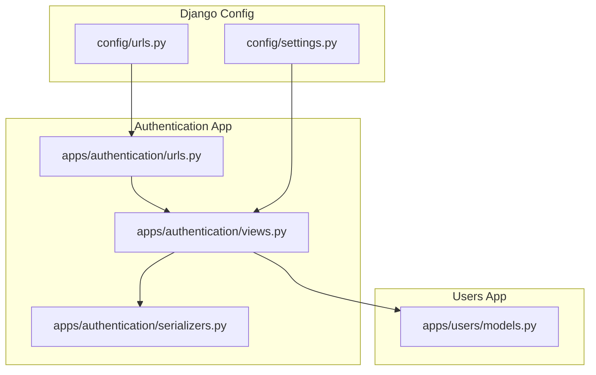
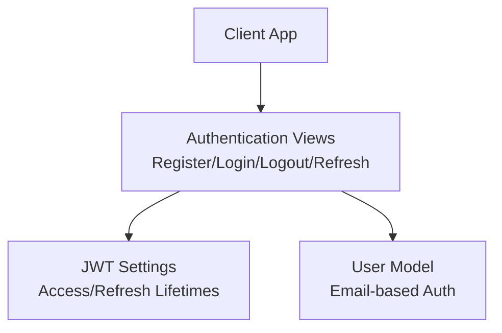
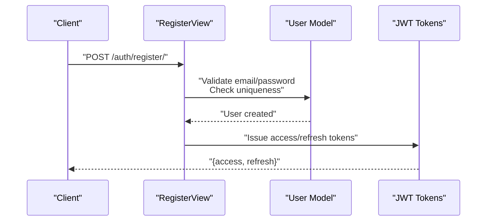
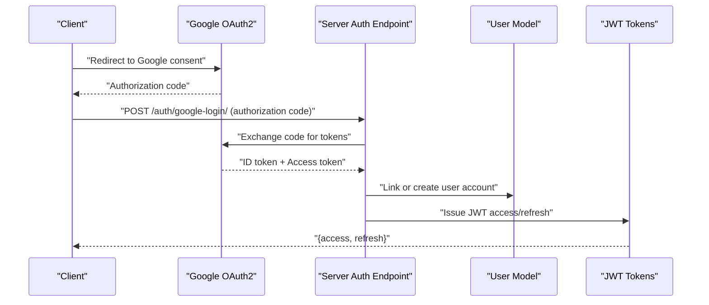
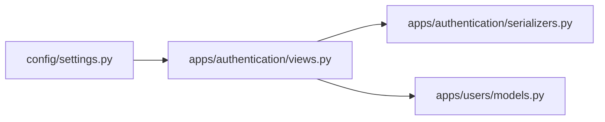

# OAuth2 Integration

<cite>
**Referenced Files in This Document**
- [settings.py](file://config/settings.py)
- [urls.py](file://config/urls.py)
- [apps/authentication/views.py](file://apps/authentication/views.py)
- [apps/authentication/urls.py](file://apps/authentication/urls.py)
- [apps/authentication/serializers.py](file://apps/authentication/serializers.py)
- [apps/users/models.py](file://apps/users/models.py)
- [apps/analysis/views.py](file://apps/analysis/views.py)
</cite>

## Table of Contents
1. [Introduction](#introduction)
2. [Project Structure](#project-structure)
3. [Core Components](#core-components)
4. [Architecture Overview](#architecture-overview)
5. [Detailed Component Analysis](#detailed-component-analysis)
6. [Dependency Analysis](#dependency-analysis)
7. [Performance Considerations](#performance-considerations)
8. [Troubleshooting Guide](#troubleshooting-guide)
9. [Conclusion](#conclusion)

## Introduction
This document describes the OAuth2 authentication integration for VeritasShield with a focus on Google OAuth2. It covers client configuration, authorization flow, token exchange, settings, client credentials management, redirect URIs, callback handling, user account linking, profile mapping, and JWT-based session management. It also documents security considerations, debugging techniques, and fallback authentication methods.

## Project Structure
VeritasShield organizes authentication under the apps/authentication package and integrates with Django’s URL routing via config/urls.py. The authentication module exposes endpoints for registration, login, logout, and token refresh. JWT is configured globally and used for session tokens.

**Diagram sources**
- [urls.py:23-30](file://config/urls.py#L23-L30)
- [settings.py:26-40](file://config/settings.py#L26-L40)
- [apps/authentication/views.py:14-74](file://apps/authentication/views.py#L14-L74)
- [apps/authentication/urls.py:8-14](file://apps/authentication/urls.py#L8-L14)
- [apps/authentication/serializers.py:4-6](file://apps/authentication/serializers.py#L4-L6)
- [apps/users/models.py:29-45](file://apps/users/models.py#L29-L45)

**Section sources**
- [urls.py:23-30](file://config/urls.py#L23-L30)
- [settings.py:26-40](file://config/settings.py#L26-L40)

## Core Components
- Authentication endpoints: Registration, login, logout, and token refresh are exposed under /auth/.
- JWT configuration: Access and refresh lifetimes, header types, and default renderer are set globally.
- User model: Custom user model using email as the primary identifier.
- Google OAuth2 client ID: Defined in settings for future Google OAuth2 integration.

Key endpoint paths:
- POST /auth/register/
- POST /auth/login/
- POST /auth/logout/
- POST /auth/refresh/

**Section sources**
- [apps/authentication/views.py:14-74](file://apps/authentication/views.py#L14-L74)
- [apps/authentication/urls.py:8-14](file://apps/authentication/urls.py#L8-L14)
- [settings.py:125-143](file://config/settings.py#L125-L143)
- [apps/users/models.py:29-45](file://apps/users/models.py#L29-L45)
- [settings.py:146-148](file://config/settings.py#L146-L148)

## Architecture Overview
The authentication architecture combines Django REST framework with JWT for secure token-based sessions. The authentication app exposes endpoints that integrate with the global JWT settings. The user model supports email-based authentication and is referenced by the authentication app.

**Diagram sources**
- [apps/authentication/views.py:14-74](file://apps/authentication/views.py#L14-L74)
- [settings.py:125-143](file://config/settings.py#L125-L143)
- [apps/users/models.py:29-45](file://apps/users/models.py#L29-L45)

## Detailed Component Analysis

### JWT and Session Management
- Access token lifetime and refresh token lifetime are configured in SIMPLE_JWT.
- DEFAULT_AUTHENTICATION_CLASSES uses JWTAuthentication, enabling bearer token authentication across the API.
- Renderer defaults to JSON, ensuring consistent response formatting.

Implementation references:
- [settings.py:125-143](file://config/settings.py#L125-L143)

Security considerations:
- Keep ACCESS_TOKEN_LIFETIME short-lived for reduced exposure windows.
- Use HTTPS in production to protect tokens in transit.
- Store refresh tokens securely and consider blacklisting invalid tokens.

**Section sources**
- [settings.py:125-143](file://config/settings.py#L125-L143)

### User Model and Email-Based Authentication
- The custom User model uses email as the unique identifier and USERNAME_FIELD.
- Password hashing is handled by Django’s base user manager.
- ACCOUNT_* settings indicate email-based authentication is preferred.

Implementation references:
- [apps/users/models.py:29-45](file://apps/users/models.py#L29-L45)
- [settings.py:144-154](file://config/settings.py#L144-L154)

**Section sources**
- [apps/users/models.py:29-45](file://apps/users/models.py#L29-L45)
- [settings.py:144-154](file://config/settings.py#L144-L154)

### Authentication Endpoints
- RegisterView validates email/password, checks for duplicates, creates a user, and issues JWT tokens.
- LogoutView accepts a refresh token and blacklists it.
- CustomLoginView extends TokenObtainPairView with a custom serializer that uses email as the username field.

Implementation references:
- [apps/authentication/views.py:14-74](file://apps/authentication/views.py#L14-L74)
- [apps/authentication/serializers.py:4-6](file://apps/authentication/serializers.py#L4-L6)

**Diagram sources**
- [apps/authentication/views.py:14-42](file://apps/authentication/views.py#L14-L42)
- [apps/users/models.py:29-45](file://apps/users/models.py#L29-L45)

**Section sources**
- [apps/authentication/views.py:14-74](file://apps/authentication/views.py#L14-L74)
- [apps/authentication/serializers.py:4-6](file://apps/authentication/serializers.py#L4-L6)

### Google OAuth2 Client Configuration
- GOOGLE_OAUTH2_CLIENT_ID is defined in settings.
- A placeholder route for Google login is present in authentication URLs but not implemented yet.

Implementation references:
- [settings.py:146-148](file://config/settings.py#L146-L148)
- [apps/authentication/urls.py](file://apps/authentication/urls.py#L13)

Security considerations:
- Store client secrets in environment variables in production.
- Restrict ALLOWED_HOSTS and enforce HTTPS.
- Use state parameter and PKCE for enhanced security.

**Section sources**
- [settings.py:146-148](file://config/settings.py#L146-L148)
- [apps/authentication/urls.py](file://apps/authentication/urls.py#L13)

### Authorization Flow and Token Exchange (Google OAuth2)
The following flow outlines the typical Google OAuth2 authorization and token exchange process. This is a conceptual representation of the steps involved; actual implementation requires adding a Google OAuth2 provider and handler.

[No sources needed since this diagram shows conceptual workflow, not actual code structure]

### Callback Handling, Account Linking, and Profile Mapping
- After successful token exchange, map Google profile data to the User model (email/name).
- If a user does not exist, create a new user; otherwise, link the existing account.
- Persist any additional profile fields as needed.

[No sources needed since this section doesn't analyze specific source files]

### Implementation Examples
- Social login integration: Add a Google OAuth2 provider and a dedicated view to handle the callback and token exchange.
- Token validation: Use JWTAuthentication to validate incoming requests.
- User session management: Issue and refresh tokens upon successful login; blacklist refresh tokens on logout.

[No sources needed since this section provides general guidance]

## Dependency Analysis
The authentication app depends on:
- Django REST framework and SimpleJWT for token handling.
- The custom User model for identity management.
- Global settings for JWT configuration and authentication policies.

**Diagram sources**
- [settings.py:125-143](file://config/settings.py#L125-L143)
- [apps/authentication/views.py:14-74](file://apps/authentication/views.py#L14-L74)
- [apps/authentication/serializers.py:4-6](file://apps/authentication/serializers.py#L4-L6)
- [apps/users/models.py:29-45](file://apps/users/models.py#L29-L45)

**Section sources**
- [settings.py:125-143](file://config/settings.py#L125-L143)
- [apps/authentication/views.py:14-74](file://apps/authentication/views.py#L14-L74)
- [apps/authentication/serializers.py:4-6](file://apps/authentication/serializers.py#L4-L6)
- [apps/users/models.py:29-45](file://apps/users/models.py#L29-L45)

## Performance Considerations
- Keep access tokens short-lived to minimize risk and reduce long-term token storage overhead.
- Use efficient database queries when validating tokens and linking accounts.
- Cache frequently accessed user metadata to reduce database load.

[No sources needed since this section provides general guidance]

## Troubleshooting Guide
Common OAuth2 issues and resolutions:
- Invalid client credentials: Verify GOOGLE_OAUTH2_CLIENT_ID and ensure the client secret is managed securely.
- Redirect URI mismatch: Confirm redirect URIs match those registered with Google.
- State parameter tampering: Always validate the state parameter and regenerate it per request.
- CSRF protection: Enable CSRF middleware and ensure anti-CSRF tokens are included in requests.
- Token validation failures: Confirm JWT settings and ensure clients send Bearer tokens correctly.
- Debugging techniques: Log authorization codes, ID tokens, and error responses during the exchange process. Inspect server logs and network traffic.

Fallback authentication methods:
- Continue to support email/password login via the existing login endpoint.
- Provide a logout endpoint to revoke tokens and clear sessions.

**Section sources**
- [apps/authentication/views.py:45-69](file://apps/authentication/views.py#L45-L69)
- [settings.py:125-143](file://config/settings.py#L125-L143)

## Conclusion
VeritasShield’s authentication system is built around JWT and a custom email-based user model. While Google OAuth2 is not yet implemented, the project includes a client ID setting and a placeholder route for future integration. By following the outlined security practices—such as state parameter handling, CSRF protection, HTTPS enforcement, and careful token lifecycle management—you can safely implement Google OAuth2 and maintain robust session management.