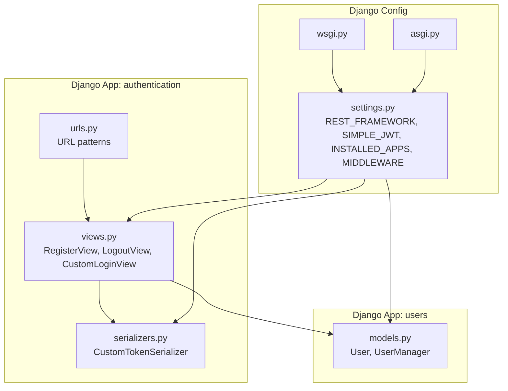
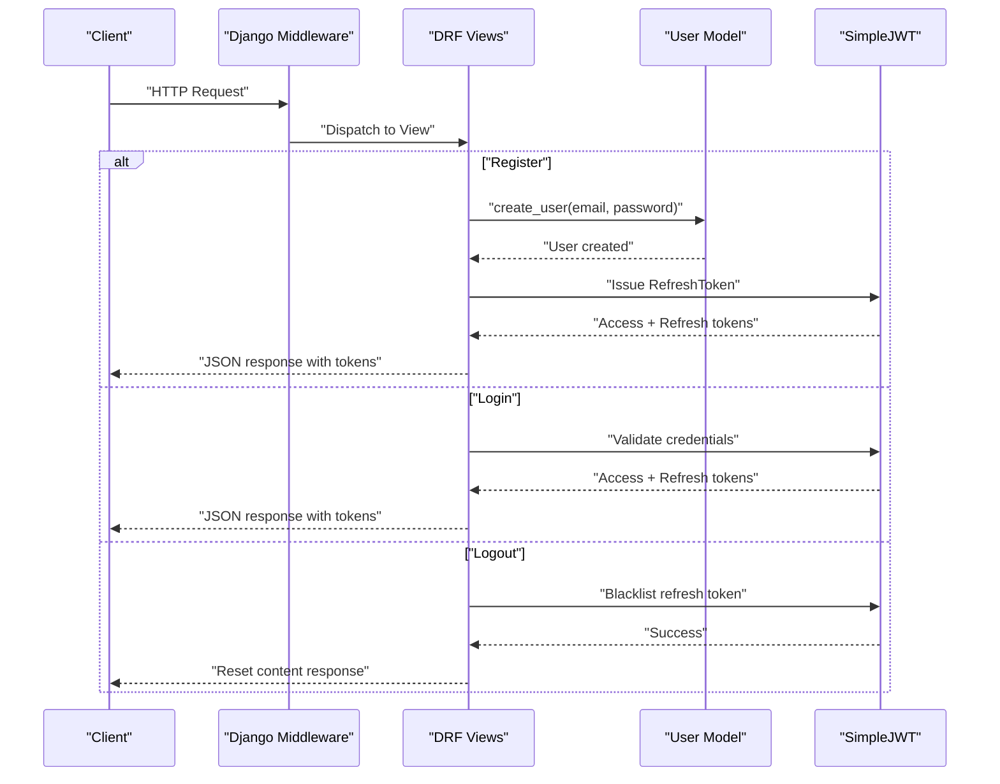
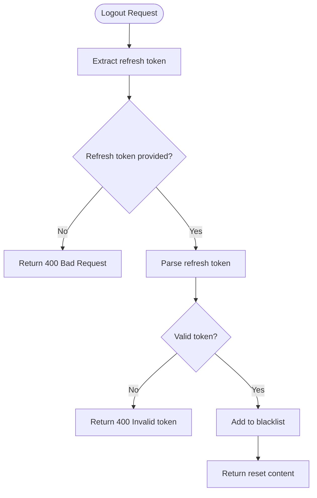
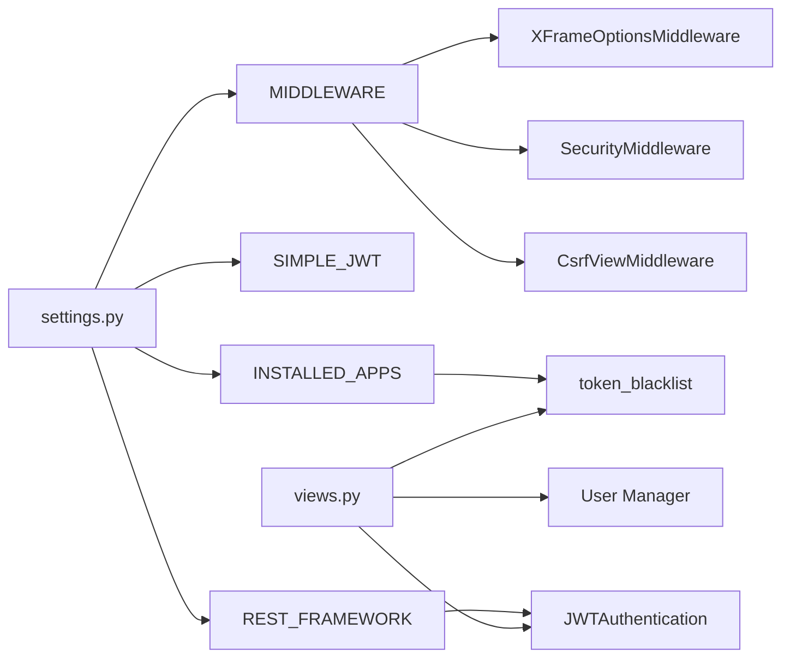

# Security Considerations

<cite>
**Referenced Files in This Document**
- [settings.py](file://config/settings.py)
- [urls.py](file://apps/authentication/urls.py)
- [views.py](file://apps/authentication/views.py)
- [serializers.py](file://apps/authentication/serializers.py)
- [models.py](file://apps/users/models.py)
- [wsgi.py](file://config/wsgi.py)
- [asgi.py](file://config/asgi.py)
</cite>

## Table of Contents
1. [Introduction](#introduction)
2. [Project Structure](#project-structure)
3. [Core Components](#core-components)
4. [Architecture Overview](#architecture-overview)
5. [Detailed Component Analysis](#detailed-component-analysis)
6. [Dependency Analysis](#dependency-analysis)
7. [Performance Considerations](#performance-considerations)
8. [Troubleshooting Guide](#troubleshooting-guide)
9. [Conclusion](#conclusion)
10. [Appendices](#appendices)

## Introduction
This document provides comprehensive security documentation for the authentication system. It focuses on JWT token security, password handling, session and token lifecycle management, input validation, CSRF protection, rate limiting, and secure deployment practices. Guidance is grounded in the actual implementation present in the repository.

## Project Structure
The authentication subsystem is implemented as a Django app with DRF endpoints, JWT-based authentication via Django REST Framework SimpleJWT, and a custom user model. URLs define registration, login, logout, and token refresh endpoints. Settings configure JWT lifetimes, default authentication, and middleware stack.

**Diagram sources**
- [urls.py:1-15](file://apps/authentication/urls.py#L1-L15)
- [views.py:1-74](file://apps/authentication/views.py#L1-L74)
- [serializers.py:1-6](file://apps/authentication/serializers.py#L1-L6)
- [models.py:1-46](file://apps/users/models.py#L1-L46)
- [settings.py:1-155](file://config/settings.py#L1-L155)
- [wsgi.py:1-17](file://config/wsgi.py#L1-L17)
- [asgi.py:1-17](file://config/asgi.py#L1-L17)

**Section sources**
- [urls.py:1-15](file://apps/authentication/urls.py#L1-L15)
- [views.py:1-74](file://apps/authentication/views.py#L1-L74)
- [serializers.py:1-6](file://apps/authentication/serializers.py#L1-L6)
- [models.py:1-46](file://apps/users/models.py#L1-L46)
- [settings.py:1-155](file://config/settings.py#L1-L155)
- [wsgi.py:1-17](file://config/wsgi.py#L1-L17)
- [asgi.py:1-17](file://config/asgi.py#L1-L17)

## Core Components
- JWT Authentication: Enabled globally via DRF SimpleJWT. Access tokens expire after a configured duration; refresh tokens last longer and are used to obtain new access tokens.
- Token Lifecycle: Registration issues both access and refresh tokens; logout invalidates the refresh token by blacklisting it.
- Credentials: Login uses email as the username field; passwords are hashed by the user manager.
- Middleware: CSRF protection is enabled; clickjacking protection is present.

Key security-relevant settings and behaviors:
- JWT lifetimes and header types are configured centrally.
- Default authentication class is JWT.
- Password validators are enabled.
- Token blacklist app is installed.

**Section sources**
- [settings.py:125-143](file://config/settings.py#L125-L143)
- [views.py:14-42](file://apps/authentication/views.py#L14-L42)
- [views.py:45-69](file://apps/authentication/views.py#L45-L69)
- [serializers.py:4-6](file://apps/authentication/serializers.py#L4-L6)
- [models.py:9-26](file://apps/users/models.py#L9-L26)

## Architecture Overview
The authentication flow integrates DRF, SimpleJWT, and the custom user model. Requests traverse Django middleware, reach DRF views, and leverage SimpleJWT for token issuance and validation.

**Diagram sources**
- [views.py:14-42](file://apps/authentication/views.py#L14-L42)
- [views.py:45-69](file://apps/authentication/views.py#L45-L69)
- [serializers.py:4-6](file://apps/authentication/serializers.py#L4-L6)
- [models.py:9-26](file://apps/users/models.py#L9-L26)
- [settings.py:125-143](file://config/settings.py#L125-L143)

## Detailed Component Analysis

### JWT Token Security
- Signing and Algorithms
  - The JWT library and algorithm selection are controlled by the SimpleJWT configuration. Ensure the signing algorithm aligns with organizational security policy and rotate keys periodically.
  - Configure the algorithm and signing key in the SimpleJWT settings to enforce secure signing.
- Token Lifetimes
  - Access tokens: short-lived (minutes) to reduce exposure windows.
  - Refresh tokens: longer-lived but revocable via blacklist.
- Secure Transmission
  - Enforce HTTPS in production to protect tokens in transit.
  - Avoid logging tokens; ensure clients store tokens securely (e.g., HttpOnly, secure storage).
- Token Validation
  - Leverage DRF’s JWT authentication class to validate tokens server-side.

Operational behavior in code:
- Access and refresh lifetimes are set in settings.
- Token issuance occurs during registration and login.
- Logout triggers token blacklisting.

**Section sources**
- [settings.py:139-143](file://config/settings.py#L139-L143)
- [views.py:37-42](file://apps/authentication/views.py#L37-L42)
- [views.py:58-69](file://apps/authentication/views.py#L58-L69)

### Password Security Measures
- Hashing and Validation
  - Passwords are hashed using the user manager’s built-in hashing mechanism.
  - Password validators are enabled to enforce minimum length, avoid common passwords, and prevent similarity to user attributes.
- Credential Validation
  - Login uses email as the username field, ensuring consistent validation.

**Section sources**
- [models.py:11-19](file://apps/users/models.py#L11-L19)
- [models.py:41-42](file://apps/users/models.py#L41-L42)
- [serializers.py:4-6](file://apps/authentication/serializers.py#L4-L6)
- [settings.py:88-103](file://config/settings.py#L88-L103)

### Session Management, Token Blacklisting, and Logout Security
- Session Management
  - Sessions are enabled via Django’s contrib sessions middleware.
- Token Blacklisting
  - The token blacklist app is installed and enabled.
  - Logout endpoint accepts a refresh token and blacklists it to invalidate the session.
- Logout Security
  - Requires a refresh token; missing or invalid tokens return appropriate errors.

**Diagram sources**
- [views.py:45-69](file://apps/authentication/views.py#L45-L69)
- [settings.py:33-33](file://config/settings.py#L33-L33)

**Section sources**
- [views.py:45-69](file://apps/authentication/views.py#L45-L69)
- [settings.py:33-33](file://config/settings.py#L33-L33)

### Input Validation, SQL Injection Prevention, and CSRF Protection
- Input Validation
  - Registration endpoint checks for presence of email and password and ensures uniqueness before creating a user.
  - DRF parsers and renderers restrict to JSON by default, reducing unexpected payload risks.
- SQL Injection Prevention
  - Django ORM usage in the user manager prevents raw SQL injection.
- CSRF Protection
  - CSRF middleware is enabled, protecting against cross-site request forgery.

**Section sources**
- [views.py:14-35](file://apps/authentication/views.py#L14-L35)
- [models.py:11-19](file://apps/users/models.py#L11-L19)
- [settings.py:42-50](file://config/settings.py#L42-L50)
- [settings.py:125-137](file://config/settings.py#L125-L137)

### Rate Limiting, Brute Force Protection, and Account Lockout Policies
- Current State
  - No explicit rate limiting or brute force protection is configured in the repository.
- Recommended Actions
  - Integrate a rate-limiting solution (e.g., database-backed counters per IP/email).
  - Implement temporary lockout after repeated failed attempts.
  - Add circuit-breaker logic around login endpoints.
  - Consider CAPTCHA for high-risk scenarios.

[No sources needed since this section provides general guidance]

### Security Headers, HTTPS Enforcement, and Secure Cookie Settings
- Security Headers
  - Security middleware is enabled; consider adding HSTS, CSP, X-Content-Type-Options, and X-Frame-Options via middleware or reverse proxy.
- HTTPS Enforcement
  - Enforce HTTPS in production deployments; do not run JWT over plain HTTP.
- Secure Cookies
  - Ensure sessions and any cookies use secure and HttpOnly flags in production settings.

[No sources needed since this section provides general guidance]

### Common Security Vulnerabilities and Penetration Testing Considerations
- JWT-Specific
  - Verify algorithm configuration and key management.
  - Prevent token replays and ensure short access token lifetimes.
- OWASP Top Ten
  - Validate inputs rigorously; sanitize and normalize data.
  - Protect against CSRF, IDOR, and SSRF.
- Pen Testing Checklist
  - Test token interception, tampering, and brute-force resistance.
  - Validate logout invalidation and session termination.
  - Assess resilience to DoS via excessive token refresh requests.

[No sources needed since this section provides general guidance]

### Compliance Requirements
- Data Protection
  - Ensure encryption at rest and in transit; manage secrets securely.
- Audit Logging
  - Log authentication events (successful/failed logins, logout, token issuance/invalidation).
- Access Control
  - Enforce least privilege and role-based permissions.

[No sources needed since this section provides general guidance]

## Dependency Analysis
The authentication app depends on Django, DRF, SimpleJWT, and the custom user model. Settings tie these together.

**Diagram sources**
- [settings.py:26-50](file://config/settings.py#L26-L50)
- [settings.py:125-143](file://config/settings.py#L125-L143)
- [views.py:1-11](file://apps/authentication/views.py#L1-L11)

**Section sources**
- [settings.py:26-50](file://config/settings.py#L26-L50)
- [settings.py:125-143](file://config/settings.py#L125-L143)
- [views.py:1-11](file://apps/authentication/views.py#L1-L11)

## Performance Considerations
- Token Lifetimes
  - Short access tokens reduce long-term risk but increase refresh frequency.
- Blacklist Lookups
  - Token blacklist queries add latency; consider indexing and caching strategies.
- Middleware Overhead
  - CSRF and security middleware add minimal overhead but are essential for safety.

[No sources needed since this section provides general guidance]

## Troubleshooting Guide
- Registration Failures
  - Missing email or password yields a client error.
  - Duplicate email triggers a conflict error.
- Login Failures
  - Invalid credentials are handled by the JWT library; ensure correct email/password combination.
- Logout Failures
  - Missing refresh token returns a client error.
  - Invalid refresh token returns a client error.

**Section sources**
- [views.py:14-35](file://apps/authentication/views.py#L14-L35)
- [views.py:45-69](file://apps/authentication/views.py#L45-L69)

## Conclusion
The authentication system leverages DRF and SimpleJWT for secure token-based authentication, with CSRF protection and password validators. To harden the system, deploy behind HTTPS, configure robust JWT settings, implement rate limiting and brute force protections, and adopt secure cookie and header policies. Regular audits and monitoring are essential for ongoing security.

## Appendices

### Security Audit Checklist
- [ ] HTTPS enforced in production
- [ ] JWT algorithm and key rotation configured
- [ ] Access tokens short-lived; refresh tokens blacklisted on logout
- [ ] CSRF middleware enabled
- [ ] Password validators enabled and up-to-date
- [ ] Input validation and normalization in place
- [ ] Rate limiting and brute force protections deployed
- [ ] Secure cookie flags (HttpOnly, Secure) configured
- [ ] Audit logs for authentication events
- [ ] Secret keys and environment variables managed securely

[No sources needed since this section provides general guidance]