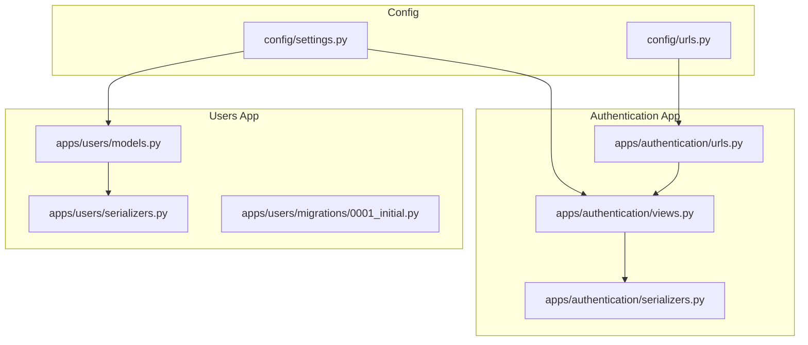
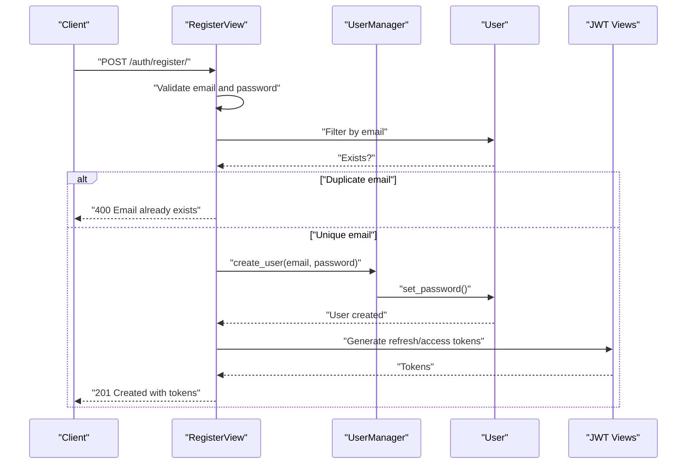
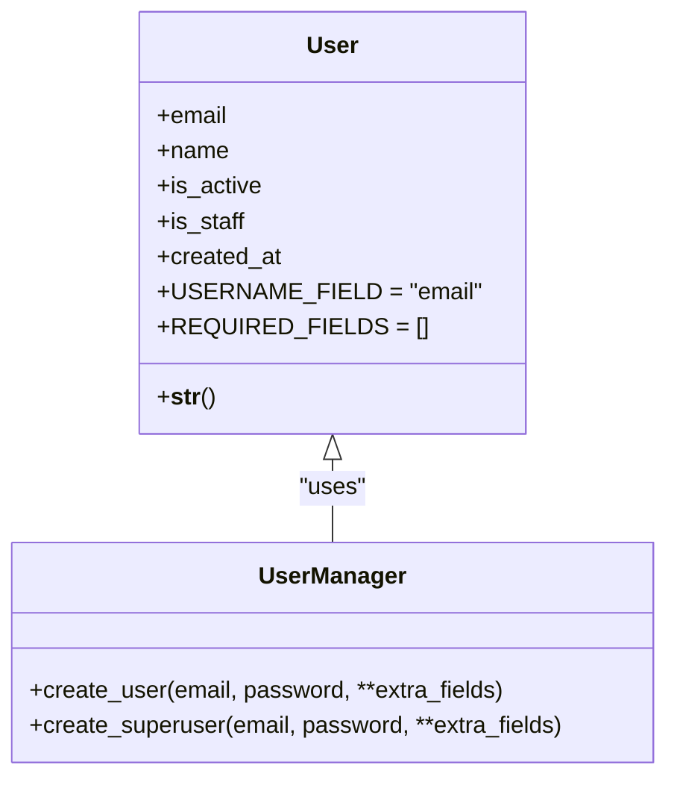
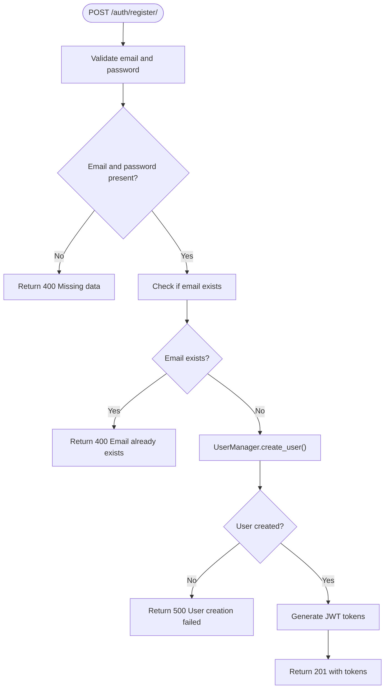
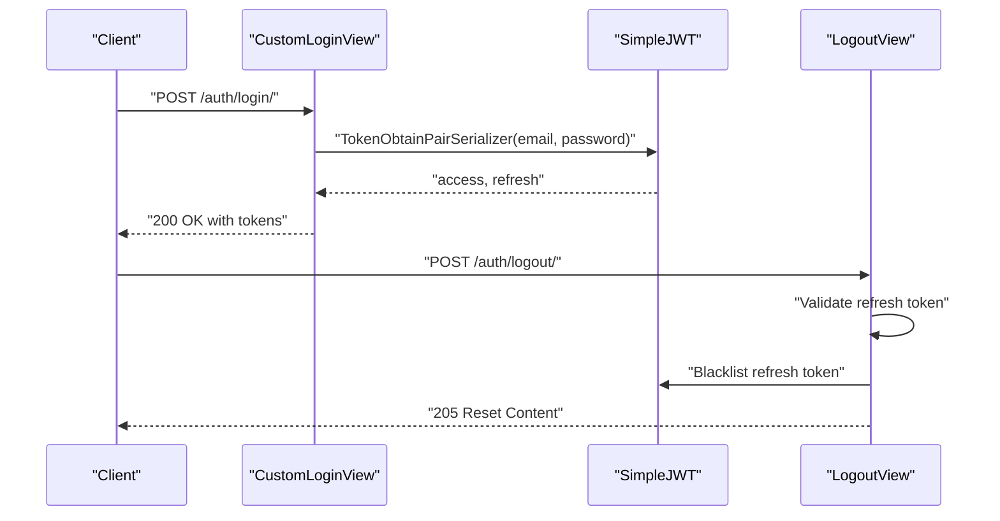
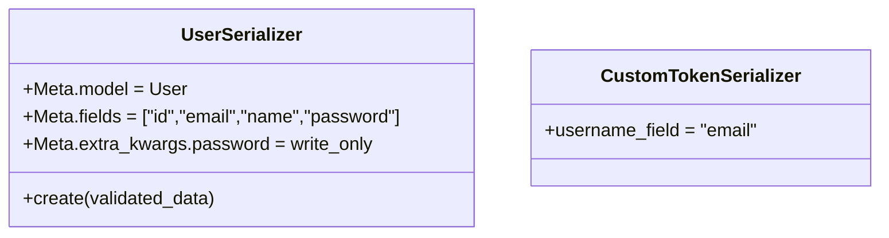
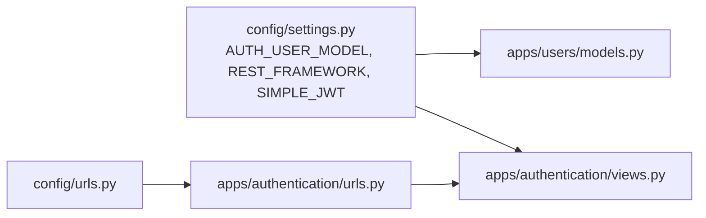

# User Model and Registration

<cite>
**Referenced Files in This Document**
- [apps/users/models.py](file://apps/users/models.py)
- [apps/users/serializers.py](file://apps/users/serializers.py)
- [apps/users/migrations/0001_initial.py](file://apps/users/migrations/0001_initial.py)
- [apps/authentication/views.py](file://apps/authentication/views.py)
- [apps/authentication/serializers.py](file://apps/authentication/serializers.py)
- [apps/authentication/urls.py](file://apps/authentication/urls.py)
- [config/settings.py](file://config/settings.py)
- [config/urls.py](file://config/urls.py)
</cite>

## Table of Contents
1. [Introduction](#introduction)
2. [Project Structure](#project-structure)
3. [Core Components](#core-components)
4. [Architecture Overview](#architecture-overview)
5. [Detailed Component Analysis](#detailed-component-analysis)
6. [Dependency Analysis](#dependency-analysis)
7. [Performance Considerations](#performance-considerations)
8. [Troubleshooting Guide](#troubleshooting-guide)
9. [Conclusion](#conclusion)

## Introduction
This document explains the custom User model and registration system that replaces traditional username/password authentication with email-based authentication. It covers the User model fields, validation rules, and inheritance from AbstractBaseUser. It documents the registration API endpoint, including request validation, duplicate email checks, and user creation. It also explains password hashing, validation requirements, JWT-based login/logout, and serializer implementations for user registration and profile management. Finally, it outlines user activation workflows, email verification processes, and account management features.

## Project Structure
The user and authentication system spans two Django apps:
- users: Defines the custom User model and related serializers.
- authentication: Provides registration, login, logout, and token management endpoints.

**Diagram sources**
- [config/settings.py:144](file://config/settings.py#L144)
- [config/urls.py:26](file://config/urls.py#L26)
- [apps/users/models.py:29](file://apps/users/models.py#L29)
- [apps/users/serializers.py:6](file://apps/users/serializers.py#L6)
- [apps/users/migrations/0001_initial.py:16](file://apps/users/migrations/0001_initial.py#L16)
- [apps/authentication/views.py:14](file://apps/authentication/views.py#L14)
- [apps/authentication/serializers.py:4](file://apps/authentication/serializers.py#L4)
- [apps/authentication/urls.py:8](file://apps/authentication/urls.py#L8)

**Section sources**
- [config/settings.py:26-40](file://config/settings.py#L26-L40)
- [config/urls.py:23-30](file://config/urls.py#L23-L30)
- [apps/authentication/urls.py:8-14](file://apps/authentication/urls.py#L8-L14)

## Core Components
- Custom User model inheriting from AbstractBaseUser and PermissionsMixin, using email as the unique identifier and login field.
- User manager implementing create_user and create_superuser with password hashing.
- Registration API view validating inputs, preventing duplicate emails, and creating users with JWT tokens.
- Login view extending TokenObtainPairView with email-based credentials.
- Logout view blacklisting refresh tokens.
- Serializers for user registration and JWT pair retrieval.

**Section sources**
- [apps/users/models.py:9-45](file://apps/users/models.py#L9-L45)
- [apps/authentication/views.py:14-73](file://apps/authentication/views.py#L14-L73)
- [apps/authentication/serializers.py:4](file://apps/authentication/serializers.py#L4)
- [apps/users/serializers.py:6-13](file://apps/users/serializers.py#L6-L13)

## Architecture Overview
The system integrates Django’s authentication framework with REST Framework and SimpleJWT. The custom User model is configured globally, and authentication endpoints are exposed under the authentication app.

**Diagram sources**
- [apps/authentication/views.py:14-42](file://apps/authentication/views.py#L14-L42)
- [apps/users/models.py:9-25](file://apps/users/models.py#L9-L25)

## Detailed Component Analysis

### User Model and Manager
- Fields:
  - email: unique EmailField
  - name: optional CharField
  - is_active: BooleanField default True
  - is_staff: BooleanField default False
  - created_at: DateTimeField auto_now_add
- USERNAME_FIELD: email
- REQUIRED_FIELDS: empty list
- Manager methods:
  - create_user: validates presence of email, normalizes email, sets hashed password, saves user
  - create_superuser: sets defaults for staff and superuser flags

**Diagram sources**
- [apps/users/models.py:29](file://apps/users/models.py#L29)
- [apps/users/models.py:9](file://apps/users/models.py#L9)

**Section sources**
- [apps/users/models.py:29-45](file://apps/users/models.py#L29-L45)
- [apps/users/migrations/0001_initial.py:16-32](file://apps/users/migrations/0001_initial.py#L16-L32)

### Registration API Endpoint
- Endpoint: POST /auth/register/
- Validation:
  - Rejects missing email or password
  - Checks for existing email to prevent duplicates
- Creation:
  - Uses UserManager.create_user to hash password and persist user
- Response:
  - Returns JWT access and refresh tokens on success
  - Returns appropriate error codes for invalid inputs or failures

**Diagram sources**
- [apps/authentication/views.py:14-42](file://apps/authentication/views.py#L14-L42)

**Section sources**
- [apps/authentication/views.py:14-42](file://apps/authentication/views.py#L14-L42)

### Login and Logout
- Login:
  - Extends TokenObtainPairView with a custom serializer that uses email as the username field
- Logout:
  - Accepts a refresh token and blacklists it via RefreshToken.blacklist()

**Diagram sources**
- [apps/authentication/views.py:72-73](file://apps/authentication/views.py#L72-L73)
- [apps/authentication/serializers.py:4](file://apps/authentication/serializers.py#L4)
- [apps/authentication/views.py:45-69](file://apps/authentication/views.py#L45-L69)

**Section sources**
- [apps/authentication/views.py:72-73](file://apps/authentication/views.py#L72-L73)
- [apps/authentication/serializers.py:4](file://apps/authentication/serializers.py#L4)
- [apps/authentication/views.py:45-69](file://apps/authentication/views.py#L45-L69)

### Serializers
- UserSerializer:
  - Model: User
  - Fields: id, email, name, password
  - write_only: password
  - create: delegates to UserManager.create_user
- CustomTokenSerializer:
  - Extends TokenObtainPairSerializer
  - Overrides username_field to use email

**Diagram sources**
- [apps/users/serializers.py:6](file://apps/users/serializers.py#L6)
- [apps/authentication/serializers.py:4](file://apps/authentication/serializers.py#L4)

**Section sources**
- [apps/users/serializers.py:6-13](file://apps/users/serializers.py#L6-L13)
- [apps/authentication/serializers.py:4](file://apps/authentication/serializers.py#L4)

### URL Routing
- Authentication endpoints:
  - /auth/login/
  - /auth/logout/
  - /auth/register/
  - /auth/refresh/

**Section sources**
- [apps/authentication/urls.py:8-14](file://apps/authentication/urls.py#L8-L14)
- [config/urls.py:26](file://config/urls.py#L26)

## Dependency Analysis
- Global configuration:
  - AUTH_USER_MODEL points to users.User
  - REST_FRAMEWORK uses JWTAuthentication
  - SIMPLE_JWT defines token lifetimes and header types
- App wiring:
  - Root URLs include authentication app
  - Authentication app exposes registration, login, logout, and refresh endpoints

**Diagram sources**
- [config/settings.py:144](file://config/settings.py#L144)
- [config/settings.py:125-143](file://config/settings.py#L125-L143)
- [config/urls.py:26](file://config/urls.py#L26)
- [apps/authentication/urls.py:8](file://apps/authentication/urls.py#L8)

**Section sources**
- [config/settings.py:125-144](file://config/settings.py#L125-L144)
- [config/urls.py:23-30](file://config/urls.py#L23-L30)

## Performance Considerations
- Token lifetime configuration:
  - ACCESS_TOKEN_LIFETIME and REFRESH_TOKEN_LIFETIME are set in SIMPLE_JWT
- Password validators:
  - AUTH_PASSWORD_VALIDATORS are enabled to enforce strong passwords
- Serializer write-only password:
  - Prevents password leakage in responses

[No sources needed since this section provides general guidance]

## Troubleshooting Guide
- Registration errors:
  - Missing data: ensure both email and password are provided
  - Duplicate email: choose a unique email address
  - User creation failure: verify database connectivity and migrations
- Login errors:
  - Invalid credentials: confirm email and password match
  - Token errors: ensure correct token type and header format
- Logout errors:
  - Missing refresh token: provide refresh token in request body
  - Invalid token: ensure token is unexpired and not previously blacklisted

**Section sources**
- [apps/authentication/views.py:19-27](file://apps/authentication/views.py#L19-L27)
- [apps/authentication/views.py:31-35](file://apps/authentication/views.py#L31-L35)
- [apps/authentication/views.py:52-59](file://apps/authentication/views.py#L52-L59)
- [apps/authentication/views.py:66-69](file://apps/authentication/views.py#L66-L69)

## Conclusion
The system implements a secure, email-based authentication model with a custom User class and robust JWT-based login/logout flows. Registration enforces input validation and prevents duplicate accounts, while password hashing and Django’s built-in validators protect user credentials. The modular design keeps user management and authentication logic cleanly separated, enabling straightforward extension for activation and verification workflows.