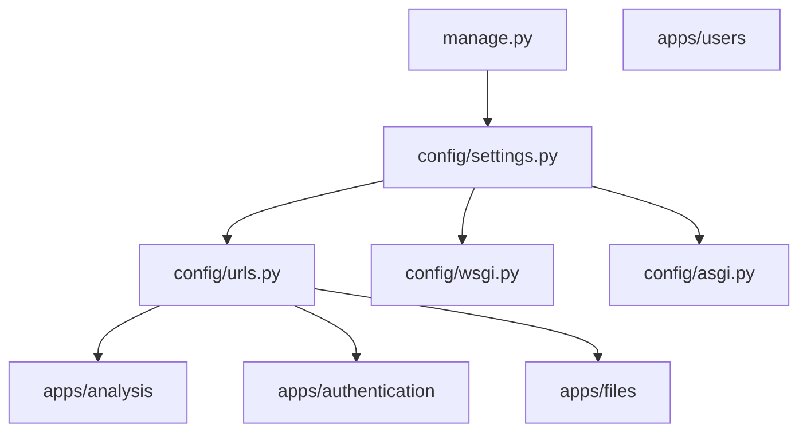
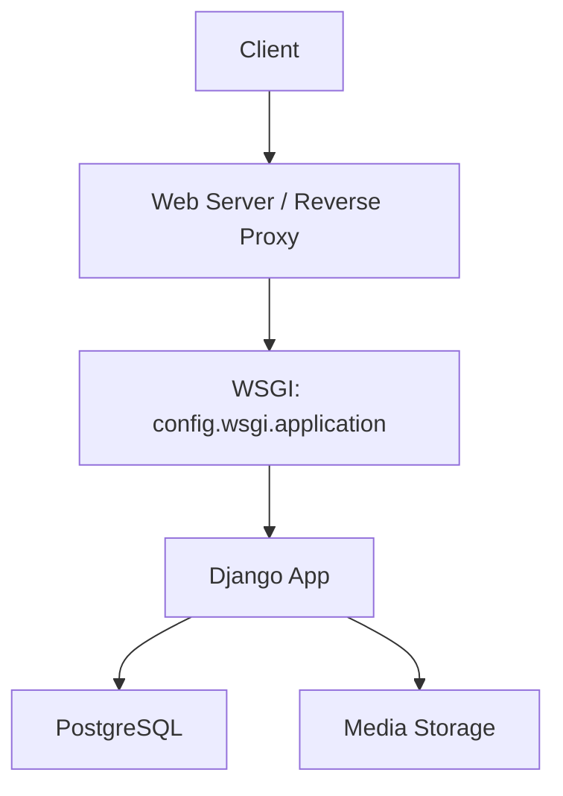
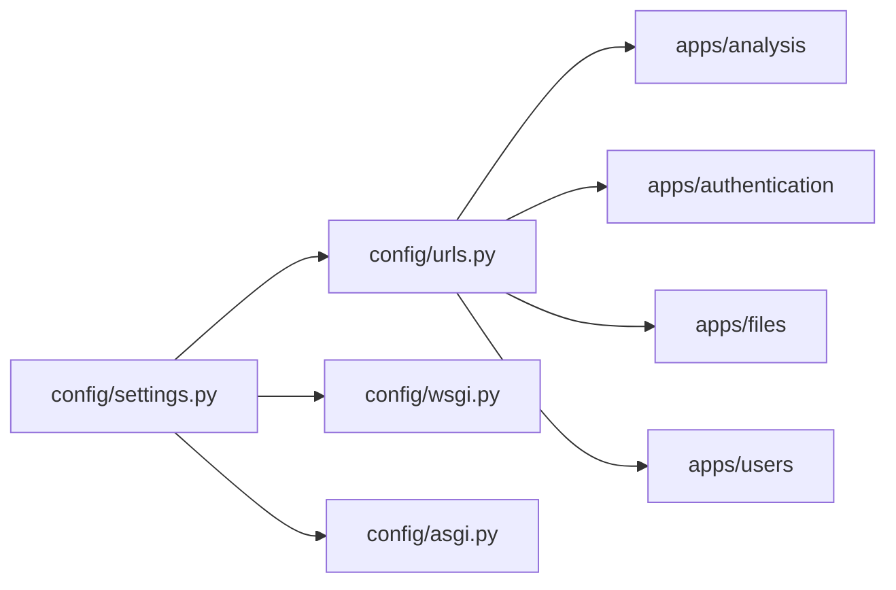

# Configuration & Deployment

<cite>
**Referenced Files in This Document**
- [settings.py](file://config/settings.py)
- [urls.py](file://config/urls.py)
- [wsgi.py](file://config/wsgi.py)
- [asgi.py](file://config/asgi.py)
- [manage.py](file://manage.py)
</cite>

## Table of Contents
1. [Introduction](#introduction)
2. [Project Structure](#project-structure)
3. [Core Components](#core-components)
4. [Architecture Overview](#architecture-overview)
5. [Detailed Component Analysis](#detailed-component-analysis)
6. [Dependency Analysis](#dependency-analysis)
7. [Performance Considerations](#performance-considerations)
8. [Troubleshooting Guide](#troubleshooting-guide)
9. [Conclusion](#conclusion)
10. [Appendices](#appendices)

## Introduction
This document provides comprehensive configuration and deployment guidance for VeritasShield. It covers Django settings for PostgreSQL database, caching, static and media file handling, environment variable configuration for production, WSGI/ASGI application setup, deployment options (Docker, cloud, traditional servers), production security (HTTPS, CORS, security headers), monitoring and logging, performance tuning, and scaling/load balancing strategies.

## Project Structure
VeritasShield follows a standard Django layout with a dedicated configuration package and modular apps. The configuration package defines settings, URL routing, and WSGI/ASGI entry points. Apps are organized under an apps directory and registered in settings.

**Diagram sources**
- [settings.py](file://config/settings.py)
- [urls.py](file://config/urls.py)
- [wsgi.py](file://config/wsgi.py)
- [asgi.py](file://config/asgi.py)
- [manage.py](file://manage.py)

**Section sources**
- [settings.py](file://config/settings.py)
- [urls.py](file://config/urls.py)
- [wsgi.py](file://config/wsgi.py)
- [asgi.py](file://config/asgi.py)
- [manage.py](file://manage.py)

## Core Components
- Settings: Defines database, REST framework, JWT, static/media, middleware, and app registration.
- URLs: Routes admin, authentication, files, and analysis endpoints; serves media files during development.
- WSGI/ASGI: Application entry points for production servers.
- Management: Command-line interface for administrative tasks.

Key production-relevant settings include:
- Database: PostgreSQL configured with engine, name, user, password, host, and port.
- REST framework: JWT authentication, JSON renderer, multipart parser.
- Static and media: Static URL, media URL, and media root path.
- Middleware: Security, session, CSRF, and clickjacking protections.

**Section sources**
- [settings.py](file://config/settings.py)
- [urls.py](file://config/urls.py)

## Architecture Overview
The application uses Django’s WSGI entry point for production deployments. ASGI is available for future WebSocket or async support. URL routing includes admin, authentication, files, and analysis apps. Media files are served via Django during development; in production, they should be served by the web server or CDN.

**Diagram sources**
- [wsgi.py](file://config/wsgi.py)
- [settings.py](file://config/settings.py)

## Detailed Component Analysis

### Django Settings Configuration
- Database: PostgreSQL configured with explicit defaults. For production, override via environment variables.
- REST framework: JWT authentication enabled; JSON renderer enforced; multipart parser enabled for file uploads.
- Static and media: Static URL set; media URL and root path configured; development-only media serving via URL patterns.
- Middleware: Security middleware, sessions, CSRF, and clickjacking protection enabled.
- Authentication: Custom user model and JWT lifetimes configured.

Recommended production overrides:
- SECRET_KEY: Set via environment variable.
- DEBUG: Disabled in production.
- ALLOWED_HOSTS: Explicitly set to domain(s).
- Database credentials: Use environment variables for NAME, USER, PASSWORD, HOST, PORT.
- JWT settings: Adjust token lifetimes and header types per policy.
- CORS: Configure allowed origins and headers for frontend domains.

**Section sources**
- [settings.py](file://config/settings.py)

### Environment Variables for Production
Critical environment variables for production:
- DJANGO_SETTINGS_MODULE: config.settings
- SECRET_KEY: Cryptographically secure value
- DEBUG: false
- DATABASE_URL: PostgreSQL connection string (alternative to individual DB_* variables)
- ALLOWED_HOSTS: Comma-separated list of domains
- JWT settings: ACCESS_TOKEN_LIFETIME, REFRESH_TOKEN_LIFETIME, AUTH_HEADER_TYPES
- Optional: CORS settings (CORS_ALLOWED_ORIGINS, CORS_ALLOW_ALL_ORIGINS, CORS_ALLOW_CREDENTIALS)

Note: The repository does not include a separate environment configuration file. Use OS environment variables or a secrets manager in production.

**Section sources**
- [settings.py](file://config/settings.py)
- [manage.py](file://manage.py)

### WSGI and ASGI Application Configuration
- WSGI: Exposes the Django WSGI application for production servers (e.g., Gunicorn/uWSGI behind Nginx).
- ASGI: Exposes the Django ASGI application for async-capable runtimes (e.g., Daphne or Uvicorn for channels).

Deployment note: The project defines both WSGI and ASGI entry points. Choose WSGI for standard HTTP APIs; ASGI for async features.

**Section sources**
- [wsgi.py](file://config/wsgi.py)
- [asgi.py](file://config/asgi.py)

### Static and Media File Handling
- Static files: Served by the web server in production; ensure collectstatic is executed and the web server maps STATIC_URL to the static root.
- Media files: Currently served by Django during development via URL patterns. In production, serve media files via the web server or CDN and restrict write access.

Recommendations:
- Collect static assets before deployment.
- Use a CDN or blob storage for media delivery.
- Restrict direct filesystem writes; use signed URLs or backend APIs for uploads.

**Section sources**
- [settings.py](file://config/settings.py)
- [urls.py](file://config/urls.py)

### Security Configuration for Production
- HTTPS: Enforce HTTPS via reverse proxy or load balancer; configure HSTS headers.
- Allowed hosts: Set ALLOWED_HOSTS to production domains.
- CSRF and security middleware: Keep default protections enabled.
- CORS: Configure CORS settings for frontend origin(s); avoid wildcard origins in production.
- Security headers: Add X-Content-Type-Options, X-Frame-Options, Content-Security-Policy via web server.
- JWT: Use HTTPS transport; rotate secrets; enforce short-lived access tokens.

**Section sources**
- [settings.py](file://config/settings.py)

### Monitoring, Logging, and Performance Tuning
- Logging: Configure Django logging to capture errors and performance metrics; forward logs to centralized systems.
- Metrics: Instrument API latency, database queries, and cache hit rates.
- Caching: Enable Redis or database-backed cache for repeated requests; configure cache backends.
- Database: Use connection pooling; tune max connections and timeouts.
- Static/media: Serve via CDN; enable compression and browser caching.
- Gunicorn/Uvicorn: Tune workers, threads, and timeouts; monitor resource usage.

[No sources needed since this section provides general guidance]

### Scaling and Load Balancing
- Horizontal scaling: Run multiple application instances behind a load balancer.
- Stateless design: Store sessions and media externally; rely on shared databases and caches.
- Health checks: Implement readiness/liveness probes.
- CDN and caching: Offload static/media traffic and reduce backend load.
- Database scaling: Use read replicas and connection pooling; consider sharding for large datasets.

[No sources needed since this section provides general guidance]

## Dependency Analysis
The configuration package depends on Django settings and URL routing, which in turn depend on installed apps. The WSGI/ASGI applications depend on settings. URL patterns include apps and serve media in development.

**Diagram sources**
- [settings.py](file://config/settings.py)
- [urls.py](file://config/urls.py)
- [wsgi.py](file://config/wsgi.py)
- [asgi.py](file://config/asgi.py)

**Section sources**
- [settings.py](file://config/settings.py)
- [urls.py](file://config/urls.py)
- [wsgi.py](file://config/wsgi.py)
- [asgi.py](file://config/asgi.py)

## Performance Considerations
- Database: Use connection pooling and optimize queries; avoid N+1 selects.
- Caching: Cache expensive computations and repeated reads; invalidate on updates.
- Static/media: Serve via CDN; compress assets; enable long-lived caching.
- Workers: Tune worker count and concurrency based on CPU and memory.
- Background tasks: Offload heavy work to queues (e.g., Celery) to keep API responsive.

[No sources needed since this section provides general guidance]

## Troubleshooting Guide
Common issues and resolutions:
- Database connectivity: Verify host, port, user, and password; test connection string; ensure PostgreSQL is reachable.
- Static files missing: Confirm static root and web server mapping; run collectstatic; verify static URL configuration.
- Media files not served: In production, serve media via web server or CDN; avoid relying on Django in production.
- CORS errors: Align CORS settings with frontend origin; avoid wildcard origins in production.
- JWT authentication failures: Ensure HTTPS; verify token lifetime and header types; confirm issuer and audience if customized.
- Reverse proxy issues: Validate SSL termination, header forwarding, and health checks.

**Section sources**
- [settings.py](file://config/settings.py)
- [urls.py](file://config/urls.py)

## Conclusion
VeritasShield’s configuration provides a solid foundation for production deployment. Focus on environment-driven settings, hardened security, scalable infrastructure, and observability. Use WSGI for standard deployments, and prepare for ASGI if async features are introduced. Serve static/media via CDN, enforce HTTPS, and implement robust monitoring and scaling strategies.

[No sources needed since this section summarizes without analyzing specific files]

## Appendices

### Appendix A: Production Checklist
- Set SECRET_KEY via environment variable.
- Disable DEBUG and configure ALLOWED_HOSTS.
- Provide database credentials via environment variables or DATABASE_URL.
- Configure CORS for frontend origin(s).
- Serve static and media via CDN/web server.
- Enforce HTTPS and security headers.
- Monitor logs and metrics; set up alerts.
- Scale horizontally with load balancing and caching.

[No sources needed since this section provides general guidance]