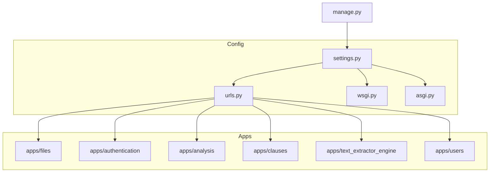
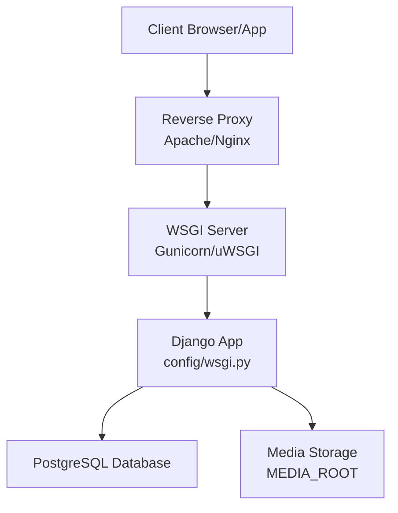
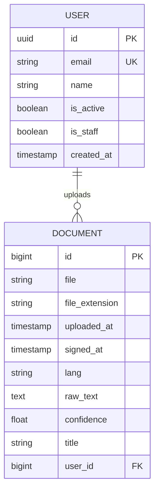

# Deployment Options

<cite>
**Referenced Files in This Document**
- [settings.py](file://config/settings.py)
- [wsgi.py](file://config/wsgi.py)
- [asgi.py](file://config/asgi.py)
- [urls.py](file://config/urls.py)
- [manage.py](file://manage.py)
- [models.py](file://apps/users/models.py)
- [0001_initial.py](file://apps/files/migrations/0001_initial.py)
- [0002_initial.py](file://apps/files/migrations/0002_initial.py)
</cite>

## Table of Contents
1. [Introduction](#introduction)
2. [Project Structure](#project-structure)
3. [Core Components](#core-components)
4. [Architecture Overview](#architecture-overview)
5. [Detailed Component Analysis](#detailed-component-analysis)
6. [Dependency Analysis](#dependency-analysis)
7. [Performance Considerations](#performance-considerations)
8. [Troubleshooting Guide](#troubleshooting-guide)
9. [Conclusion](#conclusion)
10. [Appendices](#appendices)

## Introduction
This document provides comprehensive deployment guidance for VeritasShield, a Django-based backend. It covers production-ready configurations for WSGI/ASGI application servers (Gunicorn/uWSGI), reverse proxy setups with Apache/Nginx, containerization with Docker and docker-compose, and cloud deployments on AWS, Azure, and Google Cloud Platform. It also addresses load balancing, SSL/TLS, automated deployment pipelines, scaling, and high availability.

## Project Structure
VeritasShield follows a standard Django layout with app-specific modules under apps/, shared configuration under config/, and media assets stored separately. The application exposes REST endpoints via Django REST Framework and serves media files from a dedicated MEDIA_ROOT.

**Diagram sources**
- [settings.py:1-155](file://config/settings.py#L1-L155)
- [urls.py:1-31](file://config/urls.py#L1-L31)
- [wsgi.py:1-17](file://config/wsgi.py#L1-L17)
- [asgi.py:1-17](file://config/asgi.py#L1-L17)
- [manage.py:1-23](file://manage.py#L1-L23)

**Section sources**
- [settings.py:1-155](file://config/settings.py#L1-L155)
- [urls.py:1-31](file://config/urls.py#L1-L31)
- [wsgi.py:1-17](file://config/wsgi.py#L1-L17)
- [asgi.py:1-17](file://config/asgi.py#L1-L17)
- [manage.py:1-23](file://manage.py#L1-L23)

## Core Components
- WSGI/ASGI entry points: Django’s WSGI and ASGI applications are configured in config/wsgi.py and config/asgi.py, respectively. These files set DJANGO_SETTINGS_MODULE and initialize the application factory.
- Settings: Production-grade settings include database configuration, JWT authentication, REST framework defaults, static/media handling, and OAuth-related keys.
- URL routing: Centralized URL routing under config/urls.py includes admin, files, authentication, analysis, and clauses apps, plus media serving.
- Management: manage.py sets DJANGO_SETTINGS_MODULE and executes Django commands.

Key deployment implications:
- Use WSGI for production Python WSGI servers (e.g., Gunicorn).
- ASGI is available for async-capable deployments but not required for current configuration.
- Media files must be served securely and efficiently behind a reverse proxy.

**Section sources**
- [wsgi.py:1-17](file://config/wsgi.py#L1-L17)
- [asgi.py:1-17](file://config/asgi.py#L1-L17)
- [settings.py:75-84](file://config/settings.py#L75-L84)
- [settings.py:125-143](file://config/settings.py#L125-L143)
- [urls.py:23-30](file://config/urls.py#L23-L30)
- [manage.py:9](file://manage.py#L9)

## Architecture Overview
The runtime architecture centers on Django’s WSGI application, with optional ASGI support. Requests flow through a reverse proxy (Apache/Nginx) to the WSGI server, which serves the Django app. Media assets are served from MEDIA_ROOT and exposed via the reverse proxy.

**Diagram sources**
- [wsgi.py:14](file://config/wsgi.py#L14)
- [settings.py:75-84](file://config/settings.py#L75-L84)
- [settings.py:122-123](file://config/settings.py#L122-L123)

## Detailed Component Analysis

### WSGI/ASGI Application Configuration
- WSGI: Initialize via config/wsgi.py with DJANGO_SETTINGS_MODULE pointing to config.settings. This is the standard entry point for production WSGI servers.
- ASGI: Available via config/asgi.py for async-capable deployments; not required for current configuration.

Production guidance:
- Prefer Gunicorn for WSGI with worker processes tuned to CPU cores.
- For uWSGI, configure process/thread workers and socket/file descriptors aligned with expected concurrency.
- Use separate process groups for static and dynamic content if needed.

**Section sources**
- [wsgi.py:14](file://config/wsgi.py#L14)
- [asgi.py:14](file://config/asgi.py#L14)

### Reverse Proxy with Apache/Nginx
- Nginx/Apache should serve static and media files directly and proxy dynamic requests to the WSGI server.
- Configure SSL/TLS termination at the reverse proxy with strong ciphers and modern protocols.
- Set appropriate timeouts, client_max_body_size, and header forwarding for X-Forwarded-*.

Operational notes:
- Media URLs are served under MEDIA_URL; ensure reverse proxy maps /media/ to MEDIA_ROOT.
- Keep ALLOWED_HOSTS updated per environment.

**Section sources**
- [settings.py:121-123](file://config/settings.py#L121-L123)
- [settings.py:150](file://config/settings.py#L150)

### Containerization with Docker
- Build a minimal image with Python base, install dependencies, copy application code, and expose the WSGI port.
- Mount persistent volumes for media storage and database credentials via environment variables.
- Use a reverse proxy container (Nginx) in front of the Django container for SSL and static/media handling.

docker-compose pattern:
- Separate services for web (Django + WSGI), db (PostgreSQL), and optionally cache/services.
- Environment variables for SECRET_KEY, database connection, and ALLOWED_HOSTS.
- Health checks and restart policies for resilience.

[No sources needed since this section provides general guidance]

### Cloud Deployment Strategies
- AWS: Deploy behind ALB + ECS/EKS or EC2 Auto Scaling Groups. Use RDS for PostgreSQL and S3 for media offload. Manage secrets via AWS Secrets Manager or Parameter Store.
- Azure: Use Azure Load Balancer + AKS or VMSS. Use Azure Database for PostgreSQL and Azure Storage for media. Manage secrets via Azure Key Vault.
- GCP: Use Cloud Load Balancing + GKE or Compute Engine managed instance groups. Use Cloud SQL for PostgreSQL and Cloud Storage for media. Manage secrets via Secret Manager.

Environment variables to externalize:
- DATABASE_URL or individual PG_* variables
- SECRET_KEY
- ALLOWED_HOSTS
- GOOGLE_OAUTH2_CLIENT_ID and related OAuth settings
- Media storage endpoints (when offloading)

[No sources needed since this section provides general guidance]

### Load Balancing, SSL, and Automated Pipelines
- Load balancing: Use platform LBs (ALB/NLB, Azure Load Balancer, GCP Cloud Load Balancing) with health checks and session affinity if needed.
- SSL/TLS: Terminate at the reverse proxy/load balancer with certificates managed by ACM/ACM PCA (AWS), Azure TLS Certificates (Azure), or Cloud CDN Certificates (GCP).
- Automated pipelines: CI/CD with linting, tests, image builds, and blue/green or rolling deployments.

[No sources needed since this section provides general guidance]

### Scaling and High Availability
- Horizontal scaling: Stateless Django instances behind a load balancer; scale workers per instance and replicas as needed.
- Database: Use managed PostgreSQL with read replicas and failover groups.
- Media: Offload to S3-compatible storage for global distribution.
- Caching: Introduce Redis or managed cache for sessions and rate limiting.

[No sources needed since this section provides general guidance]

## Dependency Analysis
The application depends on Django, Django REST Framework, and PostgreSQL. The database schema includes a Document model and a User model with custom manager and fields.

**Diagram sources**
- [models.py:29-45](file://apps/users/models.py#L29-L45)
- [0001_initial.py:14-27](file://apps/files/migrations/0001_initial.py#L14-L27)
- [0002_initial.py:18-23](file://apps/files/migrations/0002_initial.py#L18-L23)

**Section sources**
- [models.py:29-45](file://apps/users/models.py#L29-L45)
- [0001_initial.py:14-27](file://apps/files/migrations/0001_initial.py#L14-L27)
- [0002_initial.py:18-23](file://apps/files/migrations/0002_initial.py#L18-L23)

## Performance Considerations
- WSGI workers: Tune to CPU cores; monitor response times and queue lengths.
- Database connections: Limit per-worker; use connection pooling.
- Static/media delivery: Serve via reverse proxy or CDN; enable compression and caching.
- Sessions and tokens: Optimize JWT lifetimes and refresh strategies.

[No sources needed since this section provides general guidance]

## Troubleshooting Guide
Common deployment issues and resolutions:
- Database connectivity: Verify host, port, user, and password; ensure firewall allows inbound connections.
- Media serving: Confirm MEDIA_URL and MEDIA_ROOT alignment with reverse proxy configuration.
- Allowed hosts: Update ALLOWED_HOSTS for production domains.
- Static files: Collect static assets and ensure reverse proxy serves them from the configured location.
- Health checks: Implement readiness/liveness probes; ensure database and cache are reachable.

**Section sources**
- [settings.py:75-84](file://config/settings.py#L75-L84)
- [settings.py:121-123](file://config/settings.py#L121-L123)
- [settings.py:150](file://config/settings.py#L150)

## Conclusion
VeritasShield is a Django application ready for production deployment using WSGI servers, reverse proxies, containers, and managed cloud platforms. By externalizing configuration via environment variables, offloading media, and leveraging managed databases and load balancers, you can achieve scalable, secure, and highly available deployments across AWS, Azure, and GCP.

[No sources needed since this section summarizes without analyzing specific files]

## Appendices
- Django settings highlights for production:
  - Database: PostgreSQL configuration
  - Authentication: JWT with REST framework
  - Static/Media: MEDIA_URL and MEDIA_ROOT
  - OAuth: GOOGLE_OAUTH2_CLIENT_ID and ACCOUNT settings

**Section sources**
- [settings.py:75-84](file://config/settings.py#L75-L84)
- [settings.py:125-143](file://config/settings.py#L125-L143)
- [settings.py:121-123](file://config/settings.py#L121-L123)
- [settings.py:146-149](file://config/settings.py#L146-L149)
- [settings.py:150-154](file://config/settings.py#L150-L154)