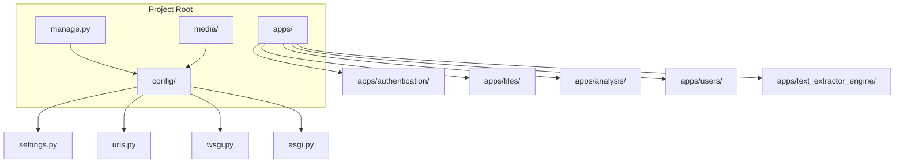
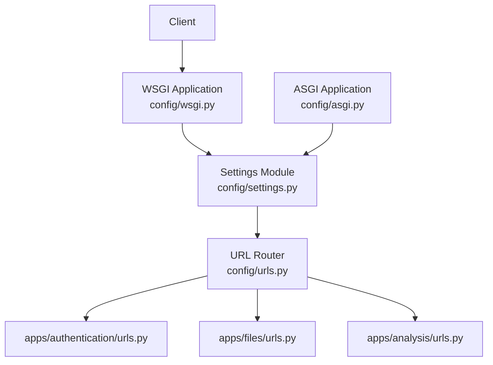
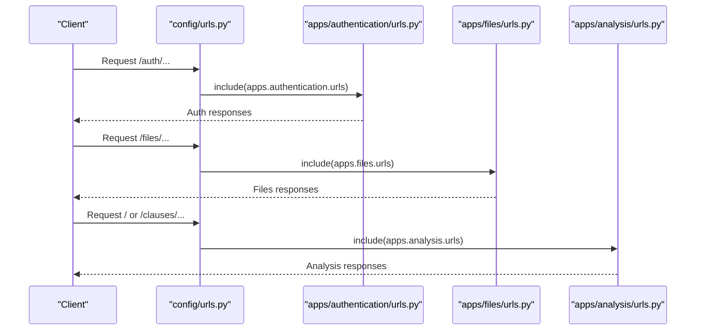
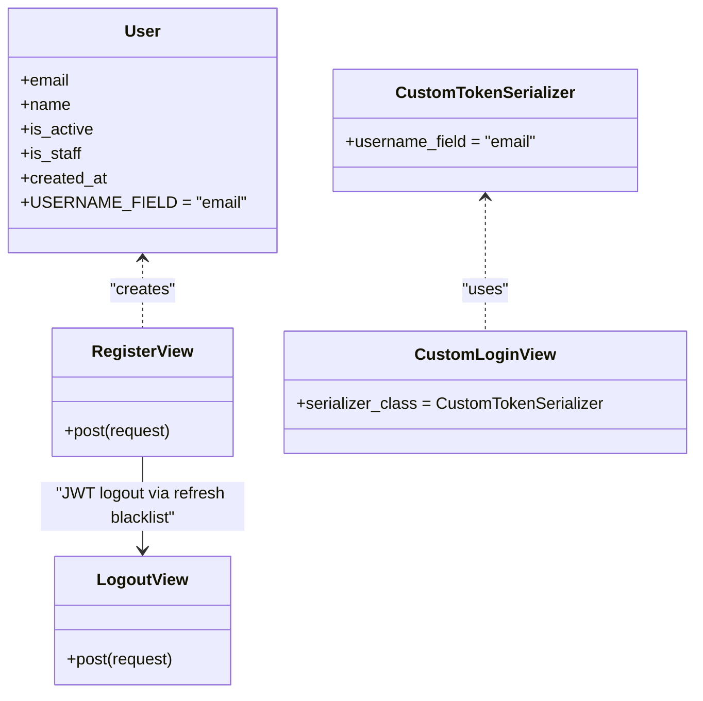
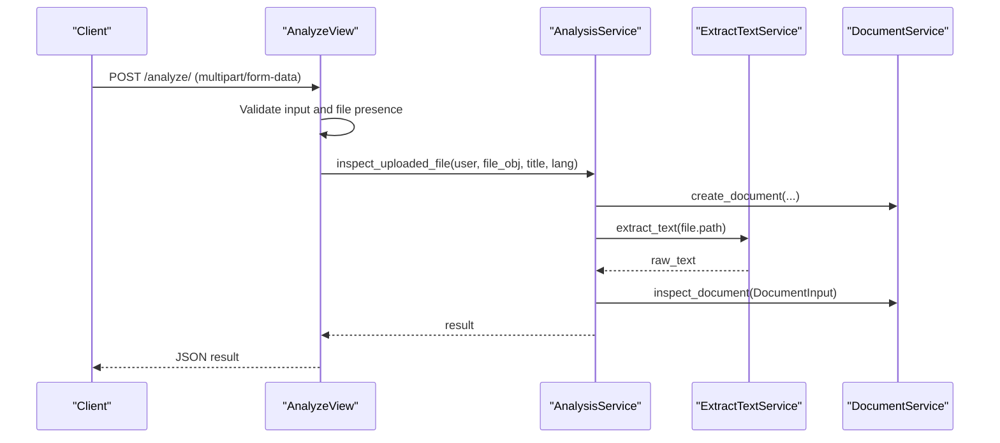
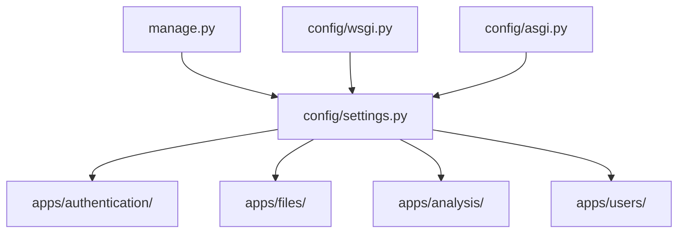
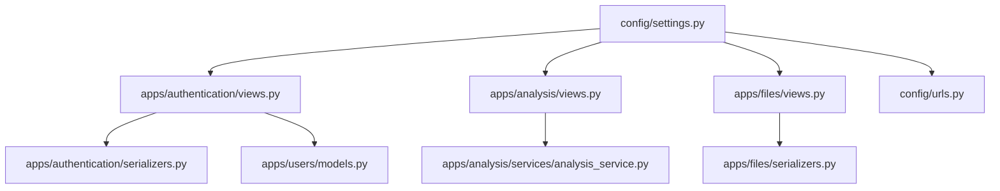

# Django Configuration

<cite>
**Referenced Files in This Document**
- [settings.py](file://config/settings.py)
- [urls.py](file://config/urls.py)
- [wsgi.py](file://config/wsgi.py)
- [asgi.py](file://config/asgi.py)
- [manage.py](file://manage.py)
- [views.py](file://apps/authentication/views.py)
- [serializers.py](file://apps/authentication/serializers.py)
- [models.py](file://apps/users/models.py)
- [views.py](file://apps/analysis/views.py)
- [analysis_service.py](file://apps/analysis/services/analysis_service.py)
- [views.py](file://apps/files/views.py)
- [serializers.py](file://apps/files/serializers.py)
</cite>

## Table of Contents
1. [Introduction](#introduction)
2. [Project Structure](#project-structure)
3. [Core Components](#core-components)
4. [Architecture Overview](#architecture-overview)
5. [Detailed Component Analysis](#detailed-component-analysis)
6. [Dependency Analysis](#dependency-analysis)
7. [Performance Considerations](#performance-considerations)
8. [Troubleshooting Guide](#troubleshooting-guide)
9. [Conclusion](#conclusion)

## Introduction
This document provides comprehensive Django configuration documentation for VeritasShield. It explains the settings layout, installed applications, middleware, database configuration for PostgreSQL, authentication and JWT setup, REST framework configuration, URL routing, application structure, security settings, internationalization, static/media handling, and environment-specific configuration patterns. Practical examples and troubleshooting guidance are included to help developers configure and operate the system reliably.

## Project Structure
VeritasShield follows a modular Django project layout with a dedicated configuration package and feature-based apps under an apps directory. The configuration package defines global settings, URL routing, and WSGI/ASGI entry points. Feature apps encapsulate domain logic, views, serializers, and models.

**Diagram sources**
- [settings.py](file://config/settings.py)
- [urls.py](file://config/urls.py)
- [wsgi.py](file://config/wsgi.py)
- [asgi.py](file://config/asgi.py)
- [manage.py](file://manage.py)

**Section sources**
- [settings.py](file://config/settings.py)
- [urls.py](file://config/urls.py)
- [wsgi.py](file://config/wsgi.py)
- [asgi.py](file://config/asgi.py)
- [manage.py](file://manage.py)

## Core Components
This section documents the primary configuration areas and their roles in the system.

- Installed Applications (INSTALLED_APPS): Includes core Django contrib apps, VeritasShield apps, and REST framework with JWT support. This enables admin, sessions, messages, static files, and the custom apps for authentication, files, analysis, clauses, and text extraction engine.
- Middleware (MIDDLEWARE): Provides security, session handling, CSRF protection, authentication, and clickjacking prevention.
- Database (DATABASES): Configured for PostgreSQL with explicit credentials and host/port.
- Authentication and JWT:
  - AUTH_USER_MODEL points to the custom User model.
  - REST_FRAMEWORK uses JWTAuthentication with JSON and MultiPart parsers.
  - SIMPLE_JWT sets token lifetimes and accepted header types.
  - Custom TokenObtainPairSerializer uses email as the username field.
- Internationalization (I18N): English locale, UTC timezone, and timezone-aware behavior enabled.
- Static and Media: Static URL mapping and media URL/root configured for uploaded files.
- Security: SECRET_KEY, DEBUG flag, ALLOWED_HOSTS, and CSRF protection are defined.

**Section sources**
- [settings.py](file://config/settings.py)
- [serializers.py](file://apps/authentication/serializers.py)
- [models.py](file://apps/users/models.py)

## Architecture Overview
The runtime architecture ties together Django’s configuration, URL routing, and app endpoints. The WSGI/ASGI entry points load the settings module, and URL routing dispatches requests to app-specific URL patterns.

**Diagram sources**
- [wsgi.py](file://config/wsgi.py)
- [asgi.py](file://config/asgi.py)
- [settings.py](file://config/settings.py)
- [urls.py](file://config/urls.py)

**Section sources**
- [wsgi.py](file://config/wsgi.py)
- [asgi.py](file://config/asgi.py)
- [settings.py](file://config/settings.py)
- [urls.py](file://config/urls.py)

## Detailed Component Analysis

### Settings Configuration
Key sections and their purpose:
- Secret Key and Debug: Defines the SECRET_KEY and DEBUG flag for development.
- Allowed Hosts: Sets hosts for local development; expand for production environments.
- Installed Apps: Includes VeritasShield apps and DRF with JWT blacklist app.
- Middleware: Security, session, CSRF, auth, and clickjacking protections.
- Templates: Uses Django templates with request/context processors.
- WSGI Application: Points to the WSGI entry point.
- Database: PostgreSQL configuration with ENGINE, NAME, USER, PASSWORD, HOST, PORT.
- Password Validators: Enforces Django’s built-in validators.
- Internationalization: Locale and timezone settings.
- Static and Media: Static URL and media URL/root for uploaded files.
- REST Framework: JWT authentication, JSON/MultiPart parsers, JSON renderer.
- SIMPLE_JWT: Access/refresh lifetimes and header types.
- AUTH_USER_MODEL: Points to the custom User model.
- Social/OAuth: Google OAuth client ID and allauth site settings.

Environment-specific notes:
- Development: DEBUG is True; SECRET_KEY is embedded; ALLOWED_HOSTS minimal.
- Production: Set SECRET_KEY via environment, disable DEBUG, restrict ALLOWED_HOSTS to domain(s), and secure database credentials.

**Section sources**
- [settings.py](file://config/settings.py)

### URL Routing Configuration
The project-level URL router aggregates app-specific URL patterns and serves media files during development.

- Admin: Admin site at /admin/.
- Files: Includes apps.files.urls under /files/.
- Authentication: Includes apps.authentication.urls under /auth/.
- Analysis: Includes apps.analysis.urls under /.
- Clauses: Includes apps.clauses.urls under /clauses/.
- Media: Serves uploaded files from MEDIA_ROOT during development.

**Diagram sources**
- [urls.py](file://config/urls.py)

**Section sources**
- [urls.py](file://config/urls.py)

### Authentication and JWT Setup
Authentication relies on a custom User model and DRF SimpleJWT with a custom token serializer.

- Custom User Model: Defined in apps.users.models.py with email as the USERNAME_FIELD.
- JWT Authentication: REST_FRAMEWORK uses JWTAuthentication; SIMPLE_JWT configures lifetimes and header types.
- Token Serialization: CustomTokenSerializer extends TokenObtainPairSerializer and uses email as the username field.
- Views: RegisterView, LogoutView, and CustomLoginView demonstrate JWT issuance and blacklist behavior.

**Diagram sources**
- [models.py](file://apps/users/models.py)
- [serializers.py](file://apps/authentication/serializers.py)
- [views.py](file://apps/authentication/views.py)

**Section sources**
- [models.py](file://apps/users/models.py)
- [serializers.py](file://apps/authentication/serializers.py)
- [views.py](file://apps/authentication/views.py)
- [settings.py](file://config/settings.py)

### REST Framework and File Uploads
The REST framework is configured for JSON responses and supports multipart/form-data for file uploads. Views leverage these settings to process document analysis and storage.

- Parsers: JSONParser and MultiPartParser enable form-data and file uploads.
- Renderers: JSONRenderer ensures JSON responses.
- Views: AnalyzeView and AnalyzeSaveView enforce IsAuthenticated and orchestrate OCR and inspection workflows.
- Serializers: DocumentSerializer and DocumentCreateSerializer define exposed and read-only fields for documents.

**Diagram sources**
- [views.py](file://apps/analysis/views.py)
- [analysis_service.py](file://apps/analysis/services/analysis_service.py)
- [serializers.py](file://apps/files/serializers.py)
- [settings.py](file://config/settings.py)

**Section sources**
- [views.py](file://apps/analysis/views.py)
- [analysis_service.py](file://apps/analysis/services/analysis_service.py)
- [serializers.py](file://apps/files/serializers.py)
- [settings.py](file://config/settings.py)

### Application Structure and Entry Points
Entry points and app structure:

- manage.py: Sets DJANGO_SETTINGS_MODULE to config.settings and executes Django commands.
- WSGI/ASGI: Load the settings module and expose the application for web servers.
- Apps: Feature-based apps (authentication, files, analysis, clauses, text extractor engine, users) encapsulate models, views, serializers, and URLs.

**Diagram sources**
- [manage.py](file://manage.py)
- [wsgi.py](file://config/wsgi.py)
- [asgi.py](file://config/asgi.py)
- [settings.py](file://config/settings.py)

**Section sources**
- [manage.py](file://manage.py)
- [wsgi.py](file://config/wsgi.py)
- [asgi.py](file://config/asgi.py)
- [settings.py](file://config/settings.py)

## Dependency Analysis
This section maps configuration dependencies and their relationships.

**Diagram sources**
- [settings.py](file://config/settings.py)
- [views.py](file://apps/authentication/views.py)
- [serializers.py](file://apps/authentication/serializers.py)
- [models.py](file://apps/users/models.py)
- [views.py](file://apps/analysis/views.py)
- [analysis_service.py](file://apps/analysis/services/analysis_service.py)
- [views.py](file://apps/files/views.py)
- [serializers.py](file://apps/files/serializers.py)
- [urls.py](file://config/urls.py)

**Section sources**
- [settings.py](file://config/settings.py)
- [views.py](file://apps/authentication/views.py)
- [serializers.py](file://apps/authentication/serializers.py)
- [models.py](file://apps/users/models.py)
- [views.py](file://apps/analysis/views.py)
- [analysis_service.py](file://apps/analysis/services/analysis_service.py)
- [views.py](file://apps/files/views.py)
- [serializers.py](file://apps/files/serializers.py)
- [urls.py](file://config/urls.py)

## Performance Considerations
- Database: Ensure PostgreSQL is tuned for concurrent reads/writes; consider connection pooling and indexing on frequently queried fields.
- Static/Staticfiles: Serve static assets via CDN or reverse proxy in production; avoid serving static files through Django in production.
- Media: Store media on scalable storage (object storage) and serve via signed URLs or CDN.
- JWT: Keep token lifetimes reasonable; use refresh token rotation and blacklist for sensitive operations.
- Logging: Enable structured logging and monitor slow queries and long-running OCR/inspection tasks.

## Troubleshooting Guide
Common configuration issues and resolutions:

- Authentication fails with JWT:
  - Verify REST_FRAMEWORK DEFAULT_AUTHENTICATION_CLASSES includes JWTAuthentication.
  - Confirm SIMPLE_JWT settings (lifetimes, header types) match client expectations.
  - Ensure custom TokenObtainPairSerializer uses email as username_field.
  - Check that AUTH_USER_MODEL points to the custom User model.

- CSRF or CORS errors:
  - Ensure CSRF middleware is present in MIDDLEWARE.
  - For cross-origin requests, configure CORS headers appropriately at the web server level or via Django packages.

- Database connection failures:
  - Validate DATABASES credentials, HOST, PORT, and that PostgreSQL is running.
  - Confirm the database name exists and user has privileges.

- Static or media files not served:
  - Confirm STATIC_URL and MEDIA_URL configuration.
  - During development, ensure static() is appended to urlpatterns for media serving.

- Missing environment variables in production:
  - Set SECRET_KEY, database credentials, and ALLOWED_HOSTS via environment variables.
  - Disable DEBUG in production.

- Token invalidation/blacklist not working:
  - Ensure rest_framework_simplejwt.token_blacklist is in INSTALLED_APPS.
  - Use RefreshToken blacklist on logout.

**Section sources**
- [settings.py](file://config/settings.py)
- [views.py](file://apps/authentication/views.py)
- [serializers.py](file://apps/authentication/serializers.py)
- [models.py](file://apps/users/models.py)
- [urls.py](file://config/urls.py)

## Conclusion
VeritasShield’s Django configuration establishes a robust foundation for authentication, document analysis, and file handling. By leveraging a custom User model, JWT authentication, and REST framework with JSON/Multipart support, the system supports modern API workflows. Proper environment-specific configuration, especially around secrets, hosts, and database credentials, is critical for production readiness. The modular app structure and centralized settings promote maintainability and scalability.