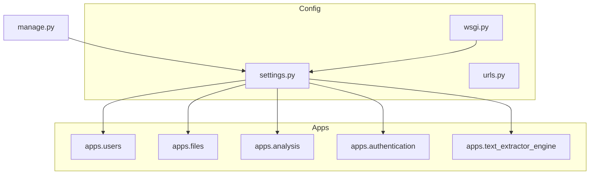
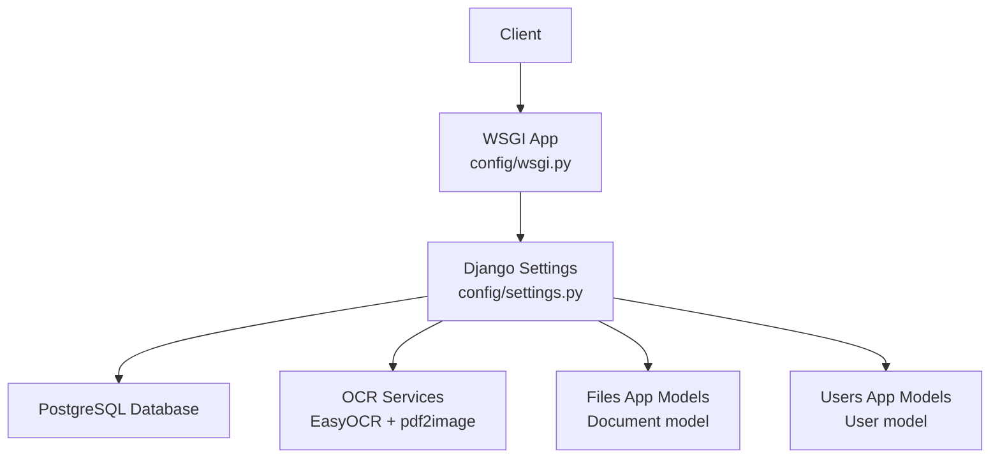
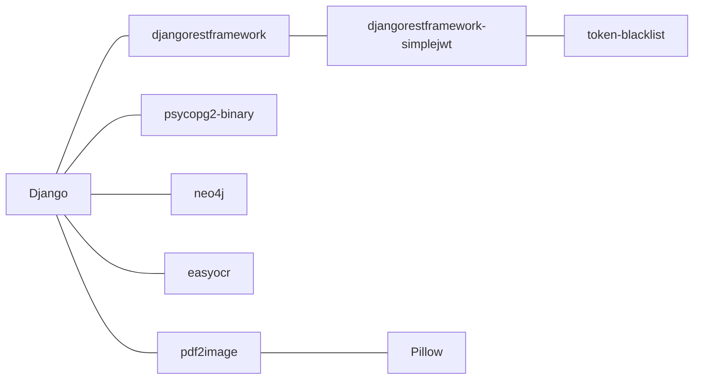

# Environment Setup

<cite>
**Referenced Files in This Document**
- [settings.py](file://config/settings.py)
- [manage.py](file://manage.py)
- [wsgi.py](file://config/wsgi.py)
- [models.py](file://apps/users/models.py)
- [models.py](file://apps/files/models.py)
- [ocr_service.py](file://apps/text_extractor_engine/services/ocr_service.py)
- [pdf_service.py](file://apps/text_extractor_engine/services/pdf_service.py)
- [extract_text.py](file://apps/text_extractor_engine/services/extract_text.py)
</cite>

## Table of Contents
1. [Introduction](#introduction)
2. [Project Structure](#project-structure)
3. [Core Components](#core-components)
4. [Architecture Overview](#architecture-overview)
5. [Detailed Component Analysis](#detailed-component-analysis)
6. [Dependency Analysis](#dependency-analysis)
7. [Performance Considerations](#performance-considerations)
8. [Troubleshooting Guide](#troubleshooting-guide)
9. [Conclusion](#conclusion)
10. [Appendices](#appendices)

## Introduction
This document provides step-by-step environment setup instructions for deploying VeritasShield in both development and production environments. It covers Python virtual environment creation and activation, environment variable configuration for production, dependency installation for Django 6.0, PostgreSQL, Neo4j, and OCR libraries, database setup for PostgreSQL, and common troubleshooting steps.

## Project Structure
VeritasShield is a Django 6.0 project organized into reusable applications under the apps directory and shared configuration under config. The runtime relies on Django’s settings module and WSGI application.

**Diagram sources**
- [settings.py:1-155](file://config/settings.py#L1-L155)
- [manage.py:1-23](file://manage.py#L1-L23)
- [wsgi.py:1-16](file://config/wsgi.py#L1-L16)

**Section sources**
- [settings.py:1-155](file://config/settings.py#L1-L155)
- [manage.py:1-23](file://manage.py#L1-L23)
- [wsgi.py:1-16](file://config/wsgi.py#L1-L16)

## Core Components
- Django settings module defines database configuration, authentication backends, static/media paths, and OAuth client identifiers.
- WSGI application module sets the Django settings module for the server process.
- Management script centralizes Django CLI invocation and enforces proper settings module selection.
- OCR pipeline integrates EasyOCR and pdf2image for text extraction from images and PDFs.

Key production configuration touchpoints:
- Database: PostgreSQL engine with default host/port and credentials embedded in settings.
- Authentication: JWT via Simple JWT and Google OAuth client ID.
- Media storage: Local filesystem media root configured for uploaded contract documents.

**Section sources**
- [settings.py:72-155](file://config/settings.py#L72-L155)
- [wsgi.py:10-16](file://config/wsgi.py#L10-L16)
- [manage.py:7-18](file://manage.py#L7-L18)
- [ocr_service.py:1-18](file://apps/text_extractor_engine/services/ocr_service.py#L1-L18)
- [pdf_service.py:1-15](file://apps/text_extractor_engine/services/pdf_service.py#L1-L15)

## Architecture Overview
The runtime architecture ties together Django’s settings, WSGI application, and OCR pipeline.

**Diagram sources**
- [settings.py:72-155](file://config/settings.py#L72-L155)
- [wsgi.py:10-16](file://config/wsgi.py#L10-L16)
- [ocr_service.py:1-18](file://apps/text_extractor_engine/services/ocr_service.py#L1-L18)
- [pdf_service.py:1-15](file://apps/text_extractor_engine/services/pdf_service.py#L1-L15)
- [models.py:1-18](file://apps/files/models.py#L1-18)
- [models.py:1-46](file://apps/users/models.py#L1-46)

## Detailed Component Analysis

### Python Virtual Environment (.venv)
- The repository includes a pre-created .venv directory. Activate it before running Django commands.
- After activation, install dependencies using pip as described below.

Activation steps:
- Windows: activate .venv script
- Linux/macOS: source .venv/bin/activate

After activation, verify Python resolves to the venv interpreter and run Django commands from the repository root.

**Section sources**
- [manage.py:7-18](file://manage.py#L7-L18)

### Environment Variables for Production
Important production variables to configure in your environment:
- SECRET_KEY: Cryptographic key for signing tokens and session cookies.
- DATABASE_URL: Alternative to DATABASES dictionary; supported by dj-database-url.
- DJANGO_SETTINGS_MODULE: Should point to config.settings.
- GOOGLE_OAUTH2_CLIENT_ID: OAuth client identifier for social authentication.
- GOOGLE_OAUTH2_CLIENT_SECRET: OAuth client secret for social authentication.
- ALLOWED_HOSTS: Comma-separated hosts/domains for security.

Notes:
- The current settings embed a development SECRET_KEY and database credentials. Replace them with secure values in production.
- The settings define an OAuth client ID but do not define a client secret constant; ensure it is set in the environment.

**Section sources**
- [settings.py:15-21](file://config/settings.py#L15-L21)
- [settings.py:75-84](file://config/settings.py#L75-L84)
- [settings.py:139-149](file://config/settings.py#L139-L149)

### Dependencies Installation
Install the following packages into your activated .venv:

- Django 6.0
- djangorestframework
- djangorestframework-simplejwt
- djangorestframework-simplejwt-token-blacklist
- psycopg2-binary (PostgreSQL adapter)
- neo4j (Neo4j driver)
- easyocr (OCR engine)
- pdf2image (PDF to image conversion)
- Pillow (PIL for image processing)
- reportlab (optional, if generating PDFs)
- python-magic (optional, MIME detection)

Verify installation by importing each package in Python after installation.

**Section sources**
- [settings.py:26-40](file://config/settings.py#L26-L40)
- [ocr_service.py:1](file://apps/text_extractor_engine/services/ocr_service.py#L1)
- [pdf_service.py:1](file://apps/text_extractor_engine/services/pdf_service.py#L1)

### PostgreSQL Database Setup
Steps to prepare PostgreSQL for VeritasShield:

1. Create a dedicated database user and database:
   - Connect to PostgreSQL as superuser.
   - Create role for application access.
   - Create database owned by the role.

2. Initialize the database:
   - Run Django migrations to create tables for all installed apps.

3. Seed initial data (optional):
   - Create initial users and documents as needed.

4. Confirm connectivity:
   - Test connection using Django’s settings and run a simple query.

Notes:
- The settings specify a default PostgreSQL configuration with host, port, user, and database name. Adjust environment variables if using a remote or non-default setup.

**Section sources**
- [settings.py:75-84](file://config/settings.py#L75-L84)

### Neo4j Connector Setup
- Install the Neo4j driver for Python.
- Configure connection parameters in environment variables or settings if needed.
- Verify connectivity by establishing a driver session and running a health check.

**Section sources**
- [settings.py:26-40](file://config/settings.py#L26-L40)

### OCR Libraries Setup
- EasyOCR requires downloading language packs on first use.
- pdf2image depends on poppler binaries; install system packages accordingly.

Verification:
- Run OCR service unit tests or a small extraction job to confirm OCR and PDF conversion work.

**Section sources**
- [ocr_service.py:1-18](file://apps/text_extractor_engine/services/ocr_service.py#L1-L18)
- [pdf_service.py:1-15](file://apps/text_extractor_engine/services/pdf_service.py#L1-L15)
- [extract_text.py:1-28](file://apps/text_extractor_engine/services/extract_text.py#L1-L28)

### Development vs Production Checklist
- Development:
  - Use the included .venv.
  - Keep DEBUG enabled.
  - Use the embedded SECRET_KEY and local database credentials for quick iteration.
- Production:
  - Set SECRET_KEY, DATABASE_URL, GOOGLE_OAUTH2_CLIENT_ID, GOOGLE_OAUTH2_CLIENT_SECRET, and ALLOWED_HOSTS.
  - Disable DEBUG and restrict ALLOWED_HOSTS.
  - Use a managed PostgreSQL instance and secure credentials rotation.

**Section sources**
- [settings.py:15-21](file://config/settings.py#L15-L21)
- [settings.py:75-84](file://config/settings.py#L75-L84)
- [settings.py:139-149](file://config/settings.py#L139-L149)

## Dependency Analysis
Runtime dependencies and their roles:

**Diagram sources**
- [settings.py:26-40](file://config/settings.py#L26-L40)
- [ocr_service.py:1](file://apps/text_extractor_engine/services/ocr_service.py#L1)
- [pdf_service.py:1](file://apps/text_extractor_engine/services/pdf_service.py#L1)

**Section sources**
- [settings.py:26-40](file://config/settings.py#L26-L40)
- [ocr_service.py:1-18](file://apps/text_extractor_engine/services/ocr_service.py#L1-L18)
- [pdf_service.py:1-15](file://apps/text_extractor_engine/services/pdf_service.py#L1-L15)

## Performance Considerations
- Use production-grade PostgreSQL with appropriate connection pooling and indexing.
- Cache frequently accessed OCR results to reduce repeated processing.
- Limit concurrent OCR conversions and batch large PDF extractions.
- Monitor Neo4j queries and tune indexes for graph operations.

[No sources needed since this section provides general guidance]

## Troubleshooting Guide
Common environment setup issues and resolutions:

- Django import errors during management commands:
  - Cause: Missing or incorrect DJANGO_SETTINGS_MODULE or unactivated virtual environment.
  - Resolution: Ensure .venv is activated and manage.py is executed from the repository root.

- PostgreSQL connection failures:
  - Cause: Incorrect host, port, user, or password; missing database.
  - Resolution: Verify DATABASES configuration and credentials; ensure the database exists and the user has privileges.

- OAuth authentication errors:
  - Cause: Missing GOOGLE_OAUTH2_CLIENT_SECRET or misconfigured client ID.
  - Resolution: Set both client ID and secret in environment variables and update ALLOWED_HOSTS.

- OCR extraction failures:
  - Cause: Missing language data for EasyOCR or missing poppler binaries for pdf2image.
  - Resolution: Download EasyOCR language packs and install system poppler binaries.

- Media upload path issues:
  - Cause: MEDIA_ROOT permissions or missing directory.
  - Resolution: Ensure MEDIA_ROOT exists and is writable by the web server process.

**Section sources**
- [manage.py:7-18](file://manage.py#L7-L18)
- [settings.py:75-84](file://config/settings.py#L75-L84)
- [settings.py:139-149](file://config/settings.py#L139-L149)
- [ocr_service.py:1-18](file://apps/text_extractor_engine/services/ocr_service.py#L1-L18)
- [pdf_service.py:1-15](file://apps/text_extractor_engine/services/pdf_service.py#L1-L15)
- [models.py:1-18](file://apps/files/models.py#L1-18)

## Conclusion
By activating the provided .venv, configuring production environment variables, installing the required dependencies, preparing PostgreSQL, and validating OCR and Neo4j connectivity, you can deploy VeritasShield reliably. Use the development defaults for rapid iteration and switch to hardened production settings for live environments.

[No sources needed since this section summarizes without analyzing specific files]

## Appendices

### Step-by-Step Installation Instructions

- Development:
  1. Activate .venv.
  2. Install dependencies.
  3. Prepare PostgreSQL locally with the default settings.
  4. Run migrations.
  5. Start the development server.

- Production:
  1. Activate .venv.
  2. Set SECRET_KEY, DATABASE_URL, GOOGLE_OAUTH2_CLIENT_ID, GOOGLE_OAUTH2_CLIENT_SECRET, ALLOWED_HOSTS.
  3. Install dependencies.
  4. Provision PostgreSQL and run migrations.
  5. Configure WSGI server and reverse proxy.
  6. Deploy and monitor.

**Section sources**
- [manage.py:7-18](file://manage.py#L7-L18)
- [settings.py:75-84](file://config/settings.py#L75-L84)
- [settings.py:139-149](file://config/settings.py#L139-L149)