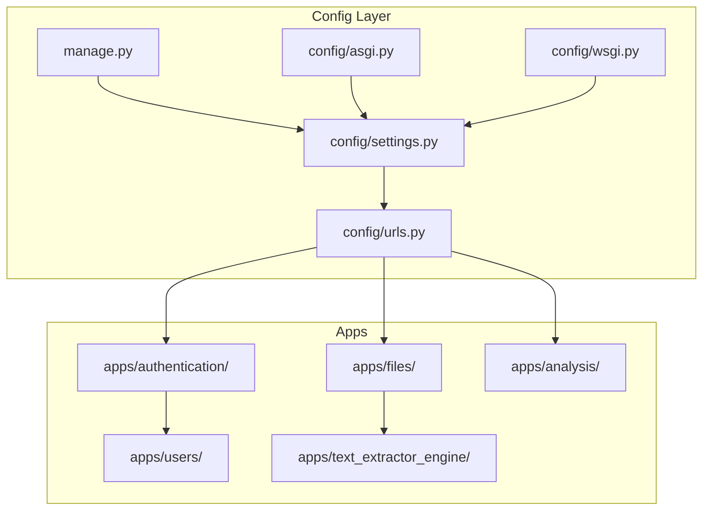
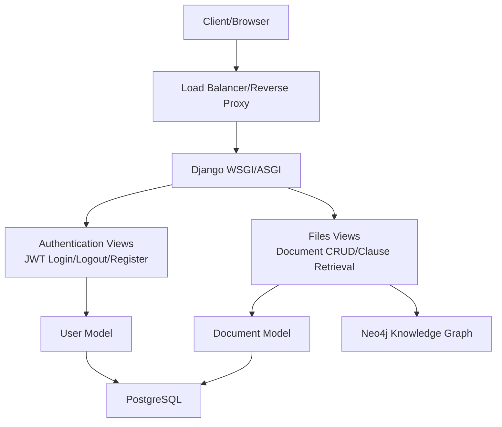
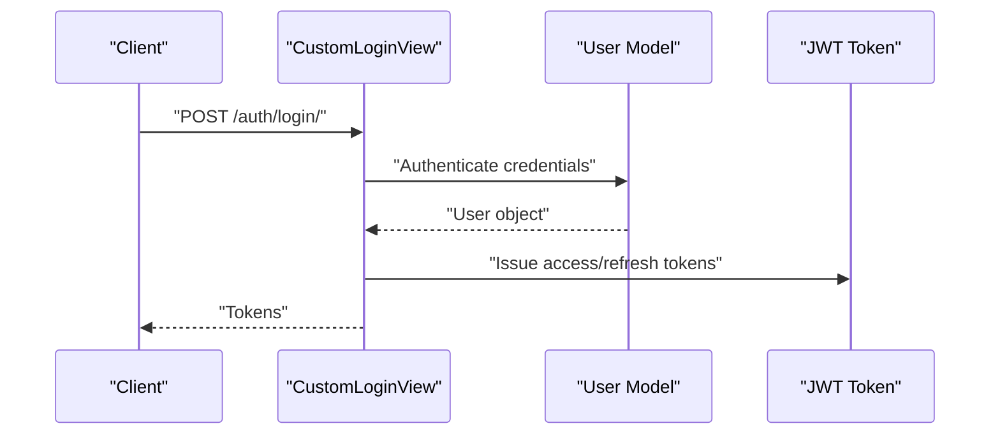
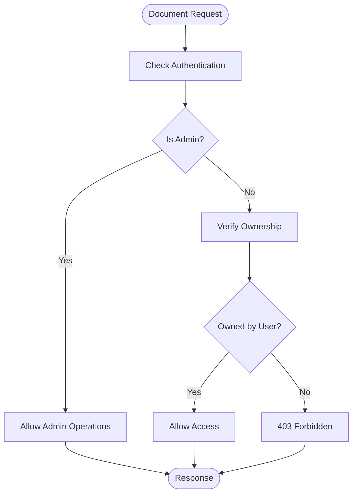
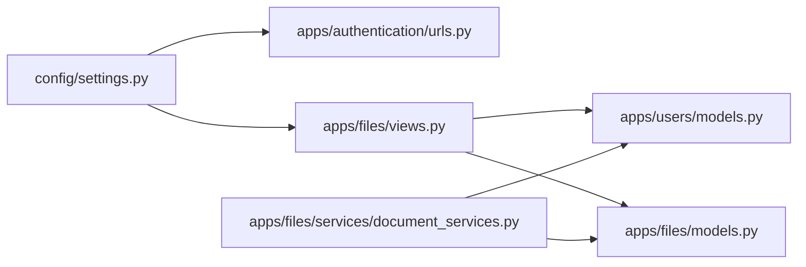

# Production Hardening

<cite>
**Referenced Files in This Document**
- [settings.py](file://config/settings.py)
- [urls.py](file://config/urls.py)
- [asgi.py](file://config/asgi.py)
- [wsgi.py](file://config/wsgi.py)
- [manage.py](file://manage.py)
- [views.py](file://apps/authentication/views.py)
- [urls.py](file://apps/authentication/urls.py)
- [models.py](file://apps/users/models.py)
- [views.py](file://apps/files/views.py)
- [models.py](file://apps/files/models.py)
- [document_services.py](file://apps/files/services/document_services.py)
- [pdf_service.py](file://apps/text_extractor_engine/services/pdf_service.py)
</cite>

## Table of Contents
1. [Introduction](#introduction)
2. [Project Structure](#project-structure)
3. [Core Components](#core-components)
4. [Architecture Overview](#architecture-overview)
5. [Detailed Component Analysis](#detailed-component-analysis)
6. [Dependency Analysis](#dependency-analysis)
7. [Performance Considerations](#performance-considerations)
8. [Monitoring and Observability](#monitoring-and-observability)
9. [Logging Configuration](#logging-configuration)
10. [Security Hardening](#security-hardening)
11. [Database Security](#database-security)
12. [Backup and Disaster Recovery](#backup-and-disaster-recovery)
13. [Maintenance Scheduling](#maintenance-scheduling)
14. [Security Audit Checklist](#security-audit-checklist)
15. [Compliance Considerations](#compliance-considerations)
16. [Troubleshooting Guide](#troubleshooting-guide)
17. [Conclusion](#conclusion)

## Introduction
This document provides production hardening guidance for VeritasShield, focusing on security, performance, observability, reliability, and operational excellence. It synthesizes the current codebase configuration and outlines actionable improvements for deployment readiness, covering HTTPS, CORS, security headers, CSRF protection, JWT lifecycle, database security, caching, query optimization, static/media delivery, monitoring, logging, backups, DR procedures, maintenance, audits, and compliance.

## Project Structure
VeritasShield follows a Django project layout with modular apps under apps/, shared configuration under config/, and media assets stored under media/. Authentication, user management, file/document handling, and AI-powered text extraction are implemented as separate apps. The project uses Django REST Framework with JWT for authentication and PostgreSQL for relational data.

**Diagram sources**
- [settings.py](file://config/settings.py)
- [urls.py](file://config/urls.py)
- [asgi.py](file://config/asgi.py)
- [wsgi.py](file://config/wsgi.py)
- [manage.py](file://manage.py)

**Section sources**
- [settings.py](file://config/settings.py)
- [urls.py](file://config/urls.py)
- [asgi.py](file://config/asgi.py)
- [wsgi.py](file://config/wsgi.py)
- [manage.py](file://manage.py)

## Core Components
- Authentication and Authorization: JWT-based authentication via REST Framework SimpleJWT with custom login and logout endpoints. User model extends AbstractBaseUser with email as the unique identifier.
- File Management: Document model stores uploaded files, metadata, and timestamps; views enforce IsAuthenticated or IsAdminUser permissions.
- Text Extraction Engine: PDF-to-images conversion service used during OCR and processing workflows.
- AI Pipelines: DocumentService orchestrates clause extraction, classification, similarity, and conflict detection against a Neo4j-backed knowledge graph.

Key production considerations:
- Enforce HTTPS/TLS termination at the edge proxy/load balancer.
- Configure ALLOWED_HOSTS and CORS policies for production domains.
- Harden JWT lifetimes, refresh token handling, and blacklist support.
- Secure database credentials and enable SSL/TLS for connections.
- Implement robust logging, metrics, and alerting.
- Establish backup and DR procedures aligned with RPO/RTO targets.

**Section sources**
- [views.py](file://apps/authentication/views.py)
- [urls.py](file://apps/authentication/urls.py)
- [models.py](file://apps/users/models.py)
- [views.py](file://apps/files/views.py)
- [models.py](file://apps/files/models.py)
- [document_services.py](file://apps/files/services/document_services.py)
- [pdf_service.py](file://apps/text_extractor_engine/services/pdf_service.py)

## Architecture Overview
The runtime architecture integrates Django with REST Framework, JWT authentication, PostgreSQL for relational data, and a Neo4j-backed knowledge graph for semantic analysis. Media files are served via Django’s development server in the current configuration; in production, they should be served by a CDN or reverse proxy.

**Diagram sources**
- [settings.py](file://config/settings.py)
- [views.py](file://apps/authentication/views.py)
- [views.py](file://apps/files/views.py)
- [models.py](file://apps/users/models.py)
- [models.py](file://apps/files/models.py)
- [document_services.py](file://apps/files/services/document_services.py)

## Detailed Component Analysis

### Authentication and Authorization
- JWT configuration defines access/refresh lifetimes and header types.
- Custom login endpoint leverages TokenObtainPairView with a custom serializer.
- Logout endpoint consumes refresh tokens and blacklists them.
- Registration enforces presence of email/password and uniqueness.

Recommended production hardening:
- Set strict ALLOWED_HOSTS and configure CORS for trusted origins only.
- Enforce HTTPS and secure cookies (SameSite, Secure, HttpOnly).
- Implement rate limiting for login/register endpoints.
- Rotate secrets regularly and store in environment variables/secrets manager.
- Add MFA and IP allowlisting for privileged endpoints.

**Diagram sources**
- [views.py](file://apps/authentication/views.py)
- [models.py](file://apps/users/models.py)

**Section sources**
- [views.py](file://apps/authentication/views.py)
- [urls.py](file://apps/authentication/urls.py)
- [models.py](file://apps/users/models.py)
- [settings.py](file://config/settings.py)

### File Management and Access Control
- DocumentViewSet restricts to admin users; DocumentClausesView requires authenticated users.
- Document model links files to users and stores metadata.
- Media files are stored under media/contracts/.

Production recommendations:
- Enforce per-user ownership checks in views/services.
- Implement signed URLs or pre-signed tokens for secure downloads.
- Restrict file types and scan uploads for malware.
- Serve media via CDN or reverse proxy with access control.

**Diagram sources**
- [views.py](file://apps/files/views.py)
- [models.py](file://apps/files/models.py)

**Section sources**
- [views.py](file://apps/files/views.py)
- [models.py](file://apps/files/models.py)

### Text Extraction Engine
- PDFService converts PDF pages to images for downstream OCR processing.
- Used within document processing workflows.

Production recommendations:
- Validate input paths and sanitize filenames.
- Limit concurrent conversions and impose resource quotas.
- Store intermediate artifacts in ephemeral storage with cleanup policies.

**Section sources**
- [pdf_service.py](file://apps/text_extractor_engine/services/pdf_service.py)

## Dependency Analysis
- Django settings define installed apps, middleware, REST framework defaults, JWT settings, and static/media paths.
- URL routing aggregates app-specific URLs and serves media in development.
- Authentication and files apps depend on the User model and database backends.
- DocumentService depends on external AI pipelines and Neo4j.

**Diagram sources**
- [settings.py](file://config/settings.py)
- [urls.py](file://apps/authentication/urls.py)
- [views.py](file://apps/files/views.py)
- [models.py](file://apps/users/models.py)
- [models.py](file://apps/files/models.py)
- [document_services.py](file://apps/files/services/document_services.py)

**Section sources**
- [settings.py](file://config/settings.py)
- [urls.py](file://apps/authentication/urls.py)
- [views.py](file://apps/files/views.py)
- [models.py](file://apps/users/models.py)
- [models.py](file://apps/files/models.py)
- [document_services.py](file://apps/files/services/document_services.py)

## Performance Considerations
Current state:
- Static files served via Django; media served via development server.
- No explicit caching layers configured.
- Database queries handled by Django ORM without pagination hints.

Recommendations:
- CDN for static and media assets; set far-future cache headers.
- Enable database connection pooling (e.g., pgBouncer) and tune pool size.
- Add Redis/Memcached for session storage and short-lived caches.
- Optimize ORM queries: select_related(), prefetch_related(), limit fields, paginate.
- Implement database indexing on frequently filtered/sorted fields.
- Use asynchronous workers (Celery) for long-running tasks (OCR, analysis).
- Monitor slow queries and query plan regressions.

[No sources needed since this section provides general guidance]

## Monitoring and Observability
- Health checks: Implement Django health checks via a dedicated endpoint returning application and database connectivity status.
- Metrics: Expose Prometheus metrics for response times, throughput, error rates, and queue lengths.
- Tracing: Add OpenTelemetry for distributed tracing across services.
- Alerting: Wire alerts for latency SLO breaches, error spikes, and resource exhaustion.

[No sources needed since this section provides general guidance]

## Logging Configuration
- Structured logs: Use structured JSON logs for easier parsing and correlation.
- Log levels: ERROR in production; reduce INFO/WARN for noisy subsystems.
- Rotation: Daily/size-based rotation with retention policies.
- Centralized logging: Ship logs to a SIEM or log aggregation platform (e.g., ELK, Loki).
- Sensitive data: Redact PII and secrets; avoid logging JWT tokens.

[No sources needed since this section provides general guidance]

## Security Hardening
- HTTPS/TLS: Terminate TLS at the load balancer; enforce HSTS and modern cipher suites.
- CORS: Configure allowed origins, methods, and headers; disable wildcard origins.
- Security headers: Strict-Transport-Security, X-Content-Type-Options, X-Frame-Options, Content-Security-Policy.
- CSRF: Ensure CSRF_COOKIE_SECURE and CSRF_TRUSTED_ORIGINS are configured when applicable.
- JWT: Short access tokens, long-lived refresh tokens, blacklist support, rotating secrets.
- Secrets: Store secrets in environment variables or a secrets manager; never commit to source.
- Rate limiting: Apply per-endpoint limits to prevent brute force and abuse.
- Input validation: Sanitize and validate all inputs; enforce file type and size limits.

**Section sources**
- [settings.py](file://config/settings.py)
- [views.py](file://apps/authentication/views.py)

## Database Security
- Connection pooling: Use pgBouncer or similar to manage connections efficiently.
- SSL/TLS: Enable SSL for database connections; pin CA certificates.
- Access control: Principle of least privilege; dedicated service accounts with minimal permissions.
- Network isolation: Place database behind private subnets; restrict inbound rules.
- Backups: Encrypted snapshots; test restore procedures regularly.

**Section sources**
- [settings.py](file://config/settings.py)

## Backup and Disaster Recovery
- Data backups: Automated encrypted snapshots of PostgreSQL and Neo4j volumes.
- Media backups: Sync media to durable object storage with versioning.
- Recovery testing: Regular restore drills; measure RPO/RTO against business requirements.
- DR site: Geographically separated environment with automated failover.

[No sources needed since this section provides general guidance]

## Maintenance Scheduling
- Patching windows: Schedule OS/database/dependency updates during low-traffic periods.
- Capacity planning: Monitor growth trends; scale compute/storage proactively.
- Security scans: Weekly vulnerability scans; monthly penetration tests.

[No sources needed since this section provides general guidance]

## Security Audit Checklist
- Environment variables and secrets management
- HTTPS enforcement and certificate validity
- CORS and security headers configuration
- CSRF protection and SameSite cookies
- JWT token lifecycle and blacklist
- Database SSL/TLS and access controls
- File upload restrictions and virus scanning
- Logging and audit trails
- Backup integrity and recovery drills
- Network segmentation and firewall rules

[No sources needed since this section provides general guidance]

## Compliance Considerations
- Data residency and transfer controls
- Encryption at rest and in transit
- Privacy by design (data minimization, retention policies)
- Audit logging and immutable records
- Vendor risk management for third-party services

[No sources needed since this section provides general guidance]

## Troubleshooting Guide
Common production issues and remedies:
- 400/401/403 errors: Verify JWT expiration, refresh token validity, and user permissions.
- 500 errors: Check application logs, database connectivity, and external service availability.
- Slow responses: Profile queries, enable query logging, and review indexes.
- Media access failures: Confirm file paths, permissions, and CDN configuration.
- CORS errors: Validate allowed origins and preflight requests.

**Section sources**
- [views.py](file://apps/authentication/views.py)
- [views.py](file://apps/files/views.py)
- [settings.py](file://config/settings.py)

## Conclusion
This guide consolidates production hardening practices for VeritasShield, aligning the existing Django/DRF/JWT architecture with enterprise-grade security, performance, and reliability standards. By implementing HTTPS/TLS, strict CORS/security headers, robust JWT lifecycle management, database security, caching, monitoring, logging, backups, and compliance controls, the system can achieve resilient, secure, and maintainable operations at scale.