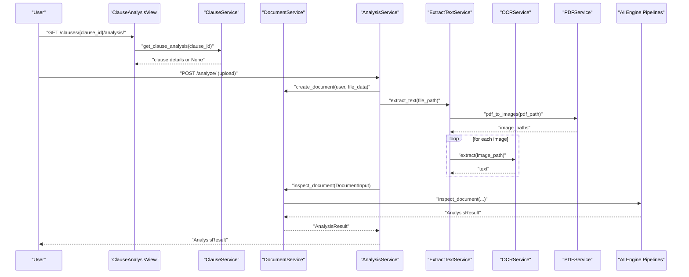
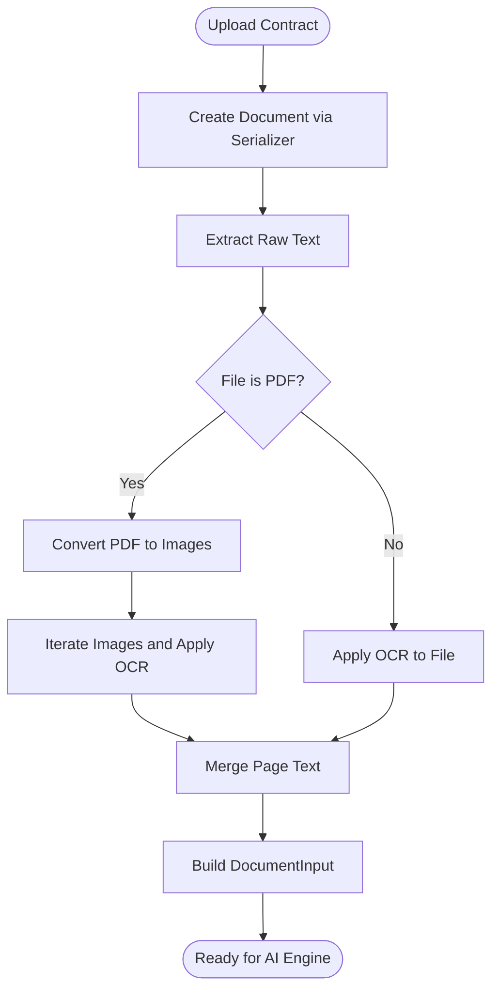
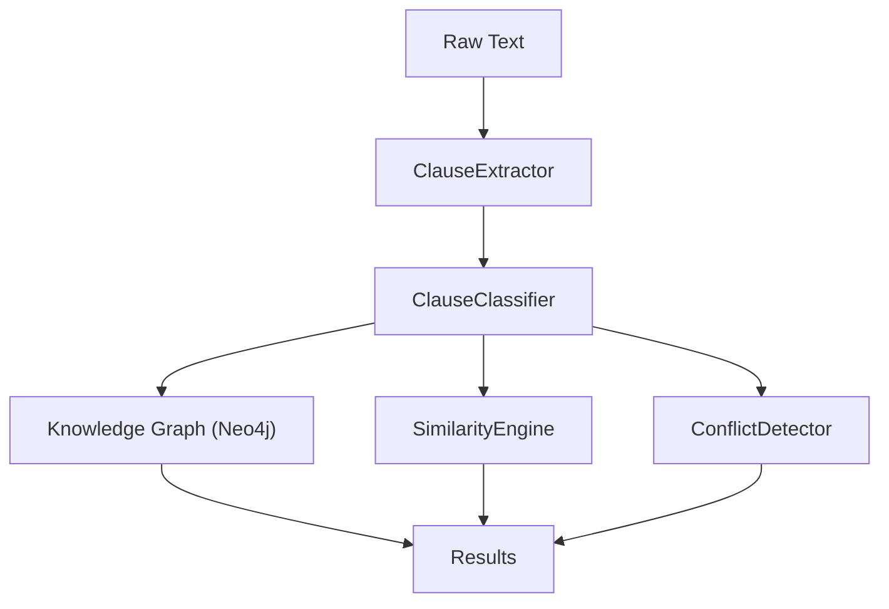
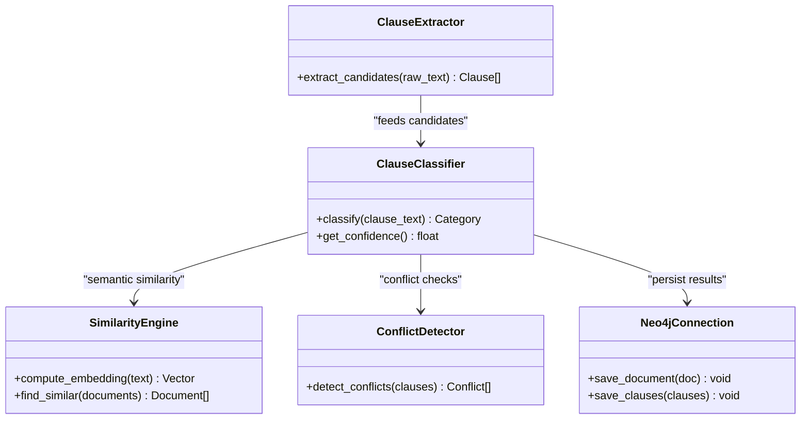
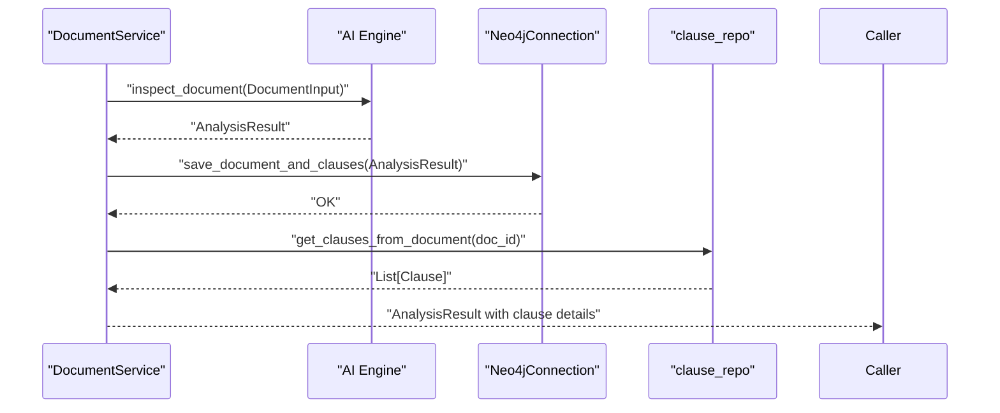
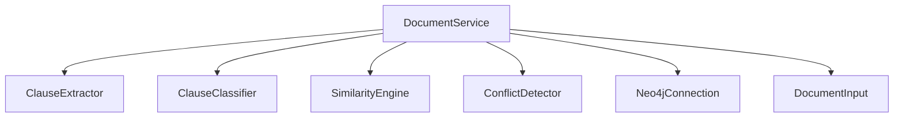
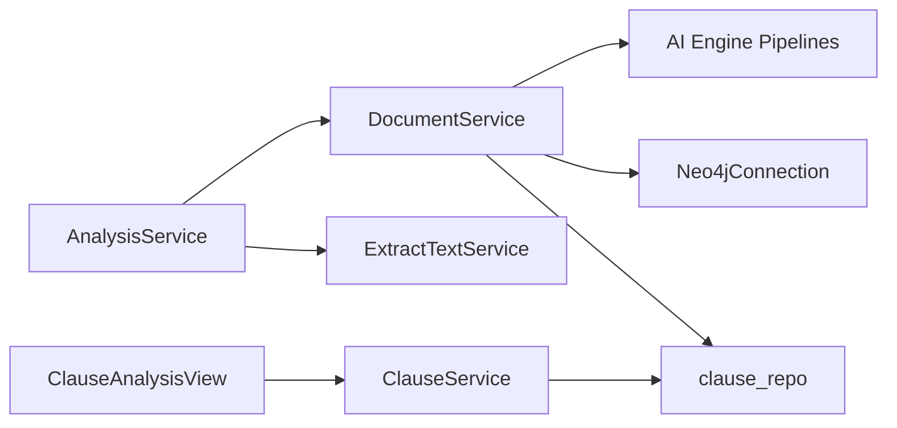

# Clause Extraction and Classification

<cite>
**Referenced Files in This Document**
- [analysis_service.py](file://apps/analysis/services/analysis_service.py)
- [document_services.py](file://apps/files/services/document_services.py)
- [document_models.py](file://apps/files/models.py)
- [document_serializers.py](file://apps/files/serializers.py)
- [clause_service.py](file://apps/clauses/services/clause_service.py)
- [clause_views.py](file://apps/clauses/views.py)
- [extract_text.py](file://apps/text_extractor_engine/services/extract_text.py)
- [ocr_service.py](file://apps/text_extractor_engine/services/ocr_service.py)
- [pdf_service.py](file://apps/text_extractor_engine/services/pdf_service.py)
</cite>

## Table of Contents
1. [Introduction](#introduction)
2. [Project Structure](#project-structure)
3. [Core Components](#core-components)
4. [Architecture Overview](#architecture-overview)
5. [Detailed Component Analysis](#detailed-component-analysis)
6. [Dependency Analysis](#dependency-analysis)
7. [Performance Considerations](#performance-considerations)
8. [Troubleshooting Guide](#troubleshooting-guide)
9. [Conclusion](#conclusion)

## Introduction
This document describes the clause extraction and classification subsystem responsible for automatically detecting and categorizing contract terms (such as obligations, representations, covenants, and remedies) from uploaded documents. It explains the pipeline that transforms raw text into structured clause insights, integrates with an external AI engine, and connects extracted clauses to a knowledge graph. It also documents the DocumentInput dataclass usage, template-based matching capabilities, machine learning classification models, and support for multiple contract types and languages.

## Project Structure
The clause extraction and classification pipeline spans several Django apps:
- apps/analysis: orchestrates end-to-end analysis of uploaded files.
- apps/files: manages document persistence, serialization, and integration with the AI engine.
- apps/clauses: exposes APIs for retrieving clause-level analysis.
- apps/text_extractor_engine: extracts raw text from various file formats (PDF, images).
- ai_engine: external package providing dataclasses, pipelines, classifiers, and knowledge graph utilities.

```mermaid
graph TB
subgraph "Django Apps"
A["apps/analysis/services/analysis_service.py"]
F["apps/files/services/document_services.py"]
M["apps/files/models.py"]
S["apps/files/serializers.py"]
C["apps/clauses/services/clause_service.py"]
V["apps/clauses/views.py"]
T["apps/text_extractor_engine/services/extract_text.py"]
O["apps/text_extractor_engine/services/ocr_service.py"]
P["apps/text_extractor_engine/services/pdf_service.py"]
end
subgraph "AI Engine (External)"
DI["ai_engine.dataclasses.DocumentInput"]
CE["ai_engine.pipelines.clause_extractor.ClauseExtractor"]
CL["ai_engine.pipelines.classify_clause.ClauseClassifier"]
SI["ai_engine.utils.similarity_engine.SimilarityEngine"]
CD["ai_engine.utils.conflict_detector.ConflictDetector"]
DB["ai_engine.db.neo4j_connection.Neo4jConnection"]
RP["ai_engine.repo.clause_repo"]
end
A --> F
F --> DI
F --> CE
F --> CL
F --> SI
F --> CD
F --> DB
F --> RP
A --> T
T --> O
T --> P
C --> RP
V --> C
```

**Diagram sources**
- [analysis_service.py:1-81](file://apps/analysis/services/analysis_service.py#L1-L81)
- [document_services.py:1-124](file://apps/files/services/document_services.py#L1-L124)
- [document_models.py:1-18](file://apps/files/models.py#L1-L18)
- [document_serializers.py:1-61](file://apps/files/serializers.py#L1-L61)
- [clause_service.py:1-20](file://apps/clauses/services/clause_service.py#L1-L20)
- [clause_views.py:1-30](file://apps/clauses/views.py#L1-L30)
- [extract_text.py:1-28](file://apps/text_extractor_engine/services/extract_text.py#L1-L28)
- [ocr_service.py](file://apps/text_extractor_engine/services/ocr_service.py)
- [pdf_service.py](file://apps/text_extractor_engine/services/pdf_service.py)

**Section sources**
- [analysis_service.py:1-81](file://apps/analysis/services/analysis_service.py#L1-L81)
- [document_services.py:1-124](file://apps/files/services/document_services.py#L1-L124)
- [document_models.py:1-18](file://apps/files/models.py#L1-L18)
- [document_serializers.py:1-61](file://apps/files/serializers.py#L1-L61)
- [clause_service.py:1-20](file://apps/clauses/services/clause_service.py#L1-L20)
- [clause_views.py:1-30](file://apps/clauses/views.py#L1-L30)
- [extract_text.py:1-28](file://apps/text_extractor_engine/services/extract_text.py#L1-L28)

## Core Components
- DocumentInput dataclass: encapsulates the document metadata and content passed to the AI engine for inspection and insertion.
- ClauseExtractor: identifies candidate clause segments from raw text using template-based matching and NLP heuristics.
- ClauseClassifier: assigns categories (obligations, representations, covenants, remedies) using ML classification models.
- SimilarityEngine: computes embeddings and similarity for conflict detection and clause comparison.
- ConflictDetector: identifies contradictory clauses across a document or across similar documents.
- Neo4jConnection: persists and queries the knowledge graph representation of documents and clauses.
- clause_repo: retrieves clause-level details and related clauses for analysis.

These components are orchestrated by DocumentService and AnalysisService, which integrate OCR/PDF processing, document persistence, and AI engine pipelines.

**Section sources**
- [document_services.py:1-124](file://apps/files/services/document_services.py#L1-L124)
- [analysis_service.py:1-81](file://apps/analysis/services/analysis_service.py#L1-L81)

## Architecture Overview
The end-to-end flow begins when a user uploads a contract file. The system extracts raw text, constructs a DocumentInput, and invokes inspection or insertion pipelines. The AI engine performs clause extraction and classification, stores results in the knowledge graph, and exposes similarity/conflict analysis.

**Diagram sources**
- [clause_views.py:1-30](file://apps/clauses/views.py#L1-L30)
- [clause_service.py:1-20](file://apps/clauses/services/clause_service.py#L1-L20)
- [analysis_service.py:1-81](file://apps/analysis/services/analysis_service.py#L1-L81)
- [document_services.py:1-124](file://apps/files/services/document_services.py#L1-L124)
- [extract_text.py:1-28](file://apps/text_extractor_engine/services/extract_text.py#L1-L28)
- [ocr_service.py](file://apps/text_extractor_engine/services/ocr_service.py)
- [pdf_service.py](file://apps/text_extractor_engine/services/pdf_service.py)

## Detailed Component Analysis

### DocumentInput and Raw Text Processing
- Raw text extraction:
  - For PDFs: convert pages to images and apply OCR per page.
  - For images/other formats: apply OCR directly.
- Document persistence:
  - Uses DocumentCreateSerializer to validate and persist metadata (title, language, extension).
  - Stores extracted raw_text and computed confidence on the Document model.
- DocumentInput construction:
  - Populated with document_id, raw_text, title, file_extension, language, signed_at, and other fields for downstream AI processing.

**Diagram sources**
- [analysis_service.py:19-50](file://apps/analysis/services/analysis_service.py#L19-L50)
- [document_services.py:83-110](file://apps/files/services/document_services.py#L83-L110)
- [extract_text.py:10-27](file://apps/text_extractor_engine/services/extract_text.py#L10-L27)

**Section sources**
- [analysis_service.py:19-50](file://apps/analysis/services/analysis_service.py#L19-L50)
- [document_models.py:5-14](file://apps/files/models.py#L5-L14)
- [document_serializers.py:32-61](file://apps/files/serializers.py#L32-L61)
- [extract_text.py:10-27](file://apps/text_extractor_engine/services/extract_text.py#L10-L27)

### Clause Extraction and Classification Pipeline
- ClauseExtractor:
  - Identifies candidate clause segments using template-based matching and NLP heuristics.
  - Produces a list of clause candidates ready for classification.
- ClauseClassifier:
  - Assigns categories (obligations, representations, covenants, remedies) with confidence scores.
  - Integrates with SimilarityEngine for semantic similarity and ConflictDetector for contradiction checks.
- Knowledge Graph Integration:
  - Neo4jConnection persists nodes and relationships for documents and clauses.
  - clause_repo retrieves clause details and related clauses for analysis.

**Diagram sources**
- [document_services.py:14-62](file://apps/files/services/document_services.py#L14-L62)

**Section sources**
- [document_services.py:14-62](file://apps/files/services/document_services.py#L14-L62)

### Template-Based Matching and Machine Learning Classification
- Template-based matching:
  - Used by ClauseExtractor to locate clause-like segments based on structural patterns and keywords.
- Machine learning classification:
  - ClauseClassifier applies trained models to categorize clauses into predefined types and compute confidence scores.
- Confidence scoring:
  - Stored on the Document model and can be surfaced in API responses for transparency.

**Diagram sources**
- [document_services.py:14-20](file://apps/files/services/document_services.py#L14-L20)

**Section sources**
- [document_services.py:14-20](file://apps/files/services/document_services.py#L14-L20)
- [document_models.py:13-13](file://apps/files/models.py#L13-L13)

### Relationship Between Extracted Clauses and the Knowledge Graph
- After classification, clauses are persisted to the knowledge graph via Neo4jConnection.
- clause_repo provides retrieval of clause details and related clauses for conflict and similarity analysis.
- The clause analysis API returns enriched results including conflicts and similar clauses.

**Diagram sources**
- [document_services.py:22-62](file://apps/files/services/document_services.py#L22-L62)
- [clause_service.py:7-19](file://apps/clauses/services/clause_service.py#L7-L19)

**Section sources**
- [document_services.py:22-62](file://apps/files/services/document_services.py#L22-L62)
- [clause_service.py:7-19](file://apps/clauses/services/clause_service.py#L7-L19)

### Integration with External AI Engines and Multi-Language Support
- External AI engine integration:
  - DocumentService composes ClauseExtractor, ClauseClassifier, SimilarityEngine, ConflictDetector, and Neo4jConnection.
  - The AI engine pipelines are invoked through inspect and insert functions exposed by the ai_engine package.
- Language handling:
  - Documents store a language field; OCR and NLP components operate based on this setting.
  - The system supports multiple contract types (PDF, images) and languages via OCR and classifier configurations.

**Diagram sources**
- [document_services.py:14-20](file://apps/files/services/document_services.py#L14-L20)

**Section sources**
- [document_services.py:14-20](file://apps/files/services/document_services.py#L14-L20)
- [document_models.py:11-11](file://apps/files/models.py#L11-L11)

## Dependency Analysis
- AnalysisService depends on DocumentService, ExtractTextService, and DocumentInput to orchestrate end-to-end processing.
- DocumentService composes AI engine components and knowledge graph utilities.
- OCR and PDF services are used for text extraction prior to AI processing.
- ClauseAnalysisView and ClauseService provide access to clause-level insights backed by clause_repo.

**Diagram sources**
- [analysis_service.py:1-81](file://apps/analysis/services/analysis_service.py#L1-L81)
- [document_services.py:1-124](file://apps/files/services/document_services.py#L1-L124)
- [clause_views.py:1-30](file://apps/clauses/views.py#L1-L30)
- [clause_service.py:1-20](file://apps/clauses/services/clause_service.py#L1-L20)

**Section sources**
- [analysis_service.py:1-81](file://apps/analysis/services/analysis_service.py#L1-L81)
- [document_services.py:1-124](file://apps/files/services/document_services.py#L1-L124)
- [clause_views.py:1-30](file://apps/clauses/views.py#L1-L30)
- [clause_service.py:1-20](file://apps/clauses/services/clause_service.py#L1-L20)

## Performance Considerations
- OCR throughput: Batch image processing for PDFs to minimize latency; cache intermediate results where feasible.
- Classifier inference: Use batching and asynchronous processing for high-volume uploads.
- Knowledge graph writes: Group clause insertions and use transactional writes to reduce overhead.
- Similarity computation: Pre-compute embeddings for static reference clauses; leverage indexing for fast nearest neighbor search.
- Memory usage: Stream large PDFs and avoid loading entire documents into memory during extraction.

## Troubleshooting Guide
- Missing raw_text before insertion:
  - The insert flow requires raw_text to be present; otherwise, a validation error is raised. Ensure inspection is performed first.
- Unsupported file types:
  - DocumentCreateSerializer validates supported extensions; ensure uploads conform to accepted formats.
- OCR failures:
  - Verify OCR service availability and image quality; consider fallback strategies for low-quality scans.
- Knowledge graph connectivity:
  - Confirm Neo4j connection parameters and permissions; monitor write latencies and retries.

**Section sources**
- [analysis_service.py:53-80](file://apps/analysis/services/analysis_service.py#L53-L80)
- [document_serializers.py:48-52](file://apps/files/serializers.py#L48-L52)
- [document_services.py:14-20](file://apps/files/services/document_services.py#L14-L20)

## Conclusion
The clause extraction and classification subsystem integrates OCR-based text extraction, AI-powered clause detection and classification, and knowledge graph storage to deliver automated contract analysis. The DocumentInput dataclass standardizes input across the pipeline, while template-based matching and ML classification provide robust categorization. Similarity and conflict detection enhance downstream analysis, and the system’s design supports extensibility for additional contract types and languages.