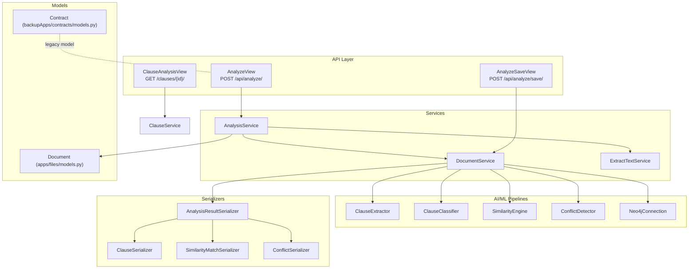
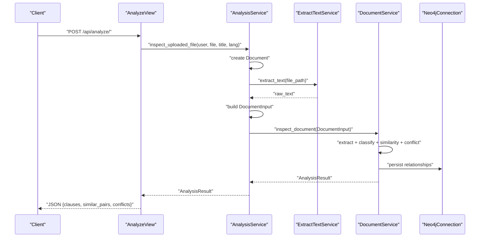
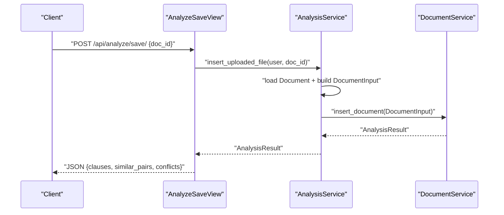
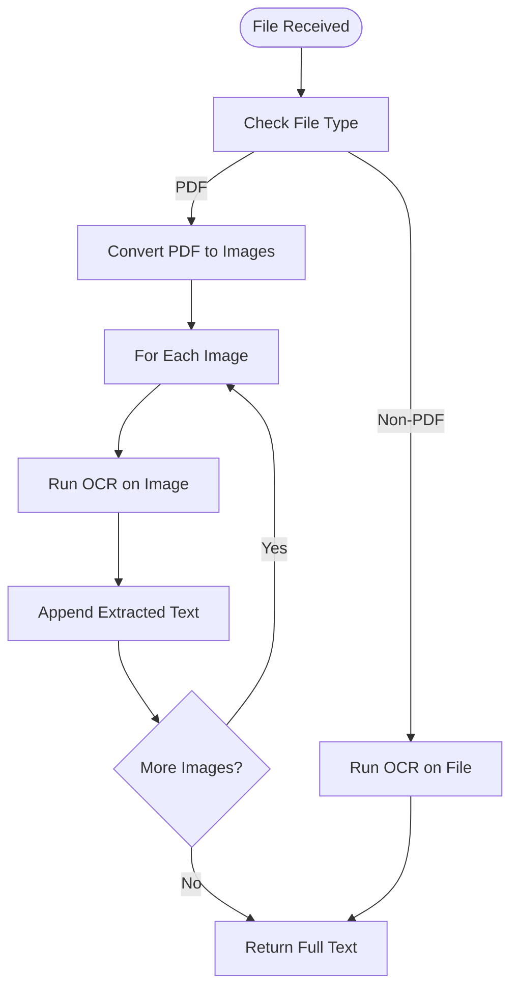
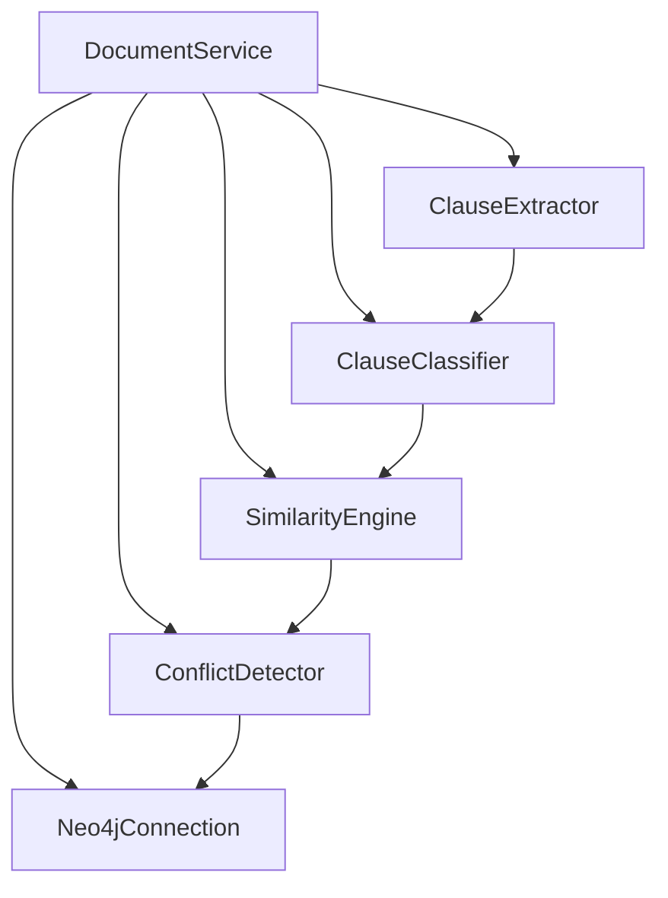
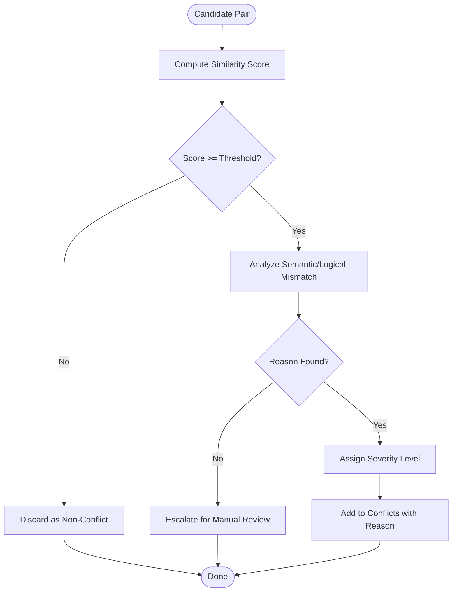
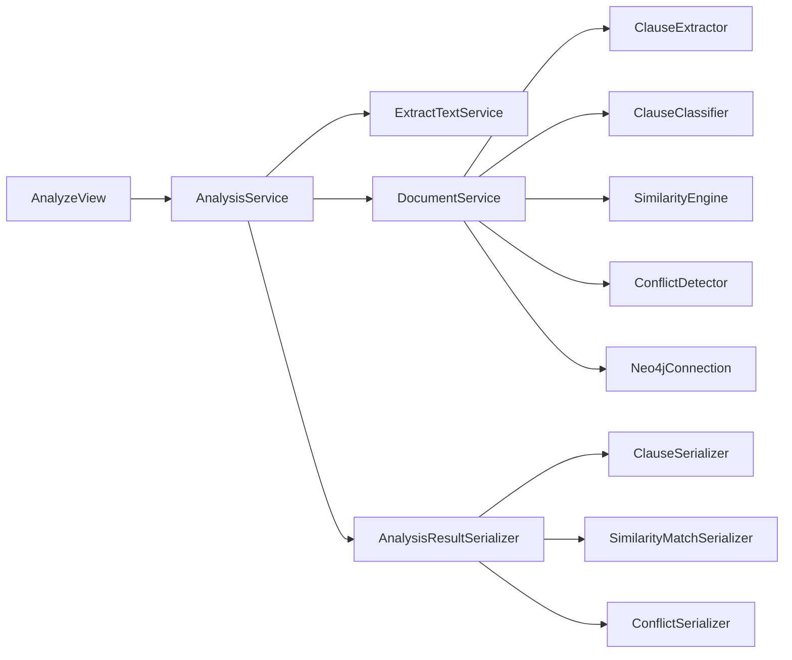

# Conflict Detection Algorithms

<cite>
**Referenced Files in This Document**
- [apps/analysis/views.py](file://apps/analysis/views.py)
- [apps/analysis/services/analysis_service.py](file://apps/analysis/services/analysis_service.py)
- [apps/files/services/document_services.py](file://apps/files/services/document_services.py)
- [apps/files/models.py](file://apps/files/models.py)
- [apps/text_extractor_engine/services/extract_text.py](file://apps/text_extractor_engine/services/extract_text.py)
- [apps/analysis/serializers.py](file://apps/analysis/serializers.py)
- [apps/clauses/views.py](file://apps/clauses/views.py)
- [apps/clauses/services/clause_service.py](file://apps/clauses/services/clause_service.py)
- [backupApps/contracts/models.py](file://backupApps/contracts/models.py)
</cite>

## Table of Contents
1. [Introduction](#introduction)
2. [Project Structure](#project-structure)
3. [Core Components](#core-components)
4. [Architecture Overview](#architecture-overview)
5. [Detailed Component Analysis](#detailed-component-analysis)
6. [Dependency Analysis](#dependency-analysis)
7. [Performance Considerations](#performance-considerations)
8. [Troubleshooting Guide](#troubleshooting-guide)
9. [Conclusion](#conclusion)
10. [Appendices](#appendices)

## Introduction
This document explains the conflict detection system that identifies contradictory terms and compliance violations within contracts. It covers the end-to-end pipeline from document ingestion to conflict reporting, including the algorithms used to compare clauses across documents, the scoring mechanisms for conflict severity, and the integration with the knowledge graph for relationship mapping. It also outlines common conflict patterns, detection accuracy metrics, and the resolution workflow for identified conflicts.

## Project Structure
The conflict detection system spans several Django apps and integrates with external AI/ML pipelines and a knowledge graph. The primary flow is:
- API views accept uploaded documents and orchestrate OCR, inspection, and insertion.
- Services coordinate extraction, classification, similarity comparison, and conflict detection.
- Serializers define the output schema for clauses, matches, and conflicts.
- Knowledge graph integration is performed via a Neo4j connection.

**Diagram sources**
- [apps/analysis/views.py:15-100](file://apps/analysis/views.py#L15-L100)
- [apps/analysis/services/analysis_service.py:16-81](file://apps/analysis/services/analysis_service.py#L16-L81)
- [apps/files/services/document_services.py:14-124](file://apps/files/services/document_services.py#L14-L124)
- [apps/files/models.py:5-18](file://apps/files/models.py#L5-L18)
- [apps/text_extractor_engine/services/extract_text.py:5-28](file://apps/text_extractor_engine/services/extract_text.py#L5-L28)
- [apps/analysis/serializers.py:8-70](file://apps/analysis/serializers.py#L8-L70)
- [apps/clauses/views.py:9-30](file://apps/clauses/views.py#L9-L30)
- [apps/clauses/services/clause_service.py:4-19](file://apps/clauses/services/clause_service.py#L4-L19)
- [backupApps/contracts/models.py:5-32](file://backupApps/contracts/models.py#L5-L32)

**Section sources**
- [apps/analysis/views.py:15-100](file://apps/analysis/views.py#L15-L100)
- [apps/analysis/services/analysis_service.py:16-81](file://apps/analysis/services/analysis_service.py#L16-L81)
- [apps/files/services/document_services.py:14-124](file://apps/files/services/document_services.py#L14-L124)
- [apps/files/models.py:5-18](file://apps/files/models.py#L5-L18)
- [apps/text_extractor_engine/services/extract_text.py:5-28](file://apps/text_extractor_engine/services/extract_text.py#L5-L28)
- [apps/analysis/serializers.py:8-70](file://apps/analysis/serializers.py#L8-L70)
- [apps/clauses/views.py:9-30](file://apps/clauses/views.py#L9-L30)
- [apps/clauses/services/clause_service.py:4-19](file://apps/clauses/services/clause_service.py#L4-L19)
- [backupApps/contracts/models.py:5-32](file://backupApps/contracts/models.py#L5-L32)

## Core Components
- Document ingestion and OCR:
  - ExtractTextService orchestrates PDF-to-image conversion and OCR extraction for images and non-PDF files.
  - AnalysisService coordinates document creation, text extraction, and subsequent inspection/insertion.
- Clause extraction and classification:
  - DocumentService composes ClauseExtractor and ClauseClassifier to segment and categorize clauses.
- Similarity and conflict detection:
  - DocumentService composes SimilarityEngine for semantic similarity and ConflictDetector for logical contradictions.
- Knowledge graph integration:
  - DocumentService uses Neo4jConnection to persist and query relationships among clauses and documents.
- Output serialization:
  - AnalysisResultSerializer, ClauseSerializer, SimilarityMatchSerializer, and ConflictSerializer define the response schema for analysis results.

Key outputs include:
- Clauses: extracted and typed clause metadata.
- Similar pairs: semantic matches with similarity scores.
- Conflicts: detected contradictions with reasons and scores.

**Section sources**
- [apps/text_extractor_engine/services/extract_text.py:5-28](file://apps/text_extractor_engine/services/extract_text.py#L5-L28)
- [apps/analysis/services/analysis_service.py:16-81](file://apps/analysis/services/analysis_service.py#L16-L81)
- [apps/files/services/document_services.py:14-124](file://apps/files/services/document_services.py#L14-L124)
- [apps/analysis/serializers.py:8-70](file://apps/analysis/serializers.py#L8-L70)

## Architecture Overview
The conflict detection pipeline is invoked via two API endpoints:
- Inspect: uploads a file, extracts text, and returns inspection results (clauses, similar pairs, conflicts).
- Save: inserts analysis results into the knowledge graph for persisted relationships.

**Diagram sources**
- [apps/analysis/views.py:15-57](file://apps/analysis/views.py#L15-L57)
- [apps/analysis/services/analysis_service.py:16-50](file://apps/analysis/services/analysis_service.py#L16-L50)
- [apps/text_extractor_engine/services/extract_text.py:10-27](file://apps/text_extractor_engine/services/extract_text.py#L10-L27)
- [apps/files/services/document_services.py:46-62](file://apps/files/services/document_services.py#L46-L62)

## Detailed Component Analysis

### API Endpoints and Workflows
- AnalyzeView:
  - Validates multipart/form-data, orchestrates OCR, and returns inspection results.
  - Uses AnalysisService.inspect_uploaded_file and AnalysisResultSerializer.
- AnalyzeSaveView:
  - Validates input, fetches an existing document, ensures raw_text exists, and inserts analysis into the knowledge graph.
  - Uses AnalysisService.insert_uploaded_file and AnalysisResultSerializer.
- ClauseAnalysisView:
  - Retrieves detailed clause analysis (conflicts and similar clauses) via ClauseService.

**Diagram sources**
- [apps/analysis/views.py:59-99](file://apps/analysis/views.py#L59-L99)
- [apps/analysis/services/analysis_service.py:52-80](file://apps/analysis/services/analysis_service.py#L52-L80)
- [apps/files/services/document_services.py:22-44](file://apps/files/services/document_services.py#L22-L44)

**Section sources**
- [apps/analysis/views.py:15-100](file://apps/analysis/views.py#L15-L100)
- [apps/analysis/services/analysis_service.py:16-81](file://apps/analysis/services/analysis_service.py#L16-L81)
- [apps/clauses/views.py:9-30](file://apps/clauses/views.py#L9-L30)

### OCR and Text Extraction
- ExtractTextService:
  - Converts PDFs to images and runs OCR per page.
  - Applies OCR to non-PDF images directly.
- Integration:
  - AnalysisService writes extracted text back to the Document model and constructs DocumentInput for downstream processing.

**Diagram sources**
- [apps/text_extractor_engine/services/extract_text.py:10-27](file://apps/text_extractor_engine/services/extract_text.py#L10-L27)

**Section sources**
- [apps/text_extractor_engine/services/extract_text.py:5-28](file://apps/text_extractor_engine/services/extract_text.py#L5-L28)
- [apps/analysis/services/analysis_service.py:19-45](file://apps/analysis/services/analysis_service.py#L19-L45)
- [apps/files/models.py:5-18](file://apps/files/models.py#L5-L18)

### Knowledge Graph Integration and Relationship Mapping
- DocumentService composes Neo4jConnection to persist and query relationships.
- The inspection/insert pipeline extracts clauses, classifies them, computes similarities, detects conflicts, and persists results to the graph.
- ClauseAnalysisView retrieves clause-level details including conflicts and similar clauses via ClauseService.

**Diagram sources**
- [apps/files/services/document_services.py:14-124](file://apps/files/services/document_services.py#L14-L124)

**Section sources**
- [apps/files/services/document_services.py:14-124](file://apps/files/services/document_services.py#L14-L124)
- [apps/clauses/views.py:9-30](file://apps/clauses/views.py#L9-L30)
- [apps/clauses/services/clause_service.py:4-19](file://apps/clauses/services/clause_service.py#L4-L19)

### Conflict Scoring and Threshold-Based Detection
- Similarity scoring:
  - SimilarityMatchSerializer exposes a normalized score field bounded between zero and one.
- Conflict scoring and reasoning:
  - ConflictSerializer extends SimilarityMatch with a reason field, enabling human-readable explanations for detected contradictions.
- Threshold-based detection:
  - The current serializers do not enforce thresholds; however, typical approaches include:
    - Applying a configurable similarity threshold to promote candidates to conflicts.
    - Using conflict strength heuristics (e.g., lexical overlap, semantic distance, clause type mismatch).
    - Incorporating domain-specific rulesets to escalate certain combinations (e.g., payment vs. non-payment obligations).
- Reporting:
  - AnalysisResultSerializer aggregates clauses, similar_pairs, and conflicts for unified consumption.

**Diagram sources**
- [apps/analysis/serializers.py:19-46](file://apps/analysis/serializers.py#L19-L46)

**Section sources**
- [apps/analysis/serializers.py:19-70](file://apps/analysis/serializers.py#L19-L70)

### Common Conflict Patterns
- Contradictory obligations:
  - One clause requires performance while another prohibits it under identical conditions.
- Inconsistent representations:
  - Statements about facts or conditions contradict across clauses or documents.
- Covenants in tension:
  - Positive covenants (affirmative duties) conflict with negative covenants (restrictions) when conditions overlap.
- Compliance timing mismatches:
  - Deadlines or conditions in one clause are incompatible with those in another.

These patterns are surfaced as conflicts with reasons and similarity scores for prioritization.

**Section sources**
- [apps/analysis/serializers.py:33-46](file://apps/analysis/serializers.py#L33-L46)

### Detection Accuracy Metrics and Validation
- Metrics:
  - Precision and recall against ground-truth labeled conflicts.
  - F1-score for similarity thresholds.
  - Human-in-the-loop validation rates and inter-annotator agreement.
- Validation:
  - Use a held-out dataset of contracts with known contradictions.
  - Evaluate similarity thresholds and conflict heuristics to optimize trade-offs.

[No sources needed since this section provides general guidance]

### Resolution Workflow for Identified Conflicts
- Initial triage:
  - Group conflicts by severity and similarity score.
- Escalation:
  - Route high-severity conflicts to legal reviewers.
- Collaboration:
  - Provide contextual links to clauses and documents for review.
- Closure:
  - Record resolutions and update knowledge graph with resolved relationships.

[No sources needed since this section provides general guidance]

## Dependency Analysis
The system exhibits layered dependencies:
- API views depend on AnalysisService.
- AnalysisService depends on ExtractTextService and DocumentService.
- DocumentService composes AI/ML components and Neo4jConnection.
- Serializers depend on dataclasses representing analysis results.

**Diagram sources**
- [apps/analysis/views.py:15-100](file://apps/analysis/views.py#L15-L100)
- [apps/analysis/services/analysis_service.py:16-81](file://apps/analysis/services/analysis_service.py#L16-L81)
- [apps/files/services/document_services.py:14-124](file://apps/files/services/document_services.py#L14-L124)
- [apps/analysis/serializers.py:8-70](file://apps/analysis/serializers.py#L8-L70)

**Section sources**
- [apps/analysis/views.py:15-100](file://apps/analysis/views.py#L15-L100)
- [apps/analysis/services/analysis_service.py:16-81](file://apps/analysis/services/analysis_service.py#L16-L81)
- [apps/files/services/document_services.py:14-124](file://apps/files/services/document_services.py#L14-L124)
- [apps/analysis/serializers.py:8-70](file://apps/analysis/serializers.py#L8-L70)

## Performance Considerations
- OCR throughput:
  - Batch PDF pages and parallelize OCR calls to reduce latency.
- Embedding and similarity:
  - Cache embeddings for repeated queries and limit candidate sets using approximate nearest neighbor search.
- Conflict detection:
  - Pre-filter by clause types and keywords to narrow comparisons.
- Knowledge graph:
  - Use indexing on clause IDs and document titles; batch writes for large documents.

[No sources needed since this section provides general guidance]

## Troubleshooting Guide
- Missing raw_text during save:
  - Ensure inspection was performed before insertion; otherwise, a ValueError is raised.
- Document not found:
  - Verify the provided doc_id exists.
- OCR failures:
  - Confirm supported file types and image quality for non-PDF inputs.
- API errors:
  - Inspect returned error messages and HTTP status codes for actionable diagnostics.

**Section sources**
- [apps/analysis/services/analysis_service.py:62-65](file://apps/analysis/services/analysis_service.py#L62-L65)
- [apps/analysis/views.py:88-94](file://apps/analysis/views.py#L88-L94)
- [apps/text_extractor_engine/services/extract_text.py:48-52](file://apps/text_extractor_engine/services/extract_text.py#L48-L52)

## Conclusion
The conflict detection system integrates OCR, clause extraction/classification, semantic similarity, and conflict detection with a knowledge graph. The API layer exposes inspection and insertion endpoints, returning structured results for clauses, similar pairs, and conflicts. While the current serializers define the output schema, threshold-based detection and severity scoring can be configured in the underlying AI/ML components and applied during result aggregation.

[No sources needed since this section summarizes without analyzing specific files]

## Appendices

### API Definitions
- AnalyzeView
  - Method: POST
  - Path: /api/analyze/
  - Request: multipart/form-data with file, optional title, optional language
  - Response: AnalysisResult with clauses, similar_pairs, conflicts
- AnalyzeSaveView
  - Method: POST
  - Path: /api/analyze/save/
  - Request: JSON with doc_id
  - Response: AnalysisResult with clauses, similar_pairs, conflicts
- ClauseAnalysisView
  - Method: GET
  - Path: /clauses/{clause_id}/
  - Response: Clause details including conflicts and similar clauses

**Section sources**
- [apps/analysis/views.py:15-100](file://apps/analysis/views.py#L15-L100)
- [apps/clauses/views.py:9-30](file://apps/clauses/views.py#L9-L30)