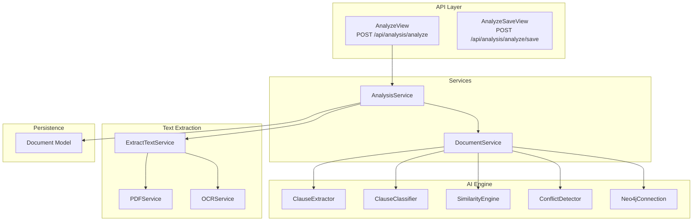
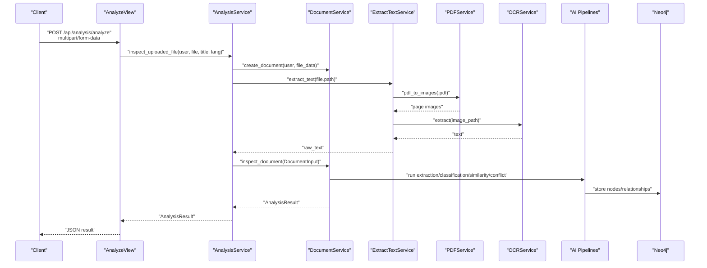
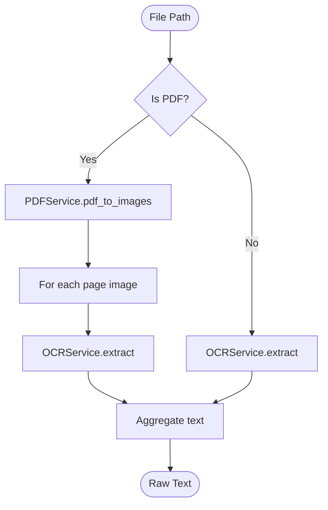
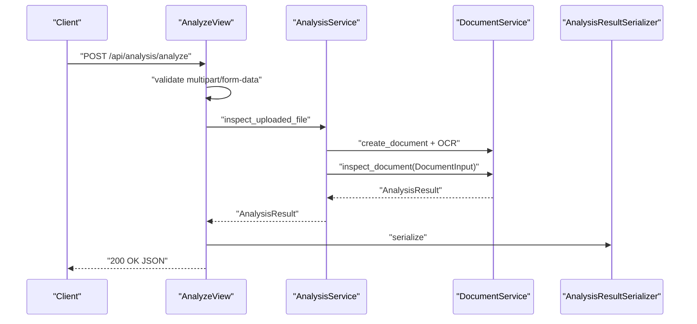
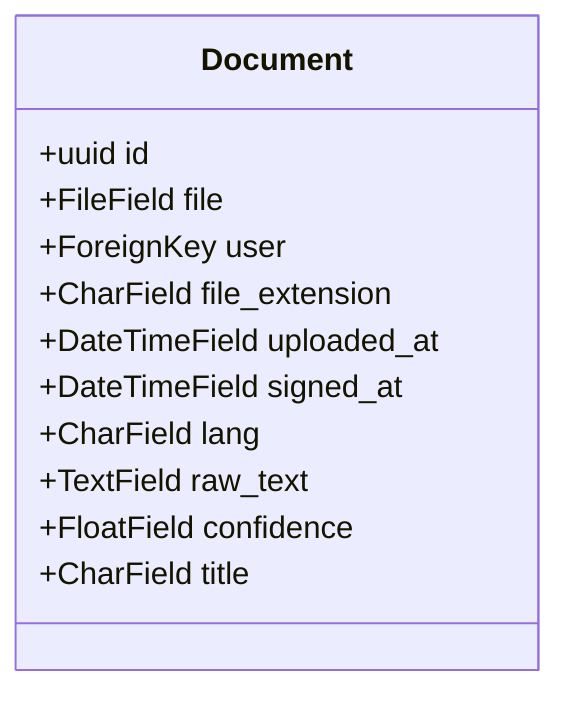
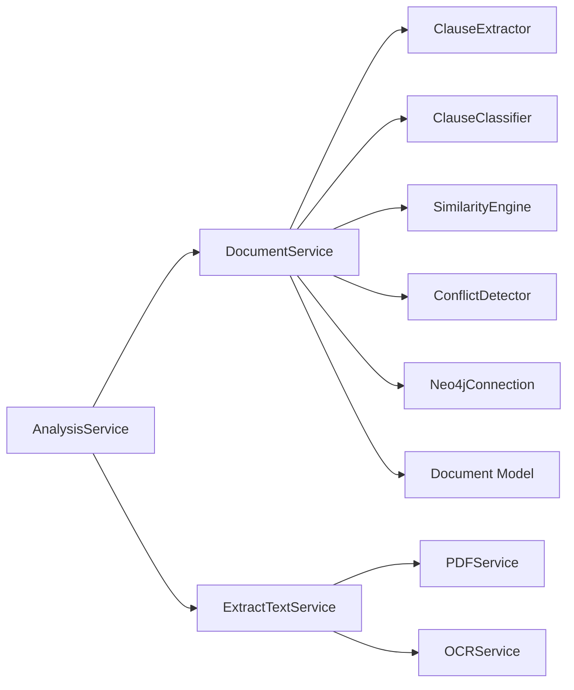

# Contract Analysis System

<cite>
**Referenced Files in This Document**
- [analysis_service.py](file://apps/analysis/services/analysis_service.py)
- [document_services.py](file://apps/files/services/document_services.py)
- [extract_text.py](file://apps/text_extractor_engine/services/extract_text.py)
- [ocr_service.py](file://apps/text_extractor_engine/services/ocr_service.py)
- [pdf_service.py](file://apps/text_extractor_engine/services/pdf_service.py)
- [views.py](file://apps/analysis/views.py)
- [urls.py](file://apps/analysis/urls.py)
- [serializers.py](file://apps/analysis/serializers.py)
- [models.py](file://apps/files/models.py)
- [settings.py](file://config/settings.py)
</cite>

## Table of Contents
1. [Introduction](#introduction)
2. [Project Structure](#project-structure)
3. [Core Components](#core-components)
4. [Architecture Overview](#architecture-overview)
5. [Detailed Component Analysis](#detailed-component-analysis)
6. [Dependency Analysis](#dependency-analysis)
7. [Performance Considerations](#performance-considerations)
8. [Troubleshooting Guide](#troubleshooting-guide)
9. [Conclusion](#conclusion)
10. [Appendices](#appendices)

## Introduction
VeritasShield is a contract analysis platform that orchestrates text extraction, clause detection, similarity analysis, and conflict detection. It integrates OCR for scanned documents, a knowledge graph for storage and relationships, and AI-powered pipelines for classification and insights. The system exposes REST endpoints for uploading contracts, performing analysis, and retrieving structured results including extracted clauses, similarity matches, and conflict reports.

## Project Structure
The backend is organized into Django apps:
- apps/analysis: API endpoints and orchestration for analysis workflows
- apps/files: Document persistence and related services
- apps/text_extractor_engine: OCR and PDF-to-image conversion
- apps/users/authentication: Authentication and user management
- config: Django settings and URL routing

**Diagram sources**
- [views.py:15-100](file://apps/analysis/views.py#L15-L100)
- [analysis_service.py:16-81](file://apps/analysis/services/analysis_service.py#L16-L81)
- [document_services.py:14-137](file://apps/files/services/document_services.py#L14-L137)
- [extract_text.py:5-28](file://apps/text_extractor_engine/services/extract_text.py#L5-L28)
- [pdf_service.py:4-15](file://apps/text_extractor_engine/services/pdf_service.py#L4-L15)
- [ocr_service.py:6-18](file://apps/text_extractor_engine/services/ocr_service.py#L6-L18)
- [models.py:5-18](file://apps/files/models.py#L5-L18)

**Section sources**
- [settings.py:26-40](file://config/settings.py#L26-L40)
- [urls.py:1-9](file://apps/analysis/urls.py#L1-L9)

## Core Components
- AnalysisService: Orchestrates end-to-end analysis from upload to inspection, handles OCR and document creation, and prepares the DocumentInput for AI pipelines.
- DocumentService: Coordinates AI pipelines (clause extraction/classification, similarity, conflict detection) and knowledge graph insertion/inspection.
- ExtractTextService: Unified interface for extracting text from PDFs (via OCR on page images) and other image formats.
- OCRService: Uses EasyOCR to extract text and compute average confidence.
- PDFService: Converts PDFs to images for OCR processing.
- Django Models: Document model stores metadata, file path, language, timestamps, and extracted text.
- API Views and Serializers: Expose endpoints for analysis and saving, with input validation and output serialization.

**Section sources**
- [analysis_service.py:16-81](file://apps/analysis/services/analysis_service.py#L16-L81)
- [document_services.py:14-137](file://apps/files/services/document_services.py#L14-L137)
- [extract_text.py:5-28](file://apps/text_extractor_engine/services/extract_text.py#L5-L28)
- [ocr_service.py:6-18](file://apps/text_extractor_engine/services/ocr_service.py#L6-L18)
- [pdf_service.py:4-15](file://apps/text_extractor_engine/services/pdf_service.py#L4-L15)
- [models.py:5-18](file://apps/files/models.py#L5-L18)
- [views.py:15-100](file://apps/analysis/views.py#L15-L100)
- [serializers.py:53-93](file://apps/analysis/serializers.py#L53-L93)

## Architecture Overview
The system follows a layered architecture:
- Presentation: DRF views handle requests and responses
- Orchestration: Services coordinate pipeline steps
- AI Engine: Pipelines for extraction, classification, similarity, and conflict detection
- Persistence: PostgreSQL for document metadata; Neo4j for knowledge graph storage
- External Integrations: EasyOCR for text extraction; pdf2image for PDF processing

**Diagram sources**
- [views.py:22-56](file://apps/analysis/views.py#L22-L56)
- [analysis_service.py:19-50](file://apps/analysis/services/analysis_service.py#L19-L50)
- [document_services.py:46-62](file://apps/files/services/document_services.py#L46-L62)
- [extract_text.py:10-27](file://apps/text_extractor_engine/services/extract_text.py#L10-L27)
- [pdf_service.py:5-14](file://apps/text_extractor_engine/services/pdf_service.py#L5-L14)
- [ocr_service.py:8-17](file://apps/text_extractor_engine/services/ocr_service.py#L8-L17)

## Detailed Component Analysis

### AnalysisService
Responsibilities:
- Create Document instance via DocumentService
- Extract raw text using ExtractTextService
- Update document with extracted text
- Build DocumentInput and delegate to DocumentService for inspection
- Support saving previously analyzed documents

Key behaviors:
- Enforces presence of raw_text before insertion
- Delegates OCR and pipeline execution to DocumentService
- Returns AnalysisResult for serialization

**Section sources**
- [analysis_service.py:16-81](file://apps/analysis/services/analysis_service.py#L16-L81)

### DocumentService
Responsibilities:
- Manage SimilarityEngine, ConflictDetector, ClauseExtractor, ClauseClassifier, and Neo4jConnection
- Provide three primary operations:
  - insert_document: inserts analysis into the knowledge graph
  - inspect_document: retrieves analysis results for a document
  - upload_document: uploads and inserts a document
- Utility methods:
  - create_document: validates and persists a Document
  - get_document_clauses: fetches clauses for a document
  - get_clause_analysis: fetches detailed clause analysis including conflicts and similarities

Integration points:
- Uses ai_engine pipelines and Neo4j for graph operations

**Section sources**
- [document_services.py:14-137](file://apps/files/services/document_services.py#L14-L137)

### Text Extraction Pipeline
- ExtractTextService:
  - Detects PDFs and converts pages to images
  - Iterates over images and applies OCR
  - Aggregates text and returns a single string
- PDFService:
  - Converts PDF to images using pdf2image
  - Saves temporary images and returns their paths
- OCRService:
  - Initializes EasyOCR Reader for English
  - Extracts text lines and computes average confidence

**Diagram sources**
- [extract_text.py:10-27](file://apps/text_extractor_engine/services/extract_text.py#L10-L27)
- [pdf_service.py:5-14](file://apps/text_extractor_engine/services/pdf_service.py#L5-L14)
- [ocr_service.py:8-17](file://apps/text_extractor_engine/services/ocr_service.py#L8-L17)

**Section sources**
- [extract_text.py:5-28](file://apps/text_extractor_engine/services/extract_text.py#L5-L28)
- [pdf_service.py:4-15](file://apps/text_extractor_engine/services/pdf_service.py#L4-L15)
- [ocr_service.py:6-18](file://apps/text_extractor_engine/services/ocr_service.py#L6-L18)

### API Endpoints and Workflows
Endpoints:
- POST /api/analysis/analyze
  - Accepts multipart/form-data with file, optional title, and language
  - Validates input, orchestrates OCR and analysis, returns AnalysisResult
- POST /api/analysis/analyze/save
  - Accepts JSON { doc_id }
  - Validates existence and raw_text, then inserts analysis into knowledge graph

Serializers:
- DocumentUploadInputSerializer: validates file upload payload
- AnalysisResultSerializer: serializes clauses, similar_pairs, and conflicts

**Diagram sources**
- [views.py:22-56](file://apps/analysis/views.py#L22-L56)
- [serializers.py:53-93](file://apps/analysis/serializers.py#L53-L93)
- [analysis_service.py:19-50](file://apps/analysis/services/analysis_service.py#L19-L50)
- [document_services.py:46-62](file://apps/files/services/document_services.py#L46-L62)

**Section sources**
- [views.py:15-100](file://apps/analysis/views.py#L15-L100)
- [serializers.py:77-93](file://apps/analysis/serializers.py#L77-L93)
- [urls.py:1-9](file://apps/analysis/urls.py#L1-L9)

### Data Models
Document model captures:
- File metadata and upload info
- Language and optional signing date
- Extracted raw text and confidence
- Title and auto-generated timestamps

**Diagram sources**
- [models.py:5-18](file://apps/files/models.py#L5-L18)

**Section sources**
- [models.py:5-18](file://apps/files/models.py#L5-L18)

## Dependency Analysis
External libraries and integrations:
- EasyOCR: text extraction from images
- pdf2image: PDF to image conversion
- Django REST Framework: API framework and JWT authentication
- PostgreSQL: relational storage for Document model
- Neo4j: knowledge graph for storing analyzed contracts and relationships

**Diagram sources**
- [document_services.py:14-21](file://apps/files/services/document_services.py#L14-L21)
- [analysis_service.py:2-13](file://apps/analysis/services/analysis_service.py#L2-L13)
- [extract_text.py:1-8](file://apps/text_extractor_engine/services/extract_text.py#L1-L8)

**Section sources**
- [settings.py:75-84](file://config/settings.py#L75-L84)
- [document_services.py:14-21](file://apps/files/services/document_services.py#L14-L21)

## Performance Considerations
- OCR cost: Each PDF page incurs OCR processing; consider batching and caching where appropriate
- PDF conversion: Converting many pages increases I/O and memory usage
- Embedding similarity: SimilarityEngine likely uses embeddings; tune thresholds and consider indexing strategies
- Graph writes: Knowledge graph operations scale with number of clauses and relationships
- Database I/O: Frequent reads/writes to Document model during analysis

## Troubleshooting Guide
Common issues and resolutions:
- Missing raw_text before insertion: Ensure OCR completes and raw_text is saved before calling save endpoint
- Unsupported file types: Only PDF and common image formats are supported by OCR pipeline
- OCR failures: Verify EasyOCR models are initialized and accessible
- PDF processing errors: Confirm pdf2image availability and permissions for temporary image writes
- Authentication: Ensure JWT tokens are included for authenticated endpoints

**Section sources**
- [analysis_service.py:52-80](file://apps/analysis/services/analysis_service.py#L52-L80)
- [views.py:88-99](file://apps/analysis/views.py#L88-L99)
- [ocr_service.py:3-3](file://apps/text_extractor_engine/services/ocr_service.py#L3-L3)
- [pdf_service.py:1-1](file://apps/text_extractor_engine/services/pdf_service.py#L1-L1)

## Conclusion
VeritasShield provides a modular, extensible contract analysis system integrating OCR, AI pipelines, and a knowledge graph. The architecture cleanly separates concerns across API, orchestration, text extraction, and AI services, enabling scalable analysis workflows from document upload to final report generation.

## Appendices

### Analysis Workflow Details
- Document upload and validation
- Text extraction via OCR (including PDF page conversion)
- AI-driven clause extraction and classification
- Similarity analysis against existing clauses
- Conflict detection for contradictory terms
- Knowledge graph insertion and retrieval

### Example Outputs
- AnalysisResult includes:
  - document_id and doc_type
  - clauses: list of extracted clauses with ids, texts, and types
  - similar_pairs: semantic matches with scores and titles
  - conflicts: detected contradictions with reasons

Note: Specific output examples are not included to avoid reproducing internal dataclass structures.