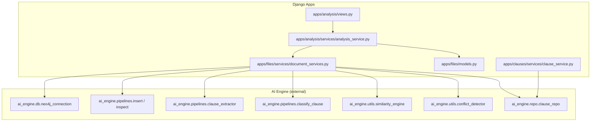
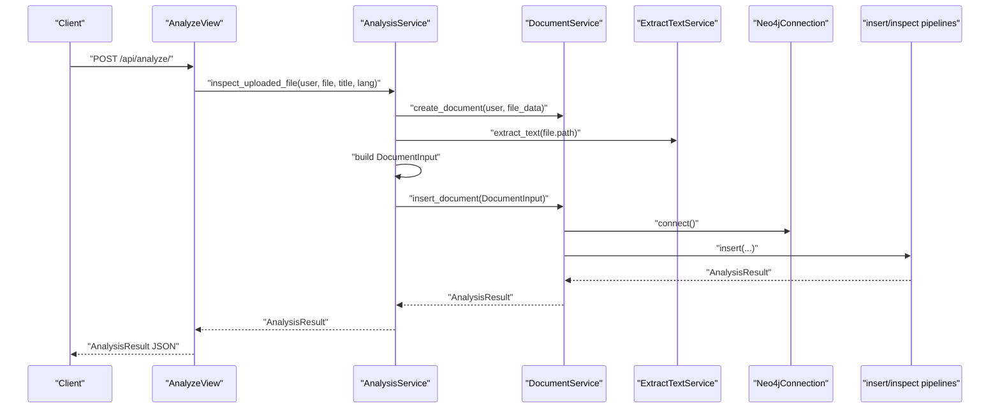
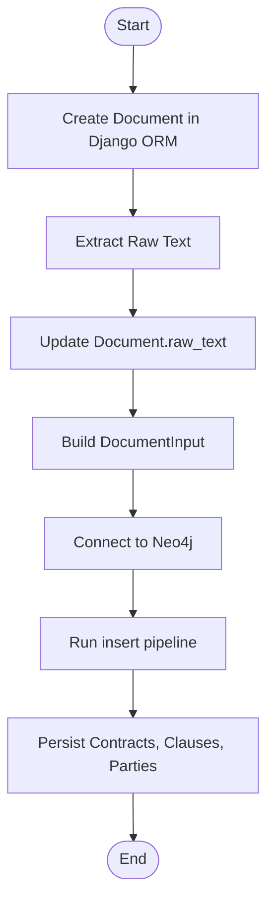
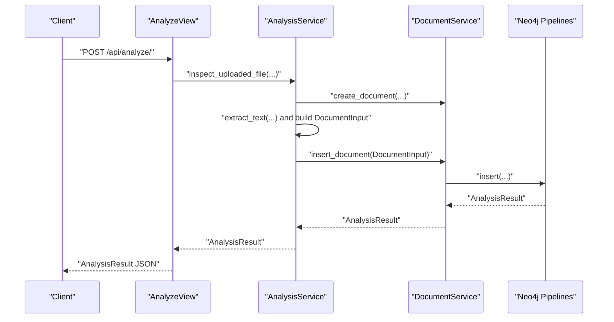
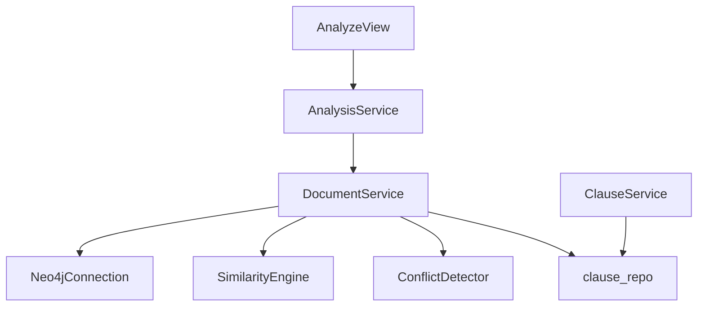
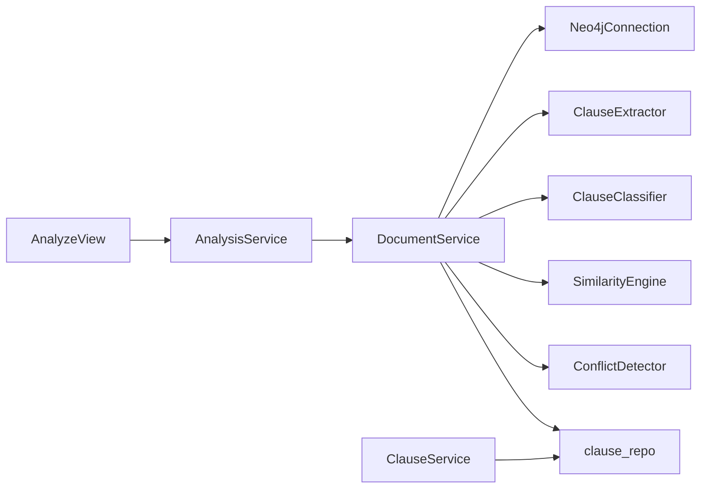

# Knowledge Graph Integration

<cite>
**Referenced Files in This Document**
- [document_services.py](file://apps/files/services/document_services.py)
- [analysis_service.py](file://apps/analysis/services/analysis_service.py)
- [views.py](file://apps/analysis/views.py)
- [urls.py](file://apps/analysis/urls.py)
- [models.py](file://apps/files/models.py)
- [serializers.py](file://apps/analysis/serializers.py)
- [clause_service.py](file://apps/clauses/services/clause_service.py)
</cite>

## Table of Contents
1. [Introduction](#introduction)
2. [Project Structure](#project-structure)
3. [Core Components](#core-components)
4. [Architecture Overview](#architecture-overview)
5. [Detailed Component Analysis](#detailed-component-analysis)
6. [Dependency Analysis](#dependency-analysis)
7. [Performance Considerations](#performance-considerations)
8. [Troubleshooting Guide](#troubleshooting-guide)
9. [Conclusion](#conclusion)

## Introduction
This document describes the Neo4j knowledge graph integration that powers contract analysis and relationship discovery. The system ingests contract documents, extracts and classifies clauses, detects conflicts, identifies similar clauses across documents, and persists the resulting knowledge graph. The Django-based backend orchestrates ingestion, OCR, and analysis, while the Neo4j graph stores contracts, clauses, parties, and their relationships. Administrative endpoints expose inspection and insertion workflows for analysis results.

## Project Structure
The knowledge graph integration spans several Django app modules:
- Analysis workflow orchestration and API endpoints
- Document ingestion and OCR pipeline
- Neo4j connection and graph persistence
- Clause retrieval and analysis services

**Diagram sources**
- [views.py:1-100](file://apps/analysis/views.py#L1-L100)
- [analysis_service.py:1-43](file://apps/analysis/services/analysis_service.py#L1-L43)
- [document_services.py:1-124](file://apps/files/services/document_services.py#L1-L124)
- [models.py:1-18](file://apps/files/models.py#L1-L18)
- [clause_service.py:1-19](file://apps/clauses/services/clause_service.py#L1-L19)

**Section sources**
- [views.py:1-100](file://apps/analysis/views.py#L1-L100)
- [urls.py:1-9](file://apps/analysis/urls.py#L1-L9)
- [analysis_service.py:1-43](file://apps/analysis/services/analysis_service.py#L1-L43)
- [document_services.py:1-124](file://apps/files/services/document_services.py#L1-L124)
- [models.py:1-18](file://apps/files/models.py#L1-L18)
- [clause_service.py:1-19](file://apps/clauses/services/clause_service.py#L1-L19)

## Core Components
- Document ingestion and OCR pipeline: Extracts raw text from uploaded files and updates the Django model.
- Analysis orchestration: Builds a structured input for the AI engine and coordinates extraction, classification, similarity detection, and conflict detection.
- Neo4j integration: Provides a connection and graph pipelines for inserting and inspecting documents in the knowledge graph.
- Clause retrieval service: Exposes detailed clause analysis including conflicts and similar clauses.

Key responsibilities:
- Document ingestion and metadata storage
- Text extraction and preprocessing
- Clause extraction and classification
- Similarity computation and conflict detection
- Graph insertion and inspection
- Retrieval of clause-level insights

**Section sources**
- [analysis_service.py:1-43](file://apps/analysis/services/analysis_service.py#L1-L43)
- [document_services.py:1-124](file://apps/files/services/document_services.py#L1-L124)
- [serializers.py:39-81](file://apps/analysis/serializers.py#L39-L81)
- [clause_service.py:1-19](file://apps/clauses/services/clause_service.py#L1-L19)

## Architecture Overview
The system follows a layered architecture:
- API layer: REST endpoints for analysis and save operations
- Service layer: Orchestration of OCR, AI pipelines, and graph operations
- Data layer: Django ORM-backed document model
- Graph layer: Neo4j for knowledge representation and traversal

**Diagram sources**
- [views.py:15-56](file://apps/analysis/views.py#L15-L56)
- [analysis_service.py:16-43](file://apps/analysis/services/analysis_service.py#L16-L43)
- [document_services.py:22-81](file://apps/files/services/document_services.py#L22-L81)

## Detailed Component Analysis

### Graph Schema Design
The knowledge graph represents contracts, clauses, and their relationships. Based on the analysis result structure, the schema includes:
- Nodes
  - Contract: Represents a document with metadata (title, language, extension)
  - Clause: Represents extracted clause text and classification
  - Party: Represents named entities identified as parties (e.g., buyer/seller)
- Relationships
  - (:Contract)-[:CONTAINS]->(:Clause)
  - (:Clause)-[:CLASSIFIED_AS]->(:Category)
  - (:Contract)-[:INVOLVES]->(:Party)
  - (:Clause)-[:REFERENCES]->(:Clause)
  - (:Clause)-[:SIMILAR_TO]->(:Clause) with similarity score
  - (:Clause)-[:CONFLICTS_WITH]->(:Clause)

Note: The schema is derived from the analysis result dataclass fields and the intended graph semantics. It supports:
- Clause-level classification and categorization
- Cross-document similarity and conflict detection
- Party identification and linkage to contracts

[No sources needed since this section describes a conceptual schema based on result fields]

### Data Synchronization from Django ORM to Neo4j
The synchronization process:
- Create a Document model instance via the DocumentService
- Extract raw text using OCR and update the model
- Build a DocumentInput dataclass with document metadata
- Invoke the insert pipeline to persist the knowledge graph
- Retrieve analysis results for inspection

**Diagram sources**
- [analysis_service.py:19-43](file://apps/analysis/services/analysis_service.py#L19-L43)
- [document_services.py:22-81](file://apps/files/services/document_services.py#L22-L81)
- [models.py:5-17](file://apps/files/models.py#L5-L17)

**Section sources**
- [analysis_service.py:16-43](file://apps/analysis/services/analysis_service.py#L16-L43)
- [document_services.py:14-124](file://apps/files/services/document_services.py#L14-L124)
- [models.py:5-17](file://apps/files/models.py#L5-L17)

### Query Optimization Strategies
- Indexes and constraints on frequently queried identifiers (e.g., document_id, clause_id)
- Relationship directionality: Prefer directional relationships to reduce traversal ambiguity
- Projection minimization: Limit returned fields to only those required by the UI/API
- Batch operations: Group clause insertions and relationship creations
- Caching: Cache similarity embeddings and conflict sets for repeated queries
- Partitioning: Separate large graphs by tenant or date range

[No sources needed since this section provides general guidance]

### Graph Traversal Algorithms for Relationship Discovery
Common traversal patterns:
- Similarity graph traversal: BFS/DFS from a clause to discover similar clauses up to a threshold
- Conflict chain traversal: Traverse CONFLICTS_WITH relationships to identify all conflicting pairs
- Party involvement traversal: From a Contract, traverse INVOLVES to find all parties, then CONTAINS to find related clauses
- Category exploration: From a Clause, traverse CLASSIFIED_AS to find categories and related clauses

[No sources needed since this section provides general guidance]

### Integration with the Analysis Workflow
- The AnalyzeView validates multipart form data and delegates to AnalysisService
- AnalysisService orchestrates OCR and builds DocumentInput
- DocumentService delegates to Neo4j pipelines for insertion and inspection
- Results are serialized and returned to the client

**Diagram sources**
- [views.py:22-56](file://apps/analysis/views.py#L22-L56)
- [analysis_service.py:19-43](file://apps/analysis/services/analysis_service.py#L19-L43)
- [document_services.py:22-81](file://apps/files/services/document_services.py#L22-L81)

**Section sources**
- [views.py:15-100](file://apps/analysis/views.py#L15-L100)
- [analysis_service.py:16-43](file://apps/analysis/services/analysis_service.py#L16-L43)
- [document_services.py:14-124](file://apps/files/services/document_services.py#L14-L124)

### Administrative Tools for Graph Maintenance and Optimization
- Endpoint: POST /api/analyze/ triggers OCR, analysis, and graph insertion
- Endpoint: POST /api/analyze/save/ inserts analysis for an existing document
- Utilities:
  - Neo4jConnection: Centralized connection management
  - SimilarityEngine: Embedding and similarity computation
  - ConflictDetector: Identifies contradictory clauses
  - ClauseRepository: Retrieves clause details and cross-document matches

**Diagram sources**
- [views.py:15-100](file://apps/analysis/views.py#L15-L100)
- [analysis_service.py:1-43](file://apps/analysis/services/analysis_service.py#L1-L43)
- [document_services.py:1-124](file://apps/files/services/document_services.py#L1-L124)
- [clause_service.py:1-19](file://apps/clauses/services/clause_service.py#L1-L19)

**Section sources**
- [views.py:15-100](file://apps/analysis/views.py#L15-L100)
- [urls.py:1-9](file://apps/analysis/urls.py#L1-L9)
- [document_services.py:1-124](file://apps/files/services/document_services.py#L1-L124)
- [clause_service.py:1-19](file://apps/clauses/services/clause_service.py#L1-L19)

## Dependency Analysis
The primary dependencies are:
- Django REST framework for API endpoints
- OCR service for text extraction
- AI engine modules for clause extraction, classification, similarity, and conflict detection
- Neo4j driver for graph operations

**Diagram sources**
- [views.py:1-100](file://apps/analysis/views.py#L1-L100)
- [analysis_service.py:1-43](file://apps/analysis/services/analysis_service.py#L1-L43)
- [document_services.py:1-124](file://apps/files/services/document_services.py#L1-L124)
- [clause_service.py:1-19](file://apps/clauses/services/clause_service.py#L1-L19)

**Section sources**
- [views.py:1-100](file://apps/analysis/views.py#L1-L100)
- [analysis_service.py:1-43](file://apps/analysis/services/analysis_service.py#L1-L43)
- [document_services.py:1-124](file://apps/files/services/document_services.py#L1-L124)
- [clause_service.py:1-19](file://apps/clauses/services/clause_service.py#L1-L19)

## Performance Considerations
- Minimize round-trips to Neo4j by batching clause and relationship creation
- Use indexes on node keys (e.g., document_id, clause_id) to accelerate lookups
- Cache embeddings and precompute similarity matrices for large corpora
- Limit traversal depth for similarity and conflict queries
- Stream large result sets to avoid memory pressure

[No sources needed since this section provides general guidance]

## Troubleshooting Guide
Common issues and resolutions:
- Missing OCR text: Ensure the OCR pipeline runs before graph insertion and that Document.raw_text is populated
- Graph insertion failures: Verify Neo4j connectivity and schema constraints; check for duplicate keys
- Empty analysis results: Confirm that clause extraction and classification pipelines return non-empty results
- Conflict detection anomalies: Review similarity thresholds and conflict heuristics
- API errors: Inspect validation errors from serializers and handle exceptions in views

**Section sources**
- [views.py:22-99](file://apps/analysis/views.py#L22-L99)
- [analysis_service.py:19-43](file://apps/analysis/services/analysis_service.py#L19-L43)
- [document_services.py:22-81](file://apps/files/services/document_services.py#L22-L81)

## Conclusion
The Neo4j knowledge graph integration provides a robust foundation for contract analysis, enabling similarity detection, conflict identification, and semantic relationship discovery. The Django-based orchestration ensures seamless ingestion, OCR, and graph persistence, while the AI engine modules deliver extraction and classification capabilities. Administrative endpoints support both inspection and insertion workflows, and the schema supports efficient traversal and querying of contracts, clauses, and parties.