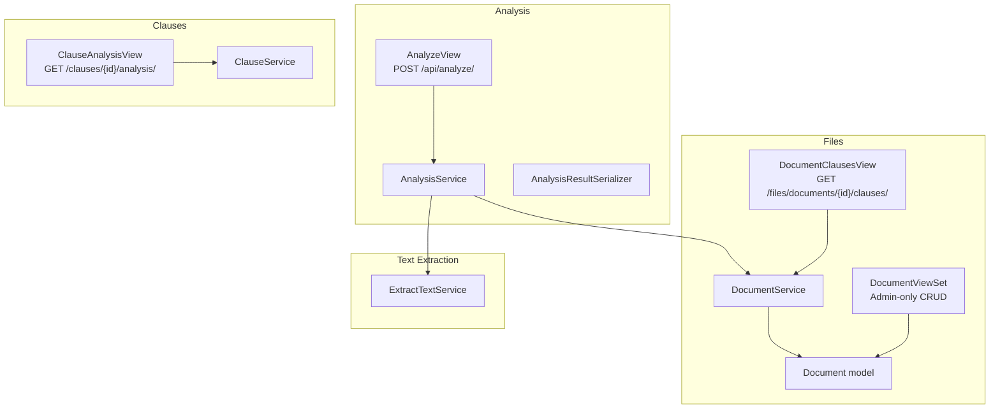
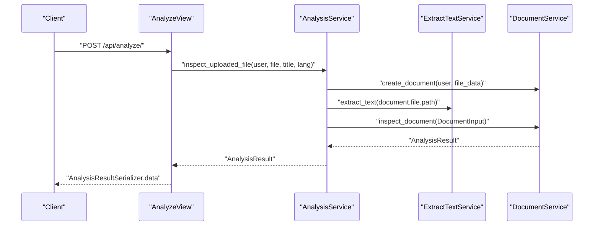
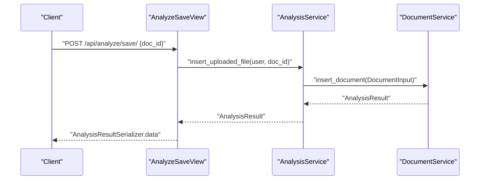
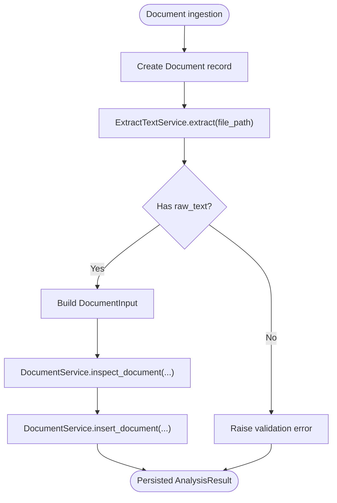
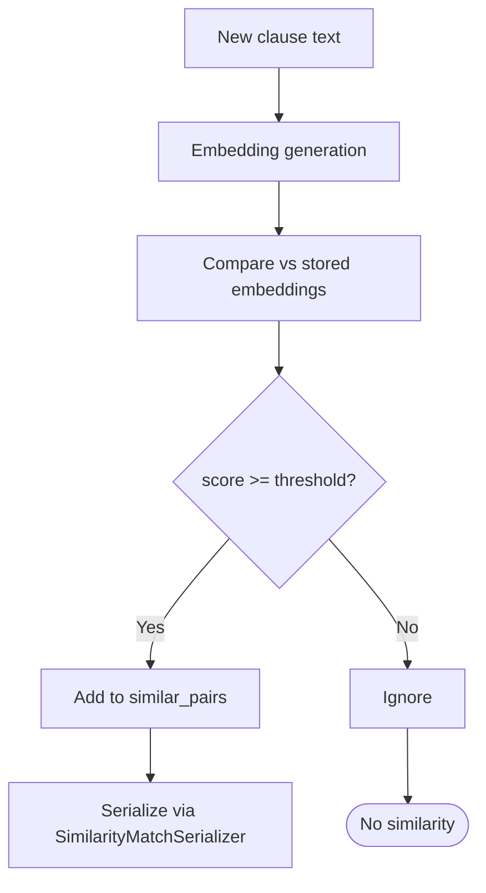
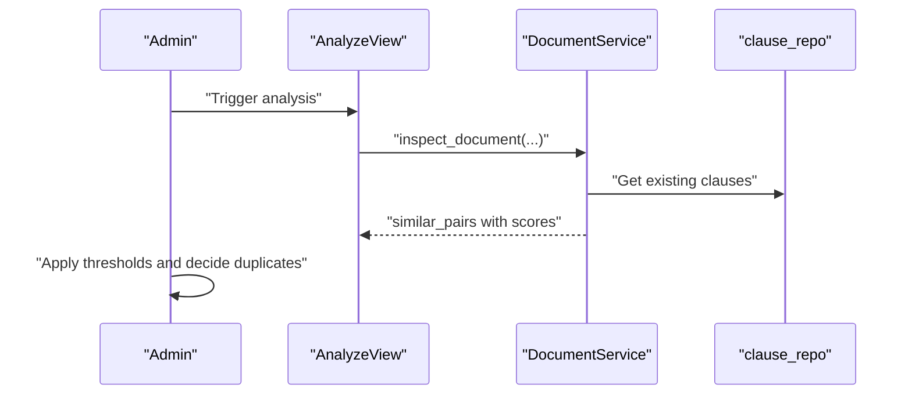
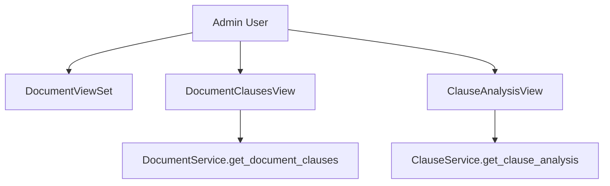
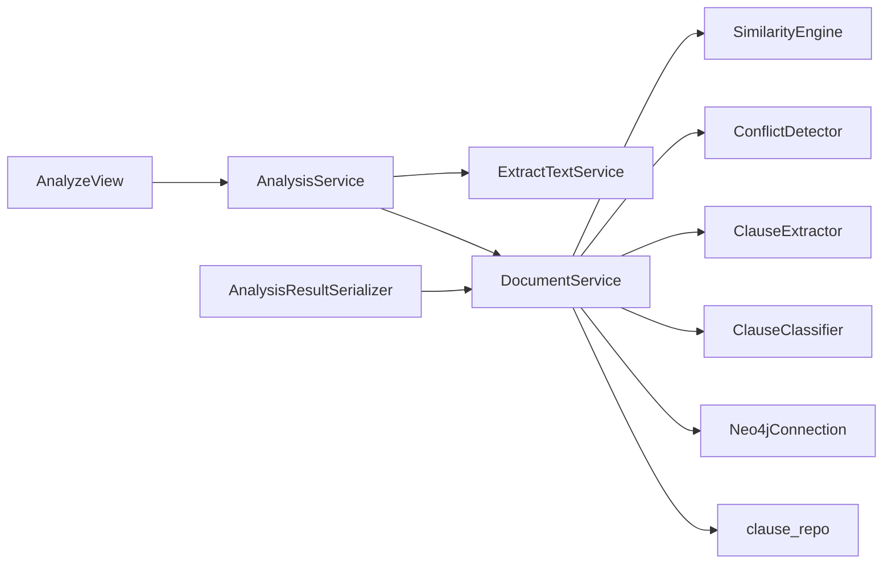

# Similarity Analysis and Matching

<cite>
**Referenced Files in This Document**
- [apps/analysis/views.py](file://apps/analysis/views.py)
- [apps/analysis/urls.py](file://apps/analysis/urls.py)
- [apps/analysis/serializers.py](file://apps/analysis/serializers.py)
- [apps/analysis/services/analysis_service.py](file://apps/analysis/services/analysis_service.py)
- [apps/files/models.py](file://apps/files/models.py)
- [apps/files/services/document_services.py](file://apps/files/services/document_services.py)
- [apps/files/views.py](file://apps/files/views.py)
- [apps/text_extractor_engine/services/extract_text.py](file://apps/text_extractor_engine/services/extract_text.py)
- [apps/clauses/views.py](file://apps/clauses/views.py)
- [apps/clauses/services/clause_service.py](file://apps/clauses/services/clause_service.py)
</cite>

## Table of Contents
1. [Introduction](#introduction)
2. [Project Structure](#project-structure)
3. [Core Components](#core-components)
4. [Architecture Overview](#architecture-overview)
5. [Detailed Component Analysis](#detailed-component-analysis)
6. [Dependency Analysis](#dependency-analysis)
7. [Performance Considerations](#performance-considerations)
8. [Troubleshooting Guide](#troubleshooting-guide)
9. [Conclusion](#conclusion)
10. [Appendices](#appendices)

## Introduction
This document describes the contract similarity analysis system that detects duplicates and similar contractual arrangements by combining OCR text extraction, clause extraction, classification, semantic similarity detection, and conflict analysis. It explains the threshold-based matching pipeline, the integration with the document management system, and the similarity reporting interface. Administrative workflows for managing similar contracts are also covered.

## Project Structure
The system is organized around three primary domains:
- Analysis orchestration: endpoints and serializers for document analysis and saving.
- Document management: models, services, and views for storing and retrieving documents and clauses.
- Text extraction: OCR and PDF-to-image conversion for raw text extraction.

**Diagram sources**
- [apps/analysis/views.py:15-100](file://apps/analysis/views.py#L15-L100)
- [apps/analysis/services/analysis_service.py:16-81](file://apps/analysis/services/analysis_service.py#L16-L81)
- [apps/files/models.py:5-18](file://apps/files/models.py#L5-L18)
- [apps/files/services/document_services.py:14-124](file://apps/files/services/document_services.py#L14-L124)
- [apps/files/views.py:11-35](file://apps/files/views.py#L11-L35)
- [apps/text_extractor_engine/services/extract_text.py:5-28](file://apps/text_extractor_engine/services/extract_text.py#L5-L28)
- [apps/clauses/views.py:9-30](file://apps/clauses/views.py#L9-L30)
- [apps/clauses/services/clause_service.py:4-19](file://apps/clauses/services/clause_service.py#L4-L19)

**Section sources**
- [apps/analysis/views.py:15-100](file://apps/analysis/views.py#L15-L100)
- [apps/analysis/urls.py:1-9](file://apps/analysis/urls.py#L1-L9)
- [apps/files/models.py:5-18](file://apps/files/models.py#L5-L18)
- [apps/files/services/document_services.py:14-124](file://apps/files/services/document_services.py#L14-L124)
- [apps/files/views.py:11-35](file://apps/files/views.py#L11-L35)
- [apps/text_extractor_engine/services/extract_text.py:5-28](file://apps/text_extractor_engine/services/extract_text.py#L5-L28)
- [apps/clauses/views.py:9-30](file://apps/clauses/views.py#L9-L30)
- [apps/clauses/services/clause_service.py:4-19](file://apps/clauses/services/clause_service.py#L4-L19)

## Core Components
- Analysis endpoints:
  - POST /api/analyze/: uploads a file, performs OCR, extracts text, and runs inspection to produce clause, similarity, and conflict results.
  - POST /api/analyze/save/: inserts previously inspected document into the knowledge graph.
- Document management:
  - Document model stores metadata, OCR text, and confidence.
  - DocumentService orchestrates clause extraction, classification, similarity detection, conflict detection, and database insertion/inspection.
  - DocumentViewSet and DocumentClausesView support admin and authenticated access to documents and clauses.
- Text extraction:
  - ExtractTextService converts PDFs to images and applies OCR; supports direct OCR for images.
- Clauses:
  - ClauseAnalysisView and ClauseService expose clause-level analysis including similar pairs and conflicts.

Key result structures:
- AnalysisResultSerializer aggregates document_id, doc_type, clauses, similar_pairs, and conflicts.
- SimilarityMatchSerializer and ConflictSerializer define the shape of similarity and conflict entries with scores.

**Section sources**
- [apps/analysis/views.py:15-100](file://apps/analysis/views.py#L15-L100)
- [apps/analysis/serializers.py:8-70](file://apps/analysis/serializers.py#L8-L70)
- [apps/files/models.py:5-18](file://apps/files/models.py#L5-L18)
- [apps/files/services/document_services.py:14-124](file://apps/files/services/document_services.py#L14-L124)
- [apps/text_extractor_engine/services/extract_text.py:5-28](file://apps/text_extractor_engine/services/extract_text.py#L5-L28)
- [apps/clauses/views.py:9-30](file://apps/clauses/views.py#L9-L30)
- [apps/clauses/services/clause_service.py:4-19](file://apps/clauses/services/clause_service.py#L4-L19)

## Architecture Overview
The system follows a layered architecture:
- Presentation layer: DRF views for analysis and document management.
- Application layer: Services encapsulate AI/ML pipelines and database operations.
- Data layer: Django ORM model for documents and Neo4j-backed repositories for clauses and analysis results.

**Diagram sources**
- [apps/analysis/views.py:22-56](file://apps/analysis/views.py#L22-L56)
- [apps/analysis/services/analysis_service.py:18-50](file://apps/analysis/services/analysis_service.py#L18-L50)
- [apps/text_extractor_engine/services/extract_text.py:10-27](file://apps/text_extractor_engine/services/extract_text.py#L10-L27)
- [apps/files/services/document_services.py:46-62](file://apps/files/services/document_services.py#L46-L62)

## Detailed Component Analysis

### Analysis Orchestration
- AnalyzeView validates multipart/form-data, delegates OCR and inspection to AnalysisService, and serializes the result.
- AnalyzeSaveView validates a doc_id, ensures raw_text exists, and triggers insertion via AnalysisService.

**Diagram sources**
- [apps/analysis/views.py:59-100](file://apps/analysis/views.py#L59-L100)
- [apps/analysis/services/analysis_service.py:52-81](file://apps/analysis/services/analysis_service.py#L52-L81)
- [apps/files/services/document_services.py:22-44](file://apps/files/services/document_services.py#L22-L44)

**Section sources**
- [apps/analysis/views.py:15-100](file://apps/analysis/views.py#L15-L100)
- [apps/analysis/urls.py:1-9](file://apps/analysis/urls.py#L1-L9)
- [apps/analysis/serializers.py:53-70](file://apps/analysis/serializers.py#L53-L70)

### Document Management and OCR Pipeline
- Document model holds file metadata, OCR text, language, and timestamps.
- ExtractTextService routes PDFs to image conversion then OCR; other formats go directly to OCR.
- DocumentService composes:
  - ClauseExtractor and ClauseClassifier for clause discovery and categorization.
  - SimilarityEngine for semantic similarity detection.
  - ConflictDetector for logical contradictions.
  - Neo4jConnection for persistence and retrieval.

**Diagram sources**
- [apps/analysis/services/analysis_service.py:18-50](file://apps/analysis/services/analysis_service.py#L18-L50)
- [apps/text_extractor_engine/services/extract_text.py:10-27](file://apps/text_extractor_engine/services/extract_text.py#L10-L27)
- [apps/files/models.py:5-18](file://apps/files/models.py#L5-L18)
- [apps/files/services/document_services.py:14-62](file://apps/files/services/document_services.py#L14-L62)

**Section sources**
- [apps/files/models.py:5-18](file://apps/files/models.py#L5-L18)
- [apps/text_extractor_engine/services/extract_text.py:5-28](file://apps/text_extractor_engine/services/extract_text.py#L5-L28)
- [apps/files/services/document_services.py:14-62](file://apps/files/services/document_services.py#L14-L62)

### Similarity Detection and Threshold-Based Matching
- SimilarityEngine is integrated into DocumentService to compute semantic similarity between newly extracted clauses and existing ones.
- SimilarityMatchSerializer defines the output shape with a numeric score in [0.0, 1.0], enabling threshold-based filtering at the presentation layer.
- Typical workflow:
  - Extract clauses from the new document.
  - Compute embeddings/similarity against stored clauses.
  - Filter pairs by a configurable threshold (e.g., score >= 0.8).
  - Emit similar_pairs in AnalysisResult.

**Diagram sources**
- [apps/files/services/document_services.py:14-21](file://apps/files/services/document_services.py#L14-L21)
- [apps/analysis/serializers.py:19-31](file://apps/analysis/serializers.py#L19-L31)

**Section sources**
- [apps/files/services/document_services.py:14-21](file://apps/files/services/document_services.py#L14-L21)
- [apps/analysis/serializers.py:19-31](file://apps/analysis/serializers.py#L19-L31)

### Duplicate Detection Workflow
- Duplicates are primarily identified by high semantic similarity between clauses across documents.
- Optional structural checks can be applied alongside similarity (e.g., clause type alignment, temporal proximity) depending on SimilarityEngine’s configuration.
- Administrative actions:
  - Review similar_pairs in the AnalysisResult.
  - Merge or flag duplicates for manual review.
  - Use DocumentViewSet to manage documents and DocumentClausesView to inspect clause sets.

**Diagram sources**
- [apps/analysis/views.py:22-56](file://apps/analysis/views.py#L22-L56)
- [apps/files/services/document_services.py:46-62](file://apps/files/services/document_services.py#L46-L62)
- [apps/clauses/services/clause_service.py:6-19](file://apps/clauses/services/clause_service.py#L6-L19)

**Section sources**
- [apps/analysis/views.py:22-56](file://apps/analysis/views.py#L22-L56)
- [apps/files/services/document_services.py:46-62](file://apps/files/services/document_services.py#L46-L62)
- [apps/clauses/services/clause_service.py:6-19](file://apps/clauses/services/clause_service.py#L6-L19)

### Administrative Workflows for Managing Similar Contracts
- Admin access:
  - DocumentViewSet is admin-only and supports CRUD operations on documents.
  - DocumentClausesView retrieves clauses for a given document for review.
  - ClauseAnalysisView fetches clause-level details including similar clauses and conflicts.
- Operational steps:
  - Upload a contract via analysis endpoints.
  - Review AnalysisResult similar_pairs and conflicts.
  - Use DocumentViewSet to update metadata or remove duplicates.
  - Use DocumentClausesView and ClauseAnalysisView to drill down into clause-level insights.

**Diagram sources**
- [apps/files/views.py:11-35](file://apps/files/views.py#L11-L35)
- [apps/clauses/views.py:9-30](file://apps/clauses/views.py#L9-L30)
- [apps/clauses/services/clause_service.py:6-19](file://apps/clauses/services/clause_service.py#L6-L19)
- [apps/files/services/document_services.py:112-122](file://apps/files/services/document_services.py#L112-L122)

**Section sources**
- [apps/files/views.py:11-35](file://apps/files/views.py#L11-L35)
- [apps/clauses/views.py:9-30](file://apps/clauses/views.py#L9-L30)
- [apps/clauses/services/clause_service.py:6-19](file://apps/clauses/services/clause_service.py#L6-L19)

## Dependency Analysis
- Analysis endpoints depend on AnalysisService for orchestration and on DocumentService for AI/ML pipelines.
- AnalysisService depends on ExtractTextService for OCR and on DocumentService for inspection/insertion.
- DocumentService depends on SimilarityEngine, ConflictDetector, ClauseExtractor, ClauseClassifier, and Neo4jConnection.
- Serializers define the canonical output shapes for clients.

**Diagram sources**
- [apps/analysis/views.py:15-100](file://apps/analysis/views.py#L15-L100)
- [apps/analysis/services/analysis_service.py:16-81](file://apps/analysis/services/analysis_service.py#L16-L81)
- [apps/files/services/document_services.py:14-21](file://apps/files/services/document_services.py#L14-L21)
- [apps/analysis/serializers.py:53-70](file://apps/analysis/serializers.py#L53-L70)

**Section sources**
- [apps/analysis/services/analysis_service.py:16-81](file://apps/analysis/services/analysis_service.py#L16-L81)
- [apps/files/services/document_services.py:14-21](file://apps/files/services/document_services.py#L14-L21)

## Performance Considerations
- OCR preprocessing:
  - PDFs are converted to images before OCR; batch image processing can be optimized for throughput.
- Embedding computation:
  - Use efficient vector indexing and caching for SimilarityEngine to reduce latency on repeated queries.
- Database writes:
  - Batch clause insertions and use transactional boundaries to minimize round-trips.
- API serialization:
  - Keep serializers lean; avoid nested serialization for large clause sets unless needed.

## Troubleshooting Guide
- Missing OCR text:
  - Ensure the file is a supported type and that ExtractTextService receives a valid path.
- Analysis failures:
  - Check for exceptions raised during inspection or insertion; the views return structured error messages.
- Document not found:
  - Verify doc_id exists and raw_text is populated before calling the save endpoint.

Common error scenarios and handling:
- No file provided or unsupported type: handled by input serializers and views.
- Business logic errors (e.g., missing raw_text): surfaced as ValueError and returned with appropriate HTTP status.
- General server errors: caught and reported with a standardized error payload.

**Section sources**
- [apps/analysis/views.py:28-56](file://apps/analysis/views.py#L28-L56)
- [apps/analysis/views.py:72-100](file://apps/analysis/views.py#L72-L100)
- [apps/analysis/services/analysis_service.py:62-65](file://apps/analysis/services/analysis_service.py#L62-L65)

## Conclusion
The system integrates OCR, clause extraction, semantic similarity detection, and conflict analysis into a cohesive workflow. Administrators can upload contracts, review similarity and conflict results, and manage documents and clauses through dedicated endpoints. Threshold-based matching enables scalable duplicate detection and similar arrangement identification.

## Appendices

### Example Outputs and Scoring
- SimilarityMatch entries include identifiers for new and existing clauses, the existing document title, and a score in [0.0, 1.0].
- Conflict entries extend similarity matches with a reason field for detected contradictions.
- AnalysisResult includes document_id, doc_type, clauses, similar_pairs, and conflicts.

**Section sources**
- [apps/analysis/serializers.py:19-46](file://apps/analysis/serializers.py#L19-L46)
- [apps/analysis/serializers.py:53-70](file://apps/analysis/serializers.py#L53-L70)