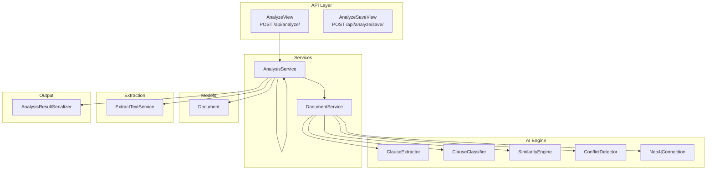
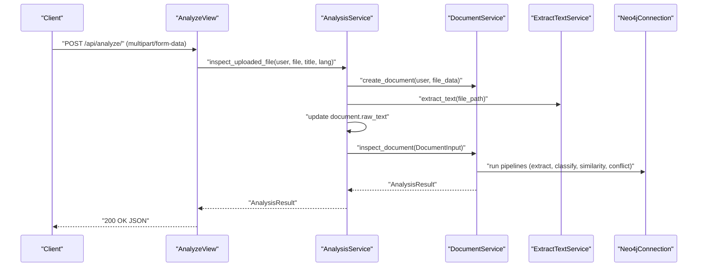
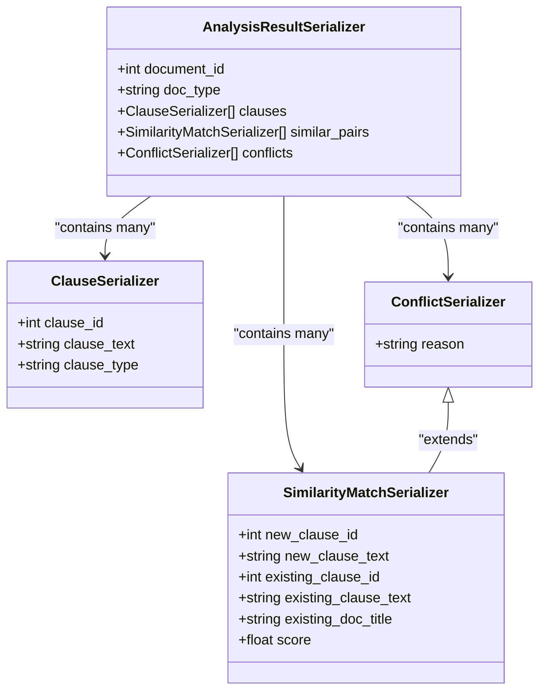
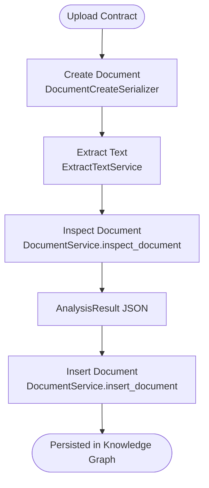
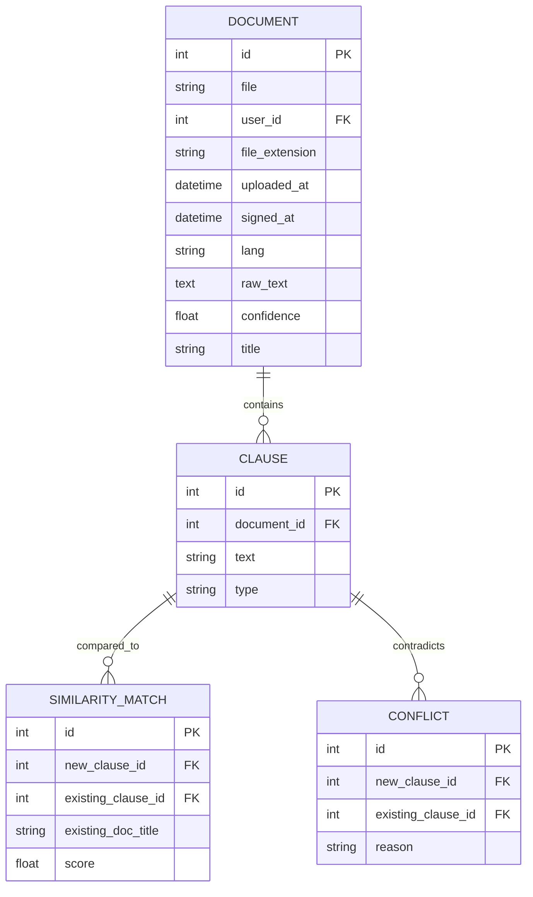
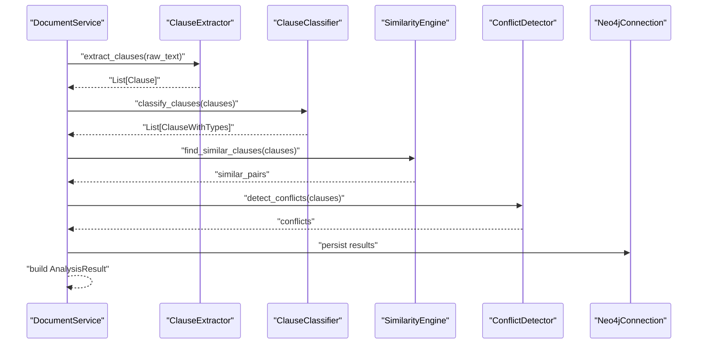
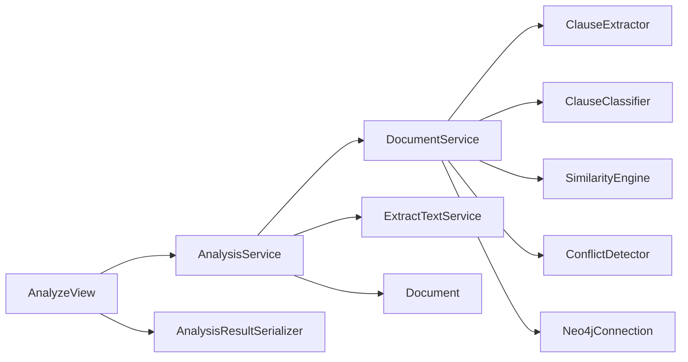

# Analysis Results & Contracts

<cite>
**Referenced Files in This Document**
- [apps/analysis/models.py](file://apps/analysis/models.py)
- [apps/analysis/serializers.py](file://apps/analysis/serializers.py)
- [apps/analysis/views.py](file://apps/analysis/views.py)
- [apps/analysis/services/analysis_service.py](file://apps/analysis/services/analysis_service.py)
- [apps/analysis/urls.py](file://apps/analysis/urls.py)
- [apps/files/models.py](file://apps/files/models.py)
- [apps/files/serializers.py](file://apps/files/serializers.py)
- [apps/files/services/document_services.py](file://apps/files/services/document_services.py)
- [apps/files/urls.py](file://apps/files/urls.py)
- [apps/text_extractor_engine/services/extract_text.py](file://apps/text_extractor_engine/services/extract_text.py)
- [apps/clauses/services/clause_service.py](file://apps/clauses/services/clause_service.py)
- [apps/clauses/urls.py](file://apps/clauses/urls.py)
</cite>

## Table of Contents
1. [Introduction](#introduction)
2. [Project Structure](#project-structure)
3. [Core Components](#core-components)
4. [Architecture Overview](#architecture-overview)
5. [Detailed Component Analysis](#detailed-component-analysis)
6. [Dependency Analysis](#dependency-analysis)
7. [Performance Considerations](#performance-considerations)
8. [Troubleshooting Guide](#troubleshooting-guide)
9. [Conclusion](#conclusion)

## Introduction
This document describes the data models and workflows for contract analysis results and related contract data structures. It focuses on:
- The AnalysisResult payload and nested data structures (clauses, similarity matches, conflicts)
- The contract document model and its lifecycle
- The relationships between documents and analysis results
- Data validation and quality assurance mechanisms
- Example workflows for creating analysis results, extracting clauses, and detecting conflicts

## Project Structure
The analysis pipeline spans several modules:
- Analysis API and serializers define the output schema for analysis results
- Files module defines the Document model and related serializers
- Services orchestrate OCR, inspection, and insertion of documents into the knowledge graph
- Text extraction engine handles OCR and PDF conversion
- Clauses module provides retrieval of clause-level analysis details

**Diagram sources**
- [apps/analysis/views.py:15-100](file://apps/analysis/views.py#L15-L100)
- [apps/analysis/services/analysis_service.py:16-81](file://apps/analysis/services/analysis_service.py#L16-L81)
- [apps/files/services/document_services.py:14-62](file://apps/files/services/document_services.py#L14-L62)
- [apps/files/models.py:5-17](file://apps/files/models.py#L5-L17)
- [apps/text_extractor_engine/services/extract_text.py:5-28](file://apps/text_extractor_engine/services/extract_text.py#L5-L28)
- [apps/analysis/serializers.py:53-70](file://apps/analysis/serializers.py#L53-L70)

**Section sources**
- [apps/analysis/urls.py:1-9](file://apps/analysis/urls.py#L1-L9)
- [apps/files/urls.py:1-29](file://apps/files/urls.py#L1-L29)
- [apps/clauses/urls.py:1-12](file://apps/clauses/urls.py#L1-L12)

## Core Components
This section documents the primary data structures used in analysis results and contracts.

- AnalysisResult payload
  - document_id: integer identifier of the analyzed document
  - doc_type: string indicating the document type
  - clauses: array of extracted clauses
  - similar_pairs: array of semantic similarity matches against existing clauses
  - conflicts: array of detected logical contradictions

- Clause structure
  - clause_id: integer identifier
  - clause_text: string content
  - clause_type: string category/classification

- SimilarityMatch structure
  - new_clause_id: integer identifier of the new clause
  - new_clause_text: string content
  - existing_clause_id: integer identifier of the matched existing clause
  - existing_clause_text: string content
  - existing_doc_title: string title of the document containing the existing clause
  - score: float similarity score in range [0.0, 1.0]

- Conflict structure
  - Inherits all fields from SimilarityMatch
  - reason: string explanation of the detected logical contradiction

- Document model
  - file: file path
  - user: foreign key to the authenticated user
  - file_extension: string extension
  - uploaded_at: timestamp
  - signed_at: optional timestamp
  - lang: language code
  - raw_text: extracted text content
  - confidence: float confidence score
  - title: optional title

Validation and constraints
- Similarity score constrained to [0.0, 1.0]
- File type validation for uploads supports pdf, jpg, png, jpeg
- Required fields enforced by serializers for analysis input

**Section sources**
- [apps/analysis/serializers.py:8-46](file://apps/analysis/serializers.py#L8-L46)
- [apps/analysis/serializers.py:53-70](file://apps/analysis/serializers.py#L53-L70)
- [apps/files/serializers.py:48-52](file://apps/files/serializers.py#L48-L52)
- [apps/files/models.py:5-17](file://apps/files/models.py#L5-L17)

## Architecture Overview
The analysis workflow integrates file upload, OCR extraction, AI-powered clause extraction and classification, similarity matching, conflict detection, and result serialization.

**Diagram sources**
- [apps/analysis/views.py:22-56](file://apps/analysis/views.py#L22-L56)
- [apps/analysis/services/analysis_service.py:19-50](file://apps/analysis/services/analysis_service.py#L19-L50)
- [apps/files/services/document_services.py:46-62](file://apps/files/services/document_services.py#L46-L62)
- [apps/text_extractor_engine/services/extract_text.py:10-27](file://apps/text_extractor_engine/services/extract_text.py#L10-L27)

## Detailed Component Analysis

### AnalysisResult and Nested Structures
The AnalysisResultSerializer composes three nested structures:
- ClauseSerializer: captures extracted clause metadata
- SimilarityMatchSerializer: captures semantic matches with existing clauses and similarity scores
- ConflictSerializer: extends SimilarityMatch with a reason field for detected contradictions

**Diagram sources**
- [apps/analysis/serializers.py:8-46](file://apps/analysis/serializers.py#L8-L46)
- [apps/analysis/serializers.py:53-70](file://apps/analysis/serializers.py#L53-L70)

**Section sources**
- [apps/analysis/serializers.py:8-46](file://apps/analysis/serializers.py#L8-L46)
- [apps/analysis/serializers.py:53-70](file://apps/analysis/serializers.py#L53-L70)

### Document Model and Lifecycle
The Document model stores uploaded contracts and auxiliary metadata. Validation ensures supported file types. The lifecycle includes:
- Creation via DocumentCreateSerializer
- OCR text extraction via ExtractTextService
- Optional saving of raw_text prior to insertion
- Retrieval of clause-level analysis via clause_repo

**Diagram sources**
- [apps/files/serializers.py:32-61](file://apps/files/serializers.py#L32-L61)
- [apps/text_extractor_engine/services/extract_text.py:10-27](file://apps/text_extractor_engine/services/extract_text.py#L10-L27)
- [apps/files/services/document_services.py:46-62](file://apps/files/services/document_services.py#L46-L62)
- [apps/analysis/services/analysis_service.py:19-50](file://apps/analysis/services/analysis_service.py#L19-L50)

**Section sources**
- [apps/files/models.py:5-17](file://apps/files/models.py#L5-L17)
- [apps/files/serializers.py:48-52](file://apps/files/serializers.py#L48-L52)
- [apps/files/services/document_services.py:83-110](file://apps/files/services/document_services.py#L83-L110)
- [apps/text_extractor_engine/services/extract_text.py:10-27](file://apps/text_extractor_engine/services/extract_text.py#L10-L27)

### Relationship Between Documents and Analysis Results
- One-to-many association: a Document can produce many AnalysisResult entries over time (e.g., re-inspections, updates)
- AnalysisResult references a specific Document via document_id
- Clause-level details can be retrieved independently via clause_id

**Diagram sources**
- [apps/files/models.py:5-17](file://apps/files/models.py#L5-L17)
- [apps/analysis/serializers.py:8-46](file://apps/analysis/serializers.py#L8-L46)

**Section sources**
- [apps/files/models.py:5-17](file://apps/files/models.py#L5-L17)
- [apps/analysis/serializers.py:8-46](file://apps/analysis/serializers.py#L8-L46)

### Clause Extraction Workflow
The clause extraction pipeline uses:
- ClauseExtractor to identify clause boundaries
- ClauseClassifier to categorize clauses
- SimilarityEngine to compute semantic similarity against existing clauses
- ConflictDetector to identify logical contradictions
- Neo4jConnection to persist and query results

**Diagram sources**
- [apps/files/services/document_services.py:14-62](file://apps/files/services/document_services.py#L14-L62)

**Section sources**
- [apps/files/services/document_services.py:14-62](file://apps/files/services/document_services.py#L14-L62)

### Conflict Detection Data Storage
Conflicts are represented as specialized SimilarityMatch entries with an additional reason field. They capture:
- New clause identity and text
- Existing clause identity and text
- Title of the document containing the existing clause
- Similarity score
- Reason for the detected conflict

Storage and retrieval:
- Stored as part of the AnalysisResult payload
- Retrieved per clause via clause_id using clause_repo

**Section sources**
- [apps/analysis/serializers.py:33-46](file://apps/analysis/serializers.py#L33-L46)
- [apps/clauses/services/clause_service.py:6-19](file://apps/clauses/services/clause_service.py#L6-L19)

### Examples

- Creating an analysis result
  - Upload a contract via POST /api/analyze/ with multipart/form-data
  - The view validates input, calls AnalysisService.inspect_uploaded_file
  - The service orchestrates OCR, creates Document, and runs DocumentService.inspect_document
  - The result is serialized by AnalysisResultSerializer and returned

- Clause extraction workflow
  - DocumentService.inspect_document invokes extractor and classifier
  - SimilarityEngine computes similarity scores
  - ConflictDetector identifies contradictions
  - Results are persisted and returned as AnalysisResult

- Saving/inserting analysis for an existing document
  - POST /api/analyze/save/ with JSON { "doc_id": <id> }
  - AnalysisService.insert_uploaded_file ensures raw_text exists
  - DocumentService.insert_document persists the document into the knowledge graph

**Section sources**
- [apps/analysis/views.py:22-56](file://apps/analysis/views.py#L22-L56)
- [apps/analysis/views.py:66-99](file://apps/analysis/views.py#L66-L99)
- [apps/analysis/services/analysis_service.py:19-50](file://apps/analysis/services/analysis_service.py#L19-L50)
- [apps/analysis/services/analysis_service.py:53-80](file://apps/analysis/services/analysis_service.py#L53-L80)
- [apps/files/services/document_services.py:46-62](file://apps/files/services/document_services.py#L46-L62)

## Dependency Analysis
Key dependencies and their roles:
- Analysis API depends on serializers to validate and serialize results
- AnalysisService depends on DocumentService, ExtractTextService, and Document model
- DocumentService depends on AI engine components (extractor, classifier, similarity engine, conflict detector) and Neo4jConnection
- OCR pipeline depends on OCRService and PDFService

**Diagram sources**
- [apps/analysis/views.py:15-100](file://apps/analysis/views.py#L15-L100)
- [apps/analysis/services/analysis_service.py:16-81](file://apps/analysis/services/analysis_service.py#L16-L81)
- [apps/files/services/document_services.py:14-62](file://apps/files/services/document_services.py#L14-L62)
- [apps/text_extractor_engine/services/extract_text.py:5-28](file://apps/text_extractor_engine/services/extract_text.py#L5-L28)
- [apps/analysis/serializers.py:53-70](file://apps/analysis/serializers.py#L53-L70)
- [apps/files/models.py:5-17](file://apps/files/models.py#L5-L17)

**Section sources**
- [apps/analysis/services/analysis_service.py:16-81](file://apps/analysis/services/analysis_service.py#L16-L81)
- [apps/files/services/document_services.py:14-62](file://apps/files/services/document_services.py#L14-L62)

## Performance Considerations
- OCR preprocessing: PDFs are converted to images before OCR; batch processing and caching of intermediate images can reduce latency
- Similarity scoring: Ensure embeddings are computed efficiently; consider batching queries to SimilarityEngine
- Conflict detection: Limit search space by pre-filtering candidate clauses using metadata or categories
- Serialization overhead: Keep AnalysisResultSerializer minimal and avoid redundant computations during serialization

## Troubleshooting Guide
Common issues and resolutions:
- Missing raw_text before insertion
  - Symptom: ValueError raised when attempting to insert a document without extracted text
  - Resolution: Ensure OCR extraction completes and raw_text is saved before calling insert

- Unsupported file type
  - Symptom: ValidationError on upload
  - Resolution: Verify file extension is among supported types

- Document not found
  - Symptom: 404 response when saving analysis for a non-existent document
  - Resolution: Confirm doc_id exists and belongs to the requesting user

- General analysis failure
  - Symptom: 500 response with error details
  - Resolution: Check AI engine pipeline logs and database connectivity

**Section sources**
- [apps/analysis/services/analysis_service.py:62-66](file://apps/analysis/services/analysis_service.py#L62-L66)
- [apps/files/serializers.py:48-52](file://apps/files/serializers.py#L48-L52)
- [apps/analysis/views.py:88-99](file://apps/analysis/views.py#L88-L99)

## Conclusion
The analysis system provides a structured approach to contract analysis with clear separation of concerns:
- Documents are stored with robust validation and OCR preprocessing
- Analysis results encapsulate extracted clauses, similarity matches, and conflicts
- Quality assurance is ensured through serializers, validators, and explicit checks
- The modular design enables extensibility for additional clause types, similarity metrics, and conflict rules