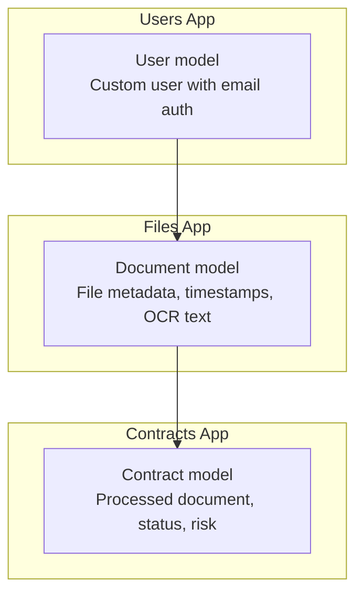
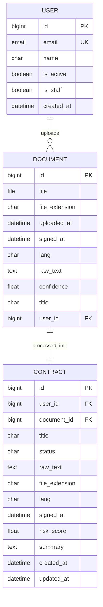
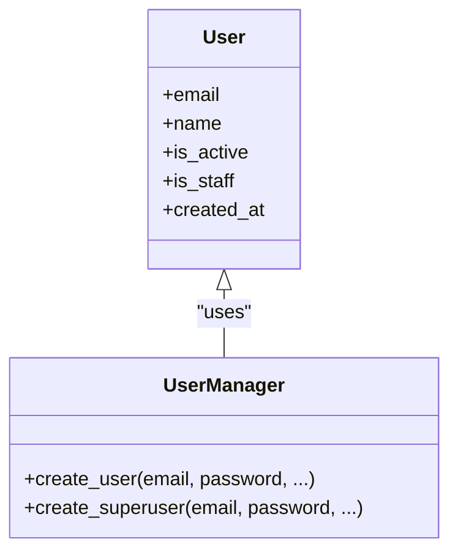
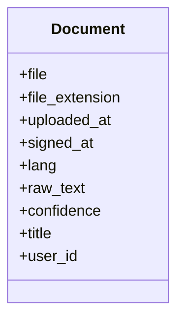
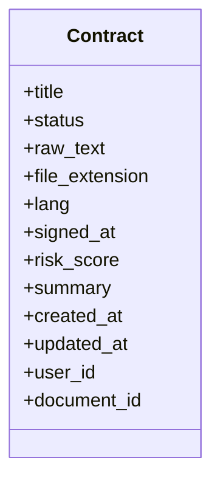
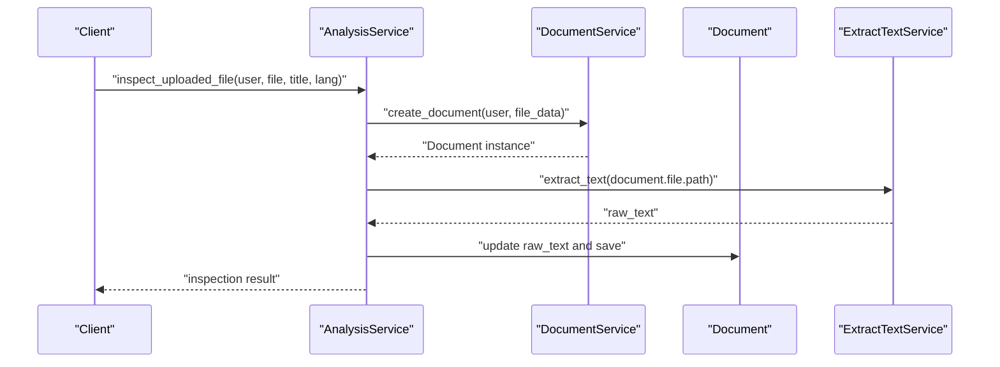
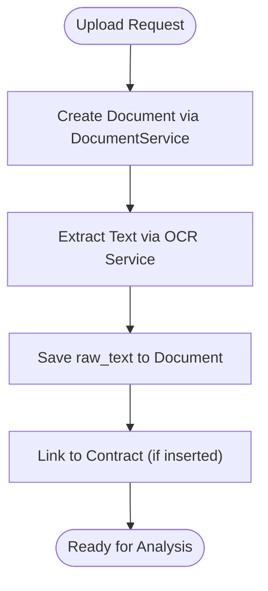
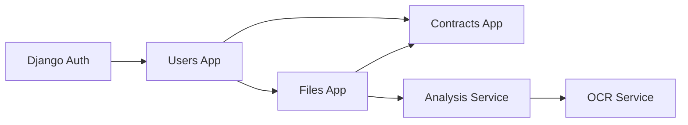

# Data Models & Database Schema

<cite>
**Referenced Files in This Document**
- [apps/users/models.py](file://apps/users/models.py)
- [apps/users/migrations/0001_initial.py](file://apps/users/migrations/0001_initial.py)
- [apps/files/models.py](file://apps/files/models.py)
- [apps/files/migrations/0001_initial.py](file://apps/files/migrations/0001_initial.py)
- [apps/files/migrations/0002_initial.py](file://apps/files/migrations/0002_initial.py)
- [backupApps/contracts/models.py](file://backupApps/contracts/models.py)
- [apps/analysis/services/analysis_service.py](file://apps/analysis/services/analysis_service.py)
</cite>

## Table of Contents
1. [Introduction](#introduction)
2. [Project Structure](#project-structure)
3. [Core Components](#core-components)
4. [Architecture Overview](#architecture-overview)
5. [Detailed Component Analysis](#detailed-component-analysis)
6. [Dependency Analysis](#dependency-analysis)
7. [Performance Considerations](#performance-considerations)
8. [Troubleshooting Guide](#troubleshooting-guide)
9. [Conclusion](#conclusion)

## Introduction
This document describes the VeritasShield database schema and data models. It focuses on:
- User model with email-based authentication, profile fields, and permissions
- Document model for contract files, metadata, timestamps, and user relationships
- Contract model representing processed documents and analysis outcomes
- Database relationships, constraints, indexing strategies, and schema evolution via migrations
- Validation rules, business constraints, and referential integrity enforcement

## Project Structure
The schema spans three primary apps:
- Users app defines the custom User model and authentication
- Files app stores uploaded contract documents and their metadata
- Contracts app (in backupApps) represents processed contracts and analysis outcomes

**Diagram sources**
- [apps/users/models.py:29-46](file://apps/users/models.py#L29-L46)
- [apps/files/models.py:5-18](file://apps/files/models.py#L5-L18)
- [backupApps/contracts/models.py:5-33](file://backupApps/contracts/models.py#L5-L33)

**Section sources**
- [apps/users/models.py:1-46](file://apps/users/models.py#L1-L46)
- [apps/files/models.py:1-18](file://apps/files/models.py#L1-L18)
- [backupApps/contracts/models.py:1-33](file://backupApps/contracts/models.py#L1-L33)

## Core Components

### User Model
- Purpose: Email-based authentication with staff/superuser permissions and activity flags
- Key fields:
  - email: unique, used as the login identifier
  - name: optional display name
  - is_active, is_staff: boolean flags controlling account and staff status
  - created_at: auto timestamp for record creation
- Authentication:
  - USERNAME_FIELD set to email
  - REQUIRED_FIELDS empty (no additional required fields)
  - UserManager enforces email presence and password hashing during creation
- Permissions:
  - Inherits PermissionsMixin for granular permission assignment
  - is_superuser flag grants all permissions implicitly

Validation and constraints:
- Email uniqueness enforced at the database level
- Password hashing handled by the custom manager
- Boolean flags ensure consistent access control semantics

**Section sources**
- [apps/users/models.py:9-26](file://apps/users/models.py#L9-L26)
- [apps/users/models.py:29-46](file://apps/users/models.py#L29-L46)
- [apps/users/migrations/0001_initial.py:15-34](file://apps/users/migrations/0001_initial.py#L15-L34)

### Document Model
- Purpose: Store uploaded contract files and associated metadata
- Key fields:
  - file: FileField pointing to contracts/ storage
  - user: ForeignKey to User (on_delete=CASCADE)
  - file_extension: string indicating file type
  - uploaded_at: timestamp of upload
  - signed_at: optional signing date
  - lang: language code with default "en"
  - raw_text: extracted text from OCR
  - confidence: OCR quality score
  - title: optional document title
- Relationships:
  - One-to-many with User (documents belong to one user)
  - One-to-one with Contract via reverse relation (Contract.document)

Constraints and defaults:
- CASCADE deletion ensures documents are removed when a user is deleted
- Defaults for lang and confidence improve consistency
- Optional fields support partial metadata availability

**Section sources**
- [apps/files/models.py:5-18](file://apps/files/models.py#L5-L18)
- [apps/files/migrations/0001_initial.py:14-28](file://apps/files/migrations/0001_initial.py#L14-L28)
- [apps/files/migrations/0002_initial.py:18-23](file://apps/files/migrations/0002_initial.py#L18-L23)

### Contract Model
- Purpose: Represent processed contracts with lifecycle status and analysis results
- Key fields:
  - user: ForeignKey to User with related_name for reverse queries
  - document: ForeignKey to Document with related_name for reverse queries
  - title: document title
  - status: choice field with lifecycle states
  - raw_text: full extracted text
  - file_extension, lang, signed_at: metadata mirroring Document
  - risk_score: numeric risk assessment
  - summary: optional summary of findings
  - created_at, updated_at: timestamps for lifecycle tracking
- Relationships:
  - Many-to-one to User and Document
  - One-to-one with Document via forward relation (Contract.document)

Business logic:
- Status transitions reflect upload → processing → analyzed → failure
- Risk scoring and summaries capture analysis outcomes

**Section sources**
- [backupApps/contracts/models.py:5-33](file://backupApps/contracts/models.py#L5-L33)

## Architecture Overview
The schema follows a layered design:
- Authentication and identity managed by the Users app
- File ingestion and metadata stored in the Files app
- Post-processing and analysis outcomes modeled in the Contracts app

**Diagram sources**
- [apps/users/models.py:29-46](file://apps/users/models.py#L29-L46)
- [apps/files/models.py:5-18](file://apps/files/models.py#L5-L18)
- [backupApps/contracts/models.py:5-33](file://backupApps/contracts/models.py#L5-L33)

## Detailed Component Analysis

### User Model Class Diagram

**Diagram sources**
- [apps/users/models.py:29-46](file://apps/users/models.py#L29-L46)
- [apps/users/models.py:9-26](file://apps/users/models.py#L9-L26)

**Section sources**
- [apps/users/models.py:9-26](file://apps/users/models.py#L9-L26)
- [apps/users/models.py:29-46](file://apps/users/models.py#L29-L46)

### Document Model Class Diagram

**Diagram sources**
- [apps/files/models.py:5-18](file://apps/files/models.py#L5-L18)

**Section sources**
- [apps/files/models.py:5-18](file://apps/files/models.py#L5-L18)

### Contract Model Class Diagram

**Diagram sources**
- [backupApps/contracts/models.py:5-33](file://backupApps/contracts/models.py#L5-L33)

**Section sources**
- [backupApps/contracts/models.py:5-33](file://backupApps/contracts/models.py#L5-L33)

### End-to-End Analysis Workflow
The analysis service orchestrates OCR extraction and inspection logic after document creation.

**Diagram sources**
- [apps/analysis/services/analysis_service.py:16-50](file://apps/analysis/services/analysis_service.py#L16-L50)

**Section sources**
- [apps/analysis/services/analysis_service.py:16-50](file://apps/analysis/services/analysis_service.py#L16-L50)

### Document Creation and Relationship Flow

**Diagram sources**
- [apps/analysis/services/analysis_service.py:19-50](file://apps/analysis/services/analysis_service.py#L19-L50)

**Section sources**
- [apps/analysis/services/analysis_service.py:19-50](file://apps/analysis/services/analysis_service.py#L19-L50)

## Dependency Analysis
- Users app depends on Django’s auth framework for permissions and base user classes
- Files app depends on Users app via AUTH_USER_MODEL and on local storage for file uploads
- Contracts app depends on both Users and Files apps for user ownership and document linkage
- Analysis service coordinates between Files and OCR services to populate Document.raw_text

**Diagram sources**
- [apps/users/models.py:29-46](file://apps/users/models.py#L29-L46)
- [apps/files/models.py:5-18](file://apps/files/models.py#L5-L18)
- [backupApps/contracts/models.py:5-33](file://backupApps/contracts/models.py#L5-L33)
- [apps/analysis/services/analysis_service.py:16-50](file://apps/analysis/services/analysis_service.py#L16-L50)

**Section sources**
- [apps/users/models.py:29-46](file://apps/users/models.py#L29-L46)
- [apps/files/models.py:5-18](file://apps/files/models.py#L5-L18)
- [backupApps/contracts/models.py:5-33](file://backupApps/contracts/models.py#L5-L33)
- [apps/analysis/services/analysis_service.py:16-50](file://apps/analysis/services/analysis_service.py#L16-L50)

## Performance Considerations
- Indexing strategies:
  - Email uniqueness on User reduces login queries cost
  - Foreign keys on Document.user and Contract.user/Contract.document should benefit from implicit DB-level indexes
  - Consider adding composite indexes on frequently filtered pairs (e.g., user + uploaded_at on Document)
- Query optimization:
  - Use select_related for Document.user and Contract.user/document to avoid N+1 queries
  - Paginate results for user document lists and contract histories
- Storage:
  - FileField paths should be configured for efficient retrieval and CDN integration
- Concurrency:
  - Ensure atomic updates when setting raw_text post-OCR to prevent race conditions

[No sources needed since this section provides general guidance]

## Troubleshooting Guide
Common issues and resolutions:
- Missing raw_text before insertion:
  - Symptom: Error raised when attempting to insert a document without OCR text
  - Resolution: Run inspection workflow to extract and persist raw_text before insertion
- User not found:
  - Symptom: IntegrityError on Document creation if user does not exist
  - Resolution: Verify user exists and is active
- Duplicate email:
  - Symptom: IntegrityError on User creation
  - Resolution: Enforce unique email at the application level before creation
- Cascade deletion:
  - Behavior: Deleting a user removes their documents; deleting a document removes its contract
  - Resolution: Confirm cascade behavior aligns with business requirements

**Section sources**
- [apps/analysis/services/analysis_service.py:52-80](file://apps/analysis/services/analysis_service.py#L52-L80)

## Conclusion
The VeritasShield schema centers on a robust User model with email-based authentication, a Document model capturing file metadata and OCR text, and a Contract model reflecting processed outcomes and risk assessments. Migrations define the initial schema and relationships, while the analysis service orchestrates OCR and inspection workflows. Constraints and defaults enforce referential integrity and data consistency, and the layered design supports scalable evolution.