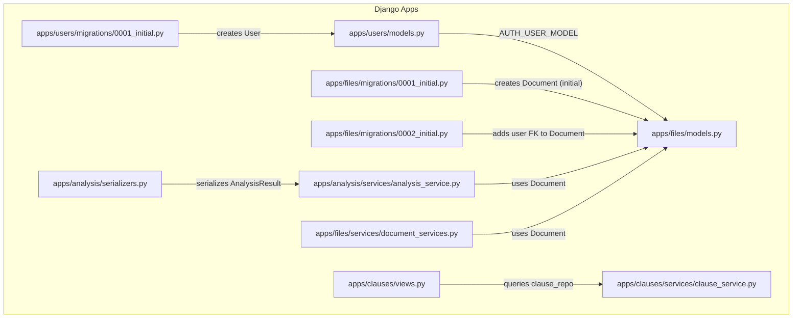
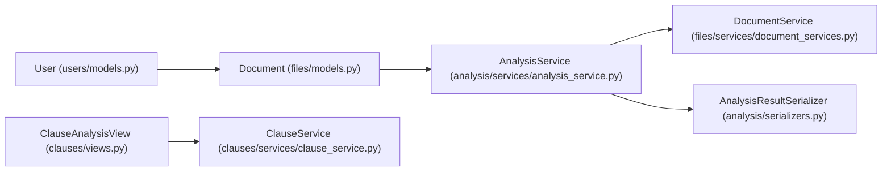

# Database Relationships & Constraints

<cite>
**Referenced Files in This Document**
- [users/models.py](file://apps/users/models.py)
- [users/migrations/0001_initial.py](file://apps/users/migrations/0001_initial.py)
- [files/models.py](file://apps/files/models.py)
- [files/migrations/0001_initial.py](file://apps/files/migrations/0001_initial.py)
- [files/migrations/0002_initial.py](file://apps/files/migrations/0002_initial.py)
- [files/services/document_services.py](file://apps/files/services/document_services.py)
- [analysis/services/analysis_service.py](file://apps/analysis/services/analysis_service.py)
- [analysis/serializers.py](file://apps/analysis/serializers.py)
- [clauses/views.py](file://apps/clauses/views.py)
- [clauses/services/clause_service.py](file://apps/clauses/services/clause_service.py)
</cite>

## Table of Contents
1. [Introduction](#introduction)
2. [Project Structure](#project-structure)
3. [Core Components](#core-components)
4. [Architecture Overview](#architecture-overview)
5. [Detailed Component Analysis](#detailed-component-analysis)
6. [Dependency Analysis](#dependency-analysis)
7. [Performance Considerations](#performance-considerations)
8. [Troubleshooting Guide](#troubleshooting-guide)
9. [Conclusion](#conclusion)
10. [Appendices](#appendices)

## Introduction
This document focuses on the database relationships, constraints, and referential integrity in VeritasShield’s core data model. It documents the foreign key relationships between the User and Document models, the cascade behaviors enforced by Django on_delete, and the absence of explicit unique constraints in the current schema. It also explains the migration system that creates and evolves the schema, outlines indexing and validation strategies, and clarifies how analysis results are handled in the broader system. Finally, it provides diagrams and practical guidance for traversal and complex queries.

## Project Structure
The database-related models and migrations are primarily located under the users and files apps. The analysis and clauses apps define serializers and views that consume the relational data produced by the files app and the AI/Graph engines.



**Diagram sources**
- [users/models.py:29-45](file://apps/users/models.py#L29-L45)
- [users/migrations/0001_initial.py:15-34](file://apps/users/migrations/0001_initial.py#L15-L34)
- [files/models.py:5-17](file://apps/files/models.py#L5-L17)
- [files/migrations/0001_initial.py:14-28](file://apps/files/migrations/0001_initial.py#L14-L28)
- [files/migrations/0002_initial.py:18-23](file://apps/files/migrations/0002_initial.py#L18-L23)
- [analysis/services/analysis_service.py:16-50](file://apps/analysis/services/analysis_service.py#L16-L50)
- [files/services/document_services.py:14-81](file://apps/files/services/document_services.py#L14-L81)
- [analysis/serializers.py:53-70](file://apps/analysis/serializers.py#L53-L70)
- [clauses/views.py:9-30](file://apps/clauses/views.py#L9-L30)
- [clauses/services/clause_service.py:4-19](file://apps/clauses/services/clause_service.py#L4-L19)

**Section sources**
- [users/models.py:29-45](file://apps/users/models.py#L29-L45)
- [users/migrations/0001_initial.py:15-34](file://apps/users/migrations/0001_initial.py#L15-L34)
- [files/models.py:5-17](file://apps/files/models.py#L5-L17)
- [files/migrations/0001_initial.py:14-28](file://apps/files/migrations/0001_initial.py#L14-L28)
- [files/migrations/0002_initial.py:18-23](file://apps/files/migrations/0002_initial.py#L18-L23)
- [analysis/services/analysis_service.py:16-50](file://apps/analysis/services/analysis_service.py#L16-L50)
- [files/services/document_services.py:14-81](file://apps/files/services/document_services.py#L14-L81)
- [analysis/serializers.py:53-70](file://apps/analysis/serializers.py#L53-L70)
- [clauses/views.py:9-30](file://apps/clauses/views.py#L9-L30)
- [clauses/services/clause_service.py:4-19](file://apps/clauses/services/clause_service.py#L4-L19)

## Core Components
- User model
  - Unique email via a unique constraint.
  - Standard Django user fields and flags.
  - Used as AUTH_USER_MODEL across the app.
- Document model
  - Foreign key to User with CASCADE deletion behavior.
  - Additional metadata fields for file handling and OCR.
  - No explicit unique constraints on file path or title in the current schema.

Key constraints and behaviors:
- Referential integrity: enforced by Django’s ForeignKey with on_delete=CASCADE.
- Uniqueness: only email is unique; no unique constraints on Document fields.
- Cascade: deleting a User deletes their Documents due to CASCADE.

**Section sources**
- [users/models.py:29-45](file://apps/users/models.py#L29-L45)
- [users/migrations/0001_initial.py:20-26](file://apps/users/migrations/0001_initial.py#L20-L26)
- [files/models.py:7](file://apps/files/models.py#L7)
- [files/migrations/0002_initial.py:21](file://apps/files/migrations/0002_initial.py#L21)

## Architecture Overview
The relational design centers on a simple User–Document relationship. Analysis results are produced by services that operate on Document instances and then integrate with graph-based repositories. The following diagram maps the actual models and migrations present in the repository.

```mermaid
erDiagram
USER {
bigint id PK
email varchar unique
name varchar
is_active boolean
is_staff boolean
created_at timestamp
}
DOCUMENT {
bigint id PK
file varchar
user_id FK
file_extension varchar
uploaded_at timestamp
signed_at timestamp
lang varchar
raw_text text
confidence float
title varchar
}
USER ||--o{ DOCUMENT : "owns"
```

**Diagram sources**
- [users/migrations/0001_initial.py:15-34](file://apps/users/migrations/0001_initial.py#L15-L34)
- [files/migrations/0001_initial.py:14-28](file://apps/files/migrations/0001_initial.py#L14-L28)
- [files/migrations/0002_initial.py:18-23](file://apps/files/migrations/0002_initial.py#L18-L23)

## Detailed Component Analysis

### User Model and Migrations
- Initial schema creation defines the User model with a unique email and standard user flags.
- The AUTH_USER_MODEL is referenced by other apps, ensuring consistent identity across the system.

Validation and uniqueness:
- Email is unique at the database level due to the unique constraint in the migration.
- Additional validations are handled by Django’s user manager and form layers.

**Section sources**
- [users/migrations/0001_initial.py:20-26](file://apps/users/migrations/0001_initial.py#L20-L26)
- [users/models.py:30](file://apps/users/models.py#L30)

### Document Model and Migrations
- Initial migration creates the Document table with file metadata and timestamps.
- Subsequent migration adds the user foreign key with CASCADE deletion.

Constraints and cascade behavior:
- The user foreign key enforces referential integrity and cascades deletions.
- No unique constraints on file path or title; duplicates are permitted unless enforced by application logic.

Indexing strategy:
- No explicit indexes are defined in the migrations.
- Suggested indexes (based on typical access patterns):
  - Document.user_id (already a foreign key; often auto-indexed by Django/DB)
  - Document.uploaded_at for time-range queries
  - Document.title for filtering/searching
  - Document.file (if frequently queried by path)

**Section sources**
- [files/migrations/0001_initial.py:14-28](file://apps/files/migrations/0001_initial.py#L14-L28)
- [files/migrations/0002_initial.py:18-23](file://apps/files/migrations/0002_initial.py#L18-L23)
- [files/models.py:5-17](file://apps/files/models.py#L5-L17)

### Analysis and Results Layer
- AnalysisService orchestrates document inspection and insertion, relying on Document instances.
- AnalysisResult is represented by serializers and returned to clients; it is not a persisted Django model in the repository snapshot.
- Clause-level analysis is accessed via dedicated views and services that query graph repositories.

Data validation at the database level:
- Validation occurs primarily in serializers and model serializers used by services.
- Database-level constraints are limited to the unique email and foreign key with CASCADE.

**Section sources**
- [analysis/services/analysis_service.py:16-50](file://apps/analysis/services/analysis_service.py#L16-L50)
- [analysis/serializers.py:53-70](file://apps/analysis/serializers.py#L53-L70)
- [clauses/views.py:9-30](file://apps/clauses/views.py#L9-L30)
- [clauses/services/clause_service.py:4-19](file://apps/clauses/services/clause_service.py#L4-L19)

### Relationship Traversals and Examples
Below are example traversals and queries aligned with the current schema and service usage. These are described conceptually to avoid reproducing code.

- Get all documents for a user
  - Traverse Document.user_id = User.id
  - Typical filters: uploaded_at range, title contains, file_extension
  - Suggested index: Document.user_id, Document.uploaded_at

- Get latest documents per user
  - Group by user_id and select the most recent uploaded_at
  - Suggested index: Document.user_id, Document.uploaded_at

- Find documents by title substring
  - Filter Document.title with case-insensitive containment
  - Suggested index: Document.title

- Count documents per user
  - Aggregate count grouped by user_id
  - Suggested index: Document.user_id

- Delete a user and their documents
  - CASCADE on delete removes all associated Documents automatically

Note: These examples reflect the current schema. If unique constraints are introduced later (for example, unique user+title), adjust queries accordingly.

[No sources needed since this section provides conceptual guidance]

## Dependency Analysis
The following diagram shows how models and services depend on each other in the repository.



**Diagram sources**
- [users/models.py:29-45](file://apps/users/models.py#L29-L45)
- [files/models.py:5-17](file://apps/files/models.py#L5-L17)
- [analysis/services/analysis_service.py:16-50](file://apps/analysis/services/analysis_service.py#L16-L50)
- [files/services/document_services.py:14-81](file://apps/files/services/document_services.py#L14-L81)
- [analysis/serializers.py:53-70](file://apps/analysis/serializers.py#L53-L70)
- [clauses/views.py:9-30](file://apps/clauses/views.py#L9-L30)
- [clauses/services/clause_service.py:4-19](file://apps/clauses/services/clause_service.py#L4-L19)

## Performance Considerations
- Current indexes
  - Django typically auto-indexes foreign keys; Document.user_id benefits from this.
  - No explicit indexes on uploaded_at, title, or file path.
- Recommended indexes
  - Document.user_id (existing auto-index)
  - Document.uploaded_at (for time-series analytics)
  - Document.title (for text search/filtering)
  - Document.file (if path-based lookups are frequent)
- Unique constraints
  - Consider adding unique constraints on (user_id, title) if documents per user should be unique by title.
  - Introduce unique constraints via new migrations to maintain referential integrity at the database level.

[No sources needed since this section provides general guidance]

## Troubleshooting Guide
- Integrity errors when deleting a user
  - Symptom: deletion fails due to foreign key violations.
  - Resolution: rely on CASCADE behavior; ensure the user foreign key is set and on_delete=CASCADE is active.
  - Verification: confirm the migration that adds the user FK is applied.

- Duplicate documents under the same user
  - Symptom: multiple rows with identical user_id and title.
  - Cause: no unique constraint on user_id+title.
  - Resolution: add a unique constraint via a new migration.

- Slow queries on document lists
  - Symptom: slow filtering by title or time range.
  - Resolution: add indexes on Document.title and Document.uploaded_at.

- Validation failures during upload
  - Symptom: serializer validation errors.
  - Resolution: ensure DocumentCreateSerializer validates required fields and file constraints before persisting.

**Section sources**
- [files/migrations/0002_initial.py:18-23](file://apps/files/migrations/0002_initial.py#L18-L23)
- [files/services/document_services.py:98-110](file://apps/files/services/document_services.py#L98-L110)

## Conclusion
VeritasShield’s current relational schema enforces referential integrity through a User–Document relationship with CASCADE deletion. The unique email constraint ensures identity integrity, while the lack of unique constraints on Document fields allows duplicates unless application-level rules enforce otherwise. Indexes can be added to optimize common queries, and future migrations can introduce unique constraints to strengthen data consistency. Analysis results are modeled in serializers and consumed by views/services, complementing the relational foundation.

[No sources needed since this section summarizes without analyzing specific files]

## Appendices

### Migration System Summary
- Initial schema creation
  - User model created with unique email and standard fields.
  - Document model created with file metadata.
- Schema evolution
  - Added user foreign key to Document with CASCADE behavior.
- Data consistency
  - Referential integrity maintained via foreign key constraints.
  - No unique constraints on Document fields in current migrations.

**Section sources**
- [users/migrations/0001_initial.py:15-34](file://apps/users/migrations/0001_initial.py#L15-L34)
- [files/migrations/0001_initial.py:14-28](file://apps/files/migrations/0001_initial.py#L14-L28)
- [files/migrations/0002_initial.py:18-23](file://apps/files/migrations/0002_initial.py#L18-L23)