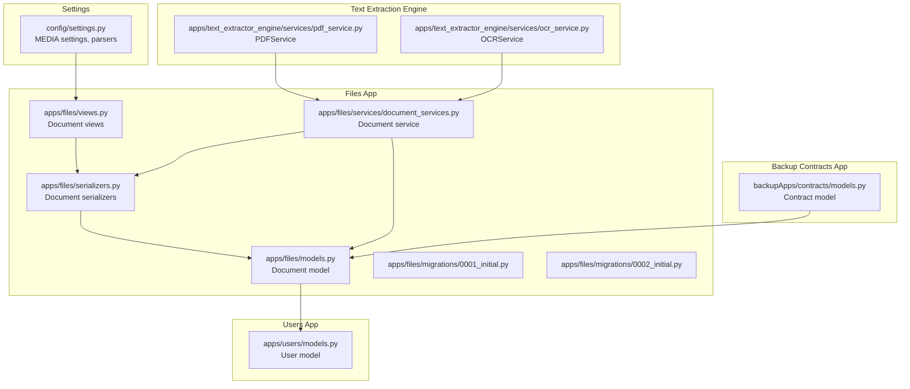
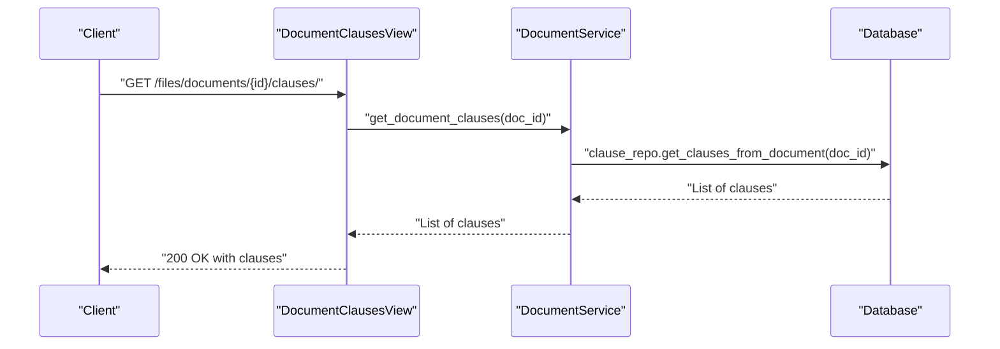
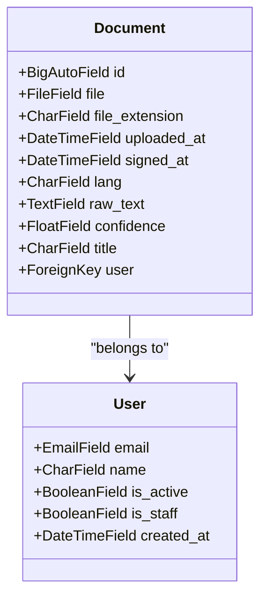
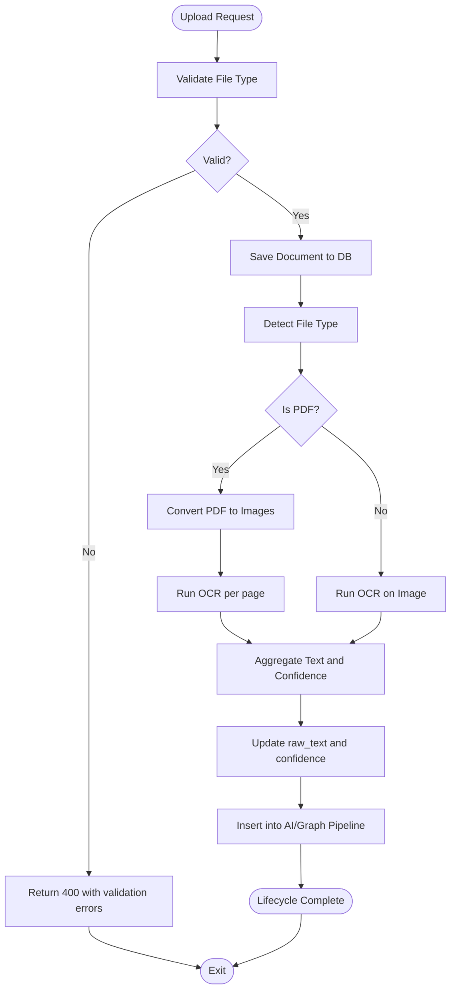
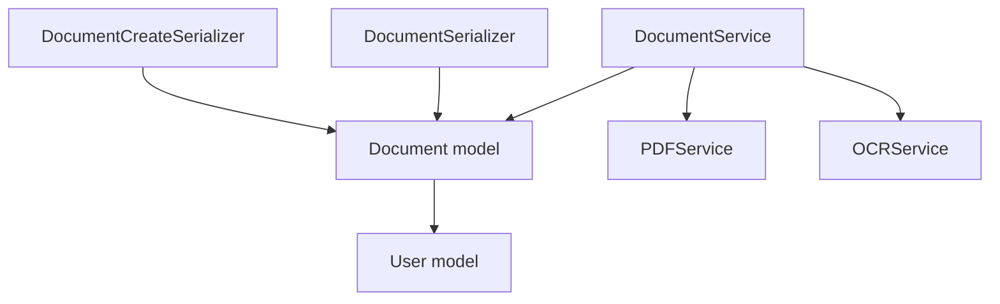

# Document Model & Metadata

<cite>
**Referenced Files in This Document**
- [models.py](file://apps/files/models.py)
- [serializers.py](file://apps/files/serializers.py)
- [document_services.py](file://apps/files/services/document_services.py)
- [views.py](file://apps/files/views.py)
- [0001_initial.py](file://apps/files/migrations/0001_initial.py)
- [0002_initial.py](file://apps/files/migrations/0002_initial.py)
- [settings.py](file://config/settings.py)
- [pdf_service.py](file://apps/text_extractor_engine/services/pdf_service.py)
- [ocr_service.py](file://apps/text_extractor_engine/services/ocr_service.py)
- [models.py](file://apps/users/models.py)
- [models.py](file://backupApps/contracts/models.py)
</cite>

## Table of Contents
1. [Introduction](#introduction)
2. [Project Structure](#project-structure)
3. [Core Components](#core-components)
4. [Architecture Overview](#architecture-overview)
5. [Detailed Component Analysis](#detailed-component-analysis)
6. [Dependency Analysis](#dependency-analysis)
7. [Performance Considerations](#performance-considerations)
8. [Troubleshooting Guide](#troubleshooting-guide)
9. [Conclusion](#conclusion)

## Introduction
This document provides comprehensive data model documentation for the Document model and associated metadata management. It covers the complete schema, file storage system, supported formats, validation rules, lifecycle from upload to completion, relationships with the User model, and metadata extraction fields. It also includes examples of document creation, file handling, and metadata management, along with validation, storage optimization, and cleanup procedures.

## Project Structure
The Document model resides in the files app and integrates with the users app for authentication and authorization. Supporting components include serializers for validation and serialization, services orchestrating AI/OCR pipelines, and settings defining media storage and parsing behavior. A backup contracts app demonstrates an alternative contract model that mirrors document metadata and lifecycle.

**Diagram sources**
- [models.py:5-17](file://apps/files/models.py#L5-L17)
- [serializers.py:6-46](file://apps/files/serializers.py#L6-L46)
- [views.py:11-34](file://apps/files/views.py#L11-L34)
- [document_services.py:14-123](file://apps/files/services/document_services.py#L14-L123)
- [0001_initial.py:14-27](file://apps/files/migrations/0001_initial.py#L14-L27)
- [0002_initial.py:18-22](file://apps/files/migrations/0002_initial.py#L18-L22)
- [pdf_service.py:4-14](file://apps/text_extractor_engine/services/pdf_service.py#L4-L14)
- [ocr_service.py:6-17](file://apps/text_extractor_engine/services/ocr_service.py#L6-L17)
- [models.py:29-45](file://apps/users/models.py#L29-L45)
- [models.py:5-30](file://backupApps/contracts/models.py#L5-L30)
- [settings.py:122-137](file://config/settings.py#L122-L137)

**Section sources**
- [models.py:5-17](file://apps/files/models.py#L5-L17)
- [serializers.py:6-46](file://apps/files/serializers.py#L6-L46)
- [views.py:11-34](file://apps/files/views.py#L11-L34)
- [document_services.py:14-123](file://apps/files/services/document_services.py#L14-L123)
- [0001_initial.py:14-27](file://apps/files/migrations/0001_initial.py#L14-L27)
- [0002_initial.py:18-22](file://apps/files/migrations/0002_initial.py#L18-L22)
- [settings.py:122-137](file://config/settings.py#L122-L137)

## Core Components
- Document model fields:
  - file: FileField stored under contracts/ with upload_to configured.
  - user: ForeignKey to AUTH_USER_MODEL with CASCADE deletion.
  - file_extension: CharField storing detected extension.
  - uploaded_at: DateTimeField auto-populated on creation.
  - signed_at: DateTimeField allowing null and blank.
  - lang: CharField defaulting to "en".
  - raw_text: TextField for extracted text.
  - confidence: FloatField defaulting to 0.0.
  - title: CharField allowing null and blank.

- Serializers:
  - DocumentSerializer exposes all fields; marks several as read-only.
  - DocumentCreateSerializer restricts client inputs and enforces file type validation.

- Services:
  - DocumentService orchestrates insertion, inspection, and clause retrieval using external AI/Graph components.
  - create_document delegates validation and persistence to the serializer while injecting the user.

- Views:
  - DocumentViewSet provides admin-level CRUD for documents.
  - DocumentClausesView retrieves clauses for a given document.

- Settings:
  - MEDIA_URL and MEDIA_ROOT define media serving and storage location.
  - DEFAULT_PARSER_CLASSES include MultiPartParser enabling file uploads.

**Section sources**
- [models.py:5-17](file://apps/files/models.py#L5-L17)
- [serializers.py:6-46](file://apps/files/serializers.py#L6-L46)
- [document_services.py:83-110](file://apps/files/services/document_services.py#L83-L110)
- [views.py:11-34](file://apps/files/views.py#L11-L34)
- [settings.py:122-137](file://config/settings.py#L122-L137)

## Architecture Overview
The document lifecycle spans upload, optional OCR preprocessing, metadata extraction, and integration with AI/Graph pipelines. The flow below maps to actual code paths.

**Diagram sources**
- [views.py:17-34](file://apps/files/views.py#L17-L34)
- [document_services.py:112-122](file://apps/files/services/document_services.py#L112-L122)

## Detailed Component Analysis

### Document Model Schema
The Document model defines the core schema for storing uploaded files and associated metadata. It includes fields for file storage, user association, timestamps, language, extracted text, confidence scores, and optional signing date.

**Diagram sources**
- [models.py:5-17](file://apps/files/models.py#L5-L17)
- [models.py:29-45](file://apps/users/models.py#L29-L45)

**Section sources**
- [models.py:5-17](file://apps/files/models.py#L5-L17)
- [0001_initial.py:14-27](file://apps/files/migrations/0001_initial.py#L14-L27)
- [0002_initial.py:18-22](file://apps/files/migrations/0002_initial.py#L18-L22)

### File Storage System and Supported Formats
- Storage path: Files are stored under contracts/ with upload_to configured in the model.
- Media configuration: MEDIA_URL="/media/" and MEDIA_ROOT points to the media directory.
- Parser support: MultiPartParser enables multipart/form-data uploads including files.

Supported file formats are enforced by the serializer’s validate_file method, restricting uploads to PDF and common image formats.

**Section sources**
- [models.py](file://apps/files/models.py#L6)
- [settings.py:122-137](file://config/settings.py#L122-L137)
- [serializers.py:48-52](file://apps/files/serializers.py#L48-L52)

### Validation Rules
- File type validation: Only PDF and images (.jpg, .png, .jpeg) are accepted.
- Read-only fields: Certain fields are excluded from client input and auto-managed by the server.
- Required fields: The serializer requires file, title, lang, and file_extension from clients.

**Section sources**
- [serializers.py:32-60](file://apps/files/serializers.py#L32-L60)

### Document Lifecycle: Upload to Completion
The lifecycle includes upload, optional OCR preprocessing, metadata extraction, and integration with AI/Graph pipelines.

**Diagram sources**
- [serializers.py:48-52](file://apps/files/serializers.py#L48-L52)
- [document_services.py:22-81](file://apps/files/services/document_services.py#L22-L81)
- [pdf_service.py:5-14](file://apps/text_extractor_engine/services/pdf_service.py#L5-L14)
- [ocr_service.py:8-17](file://apps/text_extractor_engine/services/ocr_service.py#L8-L17)

### Relationship with User Model and Foreign Keys
- The Document model has a ForeignKey to AUTH_USER_MODEL with CASCADE deletion, ensuring that when a user is removed, their documents are also removed.
- The User model uses a custom AbstractBaseUser with email as the unique identifier and standard is_active/is_staff flags.

**Section sources**
- [models.py](file://apps/files/models.py#L7)
- [models.py:29-45](file://apps/users/models.py#L29-L45)
- [settings.py](file://config/settings.py#L144)

### Metadata Extraction Fields and Processing Flags
- Metadata fields: file_extension, lang, title, signed_at.
- Processing flags/status indicators: raw_text and confidence reflect extraction outcomes.
- Status tracking: The backup contracts app introduces a Status enumeration (uploaded, processing, analyzed, failed) and additional fields like risk_score and summary.

**Section sources**
- [models.py:8-14](file://apps/files/models.py#L8-L14)
- [models.py:6-30](file://backupApps/contracts/models.py#L6-L30)

### Examples: Document Creation, File Handling, and Metadata Management
- Creating a document via serializer:
  - Merge request.data and request.FILES into a single payload.
  - Call DocumentCreateSerializer with data and validate.
  - Persist using serializer.save(user=request.user).
- File handling:
  - For PDFs, convert pages to images and process each page via OCR.
  - For images, run OCR directly.
- Metadata management:
  - Update raw_text and confidence after OCR.
  - Optionally set title and lang during creation.

**Section sources**
- [document_services.py:83-110](file://apps/files/services/document_services.py#L83-L110)
- [views.py:17-34](file://apps/files/views.py#L17-L34)
- [pdf_service.py:5-14](file://apps/text_extractor_engine/services/pdf_service.py#L5-L14)
- [ocr_service.py:8-17](file://apps/text_extractor_engine/services/ocr_service.py#L8-L17)

### Cleanup Procedures
- On user deletion: CASCADE ensures associated documents are removed automatically.
- Optional cleanup on OCR failure: The upload view demonstrates returning an error without deleting the document; you can extend this to delete the document if desired.

**Section sources**
- [models.py](file://apps/files/models.py#L7)
- [views.py:17-34](file://apps/files/views.py#L17-L34)

## Dependency Analysis
The Document model depends on the User model and Django’s file storage system. Serializers depend on the model fields and enforce validation. Services integrate with external AI/Graph components and OCR utilities. Views coordinate requests and responses.

**Diagram sources**
- [models.py:5-17](file://apps/files/models.py#L5-L17)
- [models.py:29-45](file://apps/users/models.py#L29-L45)
- [serializers.py:6-46](file://apps/files/serializers.py#L6-L46)
- [document_services.py:14-21](file://apps/files/services/document_services.py#L14-L21)
- [pdf_service.py:4-14](file://apps/text_extractor_engine/services/pdf_service.py#L4-L14)
- [ocr_service.py:6-17](file://apps/text_extractor_engine/services/ocr_service.py#L6-L17)

**Section sources**
- [models.py:5-17](file://apps/files/models.py#L5-L17)
- [serializers.py:6-46](file://apps/files/serializers.py#L6-L46)
- [document_services.py:14-21](file://apps/files/services/document_services.py#L14-L21)

## Performance Considerations
- File size and format: Prefer optimized PDFs and images to reduce OCR processing time.
- Batch processing: For large PDFs, process pages in batches to avoid memory spikes.
- Caching: Cache OCR results for repeated queries to the same file.
- Storage: Store processed raw_text and confidence to avoid recomputation.
- Concurrency: Use async tasks for OCR and AI/Graph insertion to prevent blocking requests.

## Troubleshooting Guide
- Unsupported file type: Ensure the file ends with .pdf, .jpg, .png, or .jpeg; otherwise validation will fail.
- Missing user context: When calling serializer.save(), always pass the user; otherwise the save will fail.
- OCR failures: If OCR processing raises an exception, the upload view returns a 500 error with details; verify file readability and OCR service availability.
- Cascade deletion: Deleting a user removes their documents automatically; confirm this behavior if unexpected deletions occur.

**Section sources**
- [serializers.py:48-52](file://apps/files/serializers.py#L48-L52)
- [document_services.py:83-110](file://apps/files/services/document_services.py#L83-L110)
- [views.py:17-34](file://apps/files/views.py#L17-L34)
- [models.py](file://apps/files/models.py#L7)

## Conclusion
The Document model provides a robust foundation for storing uploaded files and associated metadata, integrating seamlessly with user authentication, file validation, and OCR-based text extraction. The lifecycle from upload to completion leverages serializers, services, and external components to deliver a scalable solution. Proper validation, storage configuration, and cleanup procedures ensure reliability and maintainability.