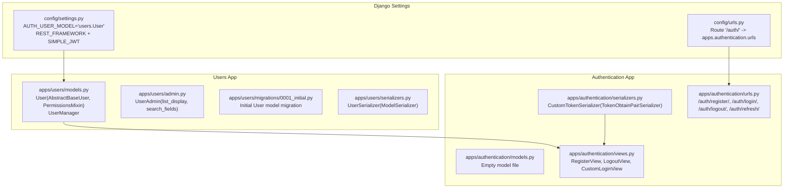
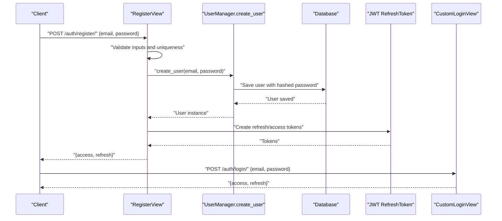
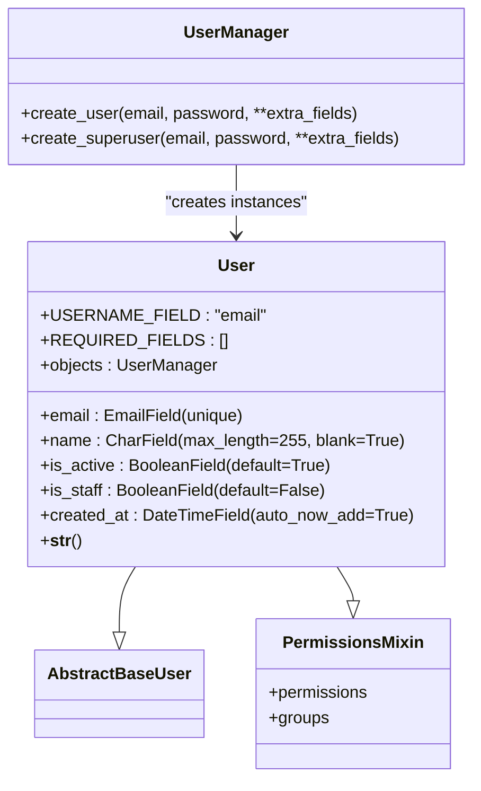
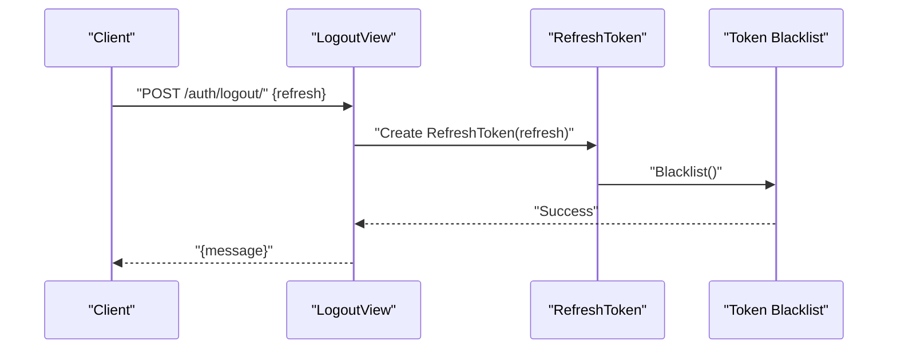
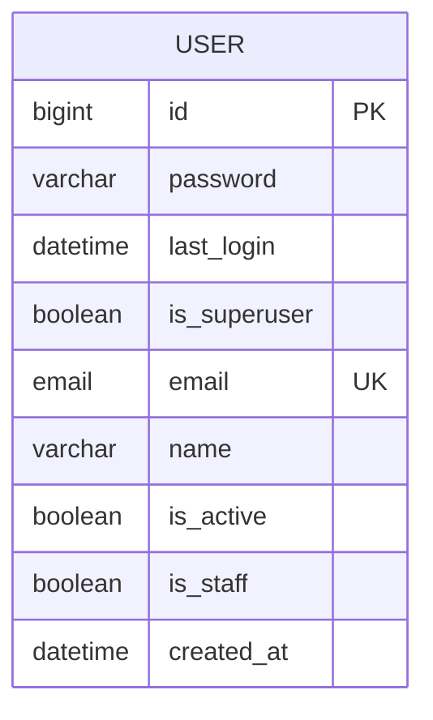
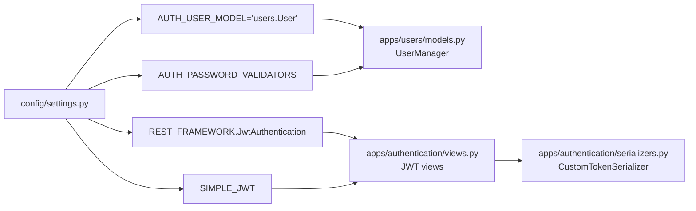

# User Model & Authentication

<cite>
**Referenced Files in This Document**
- [models.py](file://apps/users/models.py)
- [admin.py](file://apps/users/admin.py)
- [migrations/0001_initial.py](file://apps/users/migrations/0001_initial.py)
- [serializers.py](file://apps/users/serializers.py)
- [models.py](file://apps/authentication/models.py)
- [serializers.py](file://apps/authentication/serializers.py)
- [views.py](file://apps/authentication/views.py)
- [urls.py](file://apps/authentication/urls.py)
- [settings.py](file://config/settings.py)
- [urls.py](file://config/urls.py)
</cite>

## Table of Contents
1. [Introduction](#introduction)
2. [Project Structure](#project-structure)
3. [Core Components](#core-components)
4. [Architecture Overview](#architecture-overview)
5. [Detailed Component Analysis](#detailed-component-analysis)
6. [Dependency Analysis](#dependency-analysis)
7. [Performance Considerations](#performance-considerations)
8. [Troubleshooting Guide](#troubleshooting-guide)
9. [Conclusion](#conclusion)

## Introduction
This document provides comprehensive data model documentation for the custom User model and the authentication system. It explains the implementation of a custom User model using AbstractBaseUser and UserManager, focusing on email-based authentication, password hashing, and permission integration. It also documents the authentication flow, including user registration, login, logout, and token lifecycle management using JWT. Security considerations, password validation, and best practices for user management are covered.

## Project Structure
The authentication system spans two Django apps:
- users: Defines the custom User model and related admin configuration.
- authentication: Provides views and serializers for registration, login, logout, and JWT token handling.

Key configuration:
- The AUTH_USER_MODEL setting points to the custom User model.
- REST_FRAMEWORK uses JWT authentication via SimpleJWT.
- SIMPLE_JWT defines token lifetimes and header types.
- Django’s built-in password validators are enabled.

**Diagram sources**
- [settings.py:125-144](file://config/settings.py#L125-L144)
- [urls.py:23-30](file://config/urls.py#L23-L30)
- [models.py:29-45](file://apps/users/models.py#L29-L45)
- [admin.py:6-9](file://apps/users/admin.py#L6-L9)
- [migrations/0001_initial.py:14-34](file://apps/users/migrations/0001_initial.py#L14-L34)
- [serializers.py:6-13](file://apps/users/serializers.py#L6-L13)
- [models.py:1-4](file://apps/authentication/models.py#L1-L4)
- [serializers.py:4-5](file://apps/authentication/serializers.py#L4-L5)
- [views.py:14-74](file://apps/authentication/views.py#L14-L74)
- [urls.py:8-14](file://apps/authentication/urls.py#L8-L14)

**Section sources**
- [settings.py:26-40](file://config/settings.py#L26-L40)
- [settings.py:125-144](file://config/settings.py#L125-L144)
- [urls.py:23-30](file://config/urls.py#L23-L30)

## Core Components
- Custom User model
  - Fields: email (unique), name, is_active, is_staff, created_at.
  - USERNAME_FIELD configured to "email".
  - REQUIRED_FIELDS set to [].
  - Inherits permissions from PermissionsMixin.
- UserManager
  - create_user: Validates email, normalizes it, sets hashed password, persists the user.
  - create_superuser: Sets is_staff and is_superuser defaults and delegates to create_user.
- Authentication app
  - RegisterView: Validates presence of email and password, checks uniqueness, creates user via UserManager, issues JWT tokens.
  - LogoutView: Accepts a refresh token and blacklists it.
  - CustomLoginView: Extends TokenObtainPairView using a serializer that authenticates on email.
  - CustomTokenSerializer: Overrides username_field to "email".

**Section sources**
- [models.py:9-25](file://apps/users/models.py#L9-L25)
- [models.py:29-45](file://apps/users/models.py#L29-L45)
- [serializers.py:6-13](file://apps/users/serializers.py#L6-L13)
- [views.py:14-74](file://apps/authentication/views.py#L14-L74)
- [serializers.py:4-5](file://apps/authentication/serializers.py#L4-L5)

## Architecture Overview
The authentication flow integrates Django’s custom user model with DRF SimpleJWT. Registration uses the custom User model’s manager to create users with hashed passwords. Login leverages SimpleJWT pair tokens, while logout invalidates tokens via blacklist.

**Diagram sources**
- [views.py:14-42](file://apps/authentication/views.py#L14-L42)
- [models.py:11-19](file://apps/users/models.py#L11-L19)
- [serializers.py:4-5](file://apps/authentication/serializers.py#L4-L5)

## Detailed Component Analysis

### User Model and UserManager
The User model extends AbstractBaseUser and PermissionsMixin, enabling email-based authentication and integrated permission support. UserManager centralizes user creation and superuser provisioning.

**Diagram sources**
- [models.py:29-45](file://apps/users/models.py#L29-L45)
- [models.py:9-25](file://apps/users/models.py#L9-L25)

Key implementation notes:
- create_user validates email presence, normalizes it, sets hashed password, and saves the instance.
- create_superuser ensures is_staff and is_superuser defaults are set before delegating to create_user.
- USERNAME_FIELD is "email" and REQUIRED_FIELDS is empty, aligning with email-only authentication.

**Section sources**
- [models.py:9-25](file://apps/users/models.py#L9-L25)
- [models.py:29-45](file://apps/users/models.py#L29-L45)

### Authentication Views and Serializers
- RegisterView
  - Validates presence of email and password.
  - Checks email uniqueness.
  - Creates user via UserManager.
  - Issues JWT refresh/access tokens.
- LogoutView
  - Requires IsAuthenticated.
  - Accepts refresh token and blacklists it.
- CustomLoginView
  - Uses TokenObtainPairView with a serializer that authenticates on email.
- CustomTokenSerializer
  - Overrides username_field to "email".

**Diagram sources**
- [views.py:45-69](file://apps/authentication/views.py#L45-L69)
- [views.py:6-6](file://apps/authentication/views.py#L6-L6)

**Section sources**
- [views.py:14-42](file://apps/authentication/views.py#L14-L42)
- [views.py:45-69](file://apps/authentication/views.py#L45-L69)
- [serializers.py:4-5](file://apps/authentication/serializers.py#L4-L5)

### Data Model Definition and Migration
The initial migration defines the User model with:
- email (unique)
- name
- is_active, is_staff
- created_at timestamp
- inherited fields from AbstractBaseUser (password, last_login, is_superuser)
- ManyToMany fields for groups and user_permissions from PermissionsMixin

**Diagram sources**
- [migrations/0001_initial.py:14-34](file://apps/users/migrations/0001_initial.py#L14-L34)

**Section sources**
- [migrations/0001_initial.py:14-34](file://apps/users/migrations/0001_initial.py#L14-L34)

### Admin Configuration
The UserAdmin exposes email, is_staff, and is_active in the admin list display and enables searching by email.

**Section sources**
- [admin.py:6-9](file://apps/users/admin.py#L6-L9)

### URL Routing
The authentication endpoints are exposed under /auth/:
- POST /auth/register/
- POST /auth/login/
- POST /auth/logout/
- POST /auth/refresh/

**Section sources**
- [urls.py:8-14](file://apps/authentication/urls.py#L8-L14)
- [urls.py:23-30](file://config/urls.py#L23-L30)

## Dependency Analysis
- settings.py
  - AUTH_USER_MODEL points to users.User.
  - REST_FRAMEWORK uses JWT authentication.
  - SIMPLE_JWT configures token lifetimes and header types.
  - AUTH_PASSWORD_VALIDATORS enable Django’s built-in password validation.
- authentication/urls.py
  - Routes to RegisterView, CustomLoginView, LogoutView, and TokenRefreshView.
- authentication/views.py
  - Depends on get_user_model() to reference the custom User.
  - Uses RefreshToken for issuing and blacklisting tokens.
- authentication/serializers.py
  - Extends TokenObtainPairSerializer to authenticate on email.

**Diagram sources**
- [settings.py:125-144](file://config/settings.py#L125-L144)
- [models.py:9-25](file://apps/users/models.py#L9-L25)
- [views.py:1-11](file://apps/authentication/views.py#L1-L11)
- [serializers.py:1-5](file://apps/authentication/serializers.py#L1-L5)

**Section sources**
- [settings.py:125-144](file://config/settings.py#L125-L144)
- [views.py:1-11](file://apps/authentication/views.py#L1-L11)
- [serializers.py:1-5](file://apps/authentication/serializers.py#L1-L5)

## Performance Considerations
- Token lifetime configuration: Access tokens are short-lived; refresh tokens are long-lived. This reduces exposure windows and minimizes repeated authentication overhead.
- Password hashing: UserManager uses Django’s set_password, which leverages a secure hashing algorithm by default.
- Indexing: Email is unique, ensuring efficient lookups during authentication and registration.
- Serializer write-only password: Ensures passwords are not returned in responses.

[No sources needed since this section provides general guidance]

## Troubleshooting Guide
Common issues and resolutions:
- Invalid credentials during login
  - Cause: Incorrect email or password.
  - Resolution: Verify email matches the stored normalized value and ensure password is correct.
- User creation failures
  - Cause: Missing email/password or database errors.
  - Resolution: Validate inputs and check database connectivity.
- Duplicate email during registration
  - Cause: Email already exists.
  - Resolution: Prompt user to use another email or reset password.
- Logout failures
  - Cause: Missing or invalid refresh token.
  - Resolution: Ensure refresh token is provided and valid; confirm it was not previously blacklisted.
- Permission errors
  - Cause: is_staff or is_superuser not set appropriately.
  - Resolution: Confirm user flags and group permissions.

**Section sources**
- [views.py:19-27](file://apps/authentication/views.py#L19-L27)
- [views.py:48-69](file://apps/authentication/views.py#L48-L69)
- [models.py:34-35](file://apps/users/models.py#L34-L35)

## Conclusion
The custom User model and authentication system provide a robust, email-centric authentication mechanism integrated with JWT. The UserManager encapsulates secure user creation and superuser provisioning, while the authentication views handle registration, login, and logout with token lifecycle management. Django’s built-in password validators and the admin interface further strengthen security and operability. Following the outlined best practices ensures a secure and maintainable authentication layer.