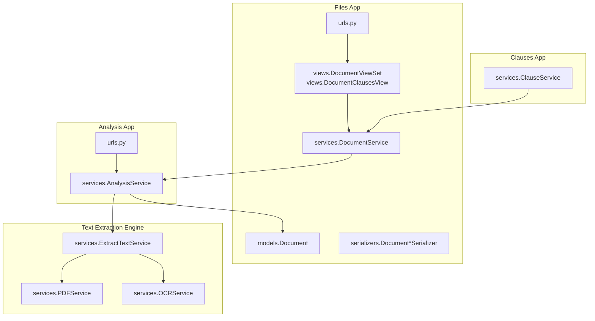
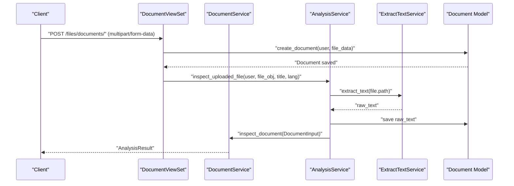
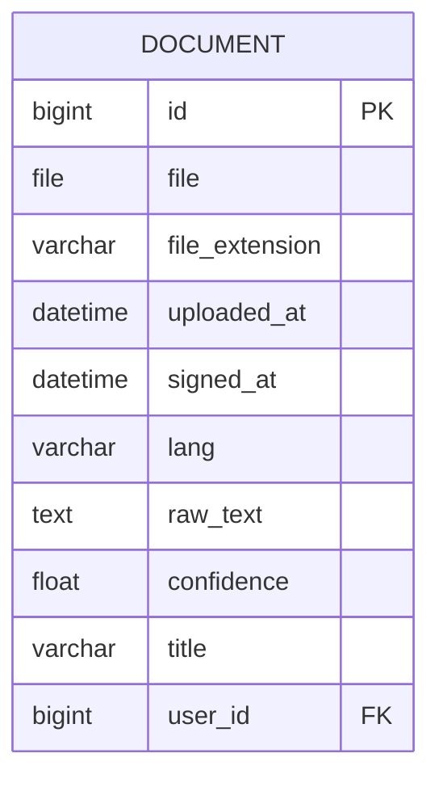
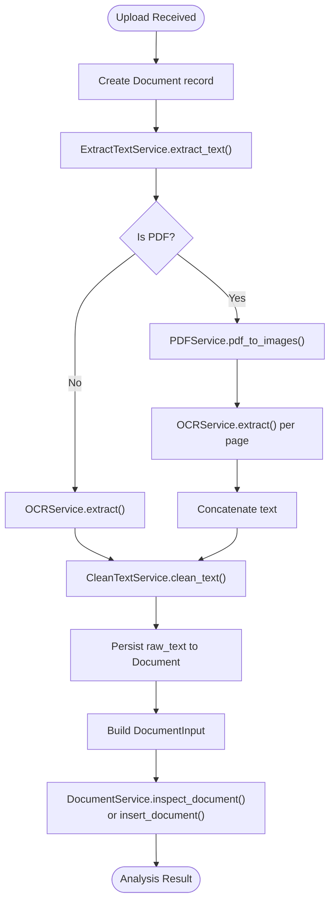
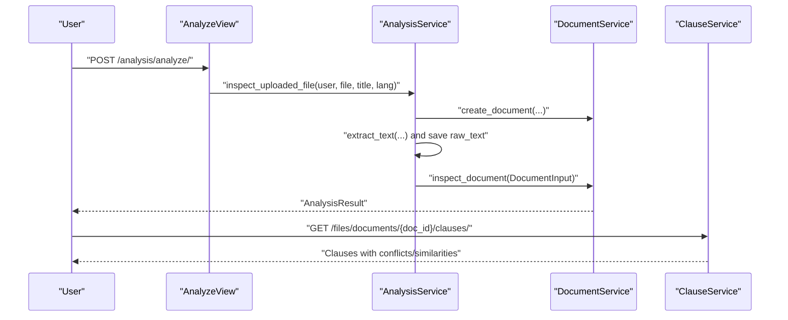
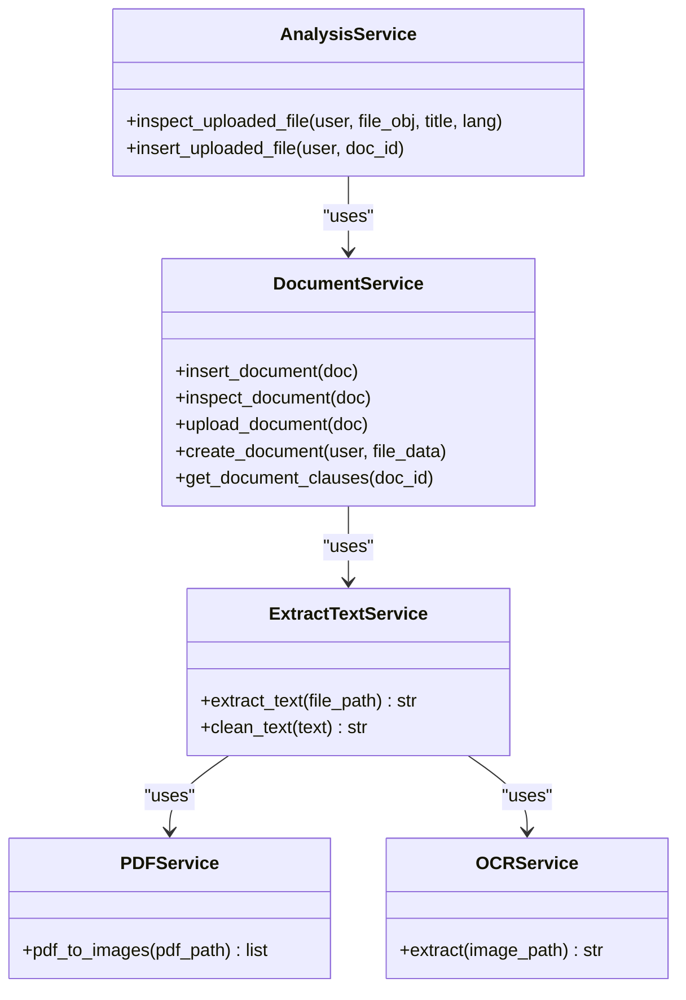
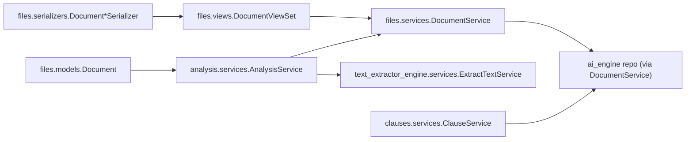

# Document Management

<cite>
**Referenced Files in This Document**
- [apps/files/models.py](file://apps/files/models.py)
- [apps/files/migrations/0001_initial.py](file://apps/files/migrations/0001_initial.py)
- [apps/files/migrations/0002_initial.py](file://apps/files/migrations/0002_initial.py)
- [apps/files/serializers.py](file://apps/files/serializers.py)
- [apps/files/views.py](file://apps/files/views.py)
- [apps/files/urls.py](file://apps/files/urls.py)
- [apps/files/services/document_services.py](file://apps/files/services/document_services.py)
- [apps/analysis/services/analysis_service.py](file://apps/analysis/services/analysis_service.py)
- [apps/text_extractor_engine/services/extract_text.py](file://apps/text_extractor_engine/services/extract_text.py)
- [apps/text_extractor_engine/services/pdf_service.py](file://apps/text_extractor_engine/services/pdf_service.py)
- [apps/text_extractor_engine/services/ocr_service.py](file://apps/text_extractor_engine/services/ocr_service.py)
- [apps/clauses/services/clause_service.py](file://apps/clauses/services/clause_service.py)
</cite>

## Table of Contents
1. [Introduction](#introduction)
2. [Project Structure](#project-structure)
3. [Core Components](#core-components)
4. [Architecture Overview](#architecture-overview)
5. [Detailed Component Analysis](#detailed-component-analysis)
6. [Dependency Analysis](#dependency-analysis)
7. [Performance Considerations](#performance-considerations)
8. [Troubleshooting Guide](#troubleshooting-guide)
9. [Conclusion](#conclusion)
10. [Appendices](#appendices)

## Introduction
This document describes the document management subsystem of Veritas Shield. It covers the Document model schema, file upload and storage mechanisms, media configuration, supported formats, validation rules, and the document processing pipeline from upload through OCR extraction to AI-powered analysis and clause retrieval. It also documents CRUD operations, batch processing considerations, integration with the AI analysis engine, error handling strategies, and performance guidance for large and concurrent workloads.

## Project Structure
The document management system spans several Django apps:
- files: Defines the Document model, serializers, views, and services for CRUD and clause retrieval.
- analysis: Provides endpoints and orchestration for analyzing uploaded documents, including OCR text extraction and AI inspection/insertion.
- text_extractor_engine: Implements OCR and PDF-to-image conversion utilities.
- clauses: Provides clause-level analysis retrieval.
- URLs: Wire routes to views and viewsets.

**Diagram sources**
- [apps/files/urls.py:1-29](file://apps/files/urls.py#L1-L29)
- [apps/files/views.py:1-35](file://apps/files/views.py#L1-L35)
- [apps/files/models.py:1-18](file://apps/files/models.py#L1-L18)
- [apps/files/serializers.py:1-61](file://apps/files/serializers.py#L1-L61)
- [apps/files/services/document_services.py:1-126](file://apps/files/services/document_services.py#L1-L126)
- [apps/analysis/services/analysis_service.py:1-90](file://apps/analysis/services/analysis_service.py#L1-L90)
- [apps/text_extractor_engine/services/extract_text.py:1-55](file://apps/text_extractor_engine/services/extract_text.py#L1-L55)
- [apps/text_extractor_engine/services/pdf_service.py:1-15](file://apps/text_extractor_engine/services/pdf_service.py#L1-L15)
- [apps/text_extractor_engine/services/ocr_service.py:1-18](file://apps/text_extractor_engine/services/ocr_service.py#L1-L18)
- [apps/clauses/services/clause_service.py:1-20](file://apps/clauses/services/clause_service.py#L1-L20)

**Section sources**
- [apps/files/urls.py:1-29](file://apps/files/urls.py#L1-L29)
- [apps/analysis/urls.py:1-9](file://apps/analysis/urls.py#L1-L9)

## Core Components
- Document model: Stores file metadata, ownership, language, timestamps, OCR-derived raw text, confidence score, and optional title.
- Serializers: Control which fields are exposed and writable for create/update operations and apply basic validation.
- Views and ViewSets: Expose CRUD endpoints and a dedicated clause retrieval endpoint.
- Services:
  - DocumentService: Orchestrates AI pipelines for inspection and insertion, and integrates with the knowledge graph.
  - AnalysisService: Coordinates OCR text extraction and document lifecycle transitions.
  - ExtractTextService: Converts PDFs to images and performs OCR; cleans extracted text.
  - ClauseService: Retrieves clause-level analysis details.

**Section sources**
- [apps/files/models.py:1-18](file://apps/files/models.py#L1-L18)
- [apps/files/serializers.py:1-61](file://apps/files/serializers.py#L1-L61)
- [apps/files/views.py:1-35](file://apps/files/views.py#L1-L35)
- [apps/files/services/document_services.py:1-126](file://apps/files/services/document_services.py#L1-L126)
- [apps/analysis/services/analysis_service.py:1-90](file://apps/analysis/services/analysis_service.py#L1-L90)
- [apps/text_extractor_engine/services/extract_text.py:1-55](file://apps/text_extractor_engine/services/extract_text.py#L1-L55)
- [apps/clauses/services/clause_service.py:1-20](file://apps/clauses/services/clause_service.py#L1-L20)

## Architecture Overview
The document lifecycle is:
1. Upload: Client uploads a file; serializer validates supported formats; model saves metadata.
2. OCR Extraction: Raw text is extracted from the stored file and persisted.
3. AI Analysis: The system constructs a DocumentInput and invokes inspection/insertion pipelines.
4. Clause Retrieval: Clients fetch clause-level insights associated with a document.

**Diagram sources**
- [apps/files/views.py:1-35](file://apps/files/views.py#L1-L35)
- [apps/files/services/document_services.py:1-126](file://apps/files/services/document_services.py#L1-L126)
- [apps/analysis/services/analysis_service.py:1-90](file://apps/analysis/services/analysis_service.py#L1-L90)
- [apps/text_extractor_engine/services/extract_text.py:1-55](file://apps/text_extractor_engine/services/extract_text.py#L1-L55)
- [apps/files/models.py:1-18](file://apps/files/models.py#L1-L18)

## Detailed Component Analysis

### Document Model Schema
The Document model captures essential metadata and state for each uploaded contract or document.

Key attributes and behaviors:
- file: Stored under the configured media root with upload_to="contracts/".
- user: Foreign key to the AUTH_USER_MODEL; cascading delete ensures cleanup on user removal.
- file_extension: Captured during creation; used for downstream processing.
- uploaded_at: Auto-populated on creation.
- signed_at: Optional timestamp for signing date.
- lang: Language hint for OCR and NLP.
- raw_text: OCR-extracted text; populated post-upload.
- confidence: OCR confidence score; initialized to zero.
- title: Optional human-readable title.

Supported migrations:
- Initial creation of Document with core fields.
- Addition of user foreign key linking to AUTH_USER_MODEL.

**Section sources**
- [apps/files/models.py:1-18](file://apps/files/models.py#L1-L18)
- [apps/files/migrations/0001_initial.py:1-29](file://apps/files/migrations/0001_initial.py#L1-L29)
- [apps/files/migrations/0002_initial.py:1-24](file://apps/files/migrations/0002_initial.py#L1-L24)

### File Upload and Storage Mechanisms
- Upload endpoint: POST /files/documents/ creates a Document via the DocumentViewSet.
- Media configuration: Files are stored under the upload_to path configured on the file field.
- Validation: The DocumentCreateSerializer restricts uploads to specific extensions.

Validation rules:
- Supported file types: pdf, jpg, png, jpeg.
- Additional read-only fields are excluded from client input to prevent tampering.

Storage considerations:
- Ensure MEDIA_ROOT and appropriate storage backends are configured in Django settings.
- Large files increase I/O and OCR processing time; consider compression and chunked uploads if extending.

**Section sources**
- [apps/files/serializers.py:48-52](file://apps/files/serializers.py#L48-L52)
- [apps/files/views.py:11-14](file://apps/files/views.py#L11-L14)
- [apps/files/models.py:6-6](file://apps/files/models.py#L6-L6)

### Media Configuration
- The file field defines upload_to="contracts/", indicating files are stored under the configured media root with a contracts/ subdirectory.
- No explicit storage backend is defined in the model; defaults depend on Django settings.

Recommendations:
- Configure DEFAULT_FILE_STORAGE and MEDIA_ROOT appropriately for production environments.
- Consider cloud storage backends for scalability and durability.

**Section sources**
- [apps/files/models.py:6-6](file://apps/files/models.py#L6-L6)

### Document Processing Pipeline
End-to-end flow:
1. Create Document record with metadata.
2. Extract raw text using ExtractTextService:
   - For PDFs: Convert pages to images and OCR each page.
   - For images: OCR directly.
   - Clean extracted text by normalizing whitespace and escape sequences.
3. Persist raw_text to the Document.
4. Construct DocumentInput and call DocumentService.inspect_document or insert_document.

**Diagram sources**
- [apps/analysis/services/analysis_service.py:21-59](file://apps/analysis/services/analysis_service.py#L21-L59)
- [apps/text_extractor_engine/services/extract_text.py:36-55](file://apps/text_extractor_engine/services/extract_text.py#L36-L55)
- [apps/text_extractor_engine/services/pdf_service.py:5-14](file://apps/text_extractor_engine/services/pdf_service.py#L5-L14)
- [apps/text_extractor_engine/services/ocr_service.py:8-17](file://apps/text_extractor_engine/services/ocr_service.py#L8-L17)
- [apps/files/services/document_services.py:48-83](file://apps/files/services/document_services.py#L48-L83)

**Section sources**
- [apps/analysis/services/analysis_service.py:1-90](file://apps/analysis/services/analysis_service.py#L1-L90)
- [apps/text_extractor_engine/services/extract_text.py:1-55](file://apps/text_extractor_engine/services/extract_text.py#L1-L55)
- [apps/text_extractor_engine/services/pdf_service.py:1-15](file://apps/text_extractor_engine/services/pdf_service.py#L1-L15)
- [apps/text_extractor_engine/services/ocr_service.py:1-18](file://apps/text_extractor_engine/services/ocr_service.py#L1-L18)
- [apps/files/services/document_services.py:1-126](file://apps/files/services/document_services.py#L1-L126)

### Supported File Formats and Size Limitations
- Supported formats: pdf, jpg, png, jpeg (validated by serializer).
- Size limits: Not enforced in the provided code; rely on Django REST Framework parser limits and web server configurations.

Recommendations:
- Enforce file size limits at the API layer and in storage backends.
- Consider rate limiting and concurrency caps for OCR processing.

**Section sources**
- [apps/files/serializers.py:48-52](file://apps/files/serializers.py#L48-L52)

### Document Lifecycle: From Upload to Analysis Completion
- Upload: POST /files/documents/ with multipart form data.
- OCR Extraction: AnalysisService orchestrates text extraction and updates raw_text.
- AI Inspection: DocumentService.inspect_document computes analysis results.
- Optional Save: DocumentService.insert_document persists results into the knowledge graph.
- Clause Retrieval: GET /files/documents/{doc_id}/clauses/ returns clause-level insights.

**Diagram sources**
- [apps/analysis/urls.py:1-9](file://apps/analysis/urls.py#L1-L9)
- [apps/analysis/services/analysis_service.py:21-59](file://apps/analysis/services/analysis_service.py#L21-L59)
- [apps/files/services/document_services.py:48-64](file://apps/files/services/document_services.py#L48-L64)
- [apps/clauses/services/clause_service.py:7-19](file://apps/clauses/services/clause_service.py#L7-L19)
- [apps/files/urls.py:24-27](file://apps/files/urls.py#L24-L27)

**Section sources**
- [apps/analysis/urls.py:1-9](file://apps/analysis/urls.py#L1-L9)
- [apps/files/urls.py:1-29](file://apps/files/urls.py#L1-L29)
- [apps/analysis/services/analysis_service.py:1-90](file://apps/analysis/services/analysis_service.py#L1-L90)
- [apps/files/services/document_services.py:1-126](file://apps/files/services/document_services.py#L1-L126)
- [apps/clauses/services/clause_service.py:1-20](file://apps/clauses/services/clause_service.py#L1-L20)

### Practical Examples

- Create a document (upload):
  - Endpoint: POST /files/documents/
  - Payload: multipart/form-data with fields file, title, lang, file_extension.
  - Behavior: Serializer validates extension; model saves metadata; user association handled by view/service.

- Retrieve a document:
  - Endpoint: GET /files/documents/{id}/

- Update a document:
  - Endpoint: PUT /files/documents/{id}/

- Delete a document:
  - Endpoint: DELETE /files/documents/{id}/

- Get clauses for a document:
  - Endpoint: GET /files/documents/{doc_id}/clauses/

- Analyze and inspect:
  - Endpoint: POST /analysis/analyze/ (uploads, extracts text, runs inspection)

- Analyze and insert into knowledge graph:
  - Endpoint: POST /analysis/analyze/save/ (requires prior inspection to populate raw_text)

Notes:
- Authentication and permissions vary by endpoint; ensure proper headers and tokens are included.
- For batch processing, iterate over multiple uploads and analyze sequentially or in controlled concurrency.

**Section sources**
- [apps/files/urls.py:6-28](file://apps/files/urls.py#L6-L28)
- [apps/files/views.py:11-35](file://apps/files/views.py#L11-L35)
- [apps/analysis/urls.py:5-8](file://apps/analysis/urls.py#L5-L8)
- [apps/analysis/services/analysis_service.py:21-59](file://apps/analysis/services/analysis_service.py#L21-L59)
- [apps/files/services/document_services.py:85-112](file://apps/files/services/document_services.py#L85-L112)

### Integration with AI Analysis Engine
- DocumentService delegates inspection and insertion to AI pipelines.
- ExtractTextService supplies raw_text to DocumentInput for analysis.
- Results include clause extractions, classifications, similarity checks, and conflict detection.

**Diagram sources**
- [apps/files/services/document_services.py:1-126](file://apps/files/services/document_services.py#L1-L126)
- [apps/analysis/services/analysis_service.py:1-90](file://apps/analysis/services/analysis_service.py#L1-L90)
- [apps/text_extractor_engine/services/extract_text.py:1-55](file://apps/text_extractor_engine/services/extract_text.py#L1-L55)
- [apps/text_extractor_engine/services/pdf_service.py:1-15](file://apps/text_extractor_engine/services/pdf_service.py#L1-L15)
- [apps/text_extractor_engine/services/ocr_service.py:1-18](file://apps/text_extractor_engine/services/ocr_service.py#L1-L18)

**Section sources**
- [apps/files/services/document_services.py:1-126](file://apps/files/services/document_services.py#L1-L126)
- [apps/analysis/services/analysis_service.py:1-90](file://apps/analysis/services/analysis_service.py#L1-L90)
- [apps/text_extractor_engine/services/extract_text.py:1-55](file://apps/text_extractor_engine/services/extract_text.py#L1-L55)

### Error Handling
Common failure modes and handling strategies:
- Unsupported file type: Serializer raises validation errors for non-allowed extensions.
- Missing raw_text before insertion: AnalysisService raises an error if attempting to insert without prior inspection.
- OCR failures: ExtractTextService relies on OCRService; consider fallbacks or retries for corrupted pages.
- Storage limitations: Not enforced in code; implement API-level limits and monitor disk usage.
- Integrity errors: CASCADE deletion on user ensures cleanup; ensure database constraints are respected.

Recommendations:
- Wrap OCR calls with timeouts and circuit breakers.
- Log raw_text extraction outcomes and confidence scores for diagnostics.
- Return structured error responses with HTTP status codes.

**Section sources**
- [apps/files/serializers.py:48-52](file://apps/files/serializers.py#L48-L52)
- [apps/analysis/services/analysis_service.py:71-74](file://apps/analysis/services/analysis_service.py#L71-L74)

## Dependency Analysis
- files app depends on Django’s AUTH_USER_MODEL for ownership.
- analysis app depends on files models and text extraction services.
- text extractor engine provides OCR and PDF conversion utilities.
- clauses app retrieves clause details from the knowledge graph via repositories.

**Diagram sources**
- [apps/files/models.py:1-18](file://apps/files/models.py#L1-L18)
- [apps/files/serializers.py:1-61](file://apps/files/serializers.py#L1-L61)
- [apps/files/views.py:1-35](file://apps/files/views.py#L1-L35)
- [apps/files/services/document_services.py:1-126](file://apps/files/services/document_services.py#L1-L126)
- [apps/analysis/services/analysis_service.py:1-90](file://apps/analysis/services/analysis_service.py#L1-L90)
- [apps/text_extractor_engine/services/extract_text.py:1-55](file://apps/text_extractor_engine/services/extract_text.py#L1-L55)
- [apps/clauses/services/clause_service.py:1-20](file://apps/clauses/services/clause_service.py#L1-L20)

**Section sources**
- [apps/files/models.py:1-18](file://apps/files/models.py#L1-L18)
- [apps/files/serializers.py:1-61](file://apps/files/serializers.py#L1-L61)
- [apps/files/views.py:1-35](file://apps/files/views.py#L1-L35)
- [apps/files/services/document_services.py:1-126](file://apps/files/services/document_services.py#L1-L126)
- [apps/analysis/services/analysis_service.py:1-90](file://apps/analysis/services/analysis_service.py#L1-L90)
- [apps/text_extractor_engine/services/extract_text.py:1-55](file://apps/text_extractor_engine/services/extract_text.py#L1-L55)
- [apps/clauses/services/clause_service.py:1-20](file://apps/clauses/services/clause_service.py#L1-L20)

## Performance Considerations
- OCR cost: PDFs are converted to images and OCR’d page-by-page; large PDFs increase processing time.
- Concurrency: Limit simultaneous OCR jobs; queue submissions and process serially or with bounded concurrency.
- Memory: Large images and long texts increase memory usage; stream or chunk where possible.
- Storage: Monitor disk usage; consider compression and retention policies.
- Network: If using remote storage, factor in transfer latency and throughput.
- Caching: Cache extracted text and analysis results where appropriate to avoid recomputation.

[No sources needed since this section provides general guidance]

## Troubleshooting Guide
- Corrupted or unreadable files:
  - Verify file integrity before upload.
  - Check OCRService confidence thresholds; consider manual review for low-confidence outputs.
- Processing failures:
  - Inspect logs around ExtractTextService.extract_text and OCRService.extract.
  - Validate that pdf2image and easyocr are installed and configured.
- Storage limitations:
  - Confirm MEDIA_ROOT and storage backend configuration.
  - Implement API-level size checks and enforce quotas.
- Concurrent uploads:
  - Use throttling and job queues to avoid resource contention.
- Missing raw_text:
  - Ensure AnalysisService.inspect_uploaded_file completes text extraction before calling insert.

**Section sources**
- [apps/analysis/services/analysis_service.py:71-74](file://apps/analysis/services/analysis_service.py#L71-L74)
- [apps/text_extractor_engine/services/ocr_service.py:1-18](file://apps/text_extractor_engine/services/ocr_service.py#L1-L18)
- [apps/text_extractor_engine/services/pdf_service.py:1-15](file://apps/text_extractor_engine/services/pdf_service.py#L1-L15)

## Conclusion
Veritas Shield’s document management system provides a robust foundation for uploading, extracting text, and analyzing legal and contractual documents. The Document model encapsulates essential metadata, while serializers and views enforce validation and expose CRUD endpoints. The processing pipeline integrates OCR and AI analysis, enabling clause extraction and similarity/conflict detection. By applying the recommended validations, storage configurations, and performance strategies, teams can scale document handling safely and efficiently.

[No sources needed since this section summarizes without analyzing specific files]

## Appendices

### API Definitions
- Upload document:
  - Method: POST
  - Path: /files/documents/
  - Body: multipart/form-data with fields file, title, lang, file_extension
  - Permissions: Depends on view configuration

- Retrieve document:
  - Method: GET
  - Path: /files/documents/{id}/

- Update document:
  - Method: PUT
  - Path: /files/documents/{id}/

- Delete document:
  - Method: DELETE
  - Path: /files/documents/{id}/

- Get clauses:
  - Method: GET
  - Path: /files/documents/{doc_id}/clauses/

- Analyze document:
  - Method: POST
  - Path: /analysis/analyze/

- Insert analyzed document:
  - Method: POST
  - Path: /analysis/analyze/save/

**Section sources**
- [apps/files/urls.py:6-28](file://apps/files/urls.py#L6-L28)
- [apps/analysis/urls.py:5-8](file://apps/analysis/urls.py#L5-L8)