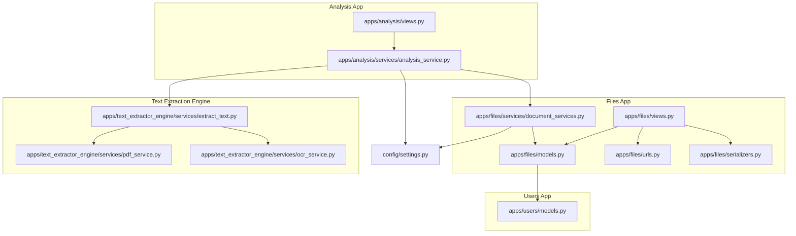
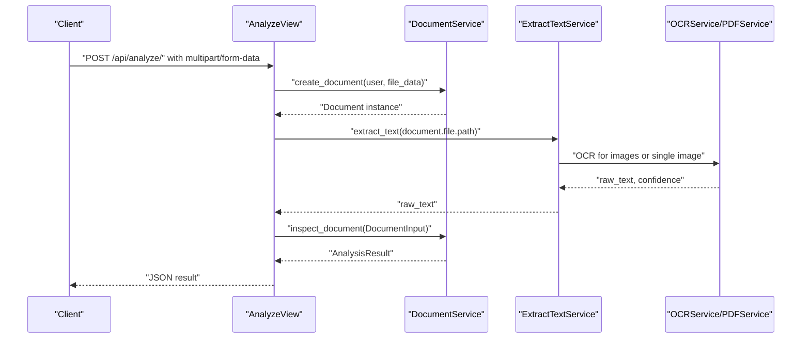
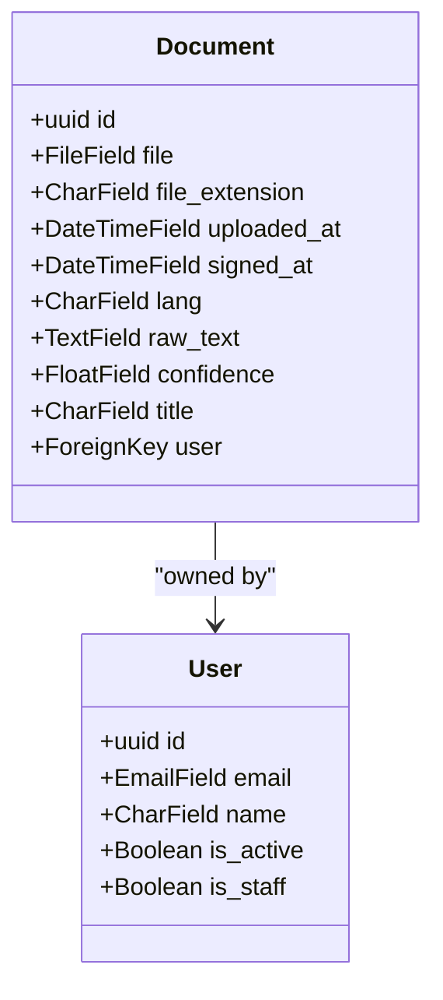
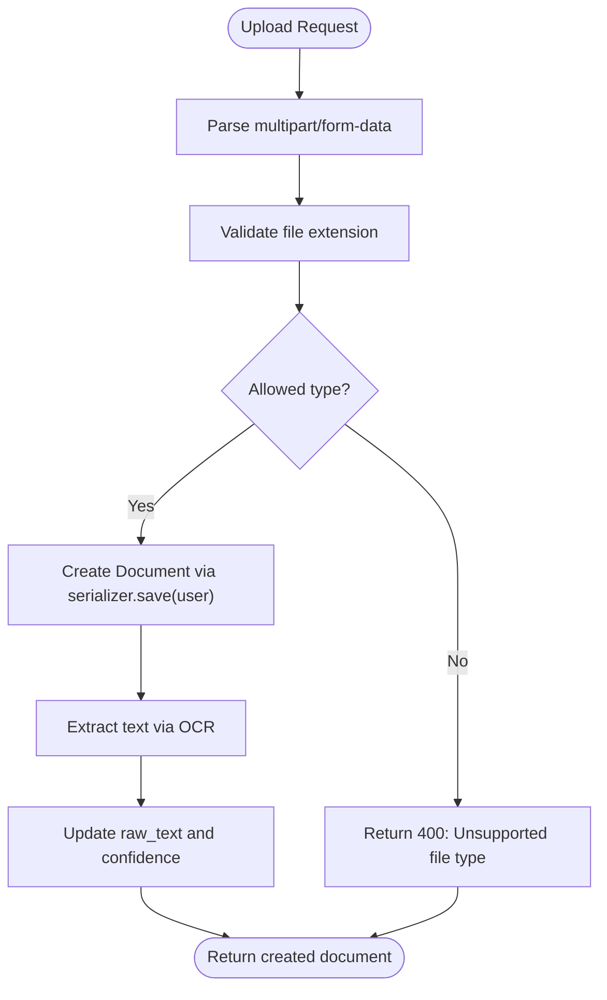
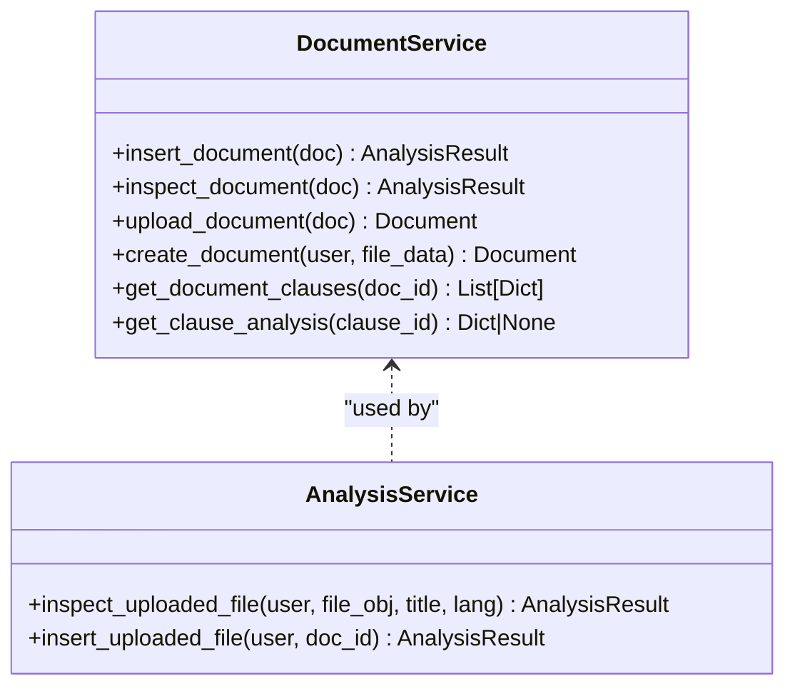
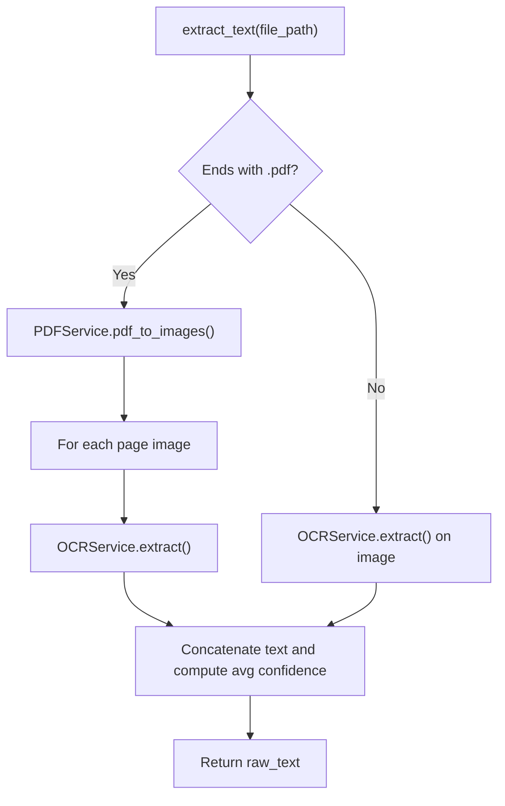
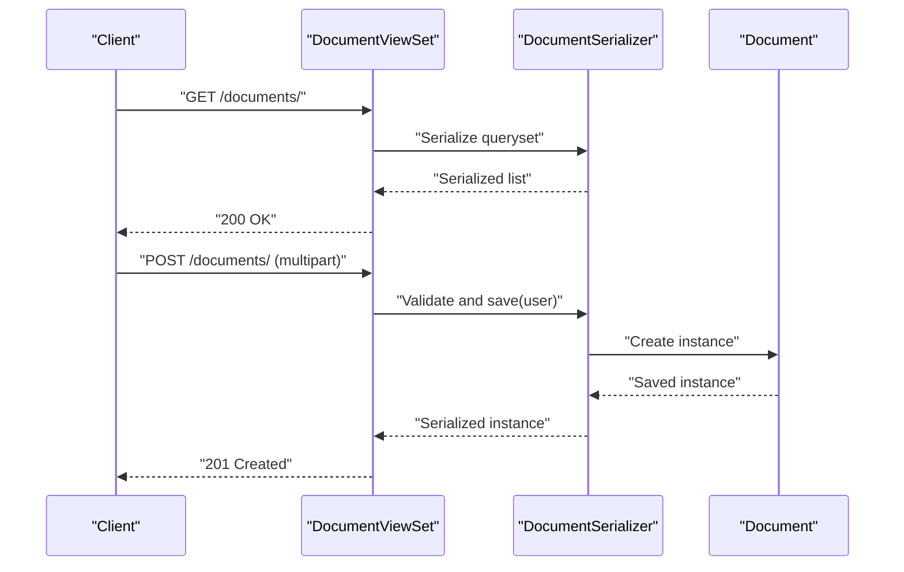
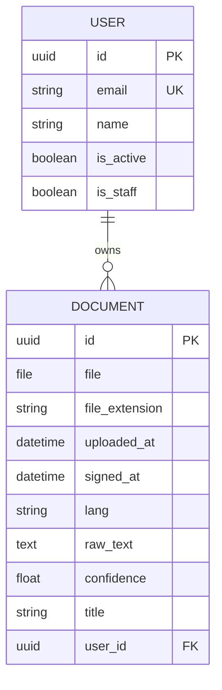
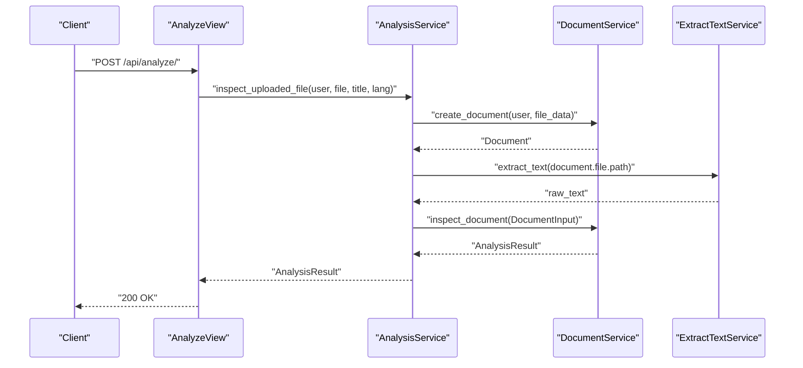
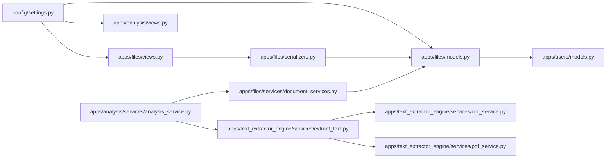

# Document Management

<cite>
**Referenced Files in This Document**
- [models.py](file://apps/files/models.py)
- [document_services.py](file://apps/files/services/document_services.py)
- [serializers.py](file://apps/files/serializers.py)
- [views.py](file://apps/files/views.py)
- [urls.py](file://apps/files/urls.py)
- [0001_initial.py](file://apps/files/migrations/0001_initial.py)
- [0002_initial.py](file://apps/files/migrations/0002_initial.py)
- [settings.py](file://config/settings.py)
- [models.py](file://apps/users/models.py)
- [pdf_service.py](file://apps/text_extractor_engine/services/pdf_service.py)
- [ocr_service.py](file://apps/text_extractor_engine/services/ocr_service.py)
- [extract_text.py](file://apps/text_extractor_engine/services/extract_text.py)
- [analysis_service.py](file://apps/analysis/services/analysis_service.py)
- [views.py](file://apps/analysis/views.py)
</cite>

## Table of Contents
1. [Introduction](#introduction)
2. [Project Structure](#project-structure)
3. [Core Components](#core-components)
4. [Architecture Overview](#architecture-overview)
5. [Detailed Component Analysis](#detailed-component-analysis)
6. [Dependency Analysis](#dependency-analysis)
7. [Performance Considerations](#performance-considerations)
8. [Troubleshooting Guide](#troubleshooting-guide)
9. [Conclusion](#conclusion)
10. [Appendices](#appendices)

## Introduction
This document describes the document management system for VeritasShield. It covers the Document model, file upload and validation, metadata handling, OCR-based text extraction, document processing workflows, and the services that orchestrate storage, metadata extraction, and AI-driven analysis. It also outlines ownership and access controls, filtering/searching/pagination capabilities, and error handling strategies.

## Project Structure
The document management system spans several Django apps:
- files: Defines the Document model, serializers, views, and services for CRUD and upload.
- analysis: Provides higher-level orchestration for OCR and AI inspection/insertion.
- text_extractor_engine: Implements OCR and PDF-to-image conversion.
- users: Defines the user model and authentication integration.
- config: Central Django settings including media handling and REST framework configuration.

**Diagram sources**
- [models.py:5-17](file://apps/files/models.py#L5-L17)
- [document_services.py:14-81](file://apps/files/services/document_services.py#L14-L81)
- [views.py:8-11](file://apps/files/views.py#L8-L11)
- [urls.py:6-23](file://apps/files/urls.py#L6-L23)
- [serializers.py:6-61](file://apps/files/serializers.py#L6-L61)
- [analysis_service.py:16-50](file://apps/analysis/services/analysis_service.py#L16-L50)
- [pdf_service.py:4-14](file://apps/text_extractor_engine/services/pdf_service.py#L4-L14)
- [ocr_service.py:6-17](file://apps/text_extractor_engine/services/ocr_service.py#L6-L17)
- [extract_text.py:5-27](file://apps/text_extractor_engine/services/extract_text.py#L5-L27)
- [models.py:29-45](file://apps/users/models.py#L29-L45)
- [settings.py:122-137](file://config/settings.py#L122-L137)

**Section sources**
- [models.py:5-17](file://apps/files/models.py#L5-L17)
- [serializers.py:6-61](file://apps/files/serializers.py#L6-L61)
- [views.py:8-11](file://apps/files/views.py#L8-L11)
- [urls.py:6-23](file://apps/files/urls.py#L6-L23)
- [settings.py:122-137](file://config/settings.py#L122-L137)

## Core Components
- Document model: Stores file metadata, ownership, timestamps, language, extracted text, confidence, and optional signing date.
- Serializers: Define which fields are exposed in APIs, read-only fields, and basic validation.
- Views: Provide CRUD endpoints backed by a ModelViewSet and additional analysis endpoints.
- Services: Orchestrate document creation, OCR text extraction, and AI inspection/insertion.
- Text extraction engine: Converts PDFs to images and performs OCR to produce raw text.
- Users app: Provides the user model referenced by the Document model.

Key model fields and their roles:
- file: Uploaded file stored under media/contracts/.
- user: Owner of the document (foreign key to AUTH_USER_MODEL).
- file_extension: Captured extension for downstream processing.
- uploaded_at: Timestamp of creation.
- signed_at: Optional timestamp for signature date.
- lang: Language hint for processing.
- raw_text: Extracted text from OCR.
- confidence: Average OCR confidence score.
- title: Optional human-readable title.

Validation and parsing:
- Multi-part parser enabled for file uploads.
- File type validation in the DocumentCreateSerializer restricts uploads to specific extensions.
- Media settings define MEDIA_URL and MEDIA_ROOT for serving uploaded files.

**Section sources**
- [models.py:5-17](file://apps/files/models.py#L5-L17)
- [serializers.py:48-52](file://apps/files/serializers.py#L48-L52)
- [settings.py:129-132](file://config/settings.py#L129-L132)
- [settings.py:122-123](file://config/settings.py#L122-L123)

## Architecture Overview
The system supports two primary flows:
- Direct upload flow: Upload a file, extract text via OCR, and optionally analyze via AI pipelines.
- AI insertion flow: Insert a previously inspected document into the knowledge graph.

**Diagram sources**
- [views.py:15-42](file://apps/analysis/views.py#L15-L42)
- [analysis_service.py:18-50](file://apps/analysis/services/analysis_service.py#L18-L50)
- [document_services.py:22-62](file://apps/files/services/document_services.py#L22-L62)
- [extract_text.py:10-27](file://apps/text_extractor_engine/services/extract_text.py#L10-L27)
- [ocr_service.py:7-17](file://apps/text_extractor_engine/services/ocr_service.py#L7-L17)
- [pdf_service.py:5-14](file://apps/text_extractor_engine/services/pdf_service.py#L5-L14)

## Detailed Component Analysis

### Document Model
The Document model encapsulates file metadata, ownership, and processing state.

**Diagram sources**
- [models.py:5-17](file://apps/files/models.py#L5-L17)
- [models.py:29-45](file://apps/users/models.py#L29-L45)

**Section sources**
- [models.py:5-17](file://apps/files/models.py#L5-L17)
- [0001_initial.py:14-27](file://apps/files/migrations/0001_initial.py#L14-L27)
- [0002_initial.py:18-22](file://apps/files/migrations/0002_initial.py#L18-L22)

### File Upload and Validation
- Supported formats: The serializer enforces file extensions for upload.
- Parser support: MultiPartParser enables form-data uploads.
- Media storage: Files are stored under MEDIA_ROOT/media/contracts/.

**Diagram sources**
- [serializers.py:48-52](file://apps/files/serializers.py#L48-L52)
- [serializers.py:54-60](file://apps/files/serializers.py#L54-L60)
- [settings.py:129-132](file://config/settings.py#L129-L132)
- [settings.py:122-123](file://config/settings.py#L122-L123)

**Section sources**
- [serializers.py:48-52](file://apps/files/serializers.py#L48-L52)
- [settings.py:129-132](file://config/settings.py#L129-L132)
- [settings.py:122-123](file://config/settings.py#L122-L123)

### Document Services
The DocumentService orchestrates AI pipelines for inspection and insertion, and exposes helpers for creating documents and retrieving clauses.

**Diagram sources**
- [document_services.py:14-81](file://apps/files/services/document_services.py#L14-L81)
- [analysis_service.py:16-80](file://apps/analysis/services/analysis_service.py#L16-L80)

**Section sources**
- [document_services.py:14-81](file://apps/files/services/document_services.py#L14-L81)
- [analysis_service.py:16-80](file://apps/analysis/services/analysis_service.py#L16-L80)

### Text Extraction Engine
The extraction pipeline converts PDFs to images and runs OCR, aggregating text and computing average confidence.

**Diagram sources**
- [extract_text.py:10-27](file://apps/text_extractor_engine/services/extract_text.py#L10-L27)
- [pdf_service.py:5-14](file://apps/text_extractor_engine/services/pdf_service.py#L5-L14)
- [ocr_service.py:7-17](file://apps/text_extractor_engine/services/ocr_service.py#L7-L17)

**Section sources**
- [extract_text.py:10-27](file://apps/text_extractor_engine/services/extract_text.py#L10-L27)
- [pdf_service.py:5-14](file://apps/text_extractor_engine/services/pdf_service.py#L5-L14)
- [ocr_service.py:7-17](file://apps/text_extractor_engine/services/ocr_service.py#L7-L17)

### CRUD Operations and Access Controls
- CRUD endpoints: The DocumentViewSet exposes list/create/retrieve/update/delete actions.
- Authentication: JWT is configured as the default authentication class.
- Authorization: The DocumentViewSet currently requires admin users; adjust as needed for role-based access.
- Pagination and filtering: Not explicitly implemented in the provided files; consider adding filters and pagination in views or serializers.

**Diagram sources**
- [views.py:8-11](file://apps/files/views.py#L8-L11)
- [serializers.py:6-29](file://apps/files/serializers.py#L6-L29)
- [settings.py:125-137](file://config/settings.py#L125-L137)

**Section sources**
- [views.py:8-11](file://apps/files/views.py#L8-L11)
- [serializers.py:6-29](file://apps/files/serializers.py#L6-L29)
- [settings.py:125-137](file://config/settings.py#L125-L137)

### Relationship Between Users and Documents
- Ownership: Documents belong to users via a foreign key to AUTH_USER_MODEL.
- Authentication integration: The AUTH_USER_MODEL setting points to the users app’s User model.
- Access control: The DocumentViewSet currently restricts access to admin users; tailor permissions for multi-user scenarios.

**Diagram sources**
- [models.py:29-45](file://apps/users/models.py#L29-L45)
- [models.py:7-7](file://apps/files/models.py#L7-L7)
- [settings.py:144-144](file://config/settings.py#L144-L144)

**Section sources**
- [models.py:7-7](file://apps/files/models.py#L7-L7)
- [models.py:29-45](file://apps/users/models.py#L29-L45)
- [settings.py:144-144](file://config/settings.py#L144-L144)

### Document Processing Workflows
- Inspect workflow: Upload -> Create document -> OCR extraction -> Build DocumentInput -> Inspect via AI -> Return analysis result.
- Insert workflow: Ensure document has raw_text -> Build DocumentInput -> Insert into knowledge graph.

**Diagram sources**
- [views.py:15-42](file://apps/analysis/views.py#L15-L42)
- [analysis_service.py:18-50](file://apps/analysis/services/analysis_service.py#L18-L50)
- [document_services.py:22-62](file://apps/files/services/document_services.py#L22-L62)

**Section sources**
- [analysis_service.py:18-50](file://apps/analysis/services/analysis_service.py#L18-L50)
- [document_services.py:22-62](file://apps/files/services/document_services.py#L22-L62)

## Dependency Analysis
- Django ORM: Document model depends on AUTH_USER_MODEL.
- REST Framework: Serializers and views rely on DRF for validation and rendering.
- Media handling: MEDIA_URL and MEDIA_ROOT define storage and serving paths.
- AI engine: DocumentService integrates with external pipelines for inspection and insertion.
- Text extraction: ExtractTextService composes OCRService and PDFService.

**Diagram sources**
- [settings.py:122-137](file://config/settings.py#L122-L137)
- [models.py:5-17](file://apps/files/models.py#L5-L17)
- [views.py:8-11](file://apps/files/views.py#L8-L11)
- [serializers.py:6-29](file://apps/files/serializers.py#L6-L29)
- [document_services.py:14-81](file://apps/files/services/document_services.py#L14-L81)
- [analysis_service.py:16-50](file://apps/analysis/services/analysis_service.py#L16-L50)
- [extract_text.py:5-27](file://apps/text_extractor_engine/services/extract_text.py#L5-L27)
- [ocr_service.py:6-17](file://apps/text_extractor_engine/services/ocr_service.py#L6-L17)
- [pdf_service.py:4-14](file://apps/text_extractor_engine/services/pdf_service.py#L4-L14)
- [models.py:29-45](file://apps/users/models.py#L29-L45)

**Section sources**
- [settings.py:122-137](file://config/settings.py#L122-L137)
- [models.py:5-17](file://apps/files/models.py#L5-L17)
- [document_services.py:14-81](file://apps/files/services/document_services.py#L14-L81)
- [analysis_service.py:16-50](file://apps/analysis/services/analysis_service.py#L16-L50)

## Performance Considerations
- OCR cost: PDFs are converted to images; consider optimizing by limiting pages or resolution.
- Storage: Large PDFs increase I/O and OCR time; implement size limits in serializers.
- Concurrency: Offload OCR and AI processing to background tasks for scalability.
- Caching: Cache repeated OCR results for identical documents.
- Pagination: Add pagination to list endpoints to avoid large payloads.

[No sources needed since this section provides general guidance]

## Troubleshooting Guide
Common issues and resolutions:
- Unsupported file type: Ensure the file extension matches allowed types in the serializer.
- Missing file in multipart payload: Verify the field name and content type.
- OCR failure: Confirm OCR dependencies are installed and accessible; handle exceptions and return structured error responses.
- Missing raw_text before insertion: The insert workflow requires prior inspection to populate raw_text.

**Section sources**
- [serializers.py:48-52](file://apps/files/serializers.py#L48-L52)
- [views.py:33-38](file://apps/analysis/views.py#L33-L38)
- [analysis_service.py:62-65](file://apps/analysis/services/analysis_service.py#L62-L65)

## Conclusion
VeritasShield’s document management system provides a robust foundation for uploading, validating, extracting text, and analyzing legal contracts. The Document model captures essential metadata and processing state, while services orchestrate OCR and AI pipelines. Current limitations include admin-only access and lack of explicit filtering/pagination; extending these capabilities will improve usability and scalability.

[No sources needed since this section summarizes without analyzing specific files]

## Appendices

### API Endpoints
- GET /documents/: List all documents (admin-only).
- POST /documents/: Create a new document (admin-only).
- GET /documents/{id}/: Retrieve a document (admin-only).
- PUT /documents/{id}/: Update a document (admin-only).
- DELETE /documents/{id}/: Delete a document (admin-only).
- POST /api/analyze/: Upload and analyze a document (authenticated).

**Section sources**
- [urls.py:6-23](file://apps/files/urls.py#L6-L23)
- [views.py:8-11](file://apps/files/views.py#L8-L11)
- [views.py:15-42](file://apps/analysis/views.py#L15-L42)