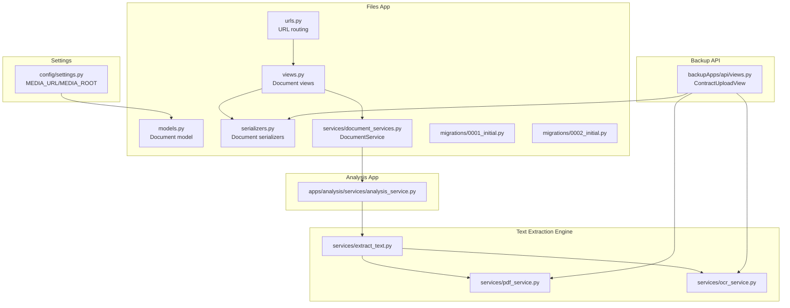
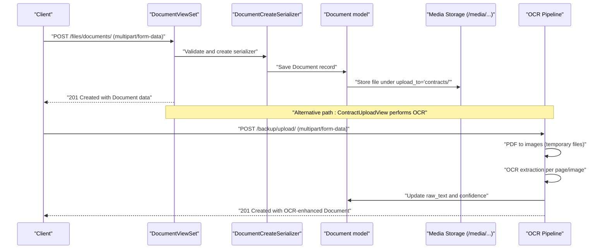
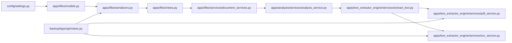

# Document Storage and Retrieval

<cite>
**Referenced Files in This Document**
- [document_services.py](file://apps/files/services/document_services.py)
- [models.py](file://apps/files/models.py)
- [views.py](file://apps/files/views.py)
- [serializers.py](file://apps/files/serializers.py)
- [urls.py](file://apps/files/urls.py)
- [settings.py](file://config/settings.py)
- [0001_initial.py](file://apps/files/migrations/0001_initial.py)
- [0002_initial.py](file://apps/files/migrations/0002_initial.py)
- [views.py](file://backupApps/api/views.py)
- [analysis_service.py](file://apps/analysis/services/analysis_service.py)
- [extract_text.py](file://apps/text_extractor_engine/services/extract_text.py)
- [pdf_service.py](file://apps/text_extractor_engine/services/pdf_service.py)
- [ocr_service.py](file://apps/text_extractor_engine/services/ocr_service.py)
</cite>

## Table of Contents
1. [Introduction](#introduction)
2. [Project Structure](#project-structure)
3. [Core Components](#core-components)
4. [Architecture Overview](#architecture-overview)
5. [Detailed Component Analysis](#detailed-component-analysis)
6. [Dependency Analysis](#dependency-analysis)
7. [Performance Considerations](#performance-considerations)
8. [Troubleshooting Guide](#troubleshooting-guide)
9. [Conclusion](#conclusion)

## Introduction
This document explains the document storage and retrieval system, focusing on how files are persisted, organized, and processed. It covers the upload_to="contracts/" path configuration, media file handling, the services layer responsible for persistence and retrieval, storage optimization strategies, file naming conventions, and directory structure. It also documents download workflows, temporary file management, cleanup procedures, and scalability considerations for large file storage and retrieval performance.

## Project Structure
The document storage system spans several modules:
- File model and migrations define the database schema and storage path.
- Serializers validate and prepare file uploads.
- Views orchestrate upload and retrieval endpoints.
- Services encapsulate business logic for document creation, OCR processing, and AI-driven analysis.
- Settings configure media storage location and parsers for uploads.

**Diagram sources**
- [models.py:5-17](file://apps/files/models.py#L5-L17)
- [serializers.py:6-61](file://apps/files/serializers.py#L6-L61)
- [views.py:11-32](file://apps/files/views.py#L11-L32)
- [urls.py:1-24](file://apps/files/urls.py#L1-L24)
- [document_services.py:14-124](file://apps/files/services/document_services.py#L14-L124)
- [0001_initial.py:14-28](file://apps/files/migrations/0001_initial.py#L14-L28)
- [0002_initial.py:18-23](file://apps/files/migrations/0002_initial.py#L18-L23)
- [settings.py:122-124](file://config/settings.py#L122-L124)
- [analysis_service.py:16-43](file://apps/analysis/services/analysis_service.py#L16-L43)
- [extract_text.py:5-27](file://apps/text_extractor_engine/services/extract_text.py#L5-L27)
- [pdf_service.py:4-15](file://apps/text_extractor_engine/services/pdf_service.py#L4-L15)
- [ocr_service.py:6-18](file://apps/text_extractor_engine/services/ocr_service.py#L6-L18)
- [views.py:14-93](file://backupApps/api/views.py#L14-L93)

**Section sources**
- [models.py:5-17](file://apps/files/models.py#L5-L17)
- [serializers.py:6-61](file://apps/files/serializers.py#L6-L61)
- [views.py:11-32](file://apps/files/views.py#L11-L32)
- [urls.py:1-24](file://apps/files/urls.py#L1-L24)
- [document_services.py:14-124](file://apps/files/services/document_services.py#L14-L124)
- [0001_initial.py:14-28](file://apps/files/migrations/0001_initial.py#L14-L28)
- [0002_initial.py:18-23](file://apps/files/migrations/0002_initial.py#L18-L23)
- [settings.py:122-124](file://config/settings.py#L122-L124)
- [analysis_service.py:16-43](file://apps/analysis/services/analysis_service.py#L16-L43)
- [extract_text.py:5-27](file://apps/text_extractor_engine/services/extract_text.py#L5-L27)
- [pdf_service.py:4-15](file://apps/text_extractor_engine/services/pdf_service.py#L4-L15)
- [ocr_service.py:6-18](file://apps/text_extractor_engine/services/ocr_service.py#L6-L18)
- [views.py:14-93](file://backupApps/api/views.py#L14-L93)

## Core Components
- Document model defines the file field with upload_to="contracts/", linking to the authenticated user, and additional metadata fields.
- Serializers validate incoming uploads and control which fields are writable/read-only.
- Views provide endpoints for listing, creating, retrieving, updating, deleting documents, and a dedicated clause retrieval endpoint.
- Services encapsulate document creation, OCR processing, and AI analysis workflows.
- Settings configure MEDIA_URL and MEDIA_ROOT for serving media files and enable multipart parsing for uploads.

Key responsibilities:
- Persistence: Document model and serializers persist file metadata and associations.
- Retrieval: Views and serializers serve file URLs and metadata; media serving uses MEDIA_URL and MEDIA_ROOT.
- Processing: OCR extraction and text processing are handled by text extraction services.
- Cleanup: Temporary files generated during PDF-to-image conversion are managed by the PDF service.

**Section sources**
- [models.py:5-17](file://apps/files/models.py#L5-L17)
- [serializers.py:32-61](file://apps/files/serializers.py#L32-L61)
- [views.py:11-32](file://apps/files/views.py#L11-L32)
- [document_services.py:14-124](file://apps/files/services/document_services.py#L14-L124)
- [settings.py:122-137](file://config/settings.py#L122-L137)

## Architecture Overview
The system supports two primary upload paths:
- Standard DRF ModelViewSet endpoints under the files app.
- Backup API endpoint that performs OCR processing and returns enriched metadata.

Both paths rely on the same underlying model and media configuration.

**Diagram sources**
- [views.py:11-32](file://apps/files/views.py#L11-L32)
- [serializers.py:32-61](file://apps/files/serializers.py#L32-L61)
- [models.py:5-17](file://apps/files/models.py#L5-L17)
- [settings.py:122-124](file://config/settings.py#L122-L124)
- [views.py:14-93](file://backupApps/api/views.py#L14-L93)
- [pdf_service.py:4-15](file://apps/text_extractor_engine/services/pdf_service.py#L4-L15)
- [ocr_service.py:6-18](file://apps/text_extractor_engine/services/ocr_service.py#L6-L18)

## Detailed Component Analysis

### Document Model and Storage Path
- The Document model stores a FileField with upload_to="contracts/", ensuring files are stored under the configured MEDIA_ROOT/contracts/ directory.
- The model links to the authenticated user and includes metadata fields such as file extension, timestamps, language, raw text, confidence, and optional title.
- Migrations establish the base schema and later add the user foreign key.

Storage path behavior:
- MEDIA_ROOT is configured in settings.py as the base directory for media files.
- upload_to="contracts/" creates a subdirectory "contracts" under MEDIA_ROOT.
- The resulting file path resolves to MEDIA_ROOT/contracts/<filename>.

File naming and uniqueness:
- Django ensures filename uniqueness to avoid collisions; the exact resolved path is available via the model’s file.path property.

**Section sources**
- [models.py:5-17](file://apps/files/models.py#L5-L17)
- [0001_initial.py:14-28](file://apps/files/migrations/0001_initial.py#L14-L28)
- [0002_initial.py:18-23](file://apps/files/migrations/0002_initial.py#L18-L23)
- [settings.py:122-124](file://config/settings.py#L122-L124)

### Serializers and Validation
- DocumentCreateSerializer controls which fields clients can submit and which are read-only.
- Validation includes restricting supported file extensions to PDF, JPG, PNG, and JPEG.
- The create method delegates to the parent serializer to persist the model instance.

Validation and persistence:
- The serializer validates input and raises errors for unsupported types.
- The service layer passes the validated data to the model for persistence.

**Section sources**
- [serializers.py:32-61](file://apps/files/serializers.py#L32-L61)
- [document_services.py:83-110](file://apps/files/services/document_services.py#L83-L110)

### Views and Endpoints
- DocumentViewSet exposes standard CRUD operations for documents.
- A dedicated endpoint retrieves clauses associated with a document.
- The backup API provides an alternate upload path that performs OCR processing and returns enriched metadata.

Endpoints:
- Files app: GET/POST /files/documents/, GET/PUT/DELETE /files/documents/{id}/, GET /files/documents/{doc_id}/clauses/
- Backup app: POST /backup/upload/

Permissions:
- DocumentViewSet uses IsAdminUser for write operations.
- Clause retrieval requires IsAuthenticated.
- Backup upload requires IsAuthenticated.

**Section sources**
- [views.py:11-32](file://apps/files/views.py#L11-L32)
- [urls.py:6-23](file://apps/files/urls.py#L6-L23)
- [views.py:14-93](file://backupApps/api/views.py#L14-L93)

### Services Layer: Persistence, Retrieval, and Cleanup
- DocumentService orchestrates document insertion, inspection, and clause retrieval. It integrates with AI/ML pipelines for analysis.
- The create_document method initializes the serializer, validates, and persists the model instance with the authenticated user.
- OCR processing is performed by ExtractTextService, which converts PDFs to images and runs OCR on each page, aggregating text and confidence scores.
- Temporary files are created during PDF-to-image conversion and saved alongside the original PDF with suffixes indicating pages.

Cleanup:
- The PDF service saves intermediate images to disk; these are local temporary files generated during processing.
- No explicit cleanup routine is present in the current code; consider implementing a scheduled cleanup job or pre-delete hooks to remove temporary files.

**Section sources**
- [document_services.py:14-124](file://apps/files/services/document_services.py#L14-L124)
- [analysis_service.py:16-43](file://apps/analysis/services/analysis_service.py#L16-L43)
- [extract_text.py:5-27](file://apps/text_extractor_engine/services/extract_text.py#L5-L27)
- [pdf_service.py:4-15](file://apps/text_extractor_engine/services/pdf_service.py#L4-L15)

### Media File Handling and Serving
- MEDIA_URL="/media/" and MEDIA_ROOT configured in settings.py define the URL prefix and filesystem path for media assets.
- When a Document is saved, the file is stored under MEDIA_ROOT/contracts/<filename>.
- Serving media in development relies on Django serving static/media files; in production, reverse proxies or CDN configurations should be applied.

Security and access:
- Authentication and permission classes restrict access to endpoints.
- Ensure proper file permissions and consider virus scanning and access logging for production deployments.

**Section sources**
- [settings.py:122-124](file://config/settings.py#L122-L124)
- [models.py:5-17](file://apps/files/models.py#L5-L17)

### Download Workflows
- Clients retrieve document metadata via the files app endpoints.
- The file URL is served under MEDIA_URL, allowing clients to download the file using the documented path.
- For OCR-enhanced documents, the backup upload endpoint returns updated raw_text and confidence after processing.

Example flow:
- Upload: POST /files/documents/ or POST /backup/upload/
- Retrieve: GET /files/documents/{id}/ or GET /files/documents/{doc_id}/clauses/
- Download: Access MEDIA_URL + file path constructed from MEDIA_ROOT and upload_to

**Section sources**
- [urls.py:6-23](file://apps/files/urls.py#L6-L23)
- [views.py:14-93](file://backupApps/api/views.py#L14-L93)
- [settings.py:122-124](file://config/settings.py#L122-L124)

### Temporary File Management and Cleanup Procedures
- During PDF processing, pages are converted to images and saved locally with deterministic filenames based on the original PDF path.
- These temporary files are created alongside the PDF and can accumulate if not cleaned up.
- Recommended cleanup procedures:
  - Pre-delete hook on Document deletion to remove associated temporary images.
  - Scheduled job to clean orphaned temporary files older than a threshold.
  - Container-level cleanup scripts for ephemeral environments.

**Section sources**
- [pdf_service.py:4-15](file://apps/text_extractor_engine/services/pdf_service.py#L4-L15)
- [views.py:14-93](file://backupApps/api/views.py#L14-L93)

## Dependency Analysis
The document storage system exhibits layered dependencies:
- Views depend on serializers and services.
- Services depend on models and external OCR/PDF libraries.
- Settings influence media path resolution and parser behavior.
- Migrations define the schema and storage path.

**Diagram sources**
- [settings.py:122-124](file://config/settings.py#L122-L124)
- [models.py:5-17](file://apps/files/models.py#L5-L17)
- [serializers.py:6-61](file://apps/files/serializers.py#L6-L61)
- [views.py:11-32](file://apps/files/views.py#L11-L32)
- [document_services.py:14-124](file://apps/files/services/document_services.py#L14-L124)
- [analysis_service.py:16-43](file://apps/analysis/services/analysis_service.py#L16-L43)
- [extract_text.py:5-27](file://apps/text_extractor_engine/services/extract_text.py#L5-L27)
- [pdf_service.py:4-15](file://apps/text_extractor_engine/services/pdf_service.py#L4-L15)
- [ocr_service.py:6-18](file://apps/text_extractor_engine/services/ocr_service.py#L6-L18)
- [views.py:14-93](file://backupApps/api/views.py#L14-L93)

**Section sources**
- [settings.py:122-124](file://config/settings.py#L122-L124)
- [models.py:5-17](file://apps/files/models.py#L5-L17)
- [serializers.py:6-61](file://apps/files/serializers.py#L6-L61)
- [views.py:11-32](file://apps/files/views.py#L11-L32)
- [document_services.py:14-124](file://apps/files/services/document_services.py#L14-L124)
- [analysis_service.py:16-43](file://apps/analysis/services/analysis_service.py#L16-L43)
- [extract_text.py:5-27](file://apps/text_extractor_engine/services/extract_text.py#L5-L27)
- [pdf_service.py:4-15](file://apps/text_extractor_engine/services/pdf_service.py#L4-L15)
- [ocr_service.py:6-18](file://apps/text_extractor_engine/services/ocr_service.py#L6-L18)
- [views.py:14-93](file://backupApps/api/views.py#L14-L93)

## Performance Considerations
- File size limits: Configure Django and web server limits to prevent oversized uploads.
- Concurrency: Use asynchronous workers for OCR processing to avoid blocking requests.
- Caching: Cache frequently accessed metadata and processed text to reduce repeated OCR work.
- Storage: For large-scale deployments, offload media to cloud storage with CDN and signed URLs for secure downloads.
- Indexing: Index user and timestamp fields for efficient querying.
- Compression: Consider compressing PDFs before OCR to reduce processing time.
- Parallelization: Process PDF pages in parallel and aggregate results efficiently.

[No sources needed since this section provides general guidance]

## Troubleshooting Guide
Common issues and resolutions:
- Unsupported file type: Ensure uploads conform to allowed extensions enforced by the serializer.
- Media serving failures: Verify MEDIA_URL and MEDIA_ROOT configuration and that the media directory exists.
- OCR processing errors: Check that OCR libraries are installed and accessible; confirm PDF conversion steps succeed.
- Temporary file accumulation: Implement cleanup routines to remove intermediate images after processing.
- Permission errors: Confirm that the application has write permissions to MEDIA_ROOT and appropriate read permissions for downloads.

**Section sources**
- [serializers.py:48-52](file://apps/files/serializers.py#L48-L52)
- [settings.py:122-124](file://config/settings.py#L122-L124)
- [views.py:14-93](file://backupApps/api/views.py#L14-L93)
- [pdf_service.py:4-15](file://apps/text_extractor_engine/services/pdf_service.py#L4-L15)

## Conclusion
The document storage and retrieval system leverages Django’s FileField with upload_to="contracts/" and centralized media configuration for robust file handling. The services layer integrates OCR and AI processing, while serializers and views enforce validation and access control. For production, consider offloading media to scalable storage, implementing cleanup for temporary files, and optimizing OCR throughput to support large-scale document processing and retrieval.