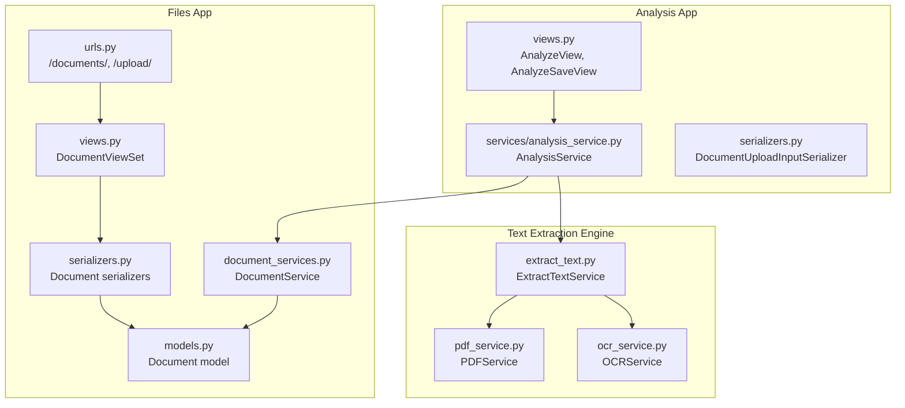
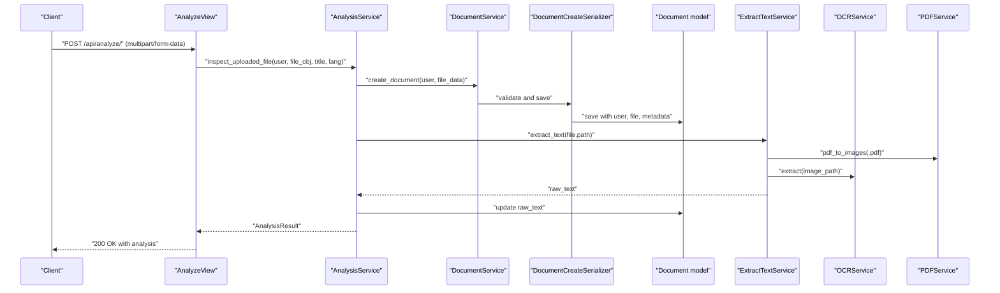
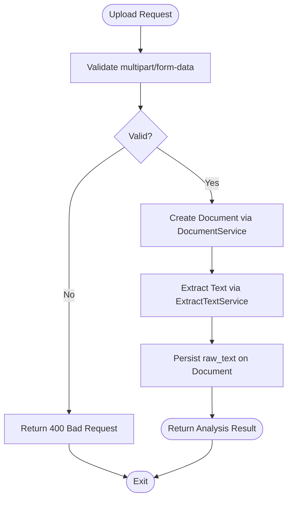
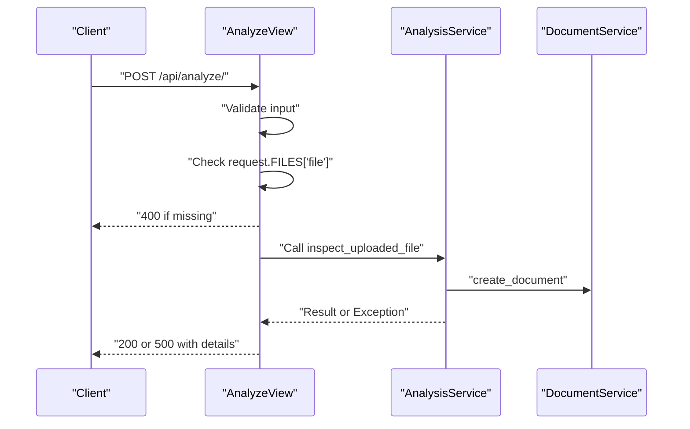
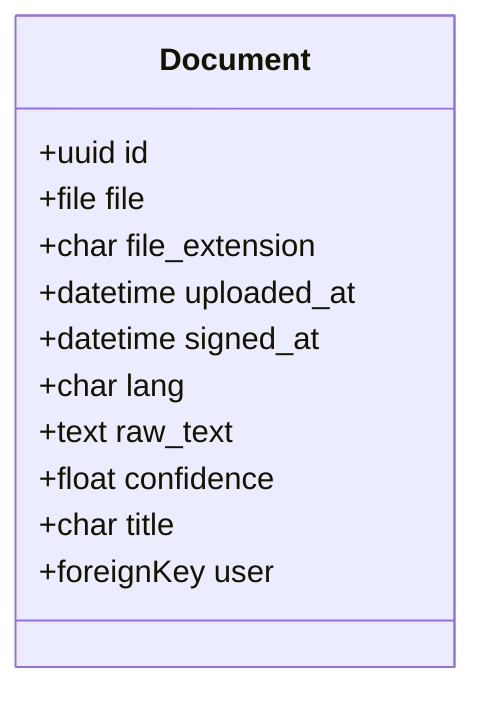
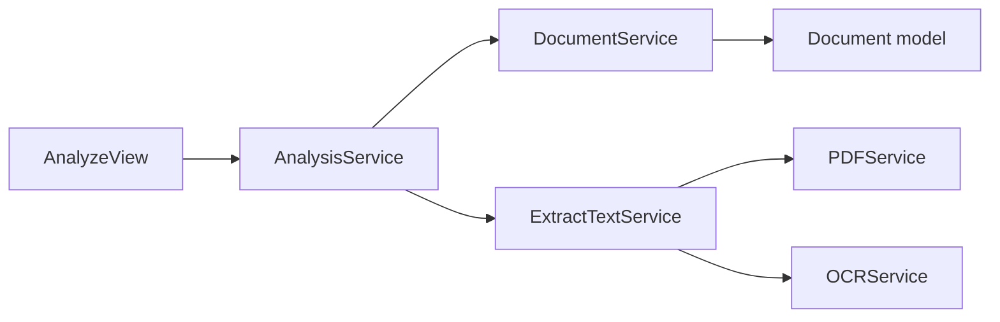

# File Upload and Validation

<cite>
**Referenced Files in This Document**
- [models.py](file://apps/files/models.py)
- [serializers.py](file://apps/files/serializers.py)
- [document_services.py](file://apps/files/services/document_services.py)
- [urls.py](file://apps/files/urls.py)
- [views.py](file://apps/files/views.py)
- [0001_initial.py](file://apps/files/migrations/0001_initial.py)
- [0002_initial.py](file://apps/files/migrations/0002_initial.py)
- [analysis_service.py](file://apps/analysis/services/analysis_service.py)
- [views.py](file://apps/analysis/views.py)
- [serializers.py](file://apps/analysis/serializers.py)
- [extract_text.py](file://apps/text_extractor_engine/services/extract_text.py)
- [pdf_service.py](file://apps/text_extractor_engine/services/pdf_service.py)
- [ocr_service.py](file://apps/text_extractor_engine/services/ocr_service.py)
</cite>

## Table of Contents
1. [Introduction](#introduction)
2. [Project Structure](#project-structure)
3. [Core Components](#core-components)
4. [Architecture Overview](#architecture-overview)
5. [Detailed Component Analysis](#detailed-component-analysis)
6. [Dependency Analysis](#dependency-analysis)
7. [Performance Considerations](#performance-considerations)
8. [Troubleshooting Guide](#troubleshooting-guide)
9. [Conclusion](#conclusion)

## Introduction
This document explains the file upload and validation mechanisms in the Document Management system. It covers supported file formats, validation rules, upload flow, OCR-based content extraction, and the relationship between uploaded files and the Document model fields such as file_extension, uploaded_at, and user association. It also outlines error handling and security considerations observed in the current implementation.

## Project Structure
The file upload pipeline spans several modules:
- Files app: model definition, serializers, services, and views for basic document handling
- Analysis app: orchestration of OCR and inspection after upload
- Text extraction engine: OCR and PDF conversion utilities
- URLs: routing for document endpoints

**Diagram sources**
- [models.py:5-17](file://apps/files/models.py#L5-L17)
- [serializers.py:6-61](file://apps/files/serializers.py#L6-L61)
- [document_services.py:83-110](file://apps/files/services/document_services.py#L83-L110)
- [urls.py:6-23](file://apps/files/urls.py#L6-L23)
- [views.py:8-11](file://apps/files/views.py#L8-L11)
- [views.py:15-56](file://apps/analysis/views.py#L15-L56)
- [analysis_service.py:16-50](file://apps/analysis/services/analysis_service.py#L16-L50)
- [extract_text.py:5-27](file://apps/text_extractor_engine/services/extract_text.py#L5-L27)
- [pdf_service.py:4-14](file://apps/text_extractor_engine/services/pdf_service.py#L4-L14)
- [ocr_service.py:6-17](file://apps/text_extractor_engine/services/ocr_service.py#L6-L17)

**Section sources**
- [models.py:5-17](file://apps/files/models.py#L5-L17)
- [serializers.py:6-61](file://apps/files/serializers.py#L6-L61)
- [document_services.py:83-110](file://apps/files/services/document_services.py#L83-L110)
- [urls.py:6-23](file://apps/files/urls.py#L6-L23)
- [views.py:8-11](file://apps/files/views.py#L8-L11)
- [views.py:15-56](file://apps/analysis/views.py#L15-L56)
- [analysis_service.py:16-50](file://apps/analysis/services/analysis_service.py#L16-L50)
- [extract_text.py:5-27](file://apps/text_extractor_engine/services/extract_text.py#L5-L27)
- [pdf_service.py:4-14](file://apps/text_extractor_engine/services/pdf_service.py#L4-L14)
- [ocr_service.py:6-17](file://apps/text_extractor_engine/services/ocr_service.py#L6-L17)

## Core Components
- Document model: stores file path, user relation, extension, timestamps, language, extracted text, confidence, and optional title.
- Document serializers: define which fields are exposed and read-only; include a custom validator for file extension.
- DocumentService: orchestrates document creation and integrates with AI/inspection pipelines.
- AnalysisService: coordinates OCR and inspection after upload; updates raw_text and confidence placeholders.
- ExtractTextService: dispatches to OCRService for images and PDFService for PDFs; converts PDF pages to images for OCR.
- OCRService and PDFService: perform OCR and PDF-to-image conversion respectively.

Key fields and their roles:
- file: FileField storing the uploaded file under the configured media path.
- file_extension: CharField storing the extension inferred from filename.
- uploaded_at: DateTimeField auto-populated on creation.
- user: ForeignKey linking the document to an authenticated user.
- raw_text: TextField populated by OCR after upload.
- confidence: FloatField placeholder for OCR quality; computed during OCR.
- title: Optional title for the document.

**Section sources**
- [models.py:5-17](file://apps/files/models.py#L5-L17)
- [serializers.py:6-61](file://apps/files/serializers.py#L6-L61)
- [document_services.py:83-110](file://apps/files/services/document_services.py#L83-L110)
- [analysis_service.py:16-50](file://apps/analysis/services/analysis_service.py#L16-L50)
- [extract_text.py:5-27](file://apps/text_extractor_engine/services/extract_text.py#L5-L27)
- [pdf_service.py:4-14](file://apps/text_extractor_engine/services/pdf_service.py#L4-L14)
- [ocr_service.py:6-17](file://apps/text_extractor_engine/services/ocr_service.py#L6-L17)

## Architecture Overview
The upload flow begins with a request to the analysis endpoint, which triggers OCR and inspection. The files app handles persistence and validation.

**Diagram sources**
- [views.py:22-56](file://apps/analysis/views.py#L22-L56)
- [analysis_service.py:18-50](file://apps/analysis/services/analysis_service.py#L18-L50)
- [document_services.py:83-110](file://apps/files/services/document_services.py#L83-L110)
- [serializers.py:32-61](file://apps/files/serializers.py#L32-L61)
- [models.py:5-17](file://apps/files/models.py#L5-L17)
- [extract_text.py:10-27](file://apps/text_extractor_engine/services/extract_text.py#L10-L27)
- [pdf_service.py:5-14](file://apps/text_extractor_engine/services/pdf_service.py#L5-L14)
- [ocr_service.py:8-17](file://apps/text_extractor_engine/services/ocr_service.py#L8-L17)

## Detailed Component Analysis

### Supported File Formats and Validation Rules
- Supported formats: PDF, JPG, PNG, JPEG.
- Validation logic:
  - File extension check occurs in the DocumentCreateSerializer.validate_file method.
  - The validation enforces allowed extensions and raises a serialization error for unsupported types.
- Size limitations:
  - No explicit size validation is present in the provided files. Django’s default FileField does not enforce size limits by itself; size constraints would need to be added to the serializer or enforced at the web server level.

Notes on validation coverage:
- Extension-based validation is performed at the serializer level.
- MIME type validation is not implemented in the provided code; only filename extension is checked.

**Section sources**
- [serializers.py:48-52](file://apps/files/serializers.py#L48-L52)

### File Upload Process
- Endpoint: POST /api/analyze/ accepts multipart/form-data with fields file, title, and language.
- Steps:
  - Input validation via DocumentUploadInputSerializer.
  - Creation of Document via DocumentService.create_document, which initializes DocumentCreateSerializer and saves the record.
  - OCR text extraction using ExtractTextService, which routes PDFs to PDFService (page conversion) and all others to OCRService.
  - raw_text is persisted on the Document model.
  - Optional subsequent insertion into the AI/inspection pipeline via AnalysisService.insert_uploaded_file.

**Diagram sources**
- [views.py:22-56](file://apps/analysis/views.py#L22-L56)
- [analysis_service.py:18-50](file://apps/analysis/services/analysis_service.py#L18-L50)
- [document_services.py:83-110](file://apps/files/services/document_services.py#L83-L110)
- [extract_text.py:10-27](file://apps/text_extractor_engine/services/extract_text.py#L10-L27)

**Section sources**
- [views.py:22-56](file://apps/analysis/views.py#L22-L56)
- [analysis_service.py:18-50](file://apps/analysis/services/analysis_service.py#L18-L50)
- [document_services.py:83-110](file://apps/files/services/document_services.py#L83-L110)
- [extract_text.py:10-27](file://apps/text_extractor_engine/services/extract_text.py#L10-L27)

### Security Checks and Virus Scanning
- Observed security measures:
  - Permission enforcement: Analysis endpoints require authentication.
  - File extension filtering at the serializer level prevents certain types.
- Missing or not shown in code:
  - MIME type validation is not implemented.
  - Content-type header verification is not enforced.
  - Virus scanning integration is not present in the provided files.
  - No explicit size limits or file content sanitization are enforced.

Recommendations (conceptual):
- Enforce MIME type checks alongside extension checks.
- Integrate virus scanning via an external service or local scanner.
- Add configurable size limits and rate limiting.
- Store files outside public web root or restrict access to prevent direct browsing.

**Section sources**
- [views.py:20-21](file://apps/analysis/views.py#L20-L21)
- [serializers.py:48-52](file://apps/files/serializers.py#L48-L52)

### Validation Logic: Extensions, MIME Types, and Content
- Extension validation:
  - Enforced in DocumentCreateSerializer.validate_file using filename suffixes.
- MIME type validation:
  - Not implemented in the provided code.
- Content validation:
  - No content-based checks are present; OCR is applied after storage.

**Section sources**
- [serializers.py:48-52](file://apps/files/serializers.py#L48-L52)
- [analysis_service.py:30-35](file://apps/analysis/services/analysis_service.py#L30-L35)

### Error Handling Examples
Common failure modes and handling:
- Missing file in multipart payload:
  - AnalyzeView returns 400 with a message indicating no file was provided.
- Invalid serializer data:
  - AnalyzeView returns 400 with validation errors.
- Business logic errors (e.g., missing raw_text before insertion):
  - AnalyzeSaveView catches ValueError and returns 400 with the error message.
- Generic failures:
  - AnalyzeView returns 500 with a generic “Analysis failed” message and details.

**Diagram sources**
- [views.py:22-56](file://apps/analysis/views.py#L22-L56)
- [analysis_service.py:18-50](file://apps/analysis/services/analysis_service.py#L18-L50)
- [document_services.py:83-110](file://apps/files/services/document_services.py#L83-L110)

**Section sources**
- [views.py:32-56](file://apps/analysis/views.py#L32-L56)
- [views.py:88-99](file://apps/analysis/views.py#L88-L99)
- [document_services.py:83-110](file://apps/files/services/document_services.py#L83-L110)

### Relationship Between File Metadata and Document Model Fields
- file: Stores the uploaded file path.
- file_extension: Derived from the filename; stored as a separate field.
- uploaded_at: Auto-populated by Django on creation.
- user: Foreign key to the authenticated user who uploaded the file.
- raw_text: Populated by OCR after upload.
- confidence: Placeholder for OCR quality; not computed in the provided code.
- title: Optional user-supplied or inferred title.

**Diagram sources**
- [models.py:5-17](file://apps/files/models.py#L5-L17)

**Section sources**
- [models.py:5-17](file://apps/files/models.py#L5-L17)
- [0001_initial.py:14-27](file://apps/files/migrations/0001_initial.py#L14-L27)
- [0002_initial.py:18-23](file://apps/files/migrations/0002_initial.py#L18-L23)

## Dependency Analysis
- Files app depends on:
  - Django REST Framework serializers and model fields for validation and persistence.
  - Django’s FileField for storage and path resolution.
- Analysis app depends on:
  - Files app services for document creation and retrieval.
  - Text extraction engine for OCR and PDF conversion.
- Text extraction engine depends on:
  - OCR library for text extraction.
  - pdf2image for converting PDF pages to images.

**Diagram sources**
- [views.py:15-56](file://apps/analysis/views.py#L15-L56)
- [analysis_service.py:16-50](file://apps/analysis/services/analysis_service.py#L16-L50)
- [document_services.py:83-110](file://apps/files/services/document_services.py#L83-L110)
- [models.py:5-17](file://apps/files/models.py#L5-L17)
- [extract_text.py:5-27](file://apps/text_extractor_engine/services/extract_text.py#L5-L27)
- [pdf_service.py:4-14](file://apps/text_extractor_engine/services/pdf_service.py#L4-L14)
- [ocr_service.py:6-17](file://apps/text_extractor_engine/services/ocr_service.py#L6-L17)

**Section sources**
- [views.py:15-56](file://apps/analysis/views.py#L15-L56)
- [analysis_service.py:16-50](file://apps/analysis/services/analysis_service.py#L16-L50)
- [document_services.py:83-110](file://apps/files/services/document_services.py#L83-L110)
- [extract_text.py:5-27](file://apps/text_extractor_engine/services/extract_text.py#L5-L27)
- [pdf_service.py:4-14](file://apps/text_extractor_engine/services/pdf_service.py#L4-L14)
- [ocr_service.py:6-17](file://apps/text_extractor_engine/services/ocr_service.py#L6-L17)

## Performance Considerations
- OCR cost: OCR is invoked per page for PDFs and per image for non-PDFs; consider batching and caching where appropriate.
- PDF conversion: Converting many pages increases I/O and memory usage; optimize page count and resolution.
- Storage: Large files increase disk usage and transfer times; consider compression and streaming where feasible.
- Validation overhead: Extension checks are lightweight; adding MIME checks may introduce additional overhead.

[No sources needed since this section provides general guidance]

## Troubleshooting Guide
- Unsupported file type:
  - Symptom: 400 error indicating unsupported file type.
  - Cause: File extension not in allowed list.
  - Resolution: Use a supported extension (PDF, JPG, PNG, JPEG).
- Missing file in multipart payload:
  - Symptom: 400 error stating no file was provided.
  - Cause: Missing file field in multipart/form-data.
  - Resolution: Ensure the form includes a file field named file.
- Business logic error before insertion:
  - Symptom: 400 error indicating raw_text must be present.
  - Cause: Attempting to insert without prior OCR inspection.
  - Resolution: Run the analyze endpoint first to populate raw_text.
- Generic analysis failure:
  - Symptom: 500 error with details.
  - Cause: Unhandled exception during OCR or inspection.
  - Resolution: Check logs and verify OCR/PDF conversion prerequisites.

**Section sources**
- [serializers.py:48-52](file://apps/files/serializers.py#L48-L52)
- [views.py:32-56](file://apps/analysis/views.py#L32-L56)
- [views.py:88-99](file://apps/analysis/views.py#L88-L99)
- [analysis_service.py:62-65](file://apps/analysis/services/analysis_service.py#L62-L65)

## Conclusion
The Document Management system supports PDF, JPG, PNG, and JPEG uploads with extension-based validation. The upload flow persists documents, extracts text via OCR, and prepares data for downstream inspection. Security measures include authentication and extension filtering, while MIME validation, virus scanning, and size limits are not implemented in the provided code. Extending validation to include MIME types and integrating virus scanning would strengthen the system’s robustness and security posture.