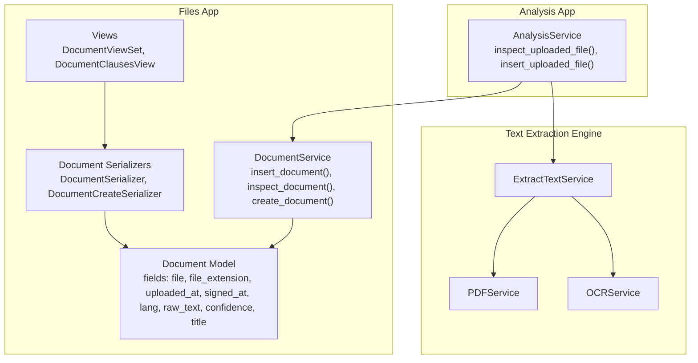
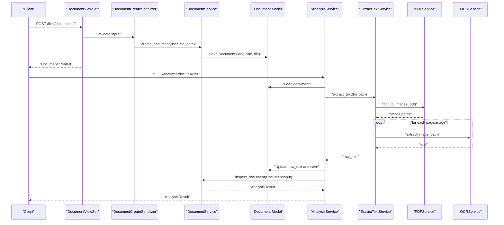
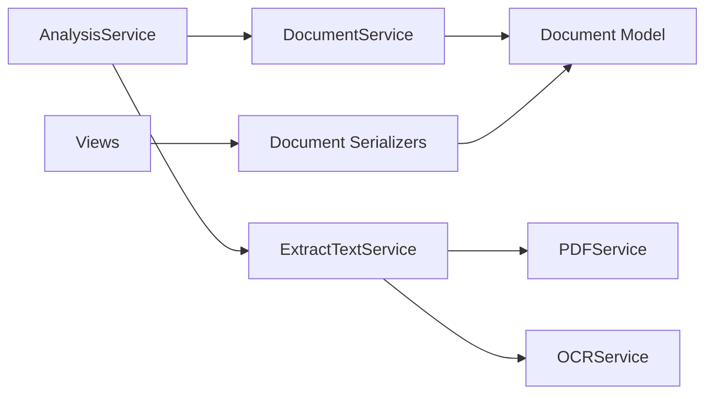

# Metadata Processing

<cite>
**Referenced Files in This Document**
- [apps/files/models.py](file://apps/files/models.py)
- [apps/files/serializers.py](file://apps/files/serializers.py)
- [apps/files/services/document_services.py](file://apps/files/services/document_services.py)
- [apps/files/views.py](file://apps/files/views.py)
- [apps/analysis/services/analysis_service.py](file://apps/analysis/services/analysis_service.py)
- [apps/text_extractor_engine/services/extract_text.py](file://apps/text_extractor_engine/services/extract_text.py)
- [apps/text_extractor_engine/services/pdf_service.py](file://apps/text_extractor_engine/services/pdf_service.py)
- [apps/text_extractor_engine/services/ocr_service.py](file://apps/text_extractor_engine/services/ocr_service.py)
</cite>

## Table of Contents
1. [Introduction](#introduction)
2. [Project Structure](#project-structure)
3. [Core Components](#core-components)
4. [Architecture Overview](#architecture-overview)
5. [Detailed Component Analysis](#detailed-component-analysis)
6. [Dependency Analysis](#dependency-analysis)
7. [Performance Considerations](#performance-considerations)
8. [Troubleshooting Guide](#troubleshooting-guide)
9. [Conclusion](#conclusion)

## Introduction
This document explains the metadata processing capabilities of the system, focusing on how metadata is automatically extracted and enriched during document ingestion and analysis. It covers:
- Automatic metadata extraction: file extension detection, language identification (lang field), and timestamp management
- Metadata enrichment: title extraction, confidence scoring, and raw text processing
- Integration with text extraction services for populating metadata
- Examples of metadata validation, fallback mechanisms for missing metadata, and consistency checks
- The relationship between metadata fields and downstream analysis workflows

## Project Structure
The metadata lifecycle spans several modules:
- File ingestion and persistence: models, serializers, and views
- Text extraction pipeline: OCR and PDF conversion services
- Analysis orchestration: analysis service coordinates inspection and insertion
- Document processing service: integrates with downstream AI pipelines

**Diagram sources**
- [apps/files/models.py:5-17](file://apps/files/models.py#L5-L17)
- [apps/files/serializers.py:6-61](file://apps/files/serializers.py#L6-L61)
- [apps/files/views.py:11-35](file://apps/files/views.py#L11-L35)
- [apps/files/services/document_services.py:14-124](file://apps/files/services/document_services.py#L14-L124)
- [apps/analysis/services/analysis_service.py:16-81](file://apps/analysis/services/analysis_service.py#L16-L81)
- [apps/text_extractor_engine/services/extract_text.py:5-28](file://apps/text_extractor_engine/services/extract_text.py#L5-L28)
- [apps/text_extractor_engine/services/pdf_service.py:4-15](file://apps/text_extractor_engine/services/pdf_service.py#L4-L15)
- [apps/text_extractor_engine/services/ocr_service.py:6-18](file://apps/text_extractor_engine/services/ocr_service.py#L6-L18)

**Section sources**
- [apps/files/models.py:5-17](file://apps/files/models.py#L5-L17)
- [apps/files/serializers.py:6-61](file://apps/files/serializers.py#L6-L61)
- [apps/files/views.py:11-35](file://apps/files/views.py#L11-L35)
- [apps/files/services/document_services.py:14-124](file://apps/files/services/document_services.py#L14-L124)
- [apps/analysis/services/analysis_service.py:16-81](file://apps/analysis/services/analysis_service.py#L16-L81)
- [apps/text_extractor_engine/services/extract_text.py:5-28](file://apps/text_extractor_engine/services/extract_text.py#L5-L28)
- [apps/text_extractor_engine/services/pdf_service.py:4-15](file://apps/text_extractor_engine/services/pdf_service.py#L4-L15)
- [apps/text_extractor_engine/services/ocr_service.py:6-18](file://apps/text_extractor_engine/services/ocr_service.py#L6-L18)

## Core Components
- Document model: central entity storing metadata and state for documents
- Serializers: define which fields are exposed and writable/read-only
- Views: expose CRUD and specialized endpoints
- AnalysisService: orchestrates inspection and insertion workflows
- ExtractTextService: routes extraction to OCR or PDF-to-image pipeline
- DocumentService: integrates with downstream AI pipelines and manages document lifecycle

Key metadata fields:
- file_extension: derived from file name/type
- uploaded_at: auto-generated timestamp
- signed_at: optional timestamp
- lang: language identifier (default en)
- raw_text: extracted text content
- confidence: OCR confidence score
- title: optional document title

Validation and defaults:
- File type validation restricts supported formats
- Read-only fields prevent client-side overrides for sensitive metadata
- Default language and confidence values ensure consistency

**Section sources**
- [apps/files/models.py:5-17](file://apps/files/models.py#L5-L17)
- [apps/files/serializers.py:6-61](file://apps/files/serializers.py#L6-L61)
- [apps/files/views.py:11-35](file://apps/files/views.py#L11-L35)
- [apps/analysis/services/analysis_service.py:16-81](file://apps/analysis/services/analysis_service.py#L16-L81)

## Architecture Overview
The metadata processing pipeline begins with file upload and ends with downstream analysis. The flow below maps actual code paths.

**Diagram sources**
- [apps/files/views.py:11-35](file://apps/files/views.py#L11-L35)
- [apps/files/serializers.py:32-61](file://apps/files/serializers.py#L32-L61)
- [apps/files/services/document_services.py:83-110](file://apps/files/services/document_services.py#L83-L110)
- [apps/files/models.py:5-17](file://apps/files/models.py#L5-L17)
- [apps/analysis/services/analysis_service.py:18-50](file://apps/analysis/services/analysis_service.py#L18-L50)
- [apps/text_extractor_engine/services/extract_text.py:10-27](file://apps/text_extractor_engine/services/extract_text.py#L10-L27)
- [apps/text_extractor_engine/services/pdf_service.py:5-14](file://apps/text_extractor_engine/services/pdf_service.py#L5-L14)
- [apps/text_extractor_engine/services/ocr_service.py:8-17](file://apps/text_extractor_engine/services/ocr_service.py#L8-L17)

## Detailed Component Analysis

### Document Model and Metadata Fields
The Document model defines the canonical metadata schema:
- file: uploaded file storage
- file_extension: stored extension for downstream routing
- uploaded_at: auto-generated timestamp
- signed_at: optional signing timestamp
- lang: language identifier with default en
- raw_text: extracted text content
- confidence: numeric confidence score
- title: optional human-readable title

Automatic metadata extraction points:
- file_extension: derived from the uploaded file’s extension
- uploaded_at: managed by Django
- lang: provided by client or defaulted
- confidence: computed from OCR results
- raw_text: populated by text extraction pipeline
- title: provided by client or inferred later

Consistency and defaults:
- Read-only fields in serializers prevent client overrides for timestamps and computed fields
- Default lang and confidence ensure downstream consumers can rely on presence

**Section sources**
- [apps/files/models.py:5-17](file://apps/files/models.py#L5-L17)
- [apps/files/serializers.py:6-30](file://apps/files/serializers.py#L6-L30)
- [apps/files/serializers.py:32-46](file://apps/files/serializers.py#L32-L46)

### Serializers: Validation and Field Control
- DocumentSerializer exposes all fields and marks certain as read-only
- DocumentCreateSerializer:
  - Accepts client-provided fields: file, title, lang, file_extension, uploaded_at
  - Enforces read-only constraints for server-managed fields
  - Validates file type against supported extensions
  - Delegates creation to the model while preserving read-only protections

Validation examples:
- Unsupported file type raises validation error
- Read-only fields cannot be set by clients

**Section sources**
- [apps/files/serializers.py:6-30](file://apps/files/serializers.py#L6-L30)
- [apps/files/serializers.py:32-61](file://apps/files/serializers.py#L32-L61)

### Views: Exposing Document Operations
- DocumentViewSet provides standard CRUD operations for documents
- DocumentClausesView retrieves clauses associated with a document

Permissions and access:
- DocumentViewSet requires admin permissions
- DocumentClausesView requires authentication

**Section sources**
- [apps/files/views.py:11-35](file://apps/files/views.py#L11-L35)

### AnalysisService: Orchestration of Inspection and Insertion
Responsibilities:
- Inspect workflow:
  - Create document via DocumentService
  - Extract raw_text using ExtractTextService
  - Persist raw_text to the model
  - Build DocumentInput for downstream inspection
- Insert workflow:
  - Load existing document
  - Validate raw_text presence
  - Build DocumentInput and trigger insertion

Integration points:
- Uses ExtractTextService to populate raw_text
- Relies on DocumentService for downstream AI pipeline integration

**Section sources**
- [apps/analysis/services/analysis_service.py:16-81](file://apps/analysis/services/analysis_service.py#L16-L81)

### Text Extraction Pipeline: OCR and PDF Handling
- ExtractTextService:
  - Routes PDFs to PDFService for page-wise conversion
  - Routes non-PDF images to OCRService
  - Aggregates extracted text across pages/images
- PDFService:
  - Converts PDF pages to images
  - Saves temporary images and returns their paths
- OCRService:
  - Performs OCR on images
  - Computes average confidence across detected text lines

Confidence scoring:
- Confidence is averaged across recognized text lines per page/image
- This value populates the document’s confidence field

**Section sources**
- [apps/text_extractor_engine/services/extract_text.py:5-28](file://apps/text_extractor_engine/services/extract_text.py#L5-L28)
- [apps/text_extractor_engine/services/pdf_service.py:4-15](file://apps/text_extractor_engine/services/pdf_service.py#L4-L15)
- [apps/text_extractor_engine/services/ocr_service.py:6-18](file://apps/text_extractor_engine/services/ocr_service.py#L6-L18)

### DocumentService: Downstream Integration
- Provides methods to insert and inspect documents
- Integrates with downstream AI pipelines (not shown here) via DocumentInput
- Manages similarity, conflict detection, and clause extraction

Relationship to metadata:
- Consumes metadata fields (raw_text, title, file_extension, lang, signed_at) for downstream processing

**Section sources**
- [apps/files/services/document_services.py:14-124](file://apps/files/services/document_services.py#L14-L124)

## Dependency Analysis
The following diagram highlights module-level dependencies among metadata-processing components.

**Diagram sources**
- [apps/analysis/services/analysis_service.py:16-81](file://apps/analysis/services/analysis_service.py#L16-L81)
- [apps/files/services/document_services.py:14-124](file://apps/files/services/document_services.py#L14-L124)
- [apps/text_extractor_engine/services/extract_text.py:5-28](file://apps/text_extractor_engine/services/extract_text.py#L5-L28)
- [apps/text_extractor_engine/services/pdf_service.py:4-15](file://apps/text_extractor_engine/services/pdf_service.py#L4-L15)
- [apps/text_extractor_engine/services/ocr_service.py:6-18](file://apps/text_extractor_engine/services/ocr_service.py#L6-L18)
- [apps/files/models.py:5-17](file://apps/files/models.py#L5-L17)
- [apps/files/serializers.py:6-61](file://apps/files/serializers.py#L6-L61)
- [apps/files/views.py:11-35](file://apps/files/views.py#L11-L35)

**Section sources**
- [apps/analysis/services/analysis_service.py:16-81](file://apps/analysis/services/analysis_service.py#L16-L81)
- [apps/files/services/document_services.py:14-124](file://apps/files/services/document_services.py#L14-L124)
- [apps/text_extractor_engine/services/extract_text.py:5-28](file://apps/text_extractor_engine/services/extract_text.py#L5-L28)
- [apps/text_extractor_engine/services/pdf_service.py:4-15](file://apps/text_extractor_engine/services/pdf_service.py#L4-L15)
- [apps/text_extractor_engine/services/ocr_service.py:6-18](file://apps/text_extractor_engine/services/ocr_service.py#L6-L18)
- [apps/files/models.py:5-17](file://apps/files/models.py#L5-L17)
- [apps/files/serializers.py:6-61](file://apps/files/serializers.py#L6-L61)
- [apps/files/views.py:11-35](file://apps/files/views.py#L11-L35)

## Performance Considerations
- PDF page conversion and OCR are computationally intensive; batch or cache results where feasible
- Confidence aggregation is linear in the number of recognized text lines; keep image quality optimal to reduce post-processing
- Avoid redundant text extraction by checking raw_text presence before re-extraction
- Use pagination and lazy loading for clause retrieval in downstream workflows

## Troubleshooting Guide
Common issues and resolutions:
- Missing raw_text on insertion:
  - Symptom: Error indicating raw_text must be present before insertion
  - Resolution: Run inspection workflow first to extract and persist raw_text
- Unsupported file type:
  - Symptom: Validation error for unsupported extension
  - Resolution: Ensure file is one of the supported types
- Empty or low-confidence text:
  - Symptom: Low confidence or empty raw_text
  - Resolution: Verify image quality, retry OCR, or adjust OCR language settings
- Timestamp inconsistencies:
  - Symptom: Unexpected timestamps
  - Resolution: Confirm auto-generated fields and client-provided values are not conflicting

Validation and fallback examples:
- File type validation prevents unsupported formats
- Default lang and confidence ensure downstream consumers receive sensible values
- signed_at remains optional; downstream logic should handle None gracefully

**Section sources**
- [apps/analysis/services/analysis_service.py:62-65](file://apps/analysis/services/analysis_service.py#L62-L65)
- [apps/files/serializers.py:48-52](file://apps/files/serializers.py#L48-L52)
- [apps/text_extractor_engine/services/ocr_service.py:13-17](file://apps/text_extractor_engine/services/ocr_service.py#L13-L17)

## Conclusion
The metadata processing pipeline integrates file ingestion, automatic metadata extraction, and text enrichment through OCR and PDF conversion. Serializers enforce validation and read-only constraints, while AnalysisService orchestrates inspection and insertion workflows. The DocumentService bridges to downstream AI pipelines using standardized metadata fields. Robust validation, defaults, and confidence scoring ensure reliable downstream analysis.