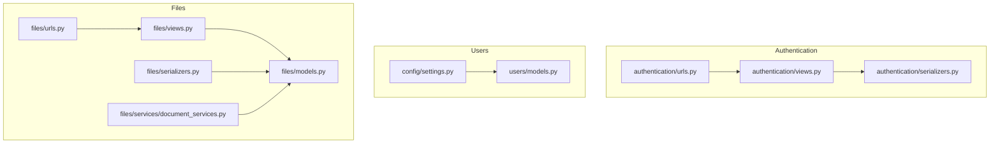
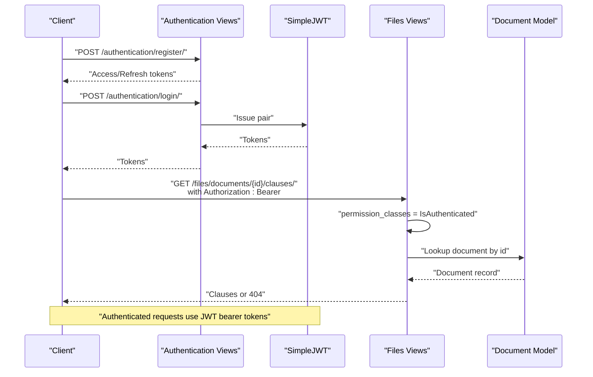
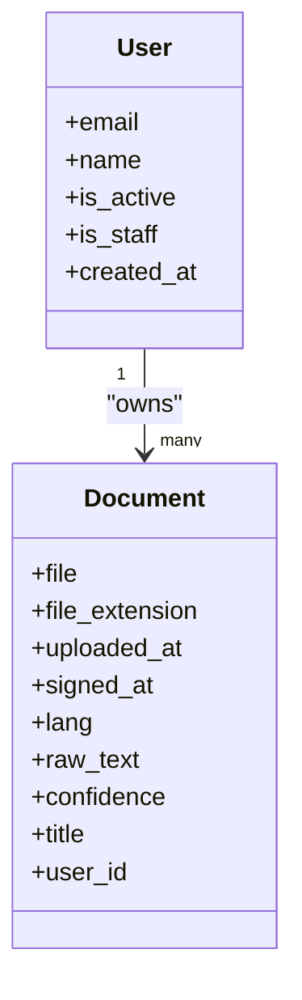
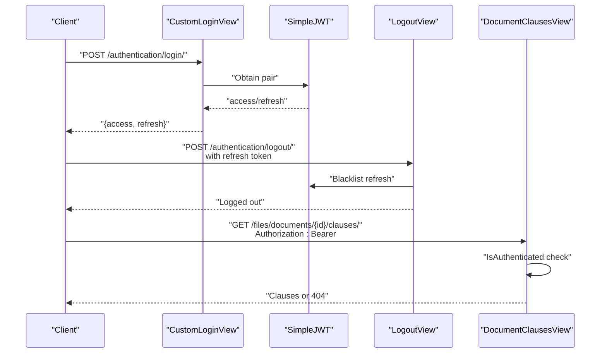
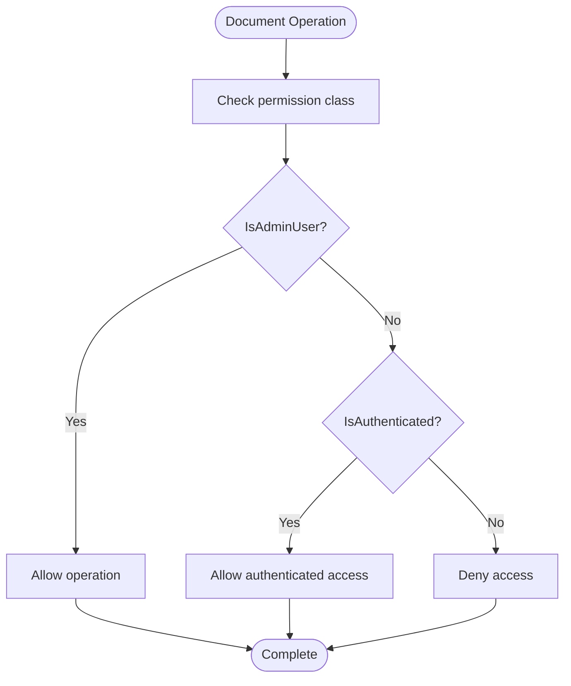
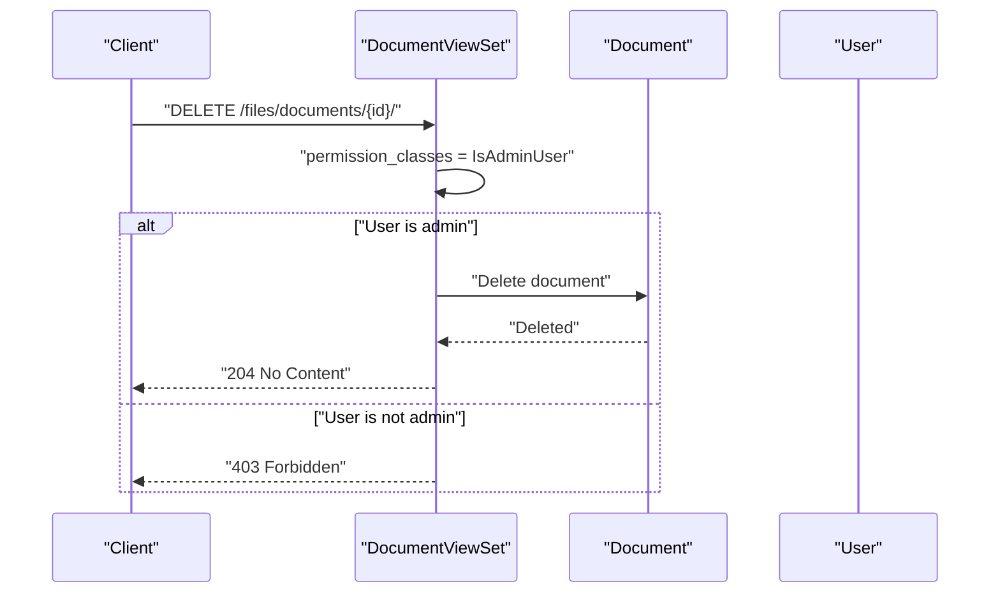
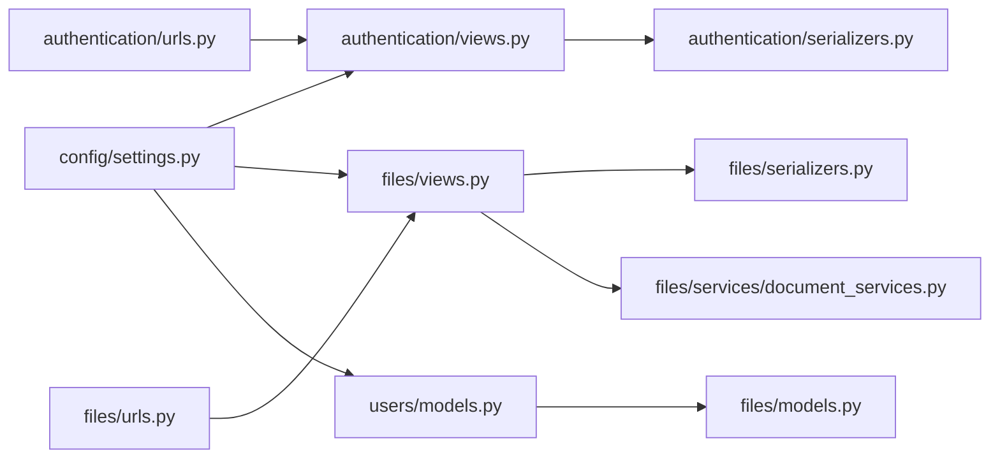

# User Access Controls

<cite>
**Referenced Files in This Document**
- [settings.py](file://config/settings.py)
- [users/models.py](file://apps/users/models.py)
- [authentication/views.py](file://apps/authentication/views.py)
- [authentication/serializers.py](file://apps/authentication/serializers.py)
- [authentication/urls.py](file://apps/authentication/urls.py)
- [files/models.py](file://apps/files/models.py)
- [files/views.py](file://apps/files/views.py)
- [files/urls.py](file://apps/files/urls.py)
- [files/serializers.py](file://apps/files/serializers.py)
- [files/services/document_services.py](file://apps/files/services/document_services.py)
- [files/migrations/0001_initial.py](file://apps/files/migrations/0001_initial.py)
</cite>

## Table of Contents
1. [Introduction](#introduction)
2. [Project Structure](#project-structure)
3. [Core Components](#core-components)
4. [Architecture Overview](#architecture-overview)
5. [Detailed Component Analysis](#detailed-component-analysis)
6. [Dependency Analysis](#dependency-analysis)
7. [Performance Considerations](#performance-considerations)
8. [Troubleshooting Guide](#troubleshooting-guide)
9. [Conclusion](#conclusion)

## Introduction
This document explains the user access control mechanisms for document management in the backend. It focuses on how users relate to documents via a ForeignKey to the AUTH_USER_MODEL, the CASCADE deletion behavior, and the resulting ownership semantics. It also details who can view, download, and delete documents, the authentication requirements for document operations, and session-based access control. Finally, it outlines examples of access control enforcement, permission checking, user isolation, and the security implications around document sharing, access logging, and audit trails.

## Project Structure
The document management feature spans several modules:
- Authentication and user identity: JWT-based authentication, user registration/login/logout, and custom user model.
- Document model and APIs: Document storage, ownership via user foreign key, and API endpoints for CRUD and clause retrieval.
- Settings: Global configuration for authentication, parsers, and the custom user model.

**Diagram sources**
- [authentication/views.py:1-74](file://apps/authentication/views.py#L1-L74)
- [authentication/serializers.py:1-6](file://apps/authentication/serializers.py#L1-L6)
- [authentication/urls.py:1-15](file://apps/authentication/urls.py#L1-L15)
- [users/models.py:1-46](file://apps/users/models.py#L1-L46)
- [config/settings.py:125-144](file://config/settings.py#L125-L144)
- [files/models.py:1-18](file://apps/files/models.py#L1-L18)
- [files/views.py:1-35](file://apps/files/views.py#L1-L35)
- [files/urls.py:1-29](file://apps/files/urls.py#L1-L29)
- [files/serializers.py:1-61](file://apps/files/serializers.py#L1-L61)
- [files/services/document_services.py:1-124](file://apps/files/services/document_services.py#L1-L124)

**Section sources**
- [config/settings.py:125-144](file://config/settings.py#L125-L144)
- [authentication/urls.py:1-15](file://apps/authentication/urls.py#L1-L15)
- [files/urls.py:1-29](file://apps/files/urls.py#L1-L29)

## Core Components
- Custom user model and authentication:
  - The AUTH_USER_MODEL is set to the custom User model in users.
  - JWT authentication is enabled via REST Framework SimpleJWT.
  - Login, logout, and registration endpoints are provided.
- Document model and ownership:
  - Documents are owned by a user via a ForeignKey to AUTH_USER_MODEL.
  - CASCADE deletion ensures that deleting a user also deletes their documents.
- API endpoints and permissions:
  - Document list/create endpoints require admin-level privileges.
  - Clause retrieval endpoint requires authenticated users.
  - Serializers define which fields are exposed and read-only.

Key implementation references:
- Custom user model and AUTH_USER_MODEL setting: [users/models.py:29-46], [config/settings.py:144]
- Document model with user foreign key and CASCADE: [files/models.py:5-18]
- JWT authentication and parser configuration: [config/settings.py:125-137]
- DocumentViewSet requiring admin: [files/views.py:11-15]
- DocumentClausesView requiring authenticated: [files/views.py:22-35]
- Document serializers and read-only fields: [files/serializers.py:6-30], [files/serializers.py:32-61]

**Section sources**
- [users/models.py:29-46](file://apps/users/models.py#L29-L46)
- [config/settings.py:125-144](file://config/settings.py#L125-L144)
- [files/models.py:5-18](file://apps/files/models.py#L5-L18)
- [files/views.py:11-15](file://apps/files/views.py#L11-L15)
- [files/views.py:22-35](file://apps/files/views.py#L22-L35)
- [files/serializers.py:6-30](file://apps/files/serializers.py#L6-L30)
- [files/serializers.py:32-61](file://apps/files/serializers.py#L32-L61)

## Architecture Overview
The access control architecture ties together authentication, authorization, and document ownership:

**Diagram sources**
- [authentication/views.py:14-42](file://apps/authentication/views.py#L14-L42)
- [authentication/views.py:72-74](file://apps/authentication/views.py#L72-L74)
- [files/views.py:17-35](file://apps/files/views.py#L17-L35)
- [files/models.py:5-18](file://apps/files/models.py#L5-L18)
- [config/settings.py:125-143](file://config/settings.py#L125-L143)

## Detailed Component Analysis

### User-Document Ownership and Deletion Semantics
- Ownership: Each document is owned by a user via a ForeignKey to AUTH_USER_MODEL.
- Deletion behavior: CASCADE ensures that when a user is deleted, all their documents are automatically removed.
- Implication: Users cannot “steal” another user’s documents; ownership is enforced by the database relationship.

**Diagram sources**
- [users/models.py:29-46](file://apps/users/models.py#L29-L46)
- [files/models.py:5-18](file://apps/files/models.py#L5-L18)

**Section sources**
- [files/models.py:5-18](file://apps/files/models.py#L5-L18)
- [config/settings.py:144](file://config/settings.py#L144)

### Authentication and Session-Based Access Control
- Authentication: JWT tokens issued by SimpleJWT; login and logout endpoints support token issuance and blacklisting.
- Session middleware: Django session middleware is configured, enabling session-based flows alongside JWT.
- Permission classes: Views apply IsAuthenticated or IsAdminUser to enforce access.

**Diagram sources**
- [authentication/views.py:72-74](file://apps/authentication/views.py#L72-L74)
- [authentication/views.py:45-70](file://apps/authentication/views.py#L45-L70)
- [authentication/views.py:14-42](file://apps/authentication/views.py#L14-L42)
- [files/views.py:22-35](file://apps/files/views.py#L22-L35)
- [config/settings.py:125-143](file://config/settings.py#L125-L143)

**Section sources**
- [authentication/views.py:14-42](file://apps/authentication/views.py#L14-L42)
- [authentication/views.py:45-70](file://apps/authentication/views.py#L45-L70)
- [authentication/serializers.py:4-6](file://apps/authentication/serializers.py#L4-L6)
- [authentication/urls.py:1-15](file://apps/authentication/urls.py#L1-L15)
- [config/settings.py:125-143](file://config/settings.py#L125-L143)

### Document Operations and Permission Matrix
- Who can view:
  - Clause retrieval requires authentication; the endpoint enforces IsAuthenticated.
  - Document list/create currently require admin privileges.
- Who can download:
  - No explicit download endpoint is present in the referenced files; access depends on application-specific logic and file serving configuration.
- Who can delete:
  - The DocumentViewSet supports delete operations; however, the current permission class is IsAdminUser. Ownership is enforced by the user foreign key, but the view-level permission class overrides per-record ownership checks.
- Who can create/upload:
  - Document list/create require admin; upload endpoint is present but not shown to enforce per-user ownership in the referenced code.

**Diagram sources**
- [files/views.py:11-15](file://apps/files/views.py#L11-L15)
- [files/views.py:22-35](file://apps/files/views.py#L22-L35)

**Section sources**
- [files/views.py:11-15](file://apps/files/views.py#L11-L15)
- [files/views.py:22-35](file://apps/files/views.py#L22-L35)

### Access Control Enforcement and User Isolation
- Per-record ownership: The user field on Document ensures that each record belongs to a specific user.
- View-level enforcement: The DocumentViewSet applies IsAdminUser, meaning only administrators can perform list/create/retrieve/update/delete at the view level. This creates a strict separation of duties.
- Serializer safeguards: The DocumentCreateSerializer marks user and several other fields as read-only, preventing clients from overriding ownership or metadata during creation.

**Diagram sources**
- [files/views.py:11-15](file://apps/files/views.py#L11-L15)
- [files/models.py:5-18](file://apps/files/models.py#L5-L18)
- [files/serializers.py:32-61](file://apps/files/serializers.py#L32-L61)

**Section sources**
- [files/views.py:11-15](file://apps/files/views.py#L11-L15)
- [files/serializers.py:32-61](file://apps/files/serializers.py#L32-L61)

### Security Implications: Sharing, Logging, and Audit Trails
- Document sharing: There is no explicit sharing mechanism in the referenced files. If documents are to be shared, implement a separate sharing model with explicit permissions and audit logs.
- Access logging: Track all document operations (create, update, delete, clause retrieval) with timestamps, user identities, and IP addresses.
- Audit trails: Maintain immutable logs of who accessed or modified documents, including before/after states for updates.

[No sources needed since this section provides general guidance]

## Dependency Analysis
The following diagram shows how modules depend on each other for access control:

**Diagram sources**
- [config/settings.py:125-144](file://config/settings.py#L125-L144)
- [authentication/views.py:1-74](file://apps/authentication/views.py#L1-L74)
- [authentication/serializers.py:1-6](file://apps/authentication/serializers.py#L1-L6)
- [authentication/urls.py:1-15](file://apps/authentication/urls.py#L1-L15)
- [users/models.py:1-46](file://apps/users/models.py#L1-L46)
- [files/models.py:1-18](file://apps/files/models.py#L1-L18)
- [files/views.py:1-35](file://apps/files/views.py#L1-L35)
- [files/serializers.py:1-61](file://apps/files/serializers.py#L1-L61)
- [files/services/document_services.py:1-124](file://apps/files/services/document_services.py#L1-L124)
- [files/urls.py:1-29](file://apps/files/urls.py#L1-L29)

**Section sources**
- [config/settings.py:125-144](file://config/settings.py#L125-L144)
- [files/urls.py:1-29](file://apps/files/urls.py#L1-L29)
- [authentication/urls.py:1-15](file://apps/authentication/urls.py#L1-L15)

## Performance Considerations
- Token lifecycle: Configure appropriate access/refresh token lifetimes to balance security and UX.
- Query efficiency: Use select_related("user") when retrieving documents to avoid N+1 queries in list views.
- File serving: Serve large files efficiently and restrict direct public access to media directories.

[No sources needed since this section provides general guidance]

## Troubleshooting Guide
- 401 Unauthorized on document endpoints:
  - Ensure the Authorization header includes a valid Bearer token from the login endpoint.
  - Verify SIMPLE_JWT configuration and that the token has not expired.
- 403 Forbidden on document operations:
  - The DocumentViewSet requires admin privileges; ensure the user has staff/superuser status.
- 404 Not Found for clauses:
  - The document may not exist or may have no clauses extracted yet.
- Logout failures:
  - Provide a valid refresh token; the server will blacklist it.

**Section sources**
- [authentication/views.py:45-70](file://apps/authentication/views.py#L45-L70)
- [authentication/views.py:72-74](file://apps/authentication/views.py#L72-L74)
- [files/views.py:11-15](file://apps/files/views.py#L11-L15)
- [files/views.py:22-35](file://apps/files/views.py#L22-L35)

## Conclusion
The document management system enforces strong user isolation through a user-owned Document model backed by a ForeignKey to AUTH_USER_MODEL with CASCADE deletion. Authentication is JWT-based, and session middleware is enabled. Currently, view-level permissions are restrictive (admin-only for most operations), while authenticated users can retrieve clauses. To enable broader access patterns (e.g., per-user document CRUD), adjust view permission classes and implement per-record ownership checks. For robust security, introduce explicit sharing controls, comprehensive access logging, and immutable audit trails.