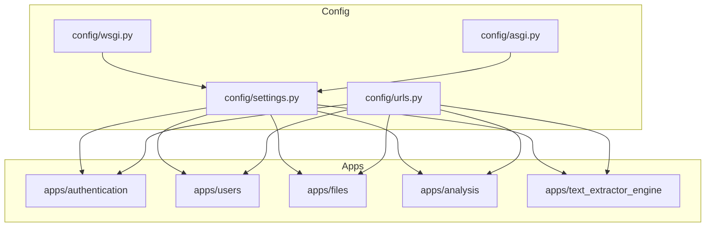
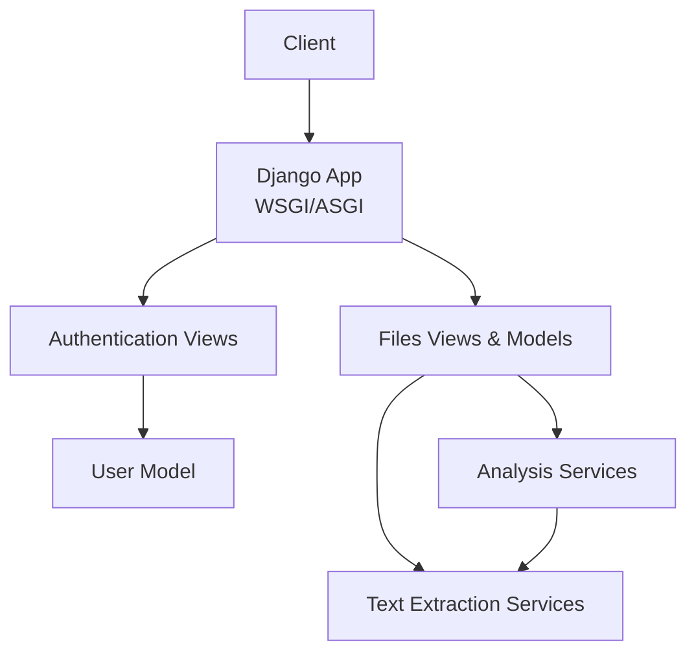
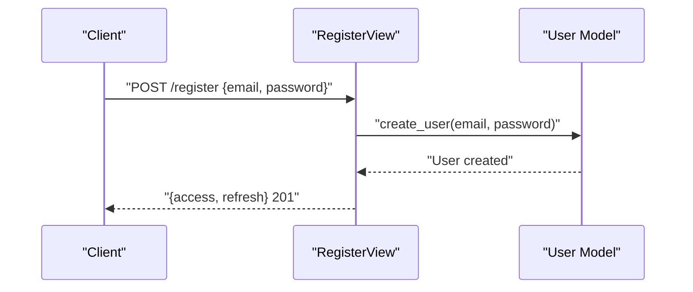
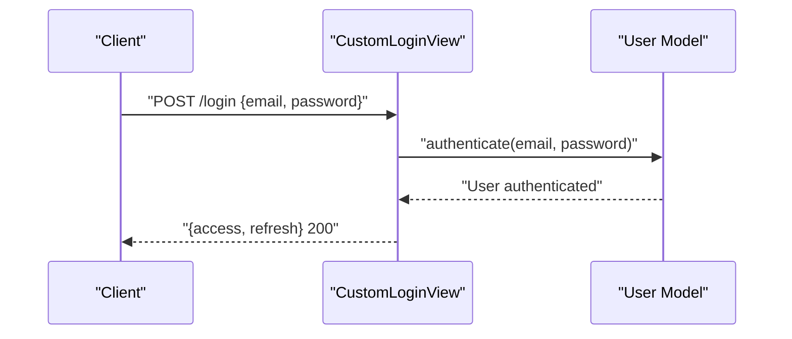
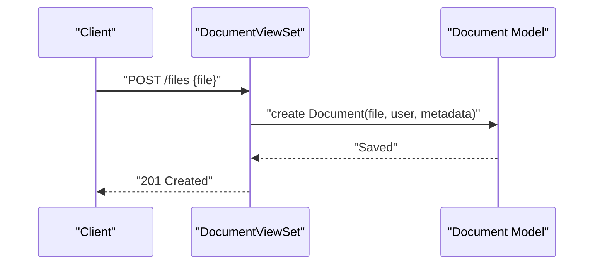
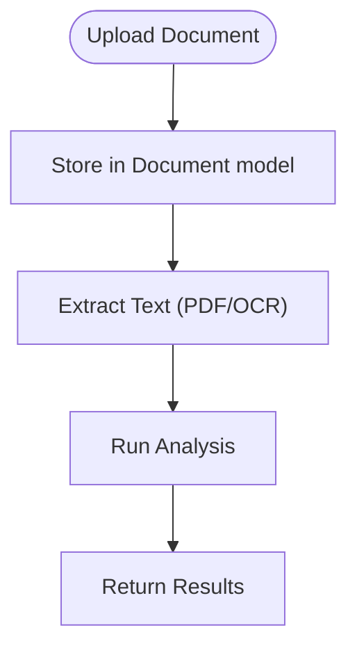
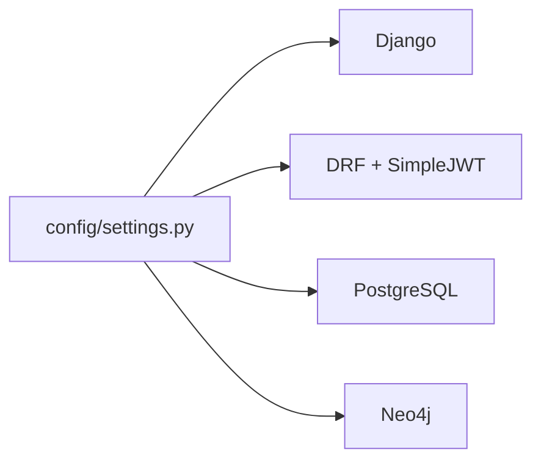

# Getting Started

<cite>
**Referenced Files in This Document**
- [settings.py](file://config/settings.py)
- [urls.py](file://config/urls.py)
- [wsgi.py](file://config/wsgi.py)
- [asgi.py](file://config/asgi.py)
- [manage.py](file://manage.py)
- [users/models.py](file://apps/users/models.py)
- [authentication/views.py](file://apps/authentication/views.py)
- [files/views.py](file://apps/files/views.py)
- [files/models.py](file://apps/files/models.py)
- [text_extractor_engine/services/pdf_service.py](file://apps/text_extractor_engine/services/pdf_service.py)
- [text_extractor_engine/services/ocr_service.py](file://apps/text_extractor_engine/services/ocr_service.py)
- [text_extractor_engine/services/extract_text.py](file://apps/text_extractor_engine/services/extract_text.py)
- [analysis/services/analysis_service.py](file://apps/analysis/services/analysis_service.py)
</cite>

## Table of Contents
1. [Introduction](#introduction)
2. [Project Structure](#project-structure)
3. [Core Components](#core-components)
4. [Architecture Overview](#architecture-overview)
5. [Detailed Component Analysis](#detailed-component-analysis)
6. [Dependency Analysis](#dependency-analysis)
7. [Performance Considerations](#performance-considerations)
8. [Troubleshooting Guide](#troubleshooting-guide)
9. [Conclusion](#conclusion)
10. [Appendices](#appendices)

## Introduction
This guide helps you install, configure, and run the VeritasShield backend locally. It covers prerequisites, environment setup, database configuration, initial migrations, environment variables, quick start workflows, and verification steps. The backend is a Django application with Django REST Framework and SimpleJWT for authentication, storing user and document metadata in PostgreSQL.

## Project Structure
VeritasShield follows a Django project layout with modular apps:
- apps/authentication: user registration, login, logout, and JWT token handling
- apps/users: custom user model and related logic
- apps/files: document storage and metadata
- apps/analysis: analysis orchestration and services
- apps/text_extractor_engine: text extraction pipeline (OCR, PDF parsing)
- config: Django settings, URLs, WSGI/ASGI applications
- manage.py: Django CLI entrypoint

**Diagram sources**
- [settings.py](file://config/settings.py)
- [urls.py](file://config/urls.py)
- [wsgi.py](file://config/wsgi.py)
- [asgi.py](file://config/asgi.py)

**Section sources**
- [settings.py](file://config/settings.py)
- [urls.py](file://config/urls.py)
- [wsgi.py](file://config/wsgi.py)
- [asgi.py](file://config/asgi.py)

## Core Components
- Authentication and Users
  - Custom user model with email-based login
  - JWT-based authentication with SimpleJWT
  - Registration, login, and logout endpoints
- Files and Documents
  - Document model with file upload, metadata, and OCR-related fields
  - Admin-only document management
- Text Extraction Engine
  - Services for PDF processing and OCR
- Analysis
  - Analysis service orchestrating document processing and insights

**Section sources**
- [users/models.py](file://apps/users/models.py)
- [authentication/views.py](file://apps/authentication/views.py)
- [files/models.py](file://apps/files/models.py)
- [files/views.py](file://apps/files/views.py)
- [text_extractor_engine/services/pdf_service.py](file://apps/text_extractor_engine/services/pdf_service.py)
- [text_extractor_engine/services/ocr_service.py](file://apps/text_extractor_engine/services/ocr_service.py)
- [text_extractor_engine/services/extract_text.py](file://apps/text_extractor_engine/services/extract_text.py)
- [analysis/services/analysis_service.py](file://apps/analysis/services/analysis_service.py)

## Architecture Overview
High-level runtime flow:
- Django WSGI/ASGI application loads settings and routes requests
- Authentication app handles registration/login/logout
- Files app manages document uploads and metadata
- Text extraction engine processes documents
- Analysis app orchestrates analysis and returns results

**Diagram sources**
- [wsgi.py](file://config/wsgi.py)
- [asgi.py](file://config/asgi.py)
- [authentication/views.py](file://apps/authentication/views.py)
- [users/models.py](file://apps/users/models.py)
- [files/views.py](file://apps/files/views.py)
- [files/models.py](file://apps/files/models.py)
- [text_extractor_engine/services/extract_text.py](file://apps/text_extractor_engine/services/extract_text.py)
- [analysis/services/analysis_service.py](file://apps/analysis/services/analysis_service.py)

## Detailed Component Analysis

### Prerequisites
- Python
  - Version 3.8 or newer is required by the project configuration
- PostgreSQL
  - Used as the default database for Django ORM
  - Credentials and connection parameters are configured in settings
- Neo4j Graph Database
  - The project imports a Neo4j driver and references a graph database in settings; ensure Neo4j is installed and accessible
- System Requirements
  - OS: Windows/Linux/macOS
  - Disk: Sufficient space for media uploads and database storage
  - Memory: Minimum recommended for local development with PostgreSQL and Neo4j

**Section sources**
- [settings.py](file://config/settings.py)

### Installation Steps
- Create a virtual environment
  - Use your preferred method to create a venv at the project root
- Activate the virtual environment
  - On Windows: .venv\Scripts\activate
- Install dependencies
  - Run pip install with the project’s requirements.txt or pyproject.toml if present
- Configure environment variables
  - Set DJANGO_SETTINGS_MODULE to config.settings
  - Configure database credentials and Neo4j connection details as per settings
- Apply migrations
  - Run the Django migration command to create tables
- Collect static assets (optional)
  - Run the collectstatic command if needed for deployment-like testing
- Start the development server
  - Use the Django management command to run the server

Verification
- Confirm the server starts without errors
- Verify database connectivity by accessing admin or running a simple query
- Test authentication endpoints

**Section sources**
- [manage.py](file://manage.py)
- [settings.py](file://config/settings.py)

### Environment Variables
Key variables to configure:
- DJANGO_SETTINGS_MODULE: set to config.settings
- Database
  - DATABASES.default.NAME, USER, PASSWORD, HOST, PORT
- JWT
  - REST_FRAMEWORK.DEFAULT_AUTHENTICATION_CLASSES and SIMPLE_JWT settings
- OAuth2
  - GOOGLE_OAUTH2_CLIENT_ID and related social account settings
- Media
  - MEDIA_ROOT and MEDIA_URL for file uploads

Note: The project currently defines default database credentials in settings. For production, override these via environment variables or a separate settings file.

**Section sources**
- [settings.py](file://config/settings.py)

### Quick Start Examples

#### User Registration
- Endpoint: POST to the registration endpoint
- Request body: email, password
- Expected response: access and refresh tokens on successful creation

**Diagram sources**
- [authentication/views.py](file://apps/authentication/views.py)
- [users/models.py](file://apps/users/models.py)

**Section sources**
- [authentication/views.py](file://apps/authentication/views.py)
- [users/models.py](file://apps/users/models.py)

#### Login Workflow
- Endpoint: POST to the login endpoint
- Request body: email, password
- Expected response: JWT pair (access and refresh)

**Diagram sources**
- [authentication/views.py](file://apps/authentication/views.py)
- [users/models.py](file://apps/users/models.py)

**Section sources**
- [authentication/views.py](file://apps/authentication/views.py)
- [users/models.py](file://apps/users/models.py)

#### Document Upload Process
- Endpoint: Upload a file via the files app
- Request: multipart/form-data with the file field
- Behavior: File saved to media directory; metadata stored in the Document model

**Diagram sources**
- [files/views.py](file://apps/files/views.py)
- [files/models.py](file://apps/files/models.py)

**Section sources**
- [files/views.py](file://apps/files/views.py)
- [files/models.py](file://apps/files/models.py)

#### Basic Analysis Request
- Endpoint: Trigger analysis on a document
- Flow: The files app stores the document; the analysis service orchestrates text extraction and analysis

**Diagram sources**
- [files/models.py](file://apps/files/models.py)
- [text_extractor_engine/services/extract_text.py](file://apps/text_extractor_engine/services/extract_text.py)
- [analysis/services/analysis_service.py](file://apps/analysis/services/analysis_service.py)

**Section sources**
- [files/models.py](file://apps/files/models.py)
- [text_extractor_engine/services/extract_text.py](file://apps/text_extractor_engine/services/extract_text.py)
- [analysis/services/analysis_service.py](file://apps/analysis/services/analysis_service.py)

## Dependency Analysis
- Django and Django REST Framework
  - Settings enable JWT authentication and define parsers/renderers
- PostgreSQL
  - Default ENGINE configured; ensure the database exists and credentials are correct
- Neo4j
  - Driver imported and settings reference a graph database; ensure connectivity

**Diagram sources**
- [settings.py](file://config/settings.py)

**Section sources**
- [settings.py](file://config/settings.py)

## Performance Considerations
- Keep DEBUG disabled in production
- Use a production-ready WSGI server and reverse proxy
- Optimize database queries and consider indexing for frequently accessed fields
- Offload heavy OCR and analysis workloads to background tasks if scaling

## Troubleshooting Guide
Common issues and resolutions:
- Django import error during startup
  - Cause: Missing Django or incorrect Python path
  - Fix: Activate the virtual environment and reinstall dependencies
- Database connection failure
  - Symptoms: OperationalError on startup
  - Fix: Verify DATABASES settings, PostgreSQL service status, and network accessibility
- Authentication failures
  - Symptoms: 401/403 responses or token errors
  - Fix: Confirm JWT settings, SECRET_KEY, and client-side token handling
- OAuth2 configuration
  - Symptoms: Social login errors
  - Fix: Validate GOOGLE_OAUTH2_CLIENT_ID and related social settings
- File upload issues
  - Symptoms: 400 errors or missing files
  - Fix: Ensure multipart/form-data encoding and MEDIA settings are correct

**Section sources**
- [manage.py](file://manage.py)
- [settings.py](file://config/settings.py)
- [authentication/views.py](file://apps/authentication/views.py)
- [files/views.py](file://apps/files/views.py)

## Conclusion
You now have the essentials to install, configure, and run VeritasShield locally. Proceed with applying migrations, configuring environment variables, and testing the endpoints documented above. For production, harden secrets, disable DEBUG, and deploy behind a proper web server and reverse proxy.

## Appendices

### Verification Checklist
- Server runs without startup errors
- Migrations applied successfully
- Database tables created and accessible
- Authentication endpoints return tokens
- Document upload succeeds and files appear under media
- Analysis endpoints return expected results

[No sources needed since this section provides general guidance]