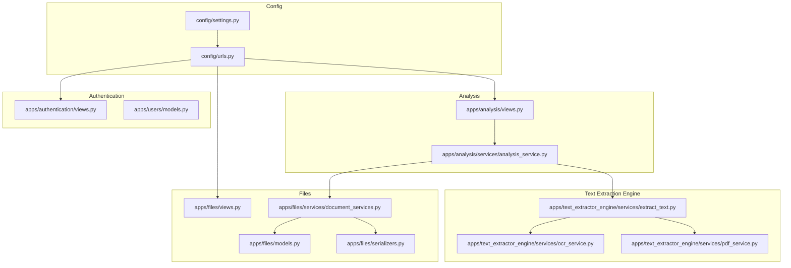
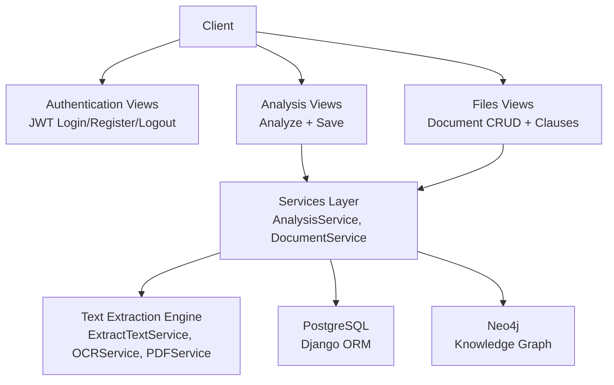
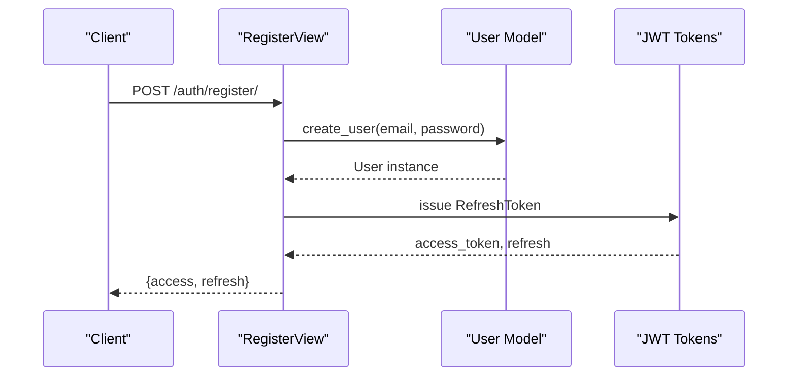
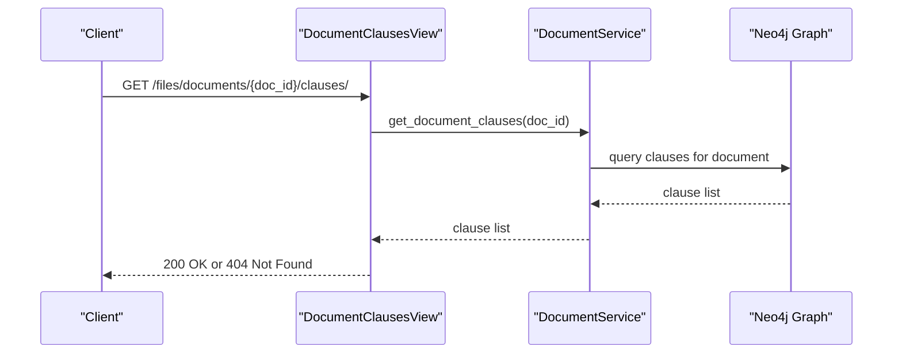
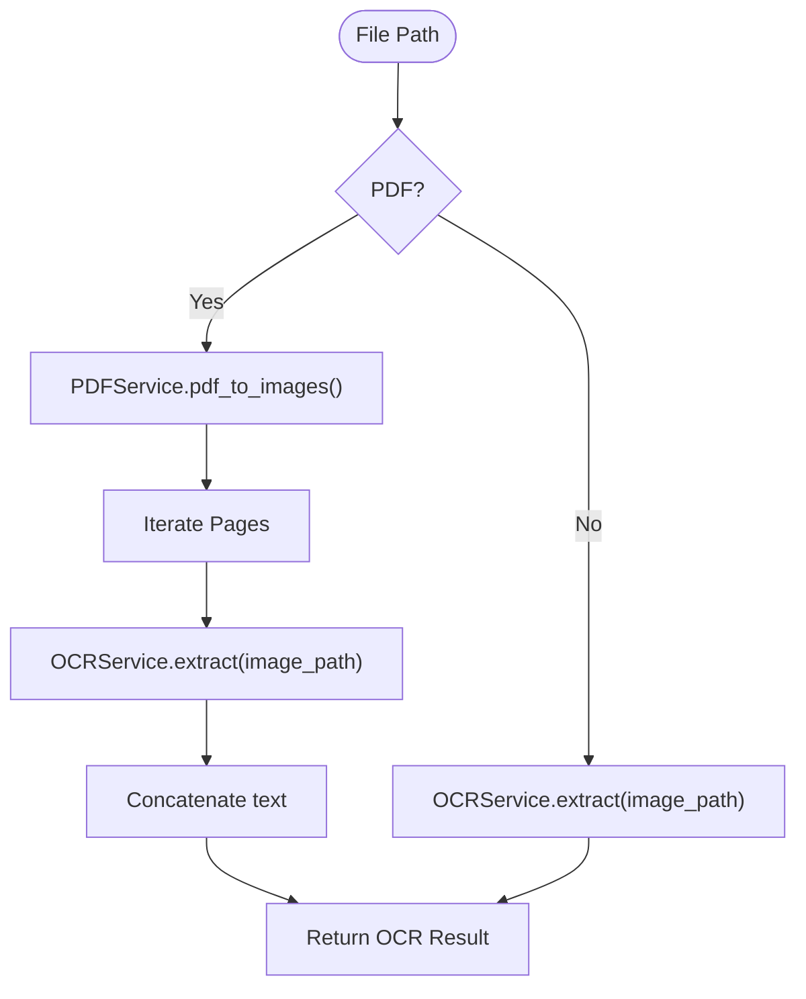
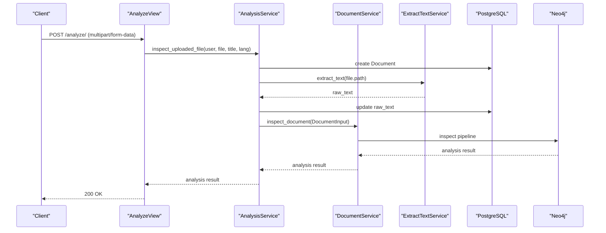
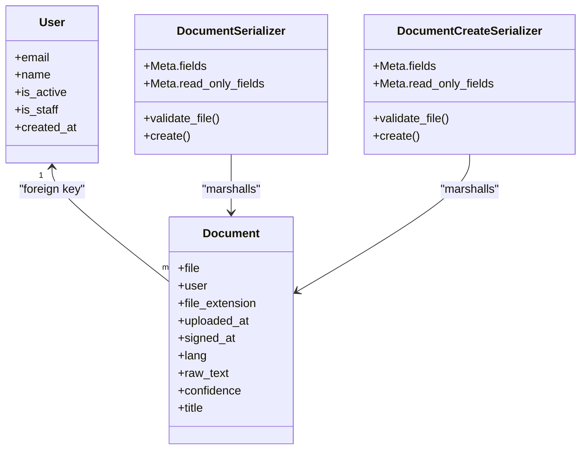
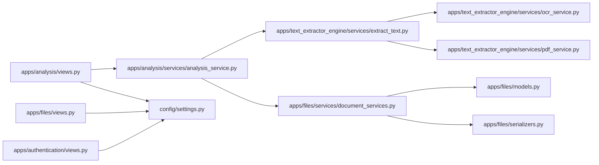

# Architecture Overview

<cite>
**Referenced Files in This Document**
- [settings.py](file://config/settings.py)
- [urls.py](file://config/urls.py)
- [users/models.py](file://apps/users/models.py)
- [files/models.py](file://apps/files/models.py)
- [files/serializers.py](file://apps/files/serializers.py)
- [files/views.py](file://apps/files/views.py)
- [text_extractor_engine/services/extract_text.py](file://apps/text_extractor_engine/services/extract_text.py)
- [text_extractor_engine/services/ocr_service.py](file://apps/text_extractor_engine/services/ocr_service.py)
- [text_extractor_engine/services/pdf_service.py](file://apps/text_extractor_engine/services/pdf_service.py)
- [analysis/views.py](file://apps/analysis/views.py)
- [analysis/services/analysis_service.py](file://apps/analysis/services/analysis_service.py)
- [files/services/document_services.py](file://apps/files/services/document_services.py)
- [authentication/views.py](file://apps/authentication/views.py)
</cite>

## Table of Contents
1. [Introduction](#introduction)
2. [Project Structure](#project-structure)
3. [Core Components](#core-components)
4. [Architecture Overview](#architecture-overview)
5. [Detailed Component Analysis](#detailed-component-analysis)
6. [Dependency Analysis](#dependency-analysis)
7. [Performance Considerations](#performance-considerations)
8. [Troubleshooting Guide](#troubleshooting-guide)
9. [Conclusion](#conclusion)

## Introduction
This document presents the architecture of the VeritasShield system, a Django-based backend designed for contract document ingestion, OCR-based text extraction, and knowledge graph storage. The system follows a layered architecture with clear separation of concerns:
- Presentation layer: REST APIs exposed via Django REST Framework
- Business logic layer: Services orchestrating workflows
- Data access layer: Django ORM models and serializers
- External integrations: OCR engine (EasyOCR), PDF conversion (pdf2image), and knowledge graph storage (Neo4j)

The system implements Django’s MTV (Model-Template-View) paradigm, with views acting as controllers and serializers handling data marshalling. Authentication is JWT-based, and the system supports file uploads, OCR processing, and graph-based analysis.

## Project Structure
The backend is organized into modular Django applications under apps/, each encapsulating a bounded responsibility:
- authentication: User registration, login/logout, JWT token management
- users: Custom user model and manager
- files: Document model, upload handling, and clause retrieval
- text_extractor_engine: OCR pipeline for images and PDFs
- analysis: Orchestration of end-to-end analysis workflow
- analysis: Graph insertion and inspection services
- backupApps: Legacy or alternate modules (not central to core flow)

Key configuration resides in config/, including Django settings, URL routing, and middleware.

**Diagram sources**
- [settings.py:1-155](file://config/settings.py#L1-L155)
- [urls.py:1-31](file://config/urls.py#L1-L31)
- [authentication/views.py:1-74](file://apps/authentication/views.py#L1-L74)
- [users/models.py:1-46](file://apps/users/models.py#L1-L46)
- [files/views.py:1-35](file://apps/files/views.py#L1-L35)
- [files/serializers.py:1-61](file://apps/files/serializers.py#L1-L61)
- [files/models.py:1-18](file://apps/files/models.py#L1-L18)
- [files/services/document_services.py:1-124](file://apps/files/services/document_services.py#L1-L124)
- [text_extractor_engine/services/extract_text.py:1-28](file://apps/text_extractor_engine/services/extract_text.py#L1-L28)
- [text_extractor_engine/services/ocr_service.py:1-18](file://apps/text_extractor_engine/services/ocr_service.py#L1-L18)
- [text_extractor_engine/services/pdf_service.py:1-15](file://apps/text_extractor_engine/services/pdf_service.py#L1-L15)
- [analysis/views.py:1-100](file://apps/analysis/views.py#L1-L100)
- [analysis/services/analysis_service.py:1-81](file://apps/analysis/services/analysis_service.py#L1-L81)

**Section sources**
- [settings.py:1-155](file://config/settings.py#L1-L155)
- [urls.py:1-31](file://config/urls.py#L1-L31)

## Core Components
- Authentication and Authorization
  - JWT-based authentication configured globally; login/logout/register endpoints exposed via views.
  - Custom user model with email-based authentication and manager.
- Files and Documents
  - Document model stores uploaded files, metadata, and OCR-derived raw text.
  - Serializers define input/output schemas; views expose CRUD and clause retrieval.
- Text Extraction Engine
  - ExtractTextService coordinates PDF-to-image conversion and OCR extraction.
  - OCRService performs text recognition; PDFService converts pages to images.
- Analysis Layer
  - AnalysisService orchestrates end-to-end workflow: create document, OCR extraction, and graph inspection/insertion.
  - DocumentService delegates to AI/Graph pipelines and Neo4j connection.
- External Integrations
  - EasyOCR for text extraction
  - pdf2image for PDF page rasterization
  - Neo4j for knowledge graph storage (via ai_engine pipelines)

**Section sources**
- [authentication/views.py:1-74](file://apps/authentication/views.py#L1-L74)
- [users/models.py:1-46](file://apps/users/models.py#L1-L46)
- [files/models.py:1-18](file://apps/files/models.py#L1-L18)
- [files/serializers.py:1-61](file://apps/files/serializers.py#L1-L61)
- [files/views.py:1-35](file://apps/files/views.py#L1-L35)
- [text_extractor_engine/services/extract_text.py:1-28](file://apps/text_extractor_engine/services/extract_text.py#L1-L28)
- [text_extractor_engine/services/ocr_service.py:1-18](file://apps/text_extractor_engine/services/ocr_service.py#L1-L18)
- [text_extractor_engine/services/pdf_service.py:1-15](file://apps/text_extractor_engine/services/pdf_service.py#L1-L15)
- [analysis/views.py:1-100](file://apps/analysis/views.py#L1-L100)
- [analysis/services/analysis_service.py:1-81](file://apps/analysis/services/analysis_service.py#L1-L81)
- [files/services/document_services.py:1-124](file://apps/files/services/document_services.py#L1-L124)

## Architecture Overview
VeritasShield employs a layered architecture:
- Presentation Layer: DRF views and serializers expose REST endpoints for authentication, document management, and analysis.
- Business Logic Layer: Services encapsulate workflows—document creation, OCR extraction, and graph insertion/inspection.
- Data Access Layer: Django models and serializers manage persistence and serialization.
- External Integrations: OCR and PDF conversion libraries, and Neo4j-backed graph operations.

**Diagram sources**
- [authentication/views.py:1-74](file://apps/authentication/views.py#L1-L74)
- [files/views.py:1-35](file://apps/files/views.py#L1-L35)
- [analysis/views.py:1-100](file://apps/analysis/views.py#L1-L100)
- [analysis/services/analysis_service.py:1-81](file://apps/analysis/services/analysis_service.py#L1-L81)
- [files/services/document_services.py:1-124](file://apps/files/services/document_services.py#L1-L124)
- [text_extractor_engine/services/extract_text.py:1-28](file://apps/text_extractor_engine/services/extract_text.py#L1-L28)
- [text_extractor_engine/services/ocr_service.py:1-18](file://apps/text_extractor_engine/services/ocr_service.py#L1-L18)
- [text_extractor_engine/services/pdf_service.py:1-15](file://apps/text_extractor_engine/services/pdf_service.py#L1-L15)
- [settings.py:75-84](file://config/settings.py#L75-L84)

## Detailed Component Analysis

### Authentication Module
- Responsibilities:
  - User registration with validation
  - JWT pair issuance and blacklist-based logout
  - Custom login view extending token pair retrieval
- Data Flow:
  - Registration validates presence of email/password, creates user, issues refresh/access tokens.
  - Logout consumes refresh token and blacklists it.
  - Login retrieves access/refresh tokens via token pair view.

**Diagram sources**
- [authentication/views.py:14-42](file://apps/authentication/views.py#L14-L42)
- [users/models.py:9-25](file://apps/users/models.py#L9-L25)

**Section sources**
- [authentication/views.py:1-74](file://apps/authentication/views.py#L1-L74)
- [users/models.py:1-46](file://apps/users/models.py#L1-L46)

### Files Management Module
- Responsibilities:
  - Document model persists uploaded files and metadata
  - Serializers control input/output fields and validation
  - Views expose CRUD and clause retrieval
- Data Flow:
  - Upload via multipart/form-data populates Document model
  - Clauses retrieval queries graph via DocumentService

**Diagram sources**
- [files/views.py:17-35](file://apps/files/views.py#L17-L35)
- [files/services/document_services.py:112-122](file://apps/files/services/document_services.py#L112-L122)

**Section sources**
- [files/models.py:1-18](file://apps/files/models.py#L1-L18)
- [files/serializers.py:1-61](file://apps/files/serializers.py#L1-L61)
- [files/views.py:1-35](file://apps/files/views.py#L1-L35)

### Text Extraction Engine
- Responsibilities:
  - Convert PDFs to images and apply OCR to each page
  - Extract text from single-page images
- Data Flow:
  - ExtractTextService detects file type and routes to appropriate handler
  - PDFService converts pages; OCRService reads text and computes average confidence

**Diagram sources**
- [text_extractor_engine/services/extract_text.py:10-27](file://apps/text_extractor_engine/services/extract_text.py#L10-L27)
- [text_extractor_engine/services/pdf_service.py:4-14](file://apps/text_extractor_engine/services/pdf_service.py#L4-L14)
- [text_extractor_engine/services/ocr_service.py:6-17](file://apps/text_extractor_engine/services/ocr_service.py#L6-L17)

**Section sources**
- [text_extractor_engine/services/extract_text.py:1-28](file://apps/text_extractor_engine/services/extract_text.py#L1-L28)
- [text_extractor_engine/services/ocr_service.py:1-18](file://apps/text_extractor_engine/services/ocr_service.py#L1-L18)
- [text_extractor_engine/services/pdf_service.py:1-15](file://apps/text_extractor_engine/services/pdf_service.py#L1-L15)

### Analysis Workflow
- Responsibilities:
  - End-to-end orchestration: upload, OCR, inspection, and optional insertion into knowledge graph
- Data Flow:
  - AnalyzeView validates multipart/form-data, invokes AnalysisService
  - AnalysisService creates Document, extracts text, builds DocumentInput, calls DocumentService.inspect_document
  - AnalyzeSaveView triggers insertion after inspection

**Diagram sources**
- [analysis/views.py:15-56](file://apps/analysis/views.py#L15-L56)
- [analysis/services/analysis_service.py:18-50](file://apps/analysis/services/analysis_service.py#L18-L50)
- [files/services/document_services.py:46-62](file://apps/files/services/document_services.py#L46-L62)
- [text_extractor_engine/services/extract_text.py:10-27](file://apps/text_extractor_engine/services/extract_text.py#L10-L27)

**Section sources**
- [analysis/views.py:1-100](file://apps/analysis/views.py#L1-L100)
- [analysis/services/analysis_service.py:1-81](file://apps/analysis/services/analysis_service.py#L1-L81)
- [files/services/document_services.py:1-124](file://apps/files/services/document_services.py#L1-L124)

### MVC Pattern and Django MTV
- Django’s MTV mapping:
  - Model: Document model and custom User model
  - Template: Not used in current backend (DRF JSON responses)
  - View: DRF APIView and ViewSet handling requests and delegating to services
- Serialization:
  - Serializers define input/output schemas and validation for all endpoints

**Diagram sources**
- [users/models.py:29-45](file://apps/users/models.py#L29-L45)
- [files/models.py:5-17](file://apps/files/models.py#L5-L17)
- [files/serializers.py:6-61](file://apps/files/serializers.py#L6-L61)

**Section sources**
- [users/models.py:1-46](file://apps/users/models.py#L1-L46)
- [files/models.py:1-18](file://apps/files/models.py#L1-L18)
- [files/serializers.py:1-61](file://apps/files/serializers.py#L1-L61)

## Dependency Analysis
- Internal Dependencies:
  - AnalysisService depends on ExtractTextService and DocumentService
  - DocumentService depends on ai_engine pipelines and Neo4j connection
  - Files views depend on DocumentService and serializers
- External Dependencies:
  - EasyOCR for OCR
  - pdf2image for PDF conversion
  - PostgreSQL for relational data
  - Neo4j for graph storage

**Diagram sources**
- [analysis/views.py:1-100](file://apps/analysis/views.py#L1-L100)
- [analysis/services/analysis_service.py:1-81](file://apps/analysis/services/analysis_service.py#L1-L81)
- [files/services/document_services.py:1-124](file://apps/files/services/document_services.py#L1-L124)
- [text_extractor_engine/services/extract_text.py:1-28](file://apps/text_extractor_engine/services/extract_text.py#L1-L28)
- [text_extractor_engine/services/ocr_service.py:1-18](file://apps/text_extractor_engine/services/ocr_service.py#L1-L18)
- [text_extractor_engine/services/pdf_service.py:1-15](file://apps/text_extractor_engine/services/pdf_service.py#L1-L15)
- [files/views.py:1-35](file://apps/files/views.py#L1-L35)
- [authentication/views.py:1-74](file://apps/authentication/views.py#L1-L74)
- [settings.py:125-144](file://config/settings.py#L125-L144)

**Section sources**
- [settings.py:125-144](file://config/settings.py#L125-L144)

## Performance Considerations
- Asynchronous OCR and Graph Operations
  - Offload OCR and graph insertion to background tasks to avoid blocking requests.
- Pagination and Filtering
  - Apply pagination and filtering in views for large datasets (e.g., document lists).
- Caching
  - Cache frequently accessed graph results and OCR outputs where safe.
- Database Scaling
  - Use read replicas for read-heavy graph queries; ensure proper indexing on Document fields.
- Load Balancing
  - Deploy behind a reverse proxy/load balancer; scale horizontally across instances.
- Microservice Boundaries
  - Consider extracting OCR and graph operations into dedicated microservices for independent scaling.

## Troubleshooting Guide
- Authentication Failures
  - Ensure JWT settings and token lifetimes are configured correctly.
  - Verify refresh token is provided for logout.
- File Upload Issues
  - Confirm multipart/form-data is used; check supported file extensions.
- OCR Extraction Problems
  - Validate file paths and ensure EasyOCR language packs are installed.
  - For PDFs, confirm pdf2image dependencies are satisfied.
- Graph Storage Errors
  - Verify Neo4j connectivity and schema alignment with ai_engine pipelines.

**Section sources**
- [authentication/views.py:45-69](file://apps/authentication/views.py#L45-L69)
- [analysis/views.py:22-56](file://apps/analysis/views.py#L22-L56)
- [text_extractor_engine/services/extract_text.py:10-27](file://apps/text_extractor_engine/services/extract_text.py#L10-L27)
- [settings.py:125-144](file://config/settings.py#L125-L144)

## Conclusion
VeritasShield’s architecture cleanly separates concerns across presentation, business logic, data access, and external integrations. The modular app structure, combined with DRF and Django’s ORM, enables maintainable growth. To enhance scalability, introduce asynchronous processing, caching, and microservices for OCR and graph operations while preserving the current layered design.