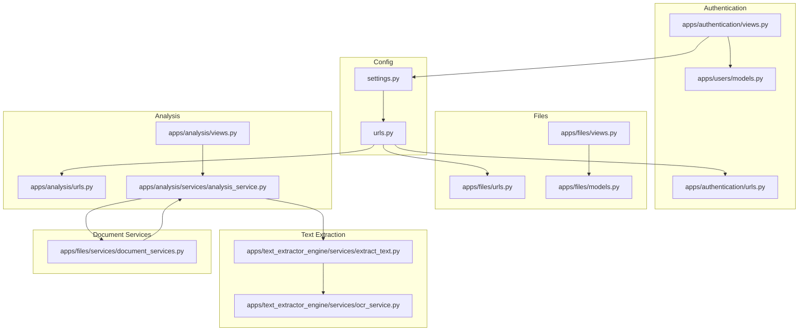
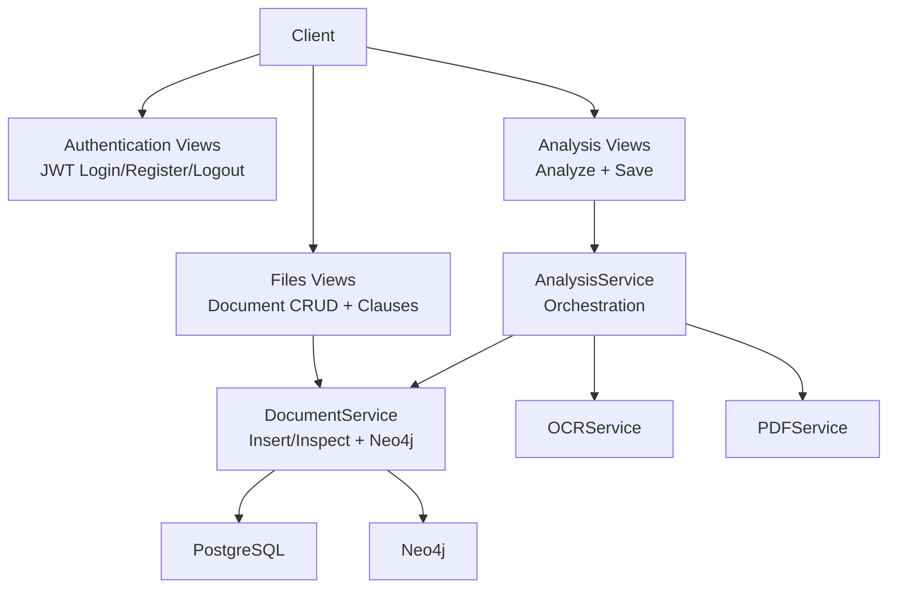
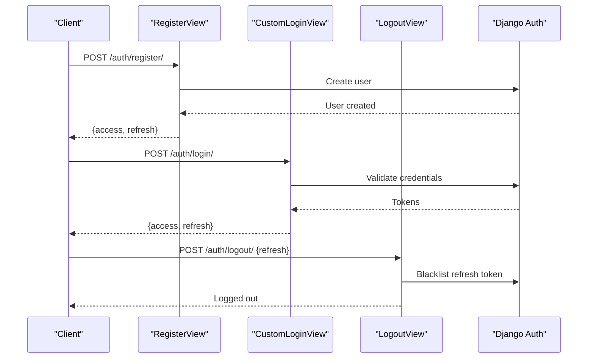
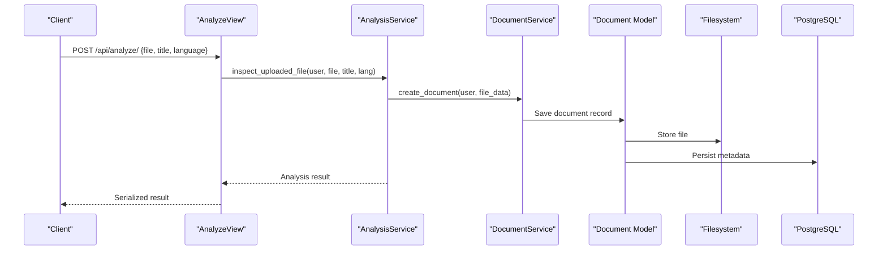
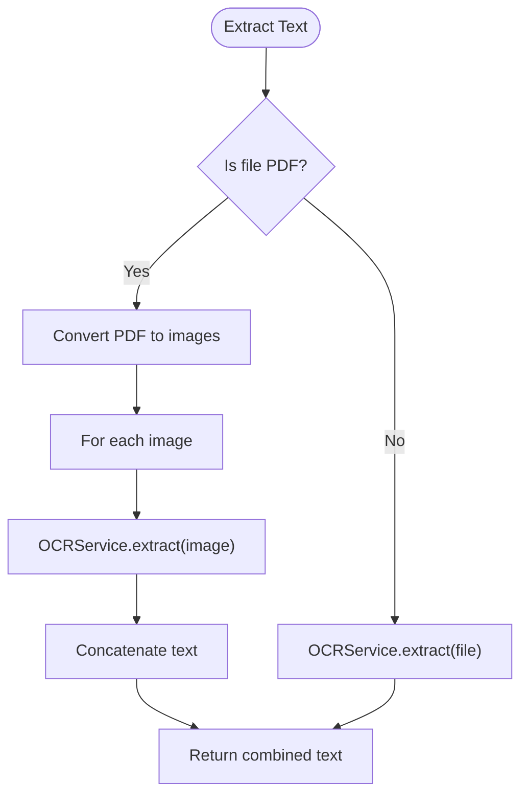
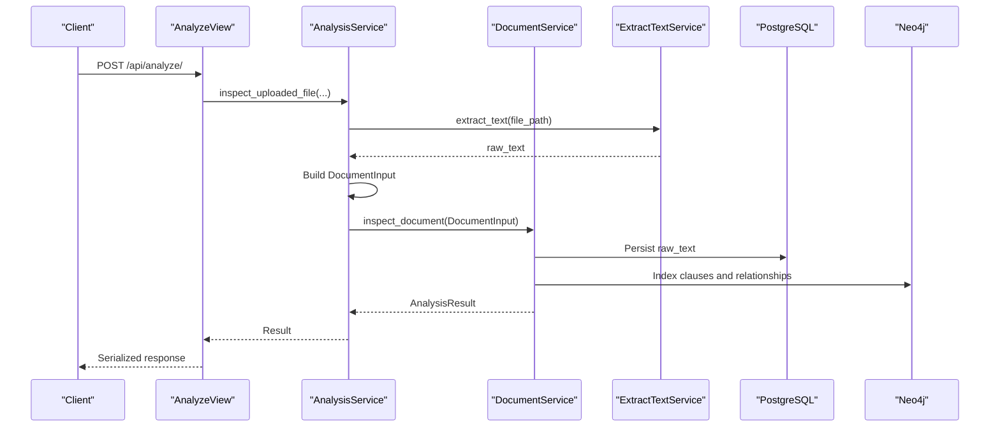
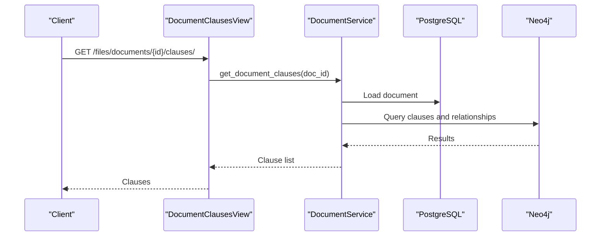
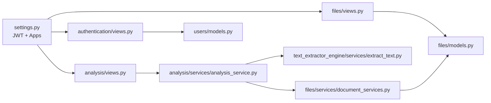

# Feature Highlights

<cite>
**Referenced Files in This Document**
- [settings.py](file://config/settings.py)
- [urls.py](file://config/urls.py)
- [authentication/views.py](file://apps/authentication/views.py)
- [authentication/urls.py](file://apps/authentication/urls.py)
- [users/models.py](file://apps/users/models.py)
- [files/models.py](file://apps/files/models.py)
- [files/views.py](file://apps/files/views.py)
- [files/urls.py](file://apps/files/urls.py)
- [text_extractor_engine/services/extract_text.py](file://apps/text_extractor_engine/services/extract_text.py)
- [text_extractor_engine/services/ocr_service.py](file://apps/text_extractor_engine/services/ocr_service.py)
- [analysis/views.py](file://apps/analysis/views.py)
- [analysis/urls.py](file://apps/analysis/urls.py)
- [analysis/services/analysis_service.py](file://apps/analysis/services/analysis_service.py)
- [files/services/document_services.py](file://apps/files/services/document_services.py)
</cite>

## Table of Contents
1. [Introduction](#introduction)
2. [Project Structure](#project-structure)
3. [Core Components](#core-components)
4. [Architecture Overview](#architecture-overview)
5. [Detailed Component Analysis](#detailed-component-analysis)
6. [Dependency Analysis](#dependency-analysis)
7. [Performance Considerations](#performance-considerations)
8. [Troubleshooting Guide](#troubleshooting-guide)
9. [Conclusion](#conclusion)
10. [Appendices](#appendices)

## Introduction
VeritasShield is a document intelligence platform designed to automate legal and compliance workflows. It provides secure user authentication, robust document upload and storage, multi-format text extraction powered by OCR, and an AI-driven analysis pipeline that inspects, classifies, and indexes contract-related content into a knowledge graph. This document highlights the platform’s core capabilities and demonstrates practical workflows for legal professionals, corporate legal teams, and compliance departments.

## Project Structure
The backend is organized into Django apps that encapsulate distinct functional domains:
- Authentication and user management with JWT-based security
- Document lifecycle (upload, inspection, storage)
- Text extraction engine (OCR and PDF handling)
- Analysis orchestration and AI pipeline integration
- Knowledge graph integration for intelligent relationship discovery

**Diagram sources**
- [settings.py:125-144](file://config/settings.py#L125-L144)
- [urls.py:23-30](file://config/urls.py#L23-L30)
- [authentication/urls.py:8-14](file://apps/authentication/urls.py#L8-L14)
- [authentication/views.py:14-74](file://apps/authentication/views.py#L14-L74)
- [users/models.py:29-46](file://apps/users/models.py#L29-L46)
- [files/urls.py:6-28](file://apps/files/urls.py#L6-L28)
- [files/views.py:11-35](file://apps/files/views.py#L11-L35)
- [files/models.py:5-18](file://apps/files/models.py#L5-L18)
- [text_extractor_engine/services/extract_text.py:5-28](file://apps/text_extractor_engine/services/extract_text.py#L5-L28)
- [text_extractor_engine/services/ocr_service.py:6-18](file://apps/text_extractor_engine/services/ocr_service.py#L6-L18)
- [analysis/urls.py:5-8](file://apps/analysis/urls.py#L5-L8)
- [analysis/views.py:15-100](file://apps/analysis/views.py#L15-L100)
- [analysis/services/analysis_service.py:16-81](file://apps/analysis/services/analysis_service.py#L16-L81)
- [files/services/document_services.py:14-124](file://apps/files/services/document_services.py#L14-L124)

**Section sources**
- [settings.py:26-40](file://config/settings.py#L26-L40)
- [settings.py:125-144](file://config/settings.py#L125-L144)
- [urls.py:23-30](file://config/urls.py#L23-L30)

## Core Components
- Authentication and Management
  - JWT-based login, registration, logout, and refresh endpoints
  - Custom user model with email-based authentication
  - Token blacklist app enabled for secure logout

- Document Upload and Storage
  - File upload with metadata persistence
  - Storage path under media/contracts
  - Document model tracks file extension, language, timestamps, and optional signature date

- Text Extraction Engine
  - Multi-format support via OCR
  - PDF-specific conversion to images followed by OCR
  - Confidence scoring derived from OCR results

- AI-Powered Analysis Pipeline
  - Orchestration of OCR, document inspection, and insertion into the knowledge graph
  - Integration with clause extraction, classification, conflict detection, and similarity matching
  - Results serialized for client consumption

- Knowledge Graph Integration
  - Neo4j connection abstraction used during analysis
  - Clause retrieval by document ID exposed via dedicated endpoint

**Section sources**
- [authentication/views.py:14-74](file://apps/authentication/views.py#L14-L74)
- [users/models.py:29-46](file://apps/users/models.py#L29-L46)
- [files/models.py:5-18](file://apps/files/models.py#L5-L18)
- [text_extractor_engine/services/extract_text.py:10-28](file://apps/text_extractor_engine/services/extract_text.py#L10-L28)
- [text_extractor_engine/services/ocr_service.py:8-18](file://apps/text_extractor_engine/services/ocr_service.py#L8-L18)
- [analysis/services/analysis_service.py:18-50](file://apps/analysis/services/analysis_service.py#L18-L50)
- [files/services/document_services.py:22-81](file://apps/files/services/document_services.py#L22-L81)
- [files/views.py:17-35](file://apps/files/views.py#L17-L35)

## Architecture Overview
The system follows a layered architecture:
- Presentation layer: DRF views and routers
- Domain services: AnalysisService and DocumentService
- Infrastructure: OCR engine, PDF conversion, and Neo4j integration
- Persistence: PostgreSQL-backed Django ORM models

**Diagram sources**
- [authentication/views.py:14-74](file://apps/authentication/views.py#L14-L74)
- [files/views.py:11-35](file://apps/files/views.py#L11-L35)
- [analysis/views.py:15-100](file://apps/analysis/views.py#L15-L100)
- [analysis/services/analysis_service.py:16-81](file://apps/analysis/services/analysis_service.py#L16-L81)
- [files/services/document_services.py:14-124](file://apps/files/services/document_services.py#L14-L124)
- [text_extractor_engine/services/extract_text.py:5-28](file://apps/text_extractor_engine/services/extract_text.py#L5-L28)
- [text_extractor_engine/services/ocr_service.py:6-18](file://apps/text_extractor_engine/services/ocr_service.py#L6-L18)

## Detailed Component Analysis

### Authentication and User Management
- JWT-based security stack configured globally
- Registration validates presence of email/password and uniqueness
- Login uses a custom pair view with a custom serializer
- Logout supports token blacklisting via refresh token
- Custom user model enforces email uniqueness and standard Django permissions

**Diagram sources**
- [authentication/views.py:14-74](file://apps/authentication/views.py#L14-L74)
- [settings.py:125-144](file://config/settings.py#L125-L144)

**Section sources**
- [authentication/views.py:14-74](file://apps/authentication/views.py#L14-L74)
- [authentication/urls.py:8-14](file://apps/authentication/urls.py#L8-L14)
- [users/models.py:29-46](file://apps/users/models.py#L29-L46)
- [settings.py:125-144](file://config/settings.py#L125-L144)

### Document Upload and Storage
- Documents are stored under media/contracts with metadata persisted in PostgreSQL
- Upload endpoint accepts multipart/form-data with file, title, and language
- Retrieval of document clauses is exposed via a dedicated authenticated endpoint

**Diagram sources**
- [analysis/views.py:22-56](file://apps/analysis/views.py#L22-L56)
- [analysis/services/analysis_service.py:18-50](file://apps/analysis/services/analysis_service.py#L18-L50)
- [files/services/document_services.py:83-110](file://apps/files/services/document_services.py#L83-L110)
- [files/models.py:5-18](file://apps/files/models.py#L5-L18)

**Section sources**
- [files/models.py:5-18](file://apps/files/models.py#L5-L18)
- [files/views.py:11-35](file://apps/files/views.py#L11-L35)
- [files/urls.py:6-28](file://apps/files/urls.py#L6-L28)
- [analysis/views.py:22-56](file://apps/analysis/views.py#L22-L56)
- [analysis/services/analysis_service.py:18-50](file://apps/analysis/services/analysis_service.py#L18-L50)

### Text Extraction Engine (OCR and PDF)
- Multi-format extraction: PDFs are converted to images and then OCR’d; other formats are OCR’d directly
- Confidence computed from OCR results for quality assessment
- ExtractTextService delegates to OCRService and PDFService

**Diagram sources**
- [text_extractor_engine/services/extract_text.py:10-28](file://apps/text_extractor_engine/services/extract_text.py#L10-L28)
- [text_extractor_engine/services/ocr_service.py:8-18](file://apps/text_extractor_engine/services/ocr_service.py#L8-L18)

**Section sources**
- [text_extractor_engine/services/extract_text.py:10-28](file://apps/text_extractor_engine/services/extract_text.py#L10-L28)
- [text_extractor_engine/services/ocr_service.py:8-18](file://apps/text_extractor_engine/services/ocr_service.py#L8-L18)

### AI-Powered Analysis Pipeline
- End-to-end workflow: upload → OCR → inspection → insert → knowledge graph indexing
- AnalysisService orchestrates the process and serializes results
- DocumentService coordinates extraction, classification, conflict detection, similarity matching, and Neo4j insertion/inspection

**Diagram sources**
- [analysis/views.py:22-56](file://apps/analysis/views.py#L22-L56)
- [analysis/services/analysis_service.py:18-50](file://apps/analysis/services/analysis_service.py#L18-L50)
- [files/services/document_services.py:22-81](file://apps/files/services/document_services.py#L22-L81)

**Section sources**
- [analysis/views.py:22-56](file://apps/analysis/views.py#L22-L56)
- [analysis/services/analysis_service.py:18-50](file://apps/analysis/services/analysis_service.py#L18-L50)
- [files/services/document_services.py:22-81](file://apps/files/services/document_services.py#L22-L81)

### Knowledge Graph Integration
- Neo4j connection is used during document insertion and inspection
- Clause retrieval by document ID is exposed via an authenticated endpoint
- Similarity and conflict detection leverage embeddings and graph traversal

**Diagram sources**
- [files/views.py:17-35](file://apps/files/views.py#L17-L35)
- [files/services/document_services.py:112-122](file://apps/files/services/document_services.py#L112-L122)

**Section sources**
- [files/views.py:17-35](file://apps/files/views.py#L17-L35)
- [files/services/document_services.py:112-122](file://apps/files/services/document_services.py#L112-L122)

## Dependency Analysis
Key dependencies and coupling:
- Global JWT configuration enables authentication across all authenticated views
- AnalysisService depends on ExtractTextService and DocumentService
- DocumentService integrates OCR, PDF conversion, Neo4j, and domain pipelines
- Files app persists documents and exposes retrieval endpoints
- Authentication app manages user lifecycle and tokens

**Diagram sources**
- [settings.py:26-40](file://config/settings.py#L26-L40)
- [settings.py:125-144](file://config/settings.py#L125-L144)
- [analysis/views.py:15-100](file://apps/analysis/views.py#L15-L100)
- [analysis/services/analysis_service.py:16-81](file://apps/analysis/services/analysis_service.py#L16-L81)
- [text_extractor_engine/services/extract_text.py:5-28](file://apps/text_extractor_engine/services/extract_text.py#L5-L28)
- [files/services/document_services.py:14-124](file://apps/files/services/document_services.py#L14-L124)
- [files/views.py:11-35](file://apps/files/views.py#L11-L35)
- [files/models.py:5-18](file://apps/files/models.py#L5-L18)
- [authentication/views.py:14-74](file://apps/authentication/views.py#L14-L74)
- [users/models.py:29-46](file://apps/users/models.py#L29-L46)

**Section sources**
- [settings.py:125-144](file://config/settings.py#L125-L144)
- [analysis/services/analysis_service.py:16-81](file://apps/analysis/services/analysis_service.py#L16-L81)
- [files/services/document_services.py:14-124](file://apps/files/services/document_services.py#L14-L124)

## Performance Considerations
- OCR latency: PDFs are converted to images before OCR; batch processing and caching can reduce repeated conversions
- Embedding and similarity computations: offload to background tasks for large-scale similarity matching
- Database I/O: minimize round-trips by batching updates and leveraging bulk operations
- Media storage: ensure scalable filesystem or cloud storage for concurrent uploads
- Token lifetimes: configure access/refresh token durations to balance security and UX

## Troubleshooting Guide
- Authentication failures
  - Verify JWT configuration and ensure clients send Authorization: Bearer tokens
  - Confirm refresh tokens are provided for logout and blacklist operations

- Document upload issues
  - Ensure multipart/form-data is used and required fields (file, title, language) are present
  - Check file permissions and media directory write access

- OCR extraction problems
  - Validate file extensions and confirm PDFs are not corrupted
  - Review OCR confidence thresholds and adjust preprocessing steps

- Analysis pipeline errors
  - Confirm raw_text is populated before insertion
  - Inspect Neo4j connectivity and indexes during graph operations

**Section sources**
- [settings.py:125-144](file://config/settings.py#L125-L144)
- [analysis/views.py:28-56](file://apps/analysis/views.py#L28-L56)
- [analysis/views.py:72-99](file://apps/analysis/views.py#L72-L99)
- [analysis/services/analysis_service.py:62-65](file://apps/analysis/services/analysis_service.py#L62-L65)
- [text_extractor_engine/services/extract_text.py:19-27](file://apps/text_extractor_engine/services/extract_text.py#L19-L27)

## Conclusion
VeritasShield delivers a secure, extensible platform for legal and compliance document processing. Its JWT-based authentication, robust document lifecycle, OCR-enabled text extraction, and AI-driven analysis pipeline enable automated contract review, legal research, and similarity analysis. The modular design and Neo4j integration position it for scalable knowledge discovery across enterprise legal workflows.

## Appendices

### Practical Workflows and Use Cases
- Contract review automation
  - Upload contracts in PDF/image/office formats
  - Run OCR-based inspection to extract clauses and metadata
  - Insert into knowledge graph for classification, conflict detection, and similarity matching

- Legal research assistance
  - Index historical contracts and agreements
  - Query similar clauses and relationships to inform new negotiations

- Document similarity analysis
  - Compare clauses across multiple contracts using embeddings
  - Identify divergences and risks flagged by conflict detection

[No sources needed since this section provides general guidance]