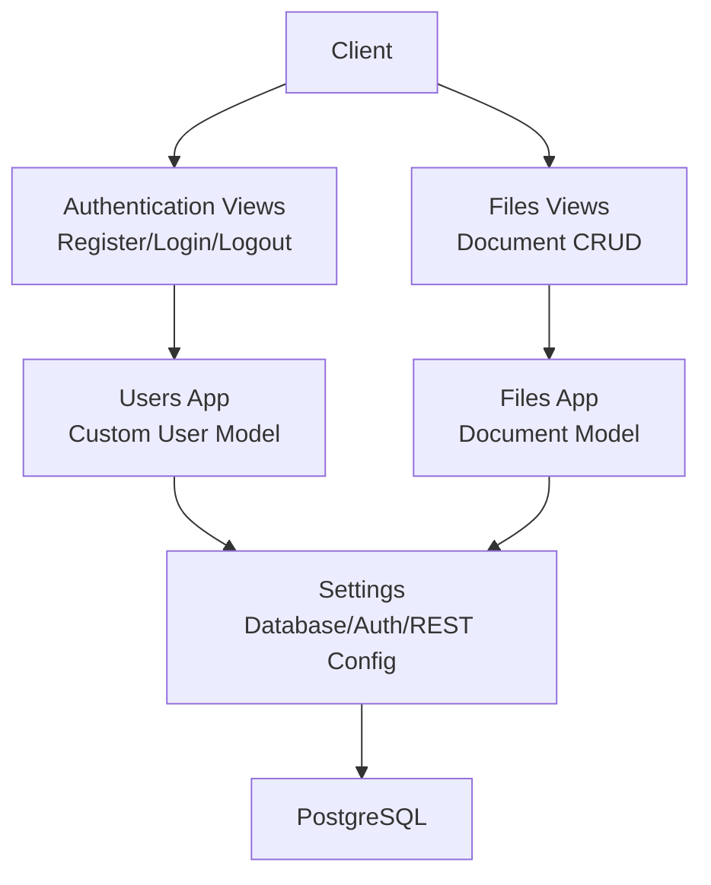

# Getting Started

<cite>
**Referenced Files in This Document**
- [manage.py](file://manage.py)
- [settings.py](file://config/settings.py)
- [urls.py](file://config/urls.py)
- [wsgi.py](file://config/wsgi.py)
- [asgi.py](file://config/asgi.py)
- [authentication views.py](file://apps/authentication/views.py)
- [authentication serializers.py](file://apps/authentication/serializers.py)
- [authentication urls.py](file://apps/authentication/urls.py)
- [users models.py](file://apps/users/models.py)
- [files models.py](file://apps/files/models.py)
- [files serializers.py](file://apps/files/serializers.py)
- [files views.py](file://apps/files/views.py)
- [files urls.py](file://apps/files/urls.py)
</cite>

## Table of Contents
1. [Introduction](#introduction)
2. [Prerequisites](#prerequisites)
3. [Environment Setup](#environment-setup)
4. [Database Configuration](#database-configuration)
5. [Development Server Startup](#development-server-startup)
6. [Quick Start Examples](#quick-start-examples)
7. [API Testing](#api-testing)
8. [Architecture Overview](#architecture-overview)
9. [Troubleshooting Guide](#troubleshooting-guide)
10. [Verification Steps](#verification-steps)
11. [Conclusion](#conclusion)

## Introduction
This guide helps you set up and run the VeritasShield backend locally for development. It covers prerequisites, environment preparation, database configuration, server startup, and practical examples for user registration, login, and document upload. It also includes troubleshooting tips and verification steps to ensure everything works as expected.

## Prerequisites
Before starting, install the following:
- Python 3.8 or newer
- PostgreSQL (required for the Django database)
- Node.js (optional; used for frontend tooling or related tasks if applicable)
- Git (recommended for version control)

Notes:
- Neo4j is not configured in the current settings; if you intend to use it, add its configuration to the settings and install the appropriate driver.
- Ensure your system PATH includes Python and pip so you can run python and pip commands from any terminal.

## Environment Setup
Follow these steps to prepare your local environment:

1. **Create a virtual environment**
   - Use your operating system’s preferred method to create a virtual environment in your project folder.
   - Activate the environment before proceeding.

2. **Install Python dependencies**
   - Install Django and related packages using pip. The project uses Django 6.0 and Django REST Framework with SimpleJWT for authentication.
   - Typical packages include:
     - django
     - djangorestframework
     - djangorestframework-simplejwt
     - psycopg2-binary (PostgreSQL adapter)
     - pillow (for image handling)
   - Pin versions compatible with your Python version and Django 6.0.

3. **Verify installation**
   - Confirm that Django is installed and accessible in your environment.

**Section sources**
- [manage.py:1-23](file://manage.py#L1-L23)
- [settings.py:26-40](file://config/settings.py#L26-L40)

## Database Configuration
The backend uses PostgreSQL as the default database. The configuration is defined in the settings file.

Key points:
- Database engine: PostgreSQL
- Host: localhost
- Port: 5432
- Database name: veritassheild
- User: hamza_admin
- Password: hamza

Steps:
1. Ensure PostgreSQL is installed and running on your machine.
2. Create a database named veritassheild and a user named hamza_admin with the password hamza.
3. Update the DATABASES configuration in settings.py if your local setup differs.
4. Apply migrations to create tables for all apps.

Important note:
- The project defines a custom User model under apps/users. Ensure migrations are applied for that app before running the server.

**Section sources**
- [settings.py:75-84](file://config/settings.py#L75-L84)
- [users models.py:29-46](file://apps/users/models.py#L29-L46)

## Development Server Startup
Start the development server using the manage.py script.

Command:
- Run the development server with the default port (typically 8000).

What happens:
- The manage.py script sets the Django settings module and executes the command-line interface.
- The WSGI application loads the configured apps and URLs.

Optional:
- If you need an ASGI server (for async features), the ASGI module is available in the config package.

**Section sources**
- [manage.py:7-18](file://manage.py#L7-L18)
- [wsgi.py:10-16](file://config/wsgi.py#L10-L16)
- [asgi.py:10-16](file://config/asgi.py#L10-L16)

## Quick Start Examples
This section demonstrates end-to-end workflows for user registration, login, and uploading a document.

### User Registration
- Endpoint: POST /auth/register/
- Request body: email, password
- Expected response: access and refresh tokens upon successful creation

### Login
- Endpoint: POST /auth/login/
- Request body: email, password
- Expected response: JWT pair (access and refresh)

### Logout
- Endpoint: POST /auth/logout/
- Request body: refresh token
- Expected response: success message after blacklisting the token

### Upload a Document
- Endpoint: POST /files/documents/ (or POST /files/upload/)
- Request body: multipart/form-data with file and optional metadata (title, lang)
- Expected response: created document record

Notes:
- Authentication: Use the access token from login in the Authorization header as Bearer <token>.
- The document upload endpoint accepts PDF and images (jpg, jpeg, png).

**Section sources**
- [authentication views.py:14-42](file://apps/authentication/views.py#L14-L42)
- [authentication views.py:45-69](file://apps/authentication/views.py#L45-L69)
- [authentication views.py:72-74](file://apps/authentication/views.py#L72-L74)
- [authentication urls.py:8-14](file://apps/authentication/urls.py#L8-L14)
- [files views.py:8-12](file://apps/files/views.py#L8-L12)
- [files urls.py:6-23](file://apps/files/urls.py#L6-L23)
- [files serializers.py:32-61](file://apps/files/serializers.py#L32-L61)

## API Testing
You can test the APIs using curl or Postman.

### Using curl
- Register a user:
  - curl -X POST http://127.0.0.1:8000/auth/register/ -H "Content-Type: application/json" -d '{"email":"test@example.com","password":"securepassword"}'
- Login:
  - curl -X POST http://127.0.0.1:8000/auth/login/ -H "Content-Type: application/json" -d '{"email":"test@example.com","password":"securepassword"}'
- Upload a document (replace FILE_PATH with a real file):
  - curl -X POST http://127.0.0.1:8000/files/documents/ -H "Authorization: Bearer YOUR_ACCESS_TOKEN" -F "file=@FILE_PATH;type=application/pdf" -F "title=Contract Title" -F "lang=en"
- Logout:
  - curl -X POST http://127.0.0.1:8000/auth/logout/ -H "Content-Type: application/json" -d '{"refresh":"YOUR_REFRESH_TOKEN"}'

### Using Postman
- Set the base URL to http://127.0.0.1:8000
- Configure the Authorization header for protected endpoints as Bearer <access token>
- Use the endpoints listed above to test registration, login, logout, and document upload

## Architecture Overview
The backend follows a layered Django architecture with DRF for APIs. The main components include:
- Settings: Database, authentication, static/media, and REST framework configuration
- Apps: authentication, users, files, analysis, clauses, text extractor engine
- URLs: routed under /auth/, /files/, and others
- WSGI/ASGI: server interfaces for development and optional async support

**Diagram sources**
- [settings.py:75-84](file://config/settings.py#L75-L84)
- [authentication views.py:14-74](file://apps/authentication/views.py#L14-L74)
- [files views.py:8-12](file://apps/files/views.py#L8-L12)
- [users models.py:29-46](file://apps/users/models.py#L29-L46)
- [files models.py:5-18](file://apps/files/models.py#L5-L18)

## Troubleshooting Guide
Common issues and fixes:

- Django import error during startup
  - Cause: Missing Django installation or wrong Python path
  - Fix: Reinstall Django in your activated virtual environment; ensure PYTHONPATH includes the project root

- Database connection fails
  - Symptoms: OperationalError indicating unable to connect to PostgreSQL
  - Checks:
    - Verify PostgreSQL is running
    - Confirm credentials and database name match settings.py
    - Ensure the user has privileges to connect and create tables
  - Action: Update DATABASES in settings.py if needed and retry migrations

- Migration errors
  - Symptom: Errors about unapplied migrations
  - Fix: Run migrations for all apps, especially the users app which defines the custom User model

- Port conflicts
  - Symptom: Address already in use
  - Fix: Stop the conflicting service or change the development server port

- Missing dependencies
  - Symptom: ModuleNotFoundError for DRF, SimpleJWT, or psycopg2
  - Fix: Install required packages with pip and ensure compatibility with Django 6.0

- Authentication failures
  - Symptom: 401/403 responses
  - Checks:
    - Ensure you are sending the Authorization header with Bearer token
    - Confirm the token is fresh and not expired

**Section sources**
- [manage.py:10-17](file://manage.py#L10-L17)
- [settings.py:75-84](file://config/settings.py#L75-L84)

## Verification Steps
After completing setup and server startup:

1. **Server runs without errors**
   - Confirm the development server starts successfully on the expected port

2. **Endpoints reachable**
   - GET /admin/ (Django admin)
   - GET /auth/register/, /auth/login/, /auth/logout/
   - GET /files/documents/ (and CRUD endpoints)

3. **Database connectivity verified**
   - Run migrations and confirm tables are created for apps

4. **Basic functionality test**
   - Register a user, log in, and receive tokens
   - Upload a document and verify it appears in the list

5. **Static and media files**
   - Confirm MEDIA_URL is served and uploads are stored under media/

**Section sources**
- [urls.py:23-30](file://config/urls.py#L23-L30)
- [settings.py:122-123](file://config/settings.py#L122-L123)

## Conclusion
You now have the essentials to develop on VeritasShield backend. Create and activate a virtual environment, install dependencies, configure PostgreSQL, apply migrations, and start the development server. Use the provided endpoints to register, log in, and upload documents. Refer to the troubleshooting section for common issues and verify your setup using the steps above.