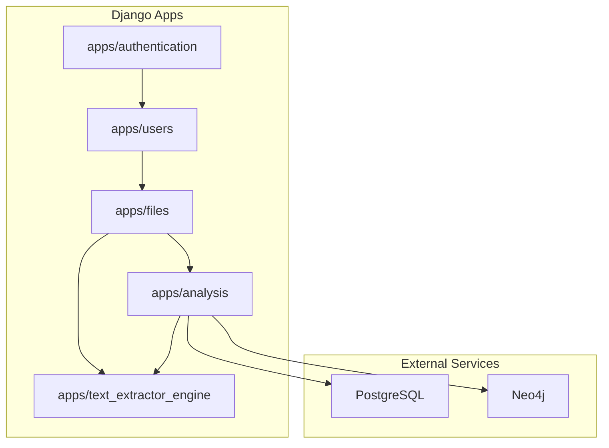
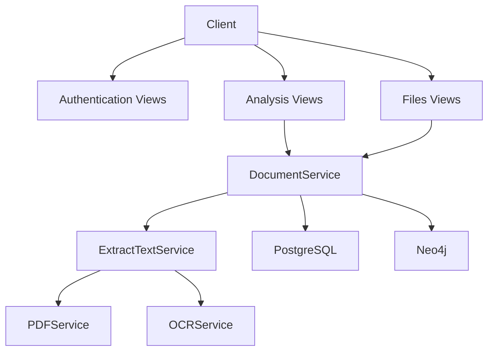
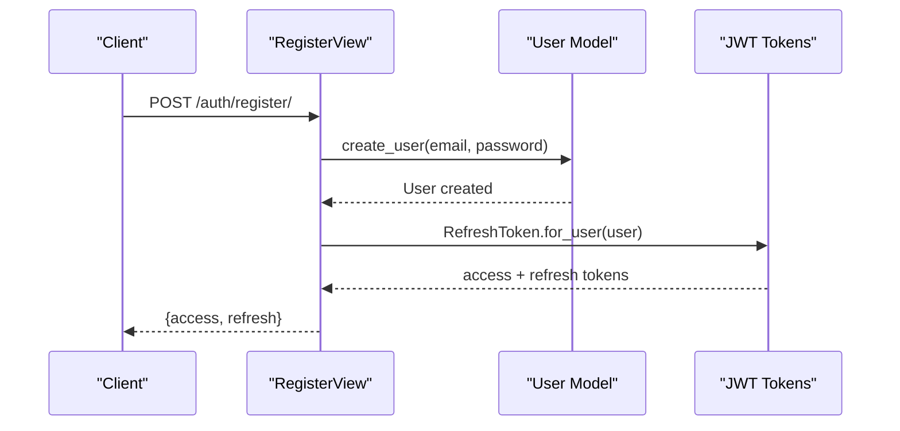
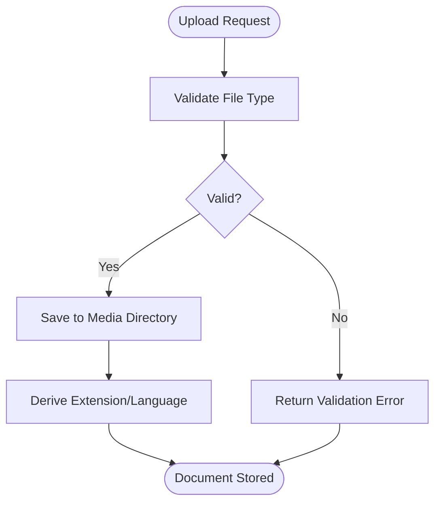
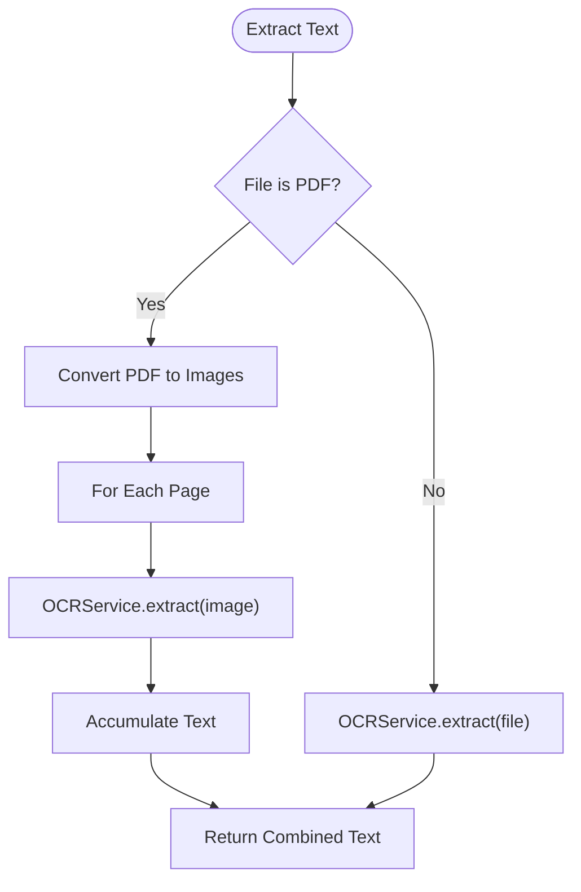
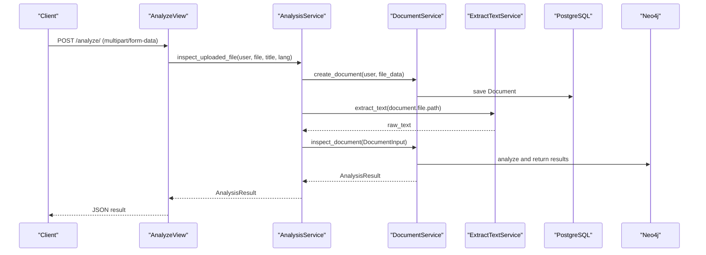
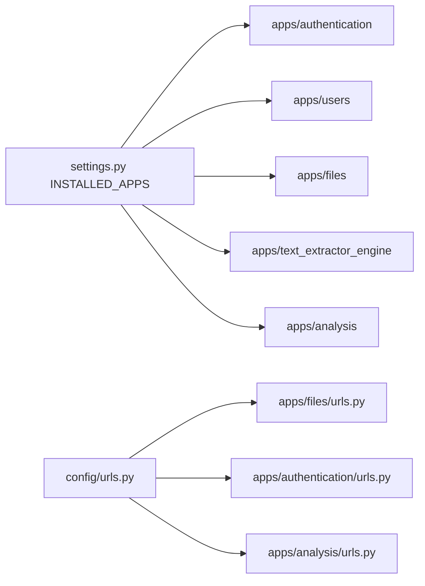

# Project Overview

<cite>
**Referenced Files in This Document**
- [settings.py](file://config/settings.py)
- [urls.py](file://config/urls.py)
- [models.py (files)](file://apps/files/models.py)
- [models.py (users)](file://apps/users/models.py)
- [views.py (authentication)](file://apps/authentication/views.py)
- [views.py (analysis)](file://apps/analysis/views.py)
- [views.py (files)](file://apps/files/views.py)
- [serializers.py (files)](file://apps/files/serializers.py)
- [serializers.py (analysis)](file://apps/analysis/serializers.py)
- [document_services.py](file://apps/files/services/document_services.py)
- [analysis_service.py](file://apps/analysis/services/analysis_service.py)
- [extract_text.py](file://apps/text_extractor_engine/services/extract_text.py)
- [ocr_service.py](file://apps/text_extractor_engine/services/ocr_service.py)
- [pdf_service.py](file://apps/text_extractor_engine/services/pdf_service.py)
</cite>

## Table of Contents
1. [Introduction](#introduction)
2. [Project Structure](#project-structure)
3. [Core Components](#core-components)
4. [Architecture Overview](#architecture-overview)
5. [Detailed Component Analysis](#detailed-component-analysis)
6. [Dependency Analysis](#dependency-analysis)
7. [Performance Considerations](#performance-considerations)
8. [Troubleshooting Guide](#troubleshooting-guide)
9. [Conclusion](#conclusion)

## Introduction
VeritasShield is a contract analysis and document processing platform designed to automate legal document analysis using OCR technology and AI pipelines. It enables legal professionals and organizations to efficiently upload, extract text from, analyze, and manage contracts while detecting potential conflicts and identifying similar clauses across a knowledge graph.

Key capabilities include:
- User authentication and session management
- Secure document upload and storage
- Multi-format text extraction (PDF and images) via OCR
- Contract clause extraction and classification
- Knowledge graph integration for structured contract insights
- Conflict detection and similarity analysis

Target audience:
- Legal teams and paralegals
- Compliance officers
- Corporate legal departments
- Law firms managing large volumes of contracts

Real-world impact:
- Reduces manual effort in contract review
- Standardizes clause analysis and comparison
- Identifies inconsistencies and risks early
- Accelerates contract onboarding and renewal cycles

## Project Structure
The backend is a Django application with Django REST Framework APIs. The system is organized into modular apps that encapsulate distinct responsibilities:
- Authentication: User registration, login, logout, and JWT token lifecycle
- Users: Custom user model and profile-related operations
- Files: Document model, upload handling, and CRUD operations
- Text Extractor Engine: OCR and PDF-to-image conversion services
- Analysis: Orchestration of OCR, AI inspection, and knowledge graph insertion

**Diagram sources**
- [settings.py:26-39](file://config/settings.py#L26-L39)
- [urls.py:23-30](file://config/urls.py#L23-L30)
- [document_services.py:14-21](file://apps/files/services/document_services.py#L14-L21)

**Section sources**
- [settings.py:26-39](file://config/settings.py#L26-L39)
- [urls.py:23-30](file://config/urls.py#L23-L30)

## Core Components
- Authentication and Authorization
  - JWT-based authentication with refresh token blacklist support
  - Registration, login, and logout endpoints
  - Session middleware and permission enforcement

- Document Management
  - Document model with metadata (extension, language, timestamps)
  - File upload validation and storage under media/contracts
  - Admin-only document management interface

- OCR and Text Extraction
  - PDF-to-image conversion for scanned documents
  - EasyOCR-powered text extraction with confidence scoring
  - Unified extraction pipeline supporting multiple formats

- AI-Powered Analysis
  - Clause extraction and classification
  - Similarity matching and conflict detection
  - Knowledge graph insertion and retrieval

- Knowledge Graph Integration
  - Neo4j connection for storing and querying contract relationships
  - Structured representation of clauses, documents, and conflicts

**Section sources**
- [views.py (authentication):14-74](file://apps/authentication/views.py#L14-L74)
- [models.py (files):5-17](file://apps/files/models.py#L5-L17)
- [ocr_service.py:6-17](file://apps/text_extractor_engine/services/ocr_service.py#L6-L17)
- [pdf_service.py:4-14](file://apps/text_extractor_engine/services/pdf_service.py#L4-L14)
- [analysis_service.py:16-50](file://apps/analysis/services/analysis_service.py#L16-L50)
- [document_services.py:14-62](file://apps/files/services/document_services.py#L14-L62)

## Architecture Overview
The system follows a layered architecture:
- Presentation Layer: Django REST Framework views and serializers
- Application Layer: Services orchestrating OCR, AI pipelines, and persistence
- Data Access Layer: Django ORM for PostgreSQL and Neo4j driver for knowledge graph
- External Integrations: EasyOCR for text extraction, Neo4j for graph storage

**Diagram sources**
- [views.py (analysis):15-100](file://apps/analysis/views.py#L15-L100)
- [views.py (files):8-12](file://apps/files/views.py#L8-L12)
- [views.py (authentication):14-74](file://apps/authentication/views.py#L14-L74)
- [document_services.py:14-62](file://apps/files/services/document_services.py#L14-L62)
- [extract_text.py:5-27](file://apps/text_extractor_engine/services/extract_text.py#L5-L27)
- [ocr_service.py:6-17](file://apps/text_extractor_engine/services/ocr_service.py#L6-L17)
- [pdf_service.py:4-14](file://apps/text_extractor_engine/services/pdf_service.py#L4-L14)

## Detailed Component Analysis

### Authentication and User Management
- Custom user model with email-based authentication
- JWT pair generation and refresh token blacklist
- Registration with duplicate email prevention
- Logout by blacklisting refresh tokens

**Diagram sources**
- [views.py (authentication):14-42](file://apps/authentication/views.py#L14-L42)
- [models.py (users):29-46](file://apps/users/models.py#L29-L46)

**Section sources**
- [views.py (authentication):14-74](file://apps/authentication/views.py#L14-L74)
- [models.py (users):29-46](file://apps/users/models.py#L29-L46)
- [settings.py:143-143](file://config/settings.py#L143-L143)

### Document Upload and Storage
- File validation for supported formats
- Automatic metadata derivation (extension, language)
- Storage under media/contracts with unique filenames
- Admin-only document management

**Diagram sources**
- [serializers.py (files):48-52](file://apps/files/serializers.py#L48-L52)
- [models.py (files):5-17](file://apps/files/models.py#L5-L17)

**Section sources**
- [serializers.py (files):32-61](file://apps/files/serializers.py#L32-L61)
- [models.py (files):5-17](file://apps/files/models.py#L5-L17)
- [views.py (files):8-12](file://apps/files/views.py#L8-L12)

### OCR and Text Extraction Pipeline
- PDFs are converted to images per page
- Each page is processed via EasyOCR to extract text
- Confidence computed as average of per-line confidence scores
- Unified extraction method supports PDF and image formats

**Diagram sources**
- [extract_text.py:10-27](file://apps/text_extractor_engine/services/extract_text.py#L10-L27)
- [pdf_service.py:5-14](file://apps/text_extractor_engine/services/pdf_service.py#L5-L14)
- [ocr_service.py:8-17](file://apps/text_extractor_engine/services/ocr_service.py#L8-L17)

**Section sources**
- [extract_text.py:5-27](file://apps/text_extractor_engine/services/extract_text.py#L5-L27)
- [pdf_service.py:4-14](file://apps/text_extractor_engine/services/pdf_service.py#L4-L14)
- [ocr_service.py:6-17](file://apps/text_extractor_engine/services/ocr_service.py#L6-L17)

### AI Analysis and Knowledge Graph Integration
- End-to-end workflow: upload → OCR → inspection → insert
- Uses clause extractor and classifier
- Leverages similarity engine and conflict detector
- Stores results in Neo4j for relationship queries

**Diagram sources**
- [views.py (analysis):22-56](file://apps/analysis/views.py#L22-L56)
- [analysis_service.py:19-50](file://apps/analysis/services/analysis_service.py#L19-L50)
- [document_services.py:46-62](file://apps/files/services/document_services.py#L46-L62)
- [extract_text.py:10-27](file://apps/text_extractor_engine/services/extract_text.py#L10-L27)

**Section sources**
- [views.py (analysis):15-100](file://apps/analysis/views.py#L15-L100)
- [analysis_service.py:16-81](file://apps/analysis/services/analysis_service.py#L16-L81)
- [document_services.py:14-62](file://apps/files/services/document_services.py#L14-L62)

## Dependency Analysis
- App wiring: installed apps define module dependencies
- URL routing: top-level URLs include app-specific namespaces
- Authentication: JWT settings and custom user model
- Data persistence: PostgreSQL for relational data, Neo4j for graph data
- OCR pipeline: EasyOCR and pdf2image dependencies

**Diagram sources**
- [settings.py:26-39](file://config/settings.py#L26-L39)
- [urls.py:23-30](file://config/urls.py#L23-L30)

**Section sources**
- [settings.py:74-83](file://config/settings.py#L74-L83)
- [settings.py:124-142](file://config/settings.py#L124-L142)

## Performance Considerations
- OCR throughput: Batch pages and process in parallel where feasible
- PDF conversion: Limit resolution and page count for large documents
- Database writes: Use bulk operations for clause inserts
- Graph queries: Index nodes and relationships on frequently queried fields
- Caching: Cache extracted text and similarity results for repeated queries

## Troubleshooting Guide
Common issues and resolutions:
- Authentication failures: Verify JWT settings and ensure refresh tokens are properly blacklisted
- File upload errors: Confirm supported extensions and MEDIA_ROOT permissions
- OCR extraction failures: Validate EasyOCR language packs and PDF-to-image conversion
- Knowledge graph errors: Check Neo4j connectivity and schema consistency
- Analysis timeouts: Monitor OCR latency and adjust concurrency limits

**Section sources**
- [views.py (authentication):45-69](file://apps/authentication/views.py#L45-L69)
- [serializers.py (files):48-52](file://apps/files/serializers.py#L48-L52)
- [views.py (analysis):52-56](file://apps/analysis/views.py#L52-L56)

## Conclusion
VeritasShield streamlines contract lifecycle management by combining robust document ingestion, accurate OCR-based text extraction, and intelligent AI analysis with a knowledge graph. Its modular Django architecture, clear separation of concerns, and integration points enable legal teams to scale contract review, maintain compliance, and reduce risk through automation.