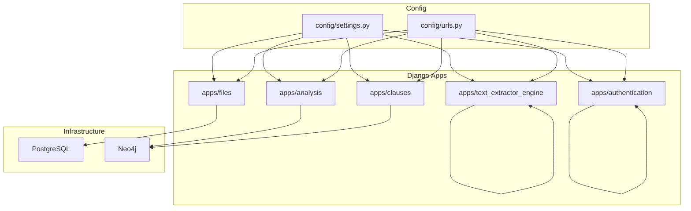
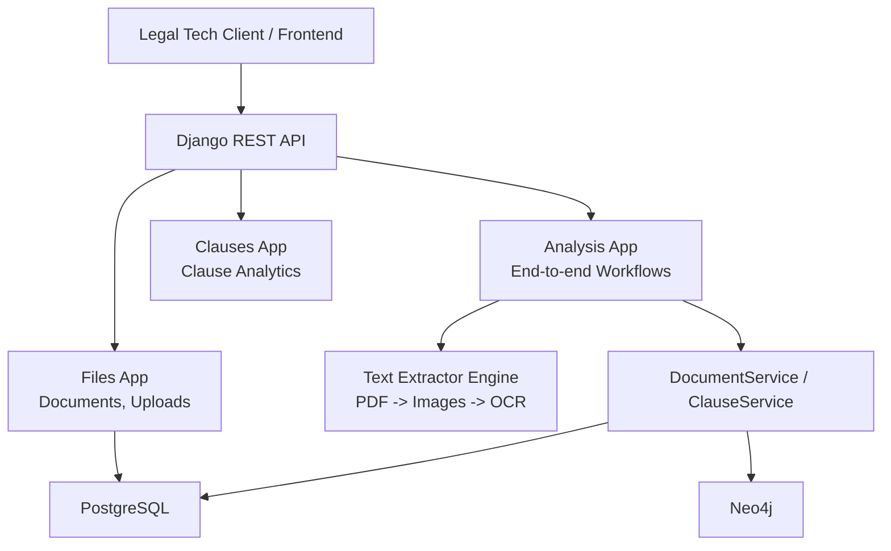
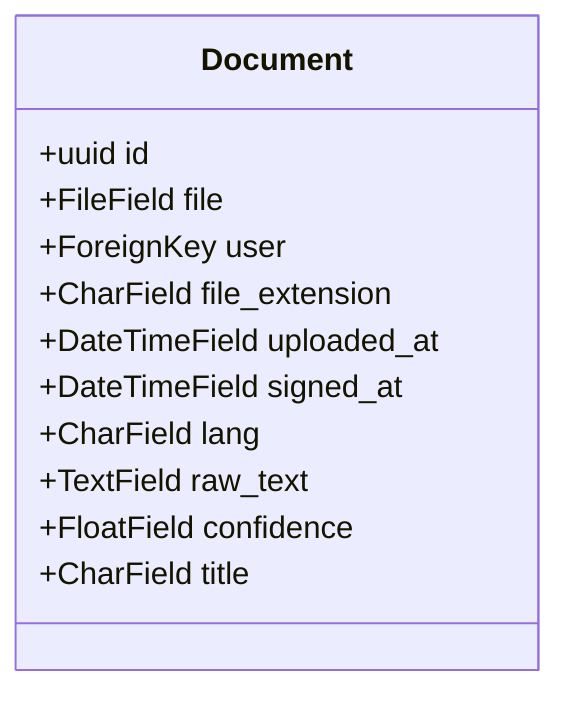
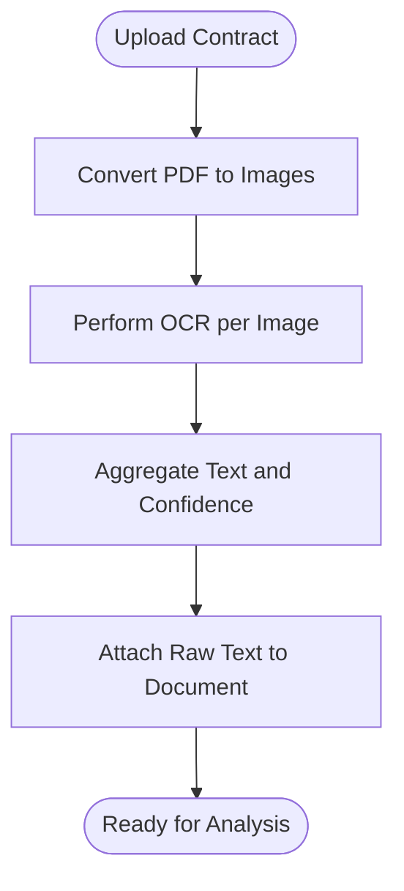
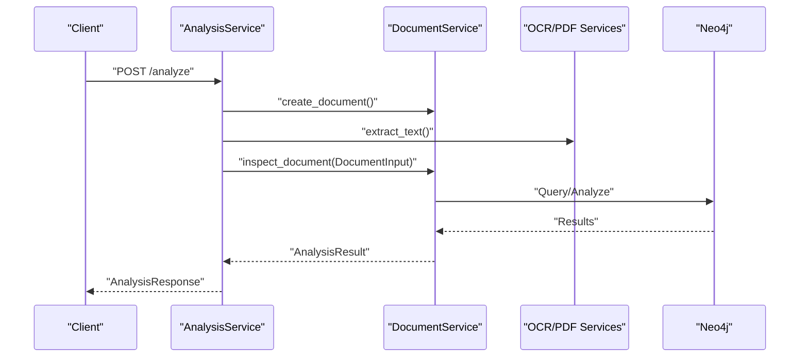
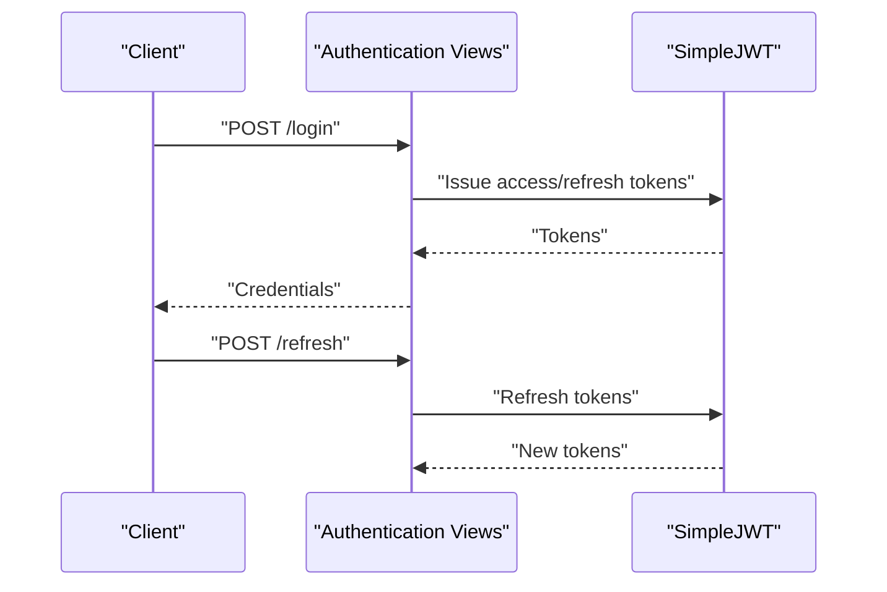
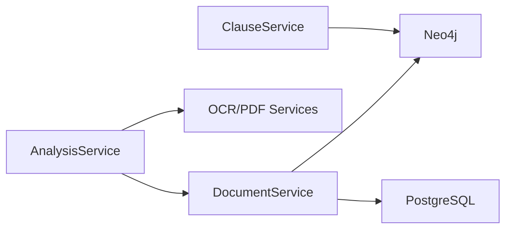

# Project Overview

<cite>
**Referenced Files in This Document**
- [settings.py](file://config/settings.py)
- [urls.py](file://config/urls.py)
- [document_services.py](file://apps/files/services/document_services.py)
- [document_models.py](file://apps/files/models.py)
- [analysis_service.py](file://apps/analysis/services/analysis_service.py)
- [pdf_service.py](file://apps/text_extractor_engine/services/pdf_service.py)
- [ocr_service.py](file://apps/text_extractor_engine/services/ocr_service.py)
- [files_urls.py](file://apps/files/urls.py)
- [analysis_urls.py](file://apps/analysis/urls.py)
- [clauses_urls.py](file://apps/clauses/urls.py)
- [authentication_urls.py](file://apps/authentication/urls.py)
- [clause_service.py](file://apps/clauses/services/clause_service.py)
- [docker_postgres.yaml](file://docker_files/postgresql_docker_compose.yaml)
- [docker_neo4j.yaml](file://docker_files/neo4j_docker_compose.yaml)
</cite>

## Table of Contents
1. [Introduction](#introduction)
2. [Project Structure](#project-structure)
3. [Core Components](#core-components)
4. [Architecture Overview](#architecture-overview)
5. [Detailed Component Analysis](#detailed-component-analysis)
6. [Dependency Analysis](#dependency-dependencies)
7. [Performance Considerations](#performance-considerations)
8. [Troubleshooting Guide](#troubleshooting-guide)
9. [Conclusion](#conclusion)

## Introduction
Veritas Shield is an AI-powered legal document processing platform designed to automate contract lifecycle tasks through intelligent text extraction, clause analysis, and knowledge graph integration. Built for legal professionals and legal tech teams, it accelerates contract review, identifies potential risks, and enables scalable contract analytics using modern AI/ML pipelines and graph databases.

Key positioning:
- Legal document automation: Reduces manual effort in contract ingestion, parsing, and analysis.
- AI-driven insights: Employs OCR, NLP-based clause extraction, and similarity/conflict detection.
- Graph-backed knowledge: Stores structured relationships between documents, clauses, parties, and obligations for advanced querying and discovery.
- Developer-friendly stack: Django REST Framework backend with modular services and Dockerized infrastructure.

## Project Structure
The backend follows a Django app-centric structure with clear separation of concerns:
- apps/files: Document ingestion, persistence, and metadata management.
- apps/analysis: Orchestration of end-to-end analysis workflows.
- apps/clauses: Clause-level analytics and retrieval.
- apps/text_extractor_engine: OCR and PDF image conversion utilities.
- apps/authentication: User registration, login, and JWT token management.
- config: Django settings, URL routing, WSGI/ASGI applications.
- docker_files: Compose configurations for PostgreSQL and Neo4j.

**Diagram sources**
- [settings.py:26-40](file://config/settings.py#L26-L40)
- [urls.py:1-200](file://config/urls.py#L1-L200)

**Section sources**
- [settings.py:26-40](file://config/settings.py#L26-L40)
- [settings.py:75-84](file://config/settings.py#L75-L84)

## Core Components
- Document Management
  - Purpose: Persist uploaded contracts, track metadata, and maintain raw text for downstream processing.
  - Implementation: Document model stores file path, user ownership, extension, timestamps, language, OCR-extracted text, confidence score, and optional signing date.
  - Integration: Used by analysis and clause services to coordinate processing and retrieval.

- Text Extraction Engine
  - Purpose: Convert PDFs to images and extract readable text via OCR for unstructured documents.
  - Implementation: PDFService converts pages to images; OCRService reads text and computes average confidence.

- Clause Analysis Pipeline
  - Purpose: Extract, classify, and analyze contract clauses; detect conflicts and similarities; integrate with the knowledge graph.
  - Implementation: DocumentService orchestrates extraction, classification, similarity checks, conflict detection, and graph insertion/inspection.

- Knowledge Graph Integration
  - Purpose: Store and query structured relationships among contracts, clauses, parties, and obligations.
  - Implementation: Neo4j connection used by DocumentService for insert/inspect operations.

- Authentication and Authorization
  - Purpose: Secure user access with JWT-based authentication and logout support.
  - Implementation: SimpleJWT integration with custom login/register/logout views.

**Section sources**
- [document_models.py:5-17](file://apps/files/models.py#L5-L17)
- [pdf_service.py:4-14](file://apps/text_extractor_engine/services/pdf_service.py#L4-L14)
- [ocr_service.py:6-17](file://apps/text_extractor_engine/services/ocr_service.py#L6-L17)
- [document_services.py:16-83](file://apps/files/services/document_services.py#L16-L83)
- [settings.py:125-143](file://config/settings.py#L125-L143)

## Architecture Overview
The system is a layered Django REST platform with AI/ML and graph database integrations:
- API Layer: Views and routers expose endpoints for document upload, inspection, saving, clause analysis, and authentication.
- Service Layer: Coordinators orchestrate workflows, calling OCR, extraction, classification, similarity, and conflict detection.
- Data Access: Django ORM persists documents; Neo4j stores knowledge graph entities and relationships.
- Infrastructure: PostgreSQL for relational data; Neo4j for graph storage; Docker compose files for local deployment.

**Diagram sources**
- [files_urls.py:6-28](file://apps/files/urls.py#L6-L28)
- [analysis_urls.py:5-8](file://apps/analysis/urls.py#L5-L8)
- [clauses_urls.py:5-11](file://apps/clauses/urls.py#L5-L11)
- [authentication_urls.py:8-14](file://apps/authentication/urls.py#L8-L14)
- [document_services.py:16-83](file://apps/files/services/document_services.py#L16-L83)
- [analysis_service.py:18-89](file://apps/analysis/services/analysis_service.py#L18-L89)

## Detailed Component Analysis

### Document Management
- Responsibilities
  - Accept file uploads with metadata (title, language, extension).
  - Persist documents and update with OCR-derived text.
  - Provide retrieval for analysis and clause association.

- Data Model Highlights
  - Fields include file path, user foreign key, extension, timestamps, language, raw text, confidence, and optional signing date.

- API Surface
  - List/create/retrieve/update/delete documents.
  - Dedicated upload endpoint.

**Diagram sources**
- [document_models.py:5-17](file://apps/files/models.py#L5-L17)

**Section sources**
- [document_models.py:5-17](file://apps/files/models.py#L5-L17)
- [files_urls.py:6-28](file://apps/files/urls.py#L6-L28)

### Text Extraction Engine
- Responsibilities
  - Convert PDFs to page images for OCR processing.
  - Extract text from images and compute average confidence.

- Processing Flow
  - PDFService: Page-by-page conversion to images.
  - OCRService: Text extraction and confidence aggregation.

**Diagram sources**
- [pdf_service.py:4-14](file://apps/text_extractor_engine/services/pdf_service.py#L4-L14)
- [ocr_service.py:6-17](file://apps/text_extractor_engine/services/ocr_service.py#L6-L17)

**Section sources**
- [pdf_service.py:4-14](file://apps/text_extractor_engine/services/pdf_service.py#L4-L14)
- [ocr_service.py:6-17](file://apps/text_extractor_engine/services/ocr_service.py#L6-L17)

### Clause Analysis and Knowledge Graph Integration
- Responsibilities
  - Extract and classify contract clauses.
  - Detect conflicts and identify similar clauses.
  - Insert documents and clauses into the knowledge graph.
  - Inspect existing documents for analysis results.

- Orchestration
  - AnalysisService coordinates document creation, OCR, and graph inspection/insertion.
  - DocumentService composes extraction, classification, similarity, and conflict detection.

**Diagram sources**
- [analysis_service.py:18-59](file://apps/analysis/services/analysis_service.py#L18-L59)
- [document_services.py:48-64](file://apps/files/services/document_services.py#L48-L64)

**Section sources**
- [analysis_service.py:18-89](file://apps/analysis/services/analysis_service.py#L18-L89)
- [document_services.py:16-83](file://apps/files/services/document_services.py#L16-L83)
- [clause_service.py:4-19](file://apps/clauses/services/clause_service.py#L4-L19)

### Authentication and Authorization
- Responsibilities
  - User registration, login, logout, and token refresh.
  - JWT-based authentication for protected endpoints.

- Integration
  - SimpleJWT configured with access/refresh lifetimes and bearer tokens.

**Diagram sources**
- [authentication_urls.py:8-14](file://apps/authentication/urls.py#L8-L14)
- [settings.py:125-143](file://config/settings.py#L125-L143)

**Section sources**
- [authentication_urls.py:8-14](file://apps/authentication/urls.py#L8-L14)
- [settings.py:125-143](file://config/settings.py#L125-L143)

## Dependency Analysis
- Internal Dependencies
  - AnalysisService depends on DocumentService, OCR/PDF services, and Document model.
  - DocumentService depends on AI pipeline components and Neo4j connection.
  - ClauseService depends on clause repository for graph queries.

- External Dependencies
  - Django REST Framework and SimpleJWT for API and auth.
  - PostgreSQL for relational persistence.
  - Neo4j for knowledge graph storage.

**Diagram sources**
- [analysis_service.py:14-15](file://apps/analysis/services/analysis_service.py#L14-L15)
- [document_services.py:16-22](file://apps/files/services/document_services.py#L16-L22)
- [clause_service.py](file://apps/clauses/services/clause_service.py#L1)

**Section sources**
- [settings.py:26-40](file://config/settings.py#L26-L40)
- [settings.py:75-84](file://config/settings.py#L75-L84)
- [settings.py:125-143](file://config/settings.py#L125-L143)

## Performance Considerations
- OCR and PDF Processing
  - Batch page conversion and parallel OCR can improve throughput for multi-page documents.
  - Cache OCR results per page to avoid redundant processing.

- Graph Operations
  - Use transactional writes and indexing on frequently queried nodes/relationships.
  - Limit similarity/conflict scans to relevant subsets of the graph.

- Storage and Media
  - Store original files efficiently and consider compression for large contracts.
  - Offload media to cloud storage in production environments.

- API Design
  - Paginate clause lists and limit concurrent analysis jobs.
  - Implement rate limiting for upload and analysis endpoints.

## Troubleshooting Guide
- Authentication Issues
  - Verify JWT configuration and ensure clients send Bearer tokens.
  - Confirm refresh token lifetime and blacklisting settings.

- OCR Failures
  - Validate PDF conversion and image quality.
  - Check OCR language packs and fallback strategies.

- Graph Connectivity
  - Confirm Neo4j credentials and connectivity.
  - Review transaction boundaries and error handling in graph operations.

- Database Persistence
  - Ensure PostgreSQL is reachable and migrations are applied.
  - Verify MEDIA_ROOT permissions for file uploads.

**Section sources**
- [settings.py:125-143](file://config/settings.py#L125-L143)
- [settings.py:75-84](file://config/settings.py#L75-L84)
- [pdf_service.py:4-14](file://apps/text_extractor_engine/services/pdf_service.py#L4-L14)
- [ocr_service.py:6-17](file://apps/text_extractor_engine/services/ocr_service.py#L6-L17)
- [docker_postgres.yaml:1-200](file://docker_files/postgresql_docker_compose.yaml#L1-L200)
- [docker_neo4j.yaml:1-200](file://docker_files/neo4j_docker_compose.yaml#L1-L200)

## Conclusion
Veritas Shield positions itself as a modern legal tech platform that automates contract ingestion, extraction, and analysis while building a knowledge graph for intelligent discovery. Its Django-based architecture, modular services, and Dockerized infrastructure enable rapid iteration and scalability. By combining OCR, clause extraction/classification, similarity/conflict detection, and graph storage, it offers legal teams a powerful foundation for contract lifecycle automation and risk management.