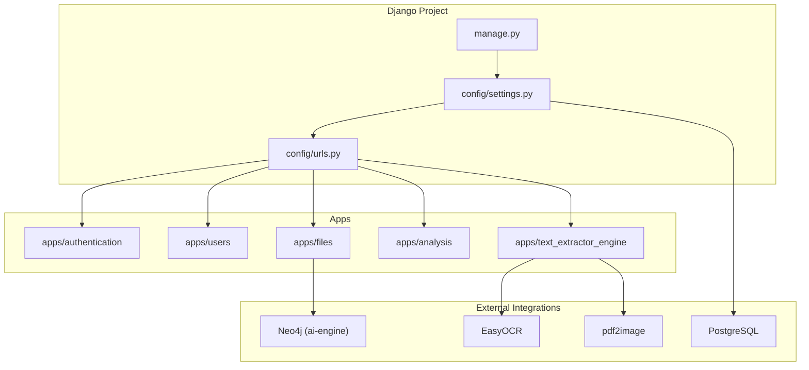
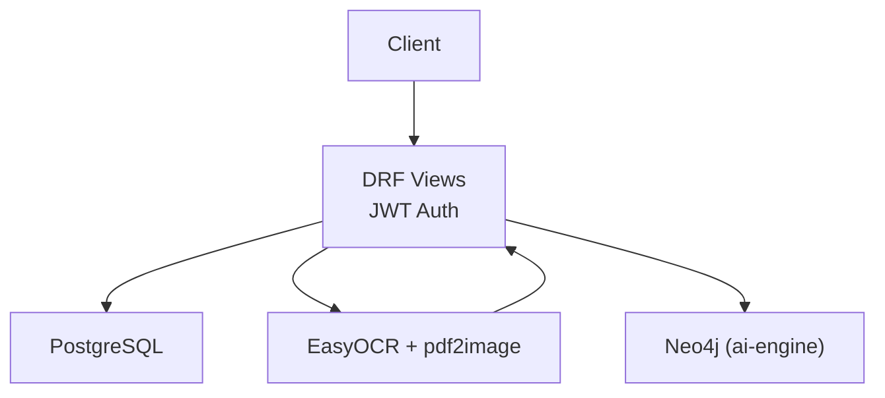
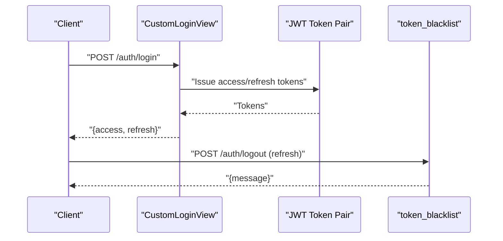
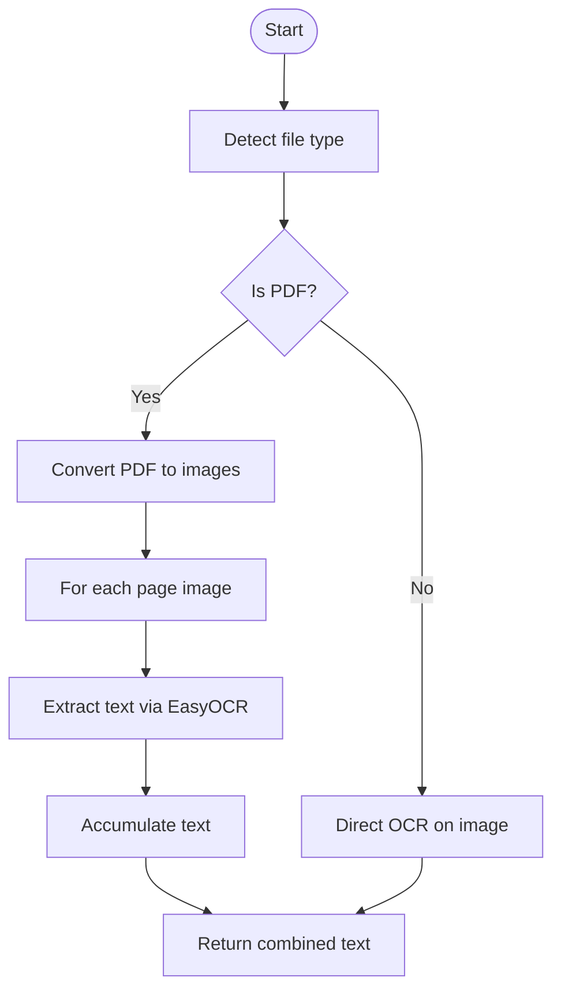
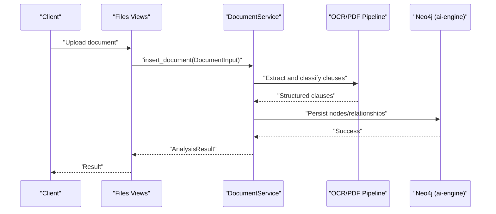
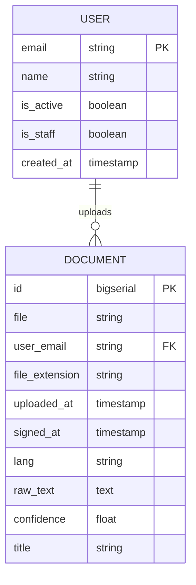
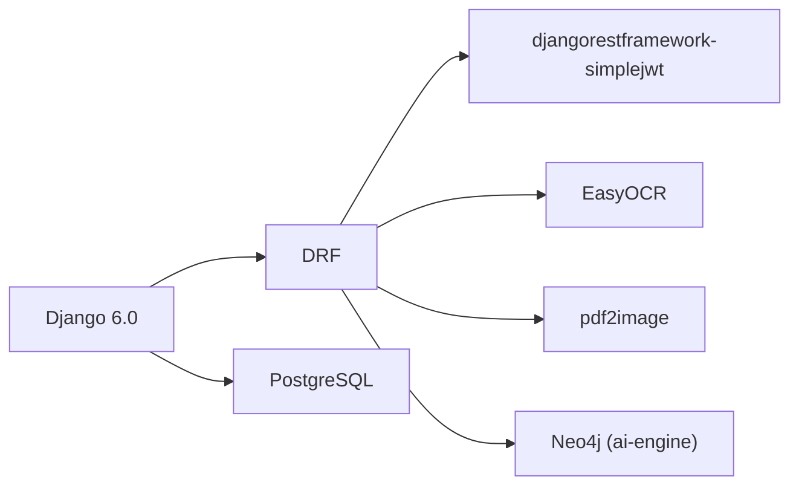

# Technology Stack & Dependencies

<cite>
**Referenced Files in This Document**
- [manage.py](file://manage.py)
- [settings.py](file://config/settings.py)
- [urls.py](file://config/urls.py)
- [pdf_service.py](file://apps/text_extractor_engine/services/pdf_service.py)
- [ocr_service.py](file://apps/text_extractor_engine/services/ocr_service.py)
- [extract_text.py](file://apps/text_extractor_engine/services/extract_text.py)
- [document_services.py](file://apps/files/services/document_services.py)
- [views.py](file://apps/authentication/views.py)
- [models.py](file://apps/users/models.py)
- [models.py](file://apps/files/models.py)
</cite>

## Table of Contents
1. [Introduction](#introduction)
2. [Project Structure](#project-structure)
3. [Core Components](#core-components)
4. [Architecture Overview](#architecture-overview)
5. [Detailed Component Analysis](#detailed-component-analysis)
6. [Dependency Analysis](#dependency-analysis)
7. [Performance Considerations](#performance-considerations)
8. [Troubleshooting Guide](#troubleshooting-guide)
9. [Conclusion](#conclusion)
10. [Appendices](#appendices)

## Introduction
This document describes the technology stack and dependencies for the VeritasShield backend. It covers the core framework (Django 6.0 and Django REST Framework), authentication and authorization (djangorestframework-simplejwt), data persistence (PostgreSQL), graph-based knowledge representation (Neo4j via ai-engine), and external integrations (EasyOCR and pdf2image). It also outlines infrastructure requirements, licensing considerations, and the rationale behind each technology choice.

## Project Structure
The backend is organized as a Django project with modular apps:
- apps/authentication: User registration, login/logout, and JWT token management
- apps/users: Custom user model and related logic
- apps/files: Document storage, metadata, and integration with the AI/Graph pipeline
- apps/analysis: Endpoints for document analysis and result serialization
- apps/text_extractor_engine: OCR and PDF-to-image conversion utilities
- config: Django settings, URL routing, ASGI/WSGI applications
- Root manage.py: Django entry point

**Diagram sources**
- [settings.py:1-155](file://config/settings.py#L1-L155)
- [urls.py:1-31](file://config/urls.py#L1-L31)
- [manage.py:1-23](file://manage.py#L1-L23)
- [pdf_service.py:1-15](file://apps/text_extractor_engine/services/pdf_service.py#L1-L15)
- [ocr_service.py:1-18](file://apps/text_extractor_engine/services/ocr_service.py#L1-L18)
- [document_services.py:1-124](file://apps/files/services/document_services.py#L1-L124)

**Section sources**
- [settings.py:1-155](file://config/settings.py#L1-L155)
- [urls.py:1-31](file://config/urls.py#L1-L31)
- [manage.py:1-23](file://manage.py#L1-L23)

## Core Components
- Django 6.0: Web framework providing routing, middleware, ORM, and admin interface
- Django REST Framework: Build REST APIs with serializers, parsers, renderers, and authentication
- djangorestframework-simplejwt: JWT-based authentication with refresh token blacklist support
- PostgreSQL: Relational database for user and document metadata
- Neo4j (via ai-engine): Graph database for knowledge representation, clause extraction, classification, similarity, and conflict detection
- EasyOCR: OCR engine for extracting text from images/PDF pages
- pdf2image: Convert PDF pages to raster images for OCR processing

Rationale:
- Django 6.0 and DRF provide rapid development of robust APIs with strong ecosystem support
- JWT simplifies stateless authentication and integrates cleanly with modern frontends
- PostgreSQL offers mature reliability and rich JSON/JSONB support alongside Django ORM
- Neo4j enables expressive graph queries for contract clauses and relationships
- EasyOCR and pdf2image enable flexible document ingestion from various formats

**Section sources**
- [settings.py:125-144](file://config/settings.py#L125-L144)
- [settings.py:75-84](file://config/settings.py#L75-L84)
- [document_services.py:1-124](file://apps/files/services/document_services.py#L1-L124)
- [ocr_service.py:1-18](file://apps/text_extractor_engine/services/ocr_service.py#L1-L18)
- [pdf_service.py:1-15](file://apps/text_extractor_engine/services/pdf_service.py#L1-L15)

## Architecture Overview
High-level flow:
- Clients call DRF endpoints under /auth/, /files/, /clauses/, and /analyze/
- Authentication is enforced via JWT; requests include Authorization: Bearer <token>
- Documents are stored in PostgreSQL; OCR extracts text; results are persisted to Neo4j as a knowledge graph
- External libraries EasyOCR and pdf2image process images/PDFs

**Diagram sources**
- [settings.py:125-144](file://config/settings.py#L125-L144)
- [urls.py:23-30](file://config/urls.py#L23-L30)
- [views.py:1-74](file://apps/authentication/views.py#L1-L74)
- [document_services.py:1-124](file://apps/files/services/document_services.py#L1-L124)
- [ocr_service.py:1-18](file://apps/text_extractor_engine/services/ocr_service.py#L1-L18)
- [pdf_service.py:1-15](file://apps/text_extractor_engine/services/pdf_service.py#L1-L15)

## Detailed Component Analysis

### Authentication and Authorization
- JWT-based authentication configured globally; token lifetime and header type set
- Custom login endpoint extends TokenObtainPairView; logout endpoint accepts a refresh token and blacklists it
- User model is a custom AbstractBaseUser with email as the unique identifier

**Diagram sources**
- [settings.py:125-144](file://config/settings.py#L125-L144)
- [views.py:72-74](file://apps/authentication/views.py#L72-L74)
- [views.py:45-69](file://apps/authentication/views.py#L45-L69)

**Section sources**
- [settings.py:125-144](file://config/settings.py#L125-L144)
- [views.py:1-74](file://apps/authentication/views.py#L1-L74)
- [models.py:1-46](file://apps/users/models.py#L1-L46)

### OCR and PDF Processing Pipeline
- PDFService converts PDF pages to images using pdf2image
- OCRService uses EasyOCR to extract text from images and compute average confidence
- ExtractTextService orchestrates PDF-to-images and OCR for both PDFs and image files

**Diagram sources**
- [extract_text.py:1-28](file://apps/text_extractor_engine/services/extract_text.py#L1-L28)
- [pdf_service.py:1-15](file://apps/text_extractor_engine/services/pdf_service.py#L1-L15)
- [ocr_service.py:1-18](file://apps/text_extractor_engine/services/ocr_service.py#L1-L18)

**Section sources**
- [extract_text.py:1-28](file://apps/text_extractor_engine/services/extract_text.py#L1-L28)
- [pdf_service.py:1-15](file://apps/text_extractor_engine/services/pdf_service.py#L1-L15)
- [ocr_service.py:1-18](file://apps/text_extractor_engine/services/ocr_service.py#L1-L18)

### Document Ingestion and Graph Knowledge Representation
- DocumentService integrates with ai-engine pipelines for clause extraction, classification, similarity, conflict detection, and insertion/inspection
- Neo4jConnection is used to persist and query the knowledge graph
- Document model stores file metadata, OCR-derived raw text, confidence, language, and timestamps

**Diagram sources**
- [document_services.py:1-124](file://apps/files/services/document_services.py#L1-L124)
- [models.py:1-18](file://apps/files/models.py#L1-L18)

**Section sources**
- [document_services.py:1-124](file://apps/files/services/document_services.py#L1-L124)
- [models.py:1-18](file://apps/files/models.py#L1-L18)

### Data Models Overview
- User: Custom user model with email-based authentication and staff/superuser flags
- Document: Stores uploaded file, user relationship, extension, timestamps, optional signing date, language, OCR text, confidence, and title

**Diagram sources**
- [models.py:1-46](file://apps/users/models.py#L1-L46)
- [models.py:1-18](file://apps/files/models.py#L1-L18)

**Section sources**
- [models.py:1-46](file://apps/users/models.py#L1-L46)
- [models.py:1-18](file://apps/files/models.py#L1-L18)

## Dependency Analysis
- Django 6.0: Core framework; entry point managed via manage.py; settings define apps, middleware, database, internationalization, static/media, and REST framework defaults
- Django REST Framework: Configured globally for JWT authentication, JSON parsing/multipart uploads, and JSON renderer
- djangorestframework-simplejwt: Configured with access/refresh lifetimes and bearer token header type; integrated with Django auth model
- PostgreSQL: Default Django database backend configured in settings
- Neo4j: Accessed via ai-engine’s Neo4jConnection; used by DocumentService for graph operations
- EasyOCR: Used by OCRService for text extraction
- pdf2image: Used by PDFService for PDF-to-image conversion

**Diagram sources**
- [settings.py:125-144](file://config/settings.py#L125-L144)
- [settings.py:75-84](file://config/settings.py#L75-L84)
- [document_services.py:1-124](file://apps/files/services/document_services.py#L1-L124)
- [ocr_service.py:1-18](file://apps/text_extractor_engine/services/ocr_service.py#L1-L18)
- [pdf_service.py:1-15](file://apps/text_extractor_engine/services/pdf_service.py#L1-L15)

**Section sources**
- [settings.py:1-155](file://config/settings.py#L1-L155)
- [document_services.py:1-124](file://apps/files/services/document_services.py#L1-L124)

## Performance Considerations
- OCR and PDF conversion are CPU and memory intensive; consider batching, concurrency limits, and worker queues for heavy loads
- JWT token lifetimes should balance security and client-side refresh overhead
- PostgreSQL indexing on frequently filtered fields (e.g., user, uploaded_at) improves query performance
- Neo4j traversal queries should leverage appropriate indexes and avoid N+1 traversals
- Media storage scalability: offload large files to cloud storage and serve via CDN

## Troubleshooting Guide
- Authentication failures: Verify JWT header format (Authorization: Bearer <token>) and token validity; ensure refresh token is present for logout/blacklist
- OCR failures: Confirm EasyOCR language packs are available and pdf2image is installed; check PDF page rendering
- Database connectivity: Validate PostgreSQL credentials and network accessibility; confirm Django DATABASES configuration
- Graph operations: Ensure Neo4j is reachable and ai-engine dependencies are installed; verify connection parameters and driver versions
- File uploads: Confirm multipart/form-data encoding and presence of required fields (file, title, language)

**Section sources**
- [views.py:45-69](file://apps/authentication/views.py#L45-L69)
- [settings.py:125-144](file://config/settings.py#L125-L144)
- [settings.py:75-84](file://config/settings.py#L75-L84)
- [document_services.py:1-124](file://apps/files/services/document_services.py#L1-L124)
- [ocr_service.py:1-18](file://apps/text_extractor_engine/services/ocr_service.py#L1-L18)
- [pdf_service.py:1-15](file://apps/text_extractor_engine/services/pdf_service.py#L1-L15)

## Conclusion
VeritasShield’s backend leverages Django 6.0 and DRF for a robust API foundation, PostgreSQL for relational persistence, and Neo4j for graph-based knowledge modeling. JWT authentication ensures secure, stateless access, while EasyOCR and pdf2image power flexible document ingestion. This combination supports scalable contract analysis and knowledge discovery workflows.

## Appendices

### Infrastructure Requirements
- Development
  - Python interpreter aligned with Django 6.0 ecosystem
  - PostgreSQL server and client libraries
  - Neo4j server and compatible driver
  - Optional: Redis for caching/session storage (as per Django defaults)
- Production
  - Reverse proxy (e.g., Nginx) and WSGI server (e.g., Gunicorn/uWSGI)
  - PostgreSQL and Neo4j hosted or managed instances
  - Secrets management for database and JWT configuration
  - Monitoring and logging stacks

### Licensing Considerations and Open-Source Management
- Django and Django REST Framework: BSD 3-Clause
- djangorestframework-simplejwt: MIT
- PostgreSQL: PostgreSQL License
- Neo4j: GNU GPL or commercial license depending on deployment; ai-engine likely under its own license
- EasyOCR: MIT
- pdf2image: MIT
- Dependency management: Pin versions in your environment and audit licenses per organization policy