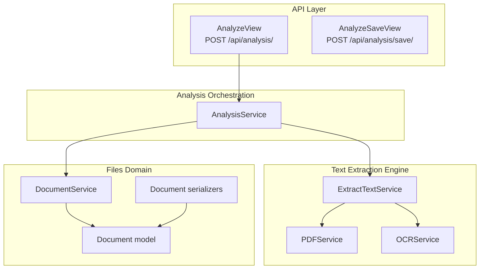
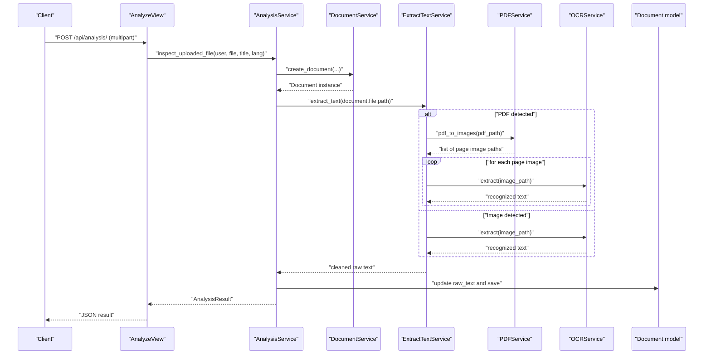
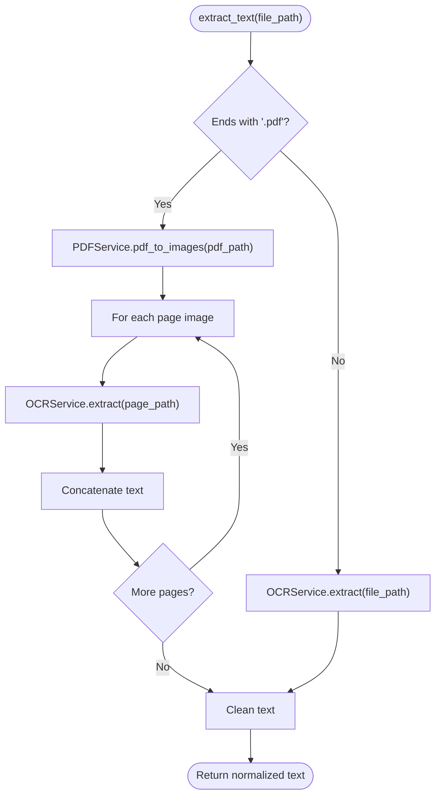
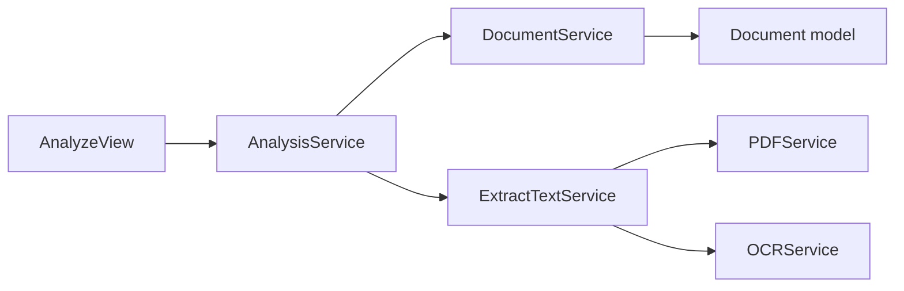

# Multi-Format Text Extraction

<cite>
**Referenced Files in This Document**
- [extract_text.py](file://apps/text_extractor_engine/services/extract_text.py)
- [ocr_service.py](file://apps/text_extractor_engine/services/ocr_service.py)
- [pdf_service.py](file://apps/text_extractor_engine/services/pdf_service.py)
- [analysis_service.py](file://apps/analysis/services/analysis_service.py)
- [views.py](file://apps/analysis/views.py)
- [urls.py](file://apps/analysis/urls.py)
- [document_services.py](file://apps/files/services/document_services.py)
- [models.py](file://apps/files/models.py)
- [serializers.py](file://apps/files/serializers.py)
- [settings.py](file://config/settings.py)
- [0001_initial.py](file://apps/files/migrations/0001_initial.py)
</cite>

## Table of Contents
1. [Introduction](#introduction)
2. [Project Structure](#project-structure)
3. [Core Components](#core-components)
4. [Architecture Overview](#architecture-overview)
5. [Detailed Component Analysis](#detailed-component-analysis)
6. [Dependency Analysis](#dependency-analysis)
7. [Performance Considerations](#performance-considerations)
8. [Troubleshooting Guide](#troubleshooting-guide)
9. [Conclusion](#conclusion)
10. [Appendices](#appendices)

## Introduction
This document explains the multi-format text extraction capabilities implemented in the backend. It covers format detection, automatic identification, and a unified extraction interface. The system supports PDF documents and raster images (JPG/JPEG, PNG) through OCR. It also outlines the extraction pipeline orchestration, error handling, and quality assessment criteria. Practical examples illustrate the processing pipelines for supported formats, and guidance is provided for extending support to additional formats.

## Project Structure
The text extraction feature spans several modules:
- Text extraction engine: OCR and PDF conversion services
- Analysis orchestration: end-to-end pipeline for uploading, extracting, and analyzing documents
- Files domain: persistence of documents and metadata
- Configuration: Django and REST framework settings enabling media handling and multipart uploads

**Diagram sources**
- [views.py:15-100](file://apps/analysis/views.py#L15-L100)
- [analysis_service.py:18-90](file://apps/analysis/services/analysis_service.py#L18-L90)
- [extract_text.py:5-55](file://apps/text_extractor_engine/services/extract_text.py#L5-L55)
- [pdf_service.py:4-15](file://apps/text_extractor_engine/services/pdf_service.py#L4-L15)
- [ocr_service.py:6-18](file://apps/text_extractor_engine/services/ocr_service.py#L6-L18)
- [document_services.py:16-126](file://apps/files/services/document_services.py#L16-L126)
- [models.py:5-18](file://apps/files/models.py#L5-L18)
- [serializers.py:32-61](file://apps/files/serializers.py#L32-L61)

**Section sources**
- [settings.py:125-137](file://config/settings.py#L125-L137)
- [urls.py:1-9](file://apps/analysis/urls.py#L1-L9)

## Core Components
- ExtractTextService: Unified interface for text extraction. Detects PDF vs. image formats and routes accordingly. Cleans extracted text for normalization.
- PDFService: Converts PDFs to a sequence of JPEG images using a conversion library.
- OCRService: Performs OCR on images using an OCR engine and aggregates recognized text with confidence metrics.
- AnalysisService: Orchestrates the end-to-end workflow: creates a Document, extracts raw text, updates the model, and prepares data for downstream analysis.
- DocumentService: Manages document lifecycle, including insertion and inspection workflows.
- Document model and serializers: Persist file metadata, raw text, and confidence scores; enforce supported file types.

Key responsibilities and interactions:
- Format detection: Based on file extension (.pdf vs. others).
- Fallback mechanism: Non-PDF files are passed directly to OCR.
- Quality assessment: Confidence computed from OCR results.
- Metadata preservation: File extension, language, title, timestamps stored in the Document model.

**Section sources**
- [extract_text.py:5-55](file://apps/text_extractor_engine/services/extract_text.py#L5-L55)
- [pdf_service.py:4-15](file://apps/text_extractor_engine/services/pdf_service.py#L4-L15)
- [ocr_service.py:6-18](file://apps/text_extractor_engine/services/ocr_service.py#L6-L18)
- [analysis_service.py:18-90](file://apps/analysis/services/analysis_service.py#L18-L90)
- [document_services.py:16-126](file://apps/files/services/document_services.py#L16-L126)
- [models.py:5-18](file://apps/files/models.py#L5-L18)
- [serializers.py:32-61](file://apps/files/serializers.py#L32-L61)

## Architecture Overview
The extraction pipeline integrates API, orchestration, and extraction services. The flow begins with a multipart upload, proceeds through document creation and text extraction, and concludes with optional insertion into the knowledge graph.

**Diagram sources**
- [views.py:22-56](file://apps/analysis/views.py#L22-L56)
- [analysis_service.py:21-59](file://apps/analysis/services/analysis_service.py#L21-L59)
- [extract_text.py:36-54](file://apps/text_extractor_engine/services/extract_text.py#L36-L54)
- [pdf_service.py:5-14](file://apps/text_extractor_engine/services/pdf_service.py#L5-L14)
- [ocr_service.py:8-17](file://apps/text_extractor_engine/services/ocr_service.py#L8-L17)
- [models.py:5-18](file://apps/files/models.py#L5-L18)

## Detailed Component Analysis

### ExtractTextService
Purpose:
- Provide a single interface to extract text from files.
- Detect format by extension and route to appropriate handler.
- Normalize extracted text for downstream processing.

Processing logic:
- PDF path: convert to images, iterate pages, OCR each page, concatenate results, then normalize.
- Image path: OCR the image and normalize.

Quality assessment:
- Confidence is derived from OCR results and stored in the Document model.

Error handling:
- Delegates exceptions from OCR/PDF conversion to upstream callers.

**Diagram sources**
- [extract_text.py:36-54](file://apps/text_extractor_engine/services/extract_text.py#L36-L54)
- [pdf_service.py:5-14](file://apps/text_extractor_engine/services/pdf_service.py#L5-L14)
- [ocr_service.py:8-17](file://apps/text_extractor_engine/services/ocr_service.py#L8-L17)

**Section sources**
- [extract_text.py:5-55](file://apps/text_extractor_engine/services/extract_text.py#L5-L55)

### PDFService
Purpose:
- Convert a PDF into a sequence of images (one per page) suitable for OCR.

Behavior:
- Uses a conversion library to render pages.
- Saves each page as a JPEG with a deterministic filename pattern.
- Returns a list of generated image paths.

Optimization considerations:
- Page order is preserved.
- JPEG quality can be tuned externally if needed.

**Section sources**
- [pdf_service.py:4-15](file://apps/text_extractor_engine/services/pdf_service.py#L4-L15)

### OCRService
Purpose:
- Perform OCR on images and aggregate recognized text.

Behavior:
- Reads text from an image and returns concatenated lines.
- Computes average confidence across recognized text blocks.

Quality assessment:
- Confidence metric is exposed by the service and persisted in the Document model.

**Section sources**
- [ocr_service.py:6-18](file://apps/text_extractor_engine/services/ocr_service.py#L6-L18)
- [models.py:12-13](file://apps/files/models.py#L12-L13)

### AnalysisService
Purpose:
- Orchestrate the end-to-end workflow for document analysis.

Workflow:
- Derive file extension from the uploaded filename.
- Create a Document instance via DocumentService.
- Extract raw text using ExtractTextService.
- Update the Document with raw_text and save.
- Prepare a dataclass for downstream processing.

Error handling:
- Catches and reports exceptions during OCR and inspection.

**Section sources**
- [analysis_service.py:18-90](file://apps/analysis/services/analysis_service.py#L18-L90)

### DocumentService
Purpose:
- Manage document lifecycle operations (insert, inspect, upload).

Integration:
- Used by AnalysisService to create and update Documents.
- Provides clause retrieval for a given document.

**Section sources**
- [document_services.py:16-126](file://apps/files/services/document_services.py#L16-L126)

### Document Model and Serializers
Purpose:
- Persist document metadata, raw text, and confidence.
- Enforce supported file types at the serializer level.

Supported formats:
- PDF and raster images (JPG/JPEG, PNG) as enforced by the serializer’s validation.

Fields:
- file, file_extension, uploaded_at, signed_at, lang, raw_text, confidence, title.

**Section sources**
- [models.py:5-18](file://apps/files/models.py#L5-L18)
- [serializers.py:32-61](file://apps/files/serializers.py#L32-L61)
- [0001_initial.py:14-26](file://apps/files/migrations/0001_initial.py#L14-L26)

## Dependency Analysis
The system exhibits clear separation of concerns:
- API layer depends on AnalysisService.
- AnalysisService depends on DocumentService and ExtractTextService.
- ExtractTextService depends on PDFService and OCRService.
- Document model persists metadata and extracted text.

**Diagram sources**
- [views.py:15-100](file://apps/analysis/views.py#L15-L100)
- [analysis_service.py:18-90](file://apps/analysis/services/analysis_service.py#L18-L90)
- [extract_text.py:5-8](file://apps/text_extractor_engine/services/extract_text.py#L5-L8)
- [pdf_service.py:4-15](file://apps/text_extractor_engine/services/pdf_service.py#L4-L15)
- [ocr_service.py:6-18](file://apps/text_extractor_engine/services/ocr_service.py#L6-L18)
- [document_services.py:16-126](file://apps/files/services/document_services.py#L16-L126)
- [models.py:5-18](file://apps/files/models.py#L5-L18)

**Section sources**
- [settings.py:26-40](file://config/settings.py#L26-L40)

## Performance Considerations
- PDF to image conversion cost: Each page incurs conversion overhead. Consider caching converted images or batching requests.
- OCR latency: OCR speed depends on image resolution and engine performance. Downscale images moderately to improve throughput while preserving readability.
- Text cleaning: Normalization is linear in output length; negligible compared to OCR costs.
- Concurrency: Parallelize OCR across pages for multi-page PDFs when safe and resource-constrained.
- Storage: JPEG page images are written to disk; ensure sufficient temporary storage and cleanup policies.

[No sources needed since this section provides general guidance]

## Troubleshooting Guide
Common issues and resolutions:
- Unsupported file type:
  - Symptom: Validation error indicating unsupported file type.
  - Cause: Serializer enforces allowed extensions.
  - Resolution: Ensure uploads use .pdf, .jpg, .jpeg, or .png.
- Missing raw_text before insertion:
  - Symptom: Business logic error when attempting to insert without prior inspection.
  - Cause: AnalysisService requires raw_text to be present.
  - Resolution: Call the analyze endpoint first to populate raw_text.
- OCR failures:
  - Symptom: Empty or low-quality text extraction.
  - Causes: Poor image quality, unsupported languages, or engine initialization issues.
  - Resolution: Verify language packs, improve image quality, retry OCR.
- API errors:
  - Symptom: 500 Internal Server Error on analyze/save.
  - Causes: Unhandled exceptions in service layer.
  - Resolution: Inspect logs and validate input serializers.

**Section sources**
- [serializers.py:48-52](file://apps/files/serializers.py#L48-L52)
- [analysis_service.py:71-74](file://apps/analysis/services/analysis_service.py#L71-L74)
- [views.py:52-56](file://apps/analysis/views.py#L52-L56)
- [views.py:88-99](file://apps/analysis/views.py#L88-L99)

## Conclusion
The system provides a robust, extensible pipeline for multi-format text extraction. PDFs are handled by converting pages to images and applying OCR, while raster images are processed directly. The unified ExtractTextService simplifies integration, and the AnalysisService orchestrates end-to-end workflows. Quality metrics and metadata are preserved, and the design allows straightforward extension to additional formats.

[No sources needed since this section summarizes without analyzing specific files]

## Appendices

### Supported Formats and Pipelines
- PDF:
  - Pipeline: PDFService converts to page images → OCRService recognizes text per page → Concatenate and normalize.
  - Notes: Multi-page PDFs are processed sequentially; consider parallelization for performance.
- JPG/JPEG/PNG:
  - Pipeline: OCRService recognizes text from the single image → Normalize.
  - Notes: Ensure adequate DPI for legibility.

**Section sources**
- [extract_text.py:45-54](file://apps/text_extractor_engine/services/extract_text.py#L45-L54)
- [pdf_service.py:5-14](file://apps/text_extractor_engine/services/pdf_service.py#L5-L14)
- [ocr_service.py:8-17](file://apps/text_extractor_engine/services/ocr_service.py#L8-L17)

### Quality Assessment Criteria
- Confidence metric:
  - Computed as the average confidence across recognized text blocks.
  - Stored in the Document model for downstream use.
- Text normalization:
  - Removes escape sequences and collapses whitespace to produce clean, readable text.

**Section sources**
- [ocr_service.py:13-17](file://apps/text_extractor_engine/services/ocr_service.py#L13-L17)
- [extract_text.py:11-34](file://apps/text_extractor_engine/services/extract_text.py#L11-L34)
- [models.py:12-13](file://apps/files/models.py#L12-L13)

### API Endpoints
- POST /api/analysis/
  - Purpose: Upload a file, extract text, and return analysis results.
  - Inputs: multipart/form-data with file, optional title, optional language.
- POST /api/analysis/save/
  - Purpose: Insert/Save analysis for an existing document that has raw_text populated.

**Section sources**
- [urls.py:5-8](file://apps/analysis/urls.py#L5-L8)
- [views.py:22-56](file://apps/analysis/views.py#L22-L56)
- [views.py:66-99](file://apps/analysis/views.py#L66-L99)