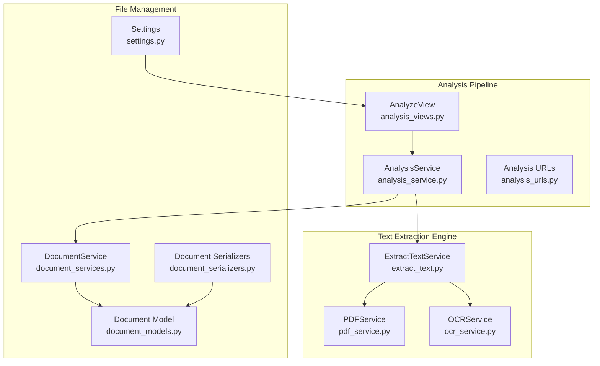
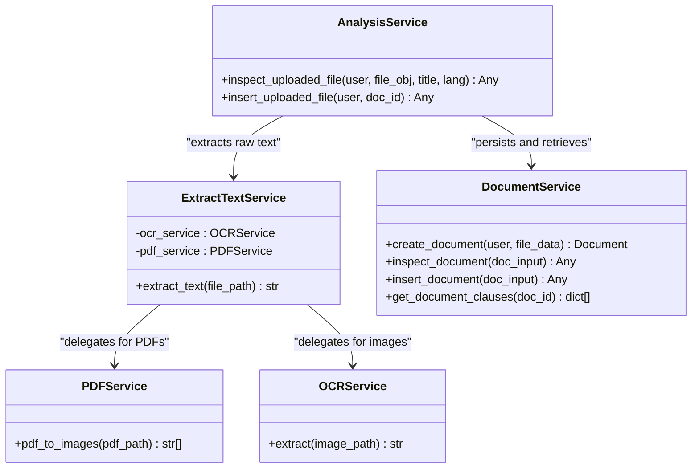
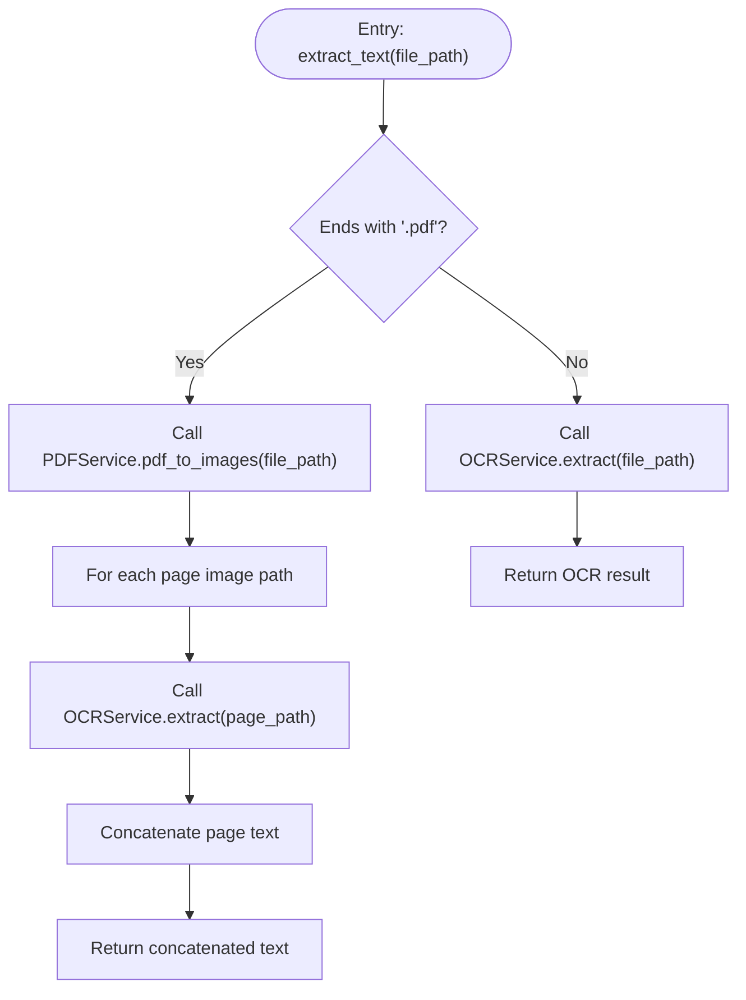
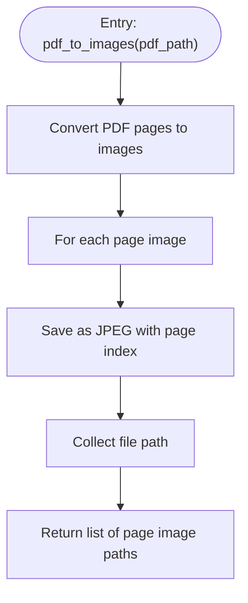
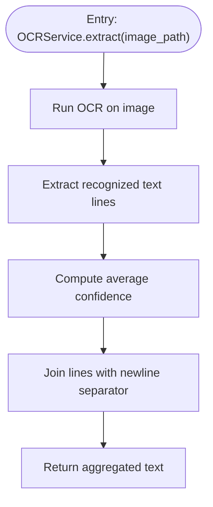
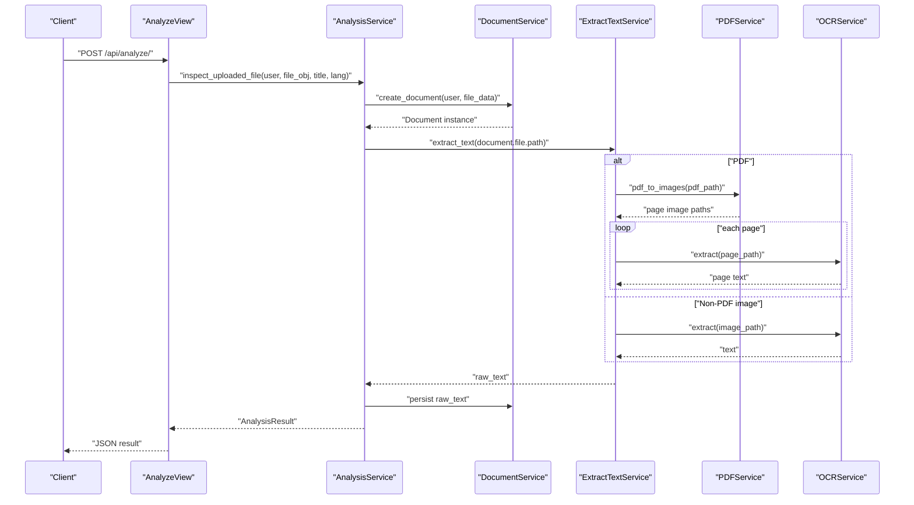
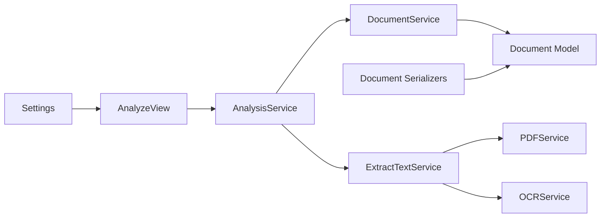

# Multi-Format Text Extraction

<cite>
**Referenced Files in This Document**
- [extract_text.py](file://apps/text_extractor_engine/services/extract_text.py)
- [pdf_service.py](file://apps/text_extractor_engine/services/pdf_service.py)
- [ocr_service.py](file://apps/text_extractor_engine/services/ocr_service.py)
- [analysis_service.py](file://apps/analysis/services/analysis_service.py)
- [analysis_views.py](file://apps/analysis/views.py)
- [analysis_urls.py](file://apps/analysis/urls.py)
- [document_services.py](file://apps/files/services/document_services.py)
- [document_models.py](file://apps/files/models.py)
- [document_serializers.py](file://apps/files/serializers.py)
- [settings.py](file://config/settings.py)
</cite>

## Table of Contents
1. [Introduction](#introduction)
2. [Project Structure](#project-structure)
3. [Core Components](#core-components)
4. [Architecture Overview](#architecture-overview)
5. [Detailed Component Analysis](#detailed-component-analysis)
6. [Dependency Analysis](#dependency-analysis)
7. [Performance Considerations](#performance-considerations)
8. [Troubleshooting Guide](#troubleshooting-guide)
9. [Conclusion](#conclusion)
10. [Appendices](#appendices)

## Introduction
This document explains the multi-format text extraction capabilities in VeritasShield. It focuses on the ExtractTextService architecture that integrates OCR and PDF processing to extract text from diverse document formats. The system supports PDFs natively and leverages OCR for images and other rasterized formats. It documents file type detection, service delegation, unified extraction interface, OCR-PDF integration, validation, supported formats, fallback behavior, and extension guidelines for adding new formats while maintaining consistency across extraction methods.

## Project Structure
The text extraction pipeline spans several modules:
- Text extraction engine: ExtractTextService orchestrates PDF-to-image conversion and OCR extraction.
- OCR service: Provides optical character recognition for images.
- PDF service: Converts PDF pages to images for OCR processing.
- Analysis workflow: Integrates extraction into the document analysis pipeline.
- File handling: Validates and persists documents with metadata such as file extension and extracted text.

**Diagram sources**
- [extract_text.py:1-28](file://apps/text_extractor_engine/services/extract_text.py#L1-L28)
- [pdf_service.py:1-15](file://apps/text_extractor_engine/services/pdf_service.py#L1-L15)
- [ocr_service.py:1-18](file://apps/text_extractor_engine/services/ocr_service.py#L1-L18)
- [analysis_service.py:1-81](file://apps/analysis/services/analysis_service.py#L1-L81)
- [analysis_views.py:1-100](file://apps/analysis/views.py#L1-L100)
- [analysis_urls.py:1-9](file://apps/analysis/urls.py#L1-L9)
- [document_services.py:1-124](file://apps/files/services/document_services.py#L1-L124)
- [document_models.py:1-18](file://apps/files/models.py#L1-L18)
- [document_serializers.py:1-61](file://apps/files/serializers.py#L1-L61)
- [settings.py:1-155](file://config/settings.py#L1-L155)

**Section sources**
- [extract_text.py:1-28](file://apps/text_extractor_engine/services/extract_text.py#L1-L28)
- [pdf_service.py:1-15](file://apps/text_extractor_engine/services/pdf_service.py#L1-L15)
- [ocr_service.py:1-18](file://apps/text_extractor_engine/services/ocr_service.py#L1-L18)
- [analysis_service.py:1-81](file://apps/analysis/services/analysis_service.py#L1-L81)
- [analysis_views.py:1-100](file://apps/analysis/views.py#L1-L100)
- [analysis_urls.py:1-9](file://apps/analysis/urls.py#L1-L9)
- [document_services.py:1-124](file://apps/files/services/document_services.py#L1-L124)
- [document_models.py:1-18](file://apps/files/models.py#L1-L18)
- [document_serializers.py:1-61](file://apps/files/serializers.py#L1-L61)
- [settings.py:1-155](file://config/settings.py#L1-L155)

## Core Components
- ExtractTextService: Central coordinator that decides whether to process a PDF via page-to-image conversion and OCR, or apply OCR directly to non-PDF images.
- PDFService: Converts each page of a PDF into JPEG images and returns their filesystem paths.
- OCRService: Performs OCR on images and aggregates recognized text with optional confidence metrics.
- AnalysisService: Integrates extraction into the document lifecycle by creating a document, extracting raw text, and preparing analysis input.
- DocumentService: Manages document persistence, validation, and retrieval of clauses.
- Document model and serializers: Define storage fields and validation rules for supported formats.

Key behaviors:
- File type detection: Uses file path suffix to detect PDFs.
- Delegation: PDFs are routed to PDFService, others to OCRService.
- Unified interface: Both paths return a single text string suitable for downstream analysis.

**Section sources**
- [extract_text.py:5-28](file://apps/text_extractor_engine/services/extract_text.py#L5-L28)
- [pdf_service.py:4-15](file://apps/text_extractor_engine/services/pdf_service.py#L4-L15)
- [ocr_service.py:6-18](file://apps/text_extractor_engine/services/ocr_service.py#L6-L18)
- [analysis_service.py:16-50](file://apps/analysis/services/analysis_service.py#L16-L50)
- [document_services.py:14-124](file://apps/files/services/document_services.py#L14-L124)
- [document_models.py:5-18](file://apps/files/models.py#L5-L18)
- [document_serializers.py:48-52](file://apps/files/serializers.py#L48-L52)

## Architecture Overview
The extraction architecture follows a service-layer design with clear separation of concerns:
- ExtractTextService encapsulates the extraction policy and delegates to specialized services.
- PDFService handles PDF-specific transformations.
- OCRService encapsulates OCR logic and returns normalized text.
- AnalysisService coordinates document creation, text extraction, and subsequent analysis.
- DocumentService and serializers ensure robust validation and persistence.

**Diagram sources**
- [extract_text.py:5-28](file://apps/text_extractor_engine/services/extract_text.py#L5-L28)
- [pdf_service.py:4-15](file://apps/text_extractor_engine/services/pdf_service.py#L4-L15)
- [ocr_service.py:6-18](file://apps/text_extractor_engine/services/ocr_service.py#L6-L18)
- [analysis_service.py:16-50](file://apps/analysis/services/analysis_service.py#L16-L50)
- [document_services.py:14-124](file://apps/files/services/document_services.py#L14-L124)

## Detailed Component Analysis

### ExtractTextService
Responsibilities:
- Determine file type by extension.
- For PDFs: Convert to images and iterate through pages, extracting text per page and concatenating results.
- For non-PDF images: Apply OCR directly to the image path.
- Return a unified text string.

Processing logic:
- PDF branch: Invoke PDFService to produce page images, then loop over each image path and call OCRService.extract.
- Non-PDF branch: Call OCRService.extract on the original file path.

**Diagram sources**
- [extract_text.py:10-27](file://apps/text_extractor_engine/services/extract_text.py#L10-L27)

**Section sources**
- [extract_text.py:5-28](file://apps/text_extractor_engine/services/extract_text.py#L5-L28)

### PDFService
Responsibilities:
- Convert each page of a PDF into a JPEG image.
- Save images to disk with deterministic naming and return their paths.

Behavior:
- Uses a conversion library to transform pages into PIL images.
- Iterates through pages, saves as JPEG, and collects paths.

**Diagram sources**
- [pdf_service.py:5-14](file://apps/text_extractor_engine/services/pdf_service.py#L5-L14)

**Section sources**
- [pdf_service.py:4-15](file://apps/text_extractor_engine/services/pdf_service.py#L4-L15)

### OCRService
Responsibilities:
- Perform OCR on a single image path.
- Aggregate recognized text lines into a single string.
- Compute average confidence across recognized lines.

Behavior:
- Initializes a reader for English text.
- Reads text from the image and extracts recognized words and confidence scores.
- Returns newline-separated text.

**Diagram sources**
- [ocr_service.py:8-17](file://apps/text_extractor_engine/services/ocr_service.py#L8-L17)

**Section sources**
- [ocr_service.py:6-18](file://apps/text_extractor_engine/services/ocr_service.py#L6-L18)

### AnalysisService Integration
Responsibilities:
- Create a Document instance via DocumentService.
- Extract raw text using ExtractTextService.
- Persist raw text to the Document record.
- Prepare a structured input for downstream analysis and call DocumentService.inspect_document.

Workflow:
- Accepts user, file object, optional title, and language.
- Delegates document creation and validation to DocumentService.
- Calls ExtractTextService to obtain raw_text.
- Updates the Document record with raw_text.
- Constructs a typed input object and invokes inspection logic.

**Diagram sources**
- [analysis_views.py:22-56](file://apps/analysis/views.py#L22-L56)
- [analysis_service.py:18-50](file://apps/analysis/services/analysis_service.py#L18-L50)
- [document_services.py:83-110](file://apps/files/services/document_services.py#L83-L110)
- [extract_text.py:10-27](file://apps/text_extractor_engine/services/extract_text.py#L10-L27)
- [pdf_service.py:5-14](file://apps/text_extractor_engine/services/pdf_service.py#L5-L14)
- [ocr_service.py:8-17](file://apps/text_extractor_engine/services/ocr_service.py#L8-L17)

**Section sources**
- [analysis_service.py:16-50](file://apps/analysis/services/analysis_service.py#L16-L50)
- [analysis_views.py:15-56](file://apps/analysis/views.py#L15-L56)
- [document_services.py:83-110](file://apps/files/services/document_services.py#L83-L110)

### File Validation and Supported Formats
Validation:
- DocumentCreateSerializer enforces supported file extensions: PDF, JPG, PNG, JPEG.
- Unsupported files trigger a validation error before further processing.

Supported formats:
- PDF: Processed via PDFService and OCR per page.
- Images: JPG, JPEG, PNG processed directly by OCRService.

Fallback behavior:
- The current implementation routes non-PDF images directly to OCRService.
- There is no explicit fallback for unsupported formats beyond validation; unsupported files are rejected during serialization.

**Section sources**
- [document_serializers.py:48-52](file://apps/files/serializers.py#L48-L52)
- [extract_text.py:19-27](file://apps/text_extractor_engine/services/extract_text.py#L19-L27)

### Unified Text Extraction Interface
- ExtractTextService exposes a single method to extract text from any supported file type.
- PDFs are handled by splitting into pages and aggregating results; non-PDFs are processed directly.
- The returned text is a plain string suitable for downstream analysis and storage.

**Section sources**
- [extract_text.py:10-27](file://apps/text_extractor_engine/services/extract_text.py#L10-L27)

### Integration Between OCR and PDF Services
- PDFService produces page images and returns their paths.
- ExtractTextService iterates over these paths and applies OCRService.extract to each.
- Results are concatenated to form the final extracted text.

**Section sources**
- [pdf_service.py:5-14](file://apps/text_extractor_engine/services/pdf_service.py#L5-L14)
- [extract_text.py:19-25](file://apps/text_extractor_engine/services/extract_text.py#L19-L25)
- [ocr_service.py:8-17](file://apps/text_extractor_engine/services/ocr_service.py#L8-L17)

## Dependency Analysis
High-level dependencies:
- AnalysisService depends on DocumentService and ExtractTextService.
- ExtractTextService depends on PDFService and OCRService.
- DocumentService depends on serializers and models for validation and persistence.
- OCRService depends on an OCR library; PDFService depends on a PDF-to-image library.

**Diagram sources**
- [analysis_views.py:1-100](file://apps/analysis/views.py#L1-L100)
- [analysis_service.py:1-81](file://apps/analysis/services/analysis_service.py#L1-L81)
- [document_services.py:1-124](file://apps/files/services/document_services.py#L1-L124)
- [extract_text.py:1-28](file://apps/text_extractor_engine/services/extract_text.py#L1-L28)
- [pdf_service.py:1-15](file://apps/text_extractor_engine/services/pdf_service.py#L1-L15)
- [ocr_service.py:1-18](file://apps/text_extractor_engine/services/ocr_service.py#L1-L18)
- [document_models.py:1-18](file://apps/files/models.py#L1-L18)
- [document_serializers.py:1-61](file://apps/files/serializers.py#L1-L61)
- [settings.py:1-155](file://config/settings.py#L1-L155)

**Section sources**
- [analysis_service.py:1-81](file://apps/analysis/services/analysis_service.py#L1-L81)
- [extract_text.py:1-28](file://apps/text_extractor_engine/services/extract_text.py#L1-L28)
- [pdf_service.py:1-15](file://apps/text_extractor_engine/services/pdf_service.py#L1-L15)
- [ocr_service.py:1-18](file://apps/text_extractor_engine/services/ocr_service.py#L1-L18)
- [document_services.py:1-124](file://apps/files/services/document_services.py#L1-L124)
- [document_models.py:1-18](file://apps/files/models.py#L1-L18)
- [document_serializers.py:1-61](file://apps/files/serializers.py#L1-L61)
- [settings.py:1-155](file://config/settings.py#L1-L155)

## Performance Considerations
- PDF page iteration: Converting many-page PDFs increases I/O and OCR workload. Consider batching or parallelizing OCR calls per page if performance becomes a bottleneck.
- Image quality: OCR accuracy improves with higher resolution images. Ensure PDFService saves images at sufficient resolution for reliable text recognition.
- Memory footprint: Large PDFs or high-resolution images can increase memory usage. Stream processing or limiting concurrent OCR tasks may help.
- Caching: Store extracted text per document to avoid recomputation on repeated requests.
- Network and external libraries: OCR and PDF conversion rely on external libraries; monitor their resource consumption and tune accordingly.

[No sources needed since this section provides general guidance]

## Troubleshooting Guide
Common issues and resolutions:
- Unsupported file type: Validation rejects files not ending with supported extensions. Ensure uploads use PDF, JPG, PNG, or JPEG.
- No file provided: The analysis view requires a multipart/form-data payload with a file field.
- Missing raw_text before insertion: Attempting to insert a document without prior inspection raises a business logic error.
- Document not found: Saving by ID fails if the document does not exist in the database.
- OCR failures: Verify OCR library availability and language packs. Confirm image paths are valid and accessible.

Operational checks:
- Confirm ExtractTextService receives a valid file path and that PDFService writes page images to disk.
- Ensure OCRService initializes correctly and that recognized lines are non-empty before computing confidence.

**Section sources**
- [document_serializers.py:48-52](file://apps/files/serializers.py#L48-L52)
- [analysis_views.py:33-38](file://apps/analysis/views.py#L33-L38)
- [analysis_service.py:62-65](file://apps/analysis/services/analysis_service.py#L62-L65)
- [analysis_views.py#L91-L94)

## Conclusion
VeritasShield’s multi-format text extraction combines a clean service-layer architecture with explicit delegation between PDF and OCR processing. The ExtractTextService provides a unified interface, while PDFService and OCRService encapsulate format-specific logic. The integration with AnalysisService ensures documents are persisted with extracted text and can be fed into downstream analysis. Current support covers PDFs and common image formats, with validation preventing unsupported types. Extending support for new formats involves adding detection logic, implementing a dedicated service, and integrating it into ExtractTextService, ensuring consistent behavior and maintainable workflows.

[No sources needed since this section summarizes without analyzing specific files]

## Appendices

### Example Workflows
- Extract text from a PDF:
  - Upload a PDF via the analysis endpoint.
  - AnalysisService creates a Document, ExtractTextService converts pages to images, OCRService recognizes text per page, and the final text is stored on the Document.
- Extract text from an image:
  - Upload a JPG/JPEG/PNG via the analysis endpoint.
  - AnalysisService creates a Document, ExtractTextService calls OCRService.extract directly, and the recognized text is stored on the Document.

**Section sources**
- [analysis_service.py:18-50](file://apps/analysis/services/analysis_service.py#L18-L50)
- [extract_text.py:19-27](file://apps/text_extractor_engine/services/extract_text.py#L19-L27)
- [ocr_service.py:8-17](file://apps/text_extractor_engine/services/ocr_service.py#L8-L17)

### Extending Support for New Document Formats
Guidelines:
- Add file type detection in ExtractTextService.extract_text to route new formats to a dedicated service.
- Implement a new service under the text extraction engine with a consistent extract method signature.
- Integrate the new service into ExtractTextService and update validation rules if needed.
- Ensure the new service returns a plain text string and handles errors gracefully.
- Update serializers and models if new metadata is required.

**Section sources**
- [extract_text.py:10-27](file://apps/text_extractor_engine/services/extract_text.py#L10-L27)
- [document_serializers.py:48-52](file://apps/files/serializers.py#L48-L52)
- [document_models.py:5-18](file://apps/files/models.py#L5-L18)