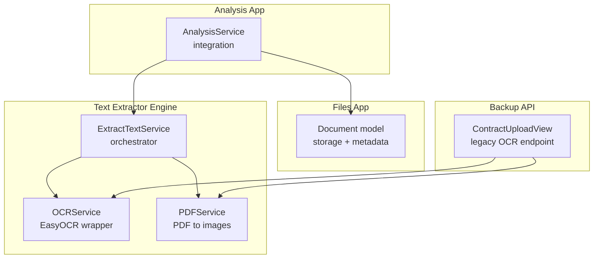
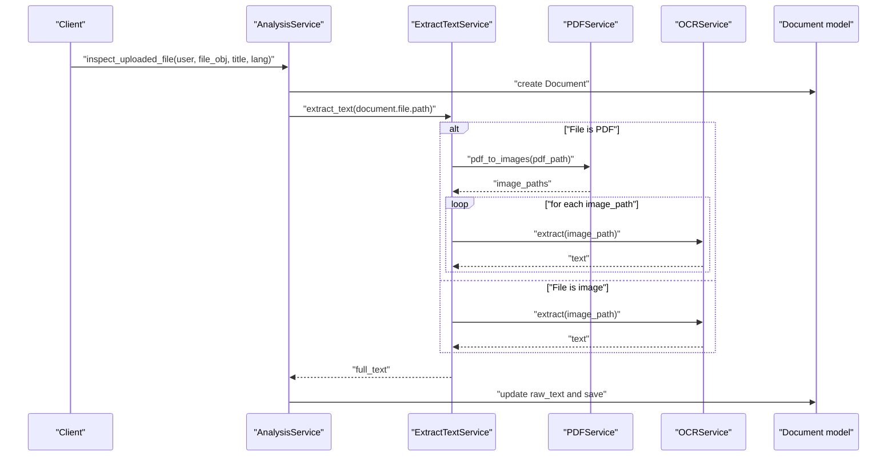
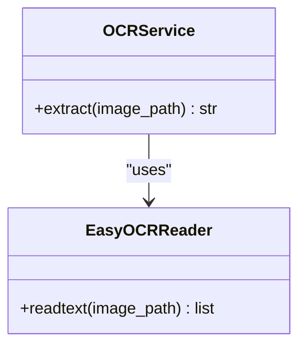
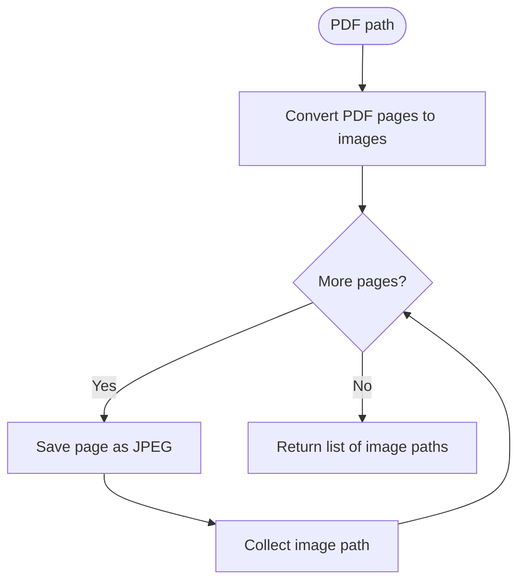
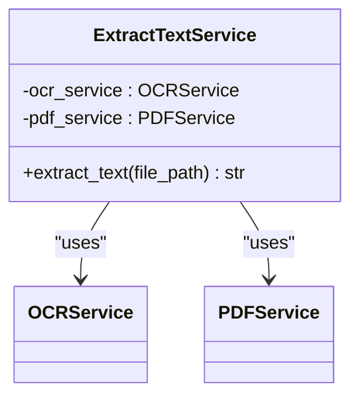
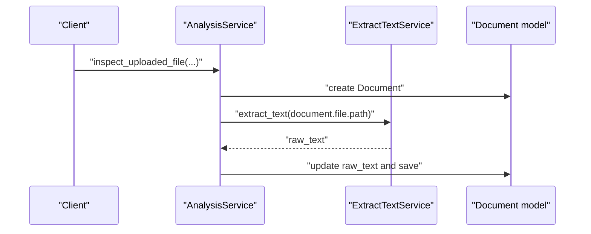
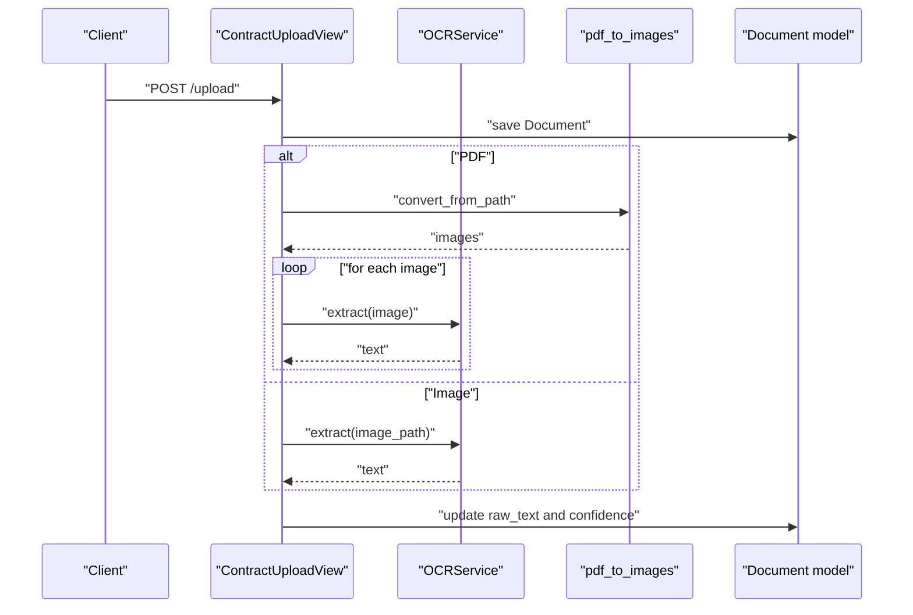
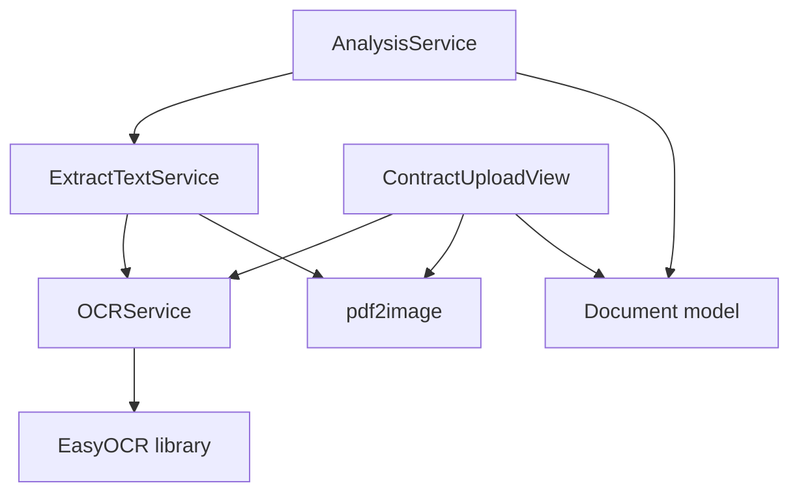

# OCR Service Implementation

<cite>
**Referenced Files in This Document**
- [ocr_service.py](file://apps/text_extractor_engine/services/ocr_service.py)
- [extract_text.py](file://apps/text_extractor_engine/services/extract_text.py)
- [pdf_service.py](file://apps/text_extractor_engine/services/pdf_service.py)
- [analysis_service.py](file://apps/analysis/services/analysis_service.py)
- [views.py](file://backupApps/api/views.py)
- [models.py](file://apps/files/models.py)
- [settings.py](file://config/settings.py)
</cite>

## Table of Contents
1. [Introduction](#introduction)
2. [Project Structure](#project-structure)
3. [Core Components](#core-components)
4. [Architecture Overview](#architecture-overview)
5. [Detailed Component Analysis](#detailed-component-analysis)
6. [Dependency Analysis](#dependency-analysis)
7. [Performance Considerations](#performance-considerations)
8. [Troubleshooting Guide](#troubleshooting-guide)
9. [Conclusion](#conclusion)

## Introduction
This document explains the OCR service implementation in VeritasShield, focusing on EasyOCR integration for extracting text from scanned documents and images. It covers the OCR service architecture, initialization parameters, language support, preprocessing techniques, and optimization strategies. It also documents configuration options, performance tuning parameters, and fallback strategies for low-quality scans, along with guidance for handling different image formats, resolutions, and multi-language scenarios.

## Project Structure
The OCR functionality resides in the text extractor engine application and integrates with the files application and analysis pipeline. The key modules are:
- OCR service: EasyOCR wrapper for text extraction
- PDF service: Converts PDF pages to images
- Extract text service: Orchestrates OCR for images and PDFs
- Analysis service: Coordinates document creation and OCR processing
- Views: Legacy API endpoints for OCR processing
- Models: Document storage with OCR metadata

**Diagram sources**
- [ocr_service.py:1-18](file://apps/text_extractor_engine/services/ocr_service.py#L1-L18)
- [pdf_service.py:1-15](file://apps/text_extractor_engine/services/pdf_service.py#L1-L15)
- [extract_text.py:1-28](file://apps/text_extractor_engine/services/extract_text.py#L1-L28)
- [analysis_service.py:1-43](file://apps/analysis/services/analysis_service.py#L1-L43)
- [views.py:1-93](file://backupApps/api/views.py#L1-L93)
- [models.py:1-18](file://apps/files/models.py#L1-L18)

**Section sources**
- [ocr_service.py:1-18](file://apps/text_extractor_engine/services/ocr_service.py#L1-L18)
- [extract_text.py:1-28](file://apps/text_extractor_engine/services/extract_text.py#L1-L28)
- [pdf_service.py:1-15](file://apps/text_extractor_engine/services/pdf_service.py#L1-L15)
- [analysis_service.py:1-43](file://apps/analysis/services/analysis_service.py#L1-L43)
- [views.py:1-93](file://backupApps/api/views.py#L1-L93)
- [models.py:1-18](file://apps/files/models.py#L1-L18)

## Core Components
- OCRService: Initializes EasyOCR with a language list and extracts text from images. It returns concatenated text lines and computes average confidence from OCR results.
- PDFService: Converts a PDF into page images using pdf2image and saves them as JPEG files for OCR processing.
- ExtractTextService: Determines whether the input is a PDF or an image and routes processing accordingly. For PDFs, it converts pages to images and applies OCR to each page, concatenating results.
- AnalysisService: Integrates OCR into the document analysis workflow by creating a document, extracting raw text via OCR, and updating the document with OCR results.
- Document model: Stores file metadata, language preference, extracted text, confidence score, and related fields.

Key characteristics:
- Language support is configured during OCR initialization.
- Confidence scores are computed from EasyOCR results.
- PDFs are processed page-by-page to improve accuracy and manage memory.

**Section sources**
- [ocr_service.py:1-18](file://apps/text_extractor_engine/services/ocr_service.py#L1-L18)
- [pdf_service.py:1-15](file://apps/text_extractor_engine/services/pdf_service.py#L1-L15)
- [extract_text.py:1-28](file://apps/text_extractor_engine/services/extract_text.py#L1-L28)
- [analysis_service.py:1-43](file://apps/analysis/services/analysis_service.py#L1-L43)
- [models.py:1-18](file://apps/files/models.py#L1-L18)

## Architecture Overview
The OCR pipeline follows a layered design:
- Input: Image or PDF file path
- PDF conversion: Convert PDF pages to images
- OCR extraction: Apply EasyOCR to each image
- Aggregation: Concatenate text from all pages/images
- Persistence: Store extracted text and confidence in the Document model

**Diagram sources**
- [analysis_service.py:16-43](file://apps/analysis/services/analysis_service.py#L16-L43)
- [extract_text.py:10-27](file://apps/text_extractor_engine/services/extract_text.py#L10-L27)
- [pdf_service.py:5-14](file://apps/text_extractor_engine/services/pdf_service.py#L5-L14)
- [ocr_service.py:8-17](file://apps/text_extractor_engine/services/ocr_service.py#L8-L17)
- [models.py:5-14](file://apps/files/models.py#L5-L14)

## Detailed Component Analysis

### OCRService
Responsibilities:
- Initialize EasyOCR reader with a language list
- Extract text from a single image
- Compute average confidence across detected text lines

Implementation highlights:
- Uses EasyOCR’s readtext to obtain bounding boxes, text, and confidence scores
- Aggregates text lines into a single string separated by newlines
- Calculates average confidence from per-line confidence values

**Diagram sources**
- [ocr_service.py:1-18](file://apps/text_extractor_engine/services/ocr_service.py#L1-L18)

**Section sources**
- [ocr_service.py:1-18](file://apps/text_extractor_engine/services/ocr_service.py#L1-L18)

### PDFService
Responsibilities:
- Convert a PDF into a sequence of images (one per page)
- Save each page as a JPEG file with a predictable naming scheme
- Return a list of generated image paths

Processing logic:
- Uses pdf2image to convert PDF pages to PIL images
- Iterates through pages, saves as JPEG, and collects paths

**Diagram sources**
- [pdf_service.py:1-15](file://apps/text_extractor_engine/services/pdf_service.py#L1-L15)

**Section sources**
- [pdf_service.py:1-15](file://apps/text_extractor_engine/services/pdf_service.py#L1-L15)

### ExtractTextService
Responsibilities:
- Determine input file type (PDF vs image)
- For PDFs: convert to images and apply OCR to each page
- For images: apply OCR directly
- Aggregate and return extracted text

Integration points:
- Delegates PDF conversion to PDFService
- Delegates OCR to OCRService

**Diagram sources**
- [extract_text.py:5-27](file://apps/text_extractor_engine/services/extract_text.py#L5-L27)

**Section sources**
- [extract_text.py:1-28](file://apps/text_extractor_engine/services/extract_text.py#L1-L28)

### AnalysisService Integration
Responsibilities:
- Create a Document instance via DocumentService
- Extract raw text using ExtractTextService
- Update the Document with raw_text and save

**Diagram sources**
- [analysis_service.py:16-43](file://apps/analysis/services/analysis_service.py#L16-L43)
- [extract_text.py:10-27](file://apps/text_extractor_engine/services/extract_text.py#L10-L27)
- [models.py:5-14](file://apps/files/models.py#L5-L14)

**Section sources**
- [analysis_service.py:1-43](file://apps/analysis/services/analysis_service.py#L1-L43)

### Legacy API Endpoint (ContractUploadView)
Responsibilities:
- Accept multipart/form-data uploads
- Convert PDFs to images and apply OCR to each page
- Aggregate text and compute average confidence
- Update the Document with OCR results

**Diagram sources**
- [views.py:14-93](file://backupApps/api/views.py#L14-L93)
- [ocr_service.py:8-17](file://apps/text_extractor_engine/services/ocr_service.py#L8-L17)

**Section sources**
- [views.py:1-93](file://backupApps/api/views.py#L1-L93)

## Dependency Analysis
External libraries and their roles:
- EasyOCR: Performs text recognition from images
- pdf2image: Converts PDFs to images for OCR processing
- Django: Provides the Document model and persistence layer
- REST Framework: Handles file uploads and API responses

**Diagram sources**
- [ocr_service.py:1-18](file://apps/text_extractor_engine/services/ocr_service.py#L1-L18)
- [extract_text.py:1-28](file://apps/text_extractor_engine/services/extract_text.py#L1-L28)
- [views.py:1-93](file://backupApps/api/views.py#L1-L93)
- [models.py:1-18](file://apps/files/models.py#L1-L18)

**Section sources**
- [ocr_service.py:1-18](file://apps/text_extractor_engine/services/ocr_service.py#L1-L18)
- [extract_text.py:1-28](file://apps/text_extractor_engine/services/extract_text.py#L1-L28)
- [views.py:1-93](file://backupApps/api/views.py#L1-L93)
- [models.py:1-18](file://apps/files/models.py#L1-L18)

## Performance Considerations
- Language initialization: Configure EasyOCR with the minimal required languages to reduce model loading overhead. The current initialization supports English; expand only as needed.
- Batch processing: For PDFs, process pages sequentially to avoid memory spikes. Consider batching page conversions and OCR calls for very large documents.
- Image quality: Preprocess images to improve OCR accuracy. Techniques include resizing, binarization, noise reduction, and deskewing. These steps can be integrated before calling OCR.
- Confidence scoring: Use confidence thresholds to filter low-quality OCR results. If confidence is below a threshold, consider reprocessing with adjusted preprocessing or manual review.
- Caching: Cache OCR results for identical images or documents to avoid redundant processing.
- Resource limits: Monitor GPU/CPU usage when running EasyOCR. Adjust batch sizes and concurrency to prevent resource exhaustion.

[No sources needed since this section provides general guidance]

## Troubleshooting Guide
Common issues and remedies:
- Low OCR accuracy on low-quality scans:
  - Apply preprocessing (noise reduction, contrast enhancement, binarization).
  - Increase image DPI/resolution before OCR.
  - Use deskewing to correct skewed text.
- Multi-language documents:
  - Initialize EasyOCR with multiple languages to capture mixed scripts.
  - Segment regions by language if supported by downstream processing.
- PDF handling:
  - Ensure pdf2image is installed and Ghostscript is available for PDF conversion.
  - Verify permissions to write temporary image files for page extraction.
- Memory and performance:
  - Process PDFs page-by-page to limit memory usage.
  - Limit concurrent OCR jobs and tune batch sizes.
- Confidence thresholds:
  - Implement a minimum confidence threshold; if below threshold, flag for manual review or reprocessing.
- Error handling:
  - Wrap OCR calls in try-except blocks and log errors with file paths for debugging.
  - On failure, consider partial updates or cleanup of intermediate files.

**Section sources**
- [ocr_service.py:8-17](file://apps/text_extractor_engine/services/ocr_service.py#L8-L17)
- [pdf_service.py:5-14](file://apps/text_extractor_engine/services/pdf_service.py#L5-L14)
- [views.py:69-79](file://backupApps/api/views.py#L69-L79)

## Conclusion
VeritasShield’s OCR service leverages EasyOCR for robust text extraction from images and PDFs. The ExtractTextService orchestrates PDF-to-image conversion and page-wise OCR, while the OCRService aggregates results and computes confidence metrics. The AnalysisService integrates OCR into the document lifecycle, persisting extracted text and confidence scores. To enhance reliability and performance, adopt preprocessing techniques, configure language lists carefully, and implement confidence-based quality checks. The modular design allows straightforward extension for advanced features such as multi-language support, region-specific processing, and improved fallback strategies for degraded scans.