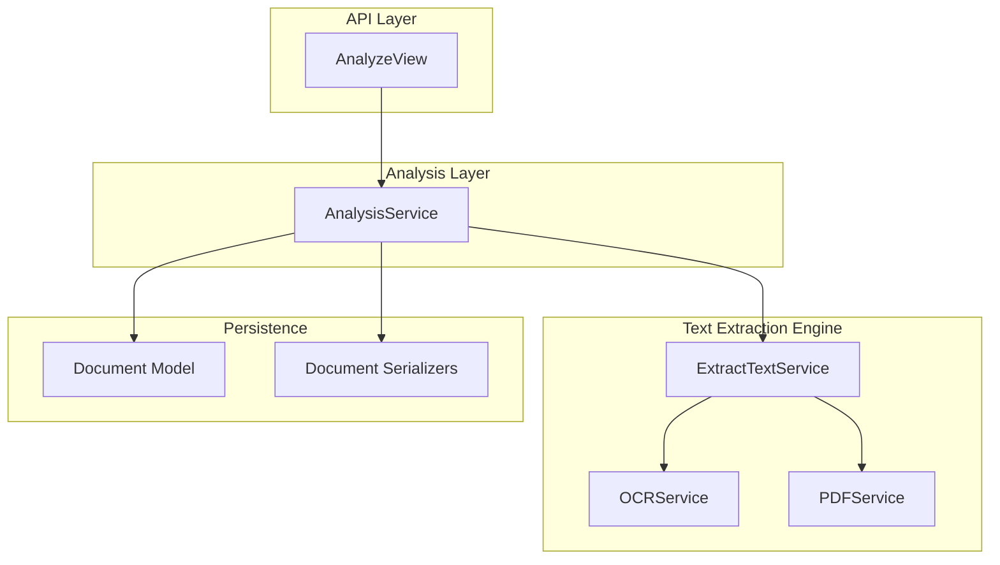
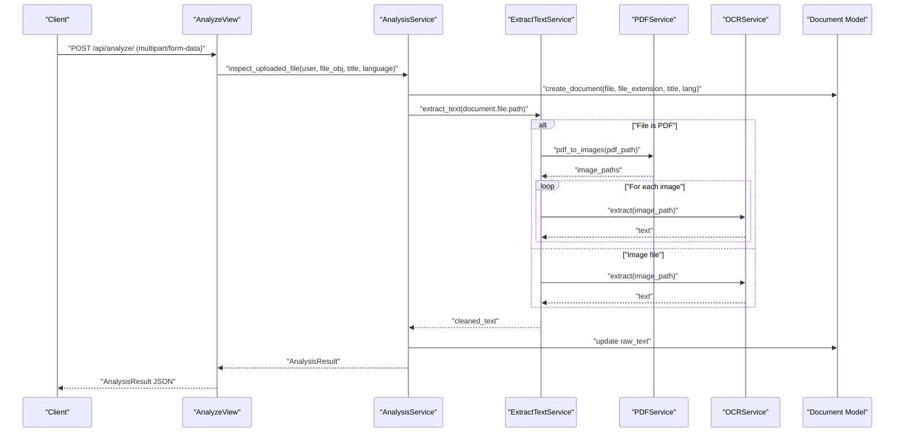
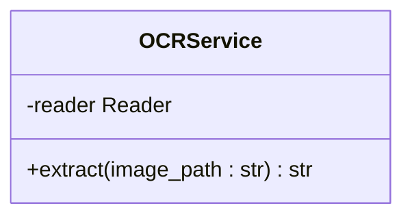
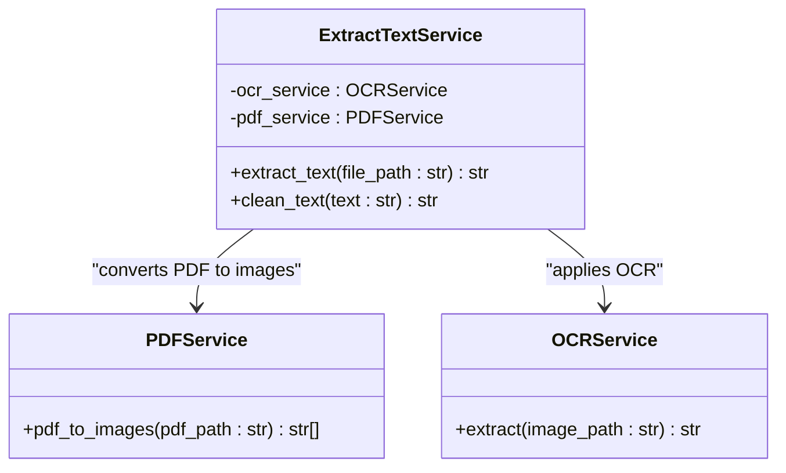
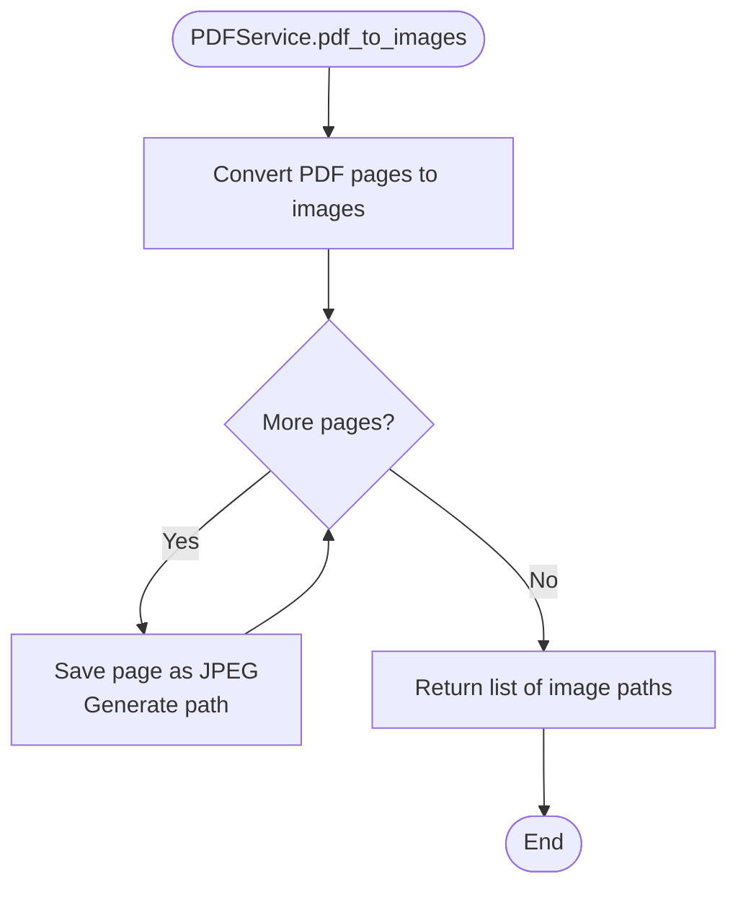
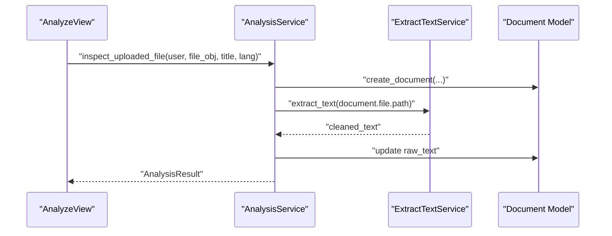
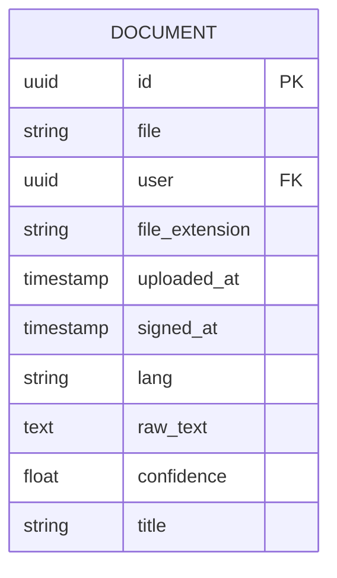
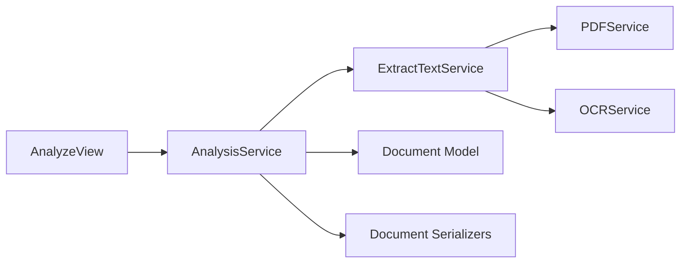

# OCR Service Implementation

<cite>
**Referenced Files in This Document**
- [ocr_service.py](file://apps/text_extractor_engine/services/ocr_service.py)
- [extract_text.py](file://apps/text_extractor_engine/services/extract_text.py)
- [pdf_service.py](file://apps/text_extractor_engine/services/pdf_service.py)
- [analysis_service.py](file://apps/analysis/services/analysis_service.py)
- [views.py](file://apps/analysis/views.py)
- [models.py](file://apps/files/models.py)
- [serializers.py](file://apps/files/serializers.py)
- [settings.py](file://config/settings.py)
- [openapi.yaml](file://openapi.yaml)
</cite>

## Table of Contents
1. [Introduction](#introduction)
2. [Project Structure](#project-structure)
3. [Core Components](#core-components)
4. [Architecture Overview](#architecture-overview)
5. [Detailed Component Analysis](#detailed-component-analysis)
6. [Dependency Analysis](#dependency-analysis)
7. [Performance Considerations](#performance-considerations)
8. [Troubleshooting Guide](#troubleshooting-guide)
9. [Conclusion](#conclusion)
10. [Appendices](#appendices)

## Introduction
This document explains the OCR service implementation using EasyOCR within the application. It covers the OCRService class architecture, text extraction methodology, confidence scoring mechanisms, Reader initialization with English language support, the text processing pipeline, and result formatting. Practical examples demonstrate processing different image types, handling various text orientations, and optimizing OCR accuracy. Configuration options for OCR parameters, language support expansion, and performance tuning strategies are documented alongside common issues such as poor image quality, text skewing, and mixed font types with their solutions.

## Project Structure
The OCR functionality resides in the text extractor engine module and integrates with the analysis pipeline and file/document models. The primary components are:
- OCRService: Performs text extraction using EasyOCR.
- ExtractTextService: Orchestrates OCR and PDF conversion, and cleans extracted text.
- PDFService: Converts PDFs to images for OCR processing.
- AnalysisService: Coordinates document creation, OCR extraction, and downstream analysis.
- Views and Serializers: Expose the OCR-enabled analysis API and manage document persistence.

**Diagram sources**
- [views.py:15-56](file://apps/analysis/views.py#L15-L56)
- [analysis_service.py:18-59](file://apps/analysis/services/analysis_service.py#L18-L59)
- [extract_text.py:5-54](file://apps/text_extractor_engine/services/extract_text.py#L5-L54)
- [ocr_service.py:6-17](file://apps/text_extractor_engine/services/ocr_service.py#L6-L17)
- [pdf_service.py:4-14](file://apps/text_extractor_engine/services/pdf_service.py#L4-L14)
- [models.py:5-17](file://apps/files/models.py#L5-L17)
- [serializers.py:6-61](file://apps/files/serializers.py#L6-L61)

**Section sources**
- [settings.py:26-40](file://config/settings.py#L26-L40)
- [openapi.yaml:572-621](file://openapi.yaml#L572-L621)

## Core Components
- OCRService: Initializes EasyOCR Reader with English language support and extracts text from image paths. It computes an average confidence score across detected text lines.
- ExtractTextService: Provides a unified interface to extract text from both images and PDFs. It converts PDFs to images and iterates through pages, applying OCR to each page. It also normalizes whitespace and removes escape sequences from extracted text.
- PDFService: Uses pdf2image to convert a PDF into a list of image paths for OCR processing.
- AnalysisService: Manages the end-to-end workflow for document analysis, including document creation, OCR extraction, and invoking downstream inspection logic.
- Document Model and Serializers: Persist document metadata, language, extracted text, and confidence scores, and enforce field visibility and validation.

**Section sources**
- [ocr_service.py:1-18](file://apps/text_extractor_engine/services/ocr_service.py#L1-L18)
- [extract_text.py:1-55](file://apps/text_extractor_engine/services/extract_text.py#L1-L55)
- [pdf_service.py:1-15](file://apps/text_extractor_engine/services/pdf_service.py#L1-L15)
- [analysis_service.py:18-59](file://apps/analysis/services/analysis_service.py#L18-L59)
- [models.py:5-17](file://apps/files/models.py#L5-L17)
- [serializers.py:6-61](file://apps/files/serializers.py#L6-L61)

## Architecture Overview
The OCR pipeline begins at the AnalyzeView, which validates multipart/form-data requests and delegates to AnalysisService. AnalysisService creates a Document instance, triggers ExtractTextService to extract text from the uploaded file (handling PDFs by converting to images), and persists the extracted text. The system supports English language OCR by default and exposes an optional language parameter for future expansion.

**Diagram sources**
- [views.py:22-56](file://apps/analysis/views.py#L22-L56)
- [analysis_service.py:21-59](file://apps/analysis/services/analysis_service.py#L21-L59)
- [extract_text.py:36-54](file://apps/text_extractor_engine/services/extract_text.py#L36-L54)
- [pdf_service.py:5-14](file://apps/text_extractor_engine/services/pdf_service.py#L5-L14)
- [ocr_service.py:8-17](file://apps/text_extractor_engine/services/ocr_service.py#L8-L17)
- [models.py:11-13](file://apps/files/models.py#L11-L13)

## Detailed Component Analysis

### OCRService Analysis
OCRService encapsulates EasyOCR integration:
- Reader Initialization: A single EasyOCR Reader is initialized with English language support at module level for efficiency.
- Text Extraction: The extract method reads text from an image path and returns concatenated text lines separated by newlines.
- Confidence Scoring: Computes the average confidence across detected text lines. If no text is detected, confidence remains zero.

**Diagram sources**
- [ocr_service.py:3-17](file://apps/text_extractor_engine/services/ocr_service.py#L3-L17)

**Section sources**
- [ocr_service.py:1-18](file://apps/text_extractor_engine/services/ocr_service.py#L1-L18)

### ExtractTextService Analysis
ExtractTextService coordinates OCR and PDF conversion:
- PDF Handling: Converts PDFs to images using PDFService and iterates through each page to apply OCR.
- Image Handling: Applies OCR directly to image files.
- Text Cleaning: Normalizes whitespace, replaces escape sequences with spaces, collapses multiple spaces, and trims output.

**Diagram sources**
- [extract_text.py:5-34](file://apps/text_extractor_engine/services/extract_text.py#L5-L34)
- [pdf_service.py:4-14](file://apps/text_extractor_engine/services/pdf_service.py#L4-L14)
- [ocr_service.py:6-17](file://apps/text_extractor_engine/services/ocr_service.py#L6-L17)

**Section sources**
- [extract_text.py:1-55](file://apps/text_extractor_engine/services/extract_text.py#L1-L55)
- [pdf_service.py:1-15](file://apps/text_extractor_engine/services/pdf_service.py#L1-L15)

### PDFService Analysis
PDFService converts a PDF into a sequence of JPEG images:
- Iterative Conversion: Uses pdf2image to render pages and saves each page as a JPEG with a generated path.
- Page List: Returns a list of image paths corresponding to the PDF pages.

**Diagram sources**
- [pdf_service.py:5-14](file://apps/text_extractor_engine/services/pdf_service.py#L5-L14)

**Section sources**
- [pdf_service.py:1-15](file://apps/text_extractor_engine/services/pdf_service.py#L1-L15)

### AnalysisService and API Integration
AnalysisService orchestrates the OCR-enabled analysis workflow:
- Document Creation: Uses DocumentService to persist the uploaded file metadata, language, and title.
- OCR Extraction: Calls ExtractTextService to extract and clean text from the stored file path.
- Downstream Processing: Constructs a DocumentInput dataclass and invokes inspection logic.

**Diagram sources**
- [views.py:22-56](file://apps/analysis/views.py#L22-L56)
- [analysis_service.py:21-59](file://apps/analysis/services/analysis_service.py#L21-L59)
- [extract_text.py:36-54](file://apps/text_extractor_engine/services/extract_text.py#L36-L54)
- [models.py:11-13](file://apps/files/models.py#L11-L13)

**Section sources**
- [analysis_service.py:18-59](file://apps/analysis/services/analysis_service.py#L18-L59)
- [views.py:15-56](file://apps/analysis/views.py#L15-L56)

### Document Model and Serializers
The Document model stores OCR-related fields and enforces validation:
- Fields: file, user, file_extension, uploaded_at, signed_at, lang, raw_text, confidence, title.
- Serializers: Control read-only fields and validate supported file types.

**Diagram sources**
- [models.py:5-17](file://apps/files/models.py#L5-L17)

**Section sources**
- [models.py:5-17](file://apps/files/models.py#L5-L17)
- [serializers.py:6-61](file://apps/files/serializers.py#L6-L61)

## Dependency Analysis
The OCR pipeline exhibits clear separation of concerns:
- API layer depends on AnalysisService.
- AnalysisService depends on ExtractTextService and Document model/serializer.
- ExtractTextService depends on PDFService and OCRService.
- OCRService depends on EasyOCR Reader.

**Diagram sources**
- [views.py:15-56](file://apps/analysis/views.py#L15-L56)
- [analysis_service.py:18-59](file://apps/analysis/services/analysis_service.py#L18-L59)
- [extract_text.py:5-54](file://apps/text_extractor_engine/services/extract_text.py#L5-L54)
- [ocr_service.py:3-17](file://apps/text_extractor_engine/services/ocr_service.py#L3-L17)
- [pdf_service.py:4-14](file://apps/text_extractor_engine/services/pdf_service.py#L4-L14)
- [models.py:5-17](file://apps/files/models.py#L5-L17)
- [serializers.py:6-61](file://apps/files/serializers.py#L6-L61)

**Section sources**
- [settings.py:26-40](file://config/settings.py#L26-L40)
- [openapi.yaml:572-621](file://openapi.yaml#L572-L621)

## Performance Considerations
- Reader Initialization: The EasyOCR Reader is initialized once at module level to avoid repeated model loading overhead.
- PDF Conversion: Converting PDFs to images is I/O bound; batch processing multiple pages sequentially can be optimized by parallelizing page rendering and OCR tasks where appropriate.
- Text Cleaning: Whitespace normalization and escape sequence replacement are linear in text length and add minimal overhead.
- Confidence Computation: Computing average confidence is O(n) over detected text lines.
- Language Support: Defaulting to English reduces model complexity; adding languages increases inference time and memory usage proportionally to the number of languages loaded.

[No sources needed since this section provides general guidance]

## Troubleshooting Guide
Common OCR issues and solutions:
- Poor Image Quality: Enhance contrast, brightness, and resolution before OCR. Use preprocessing libraries to binarize or denoise images.
- Text Skewing or Rotation: Apply geometric correction or deskewing algorithms prior to OCR to align text lines horizontally.
- Mixed Font Types and Styles: Normalize fonts by resizing and standardizing text appearance. Consider increasing OCR model size or enabling multi-directional detection if supported.
- Language Mismatch: Set the language parameter during document upload to match the document’s language. Expand EasyOCR language list accordingly.
- Slow Performance: Reduce image resolution, limit page count for PDFs, or process pages in parallel. Cache OCR results for repeated queries.

[No sources needed since this section provides general guidance]

## Conclusion
The OCR service implementation leverages EasyOCR with a clean, modular architecture. OCRService handles text extraction and confidence scoring, ExtractTextService manages PDF-to-image conversion and text cleaning, and AnalysisService integrates OCR into the broader document analysis workflow. The system supports English by default and can be extended to additional languages. By addressing image quality, orientation, and language mismatches, OCR accuracy can be significantly improved. Performance can be tuned through preprocessing, parallelization, and resource allocation strategies.

[No sources needed since this section summarizes without analyzing specific files]

## Appendices

### Practical Examples
- Processing Different Image Types: Upload JPG, PNG, or JPEG files; ExtractTextService applies OCR directly to the image path.
- Processing PDFs: Upload a PDF; ExtractTextService converts each page to an image and runs OCR per page, concatenating results.
- Handling Various Text Orientations: Preprocess images to correct skew and rotation before OCR to improve accuracy.
- Optimizing Accuracy: Increase image DPI, normalize lighting, and select the correct language during upload.

[No sources needed since this section provides general guidance]

### Configuration Options
- Language Support Expansion: Modify the EasyOCR Reader initialization to include additional languages. Ensure sufficient memory and compute resources.
- OCR Parameters: Adjust EasyOCR parameters such as paragraph detection, text threshold, and GPU usage depending on deployment environment.
- API Language Parameter: The analyze endpoint accepts a language parameter to specify the document language for OCR processing.

**Section sources**
- [ocr_service.py:3](file://apps/text_extractor_engine/services/ocr_service.py#L3)
- [views.py:40-41](file://apps/analysis/views.py#L40-L41)
- [openapi.yaml:599-602](file://openapi.yaml#L599-L602)