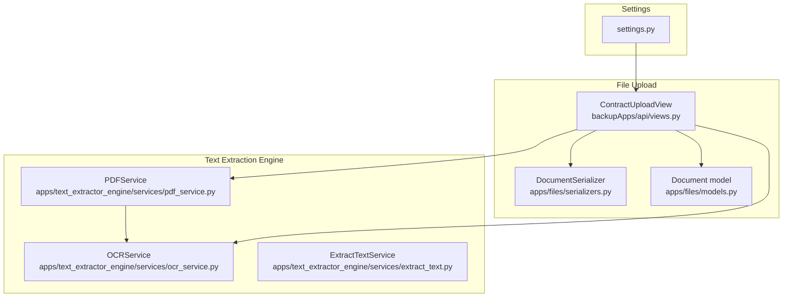
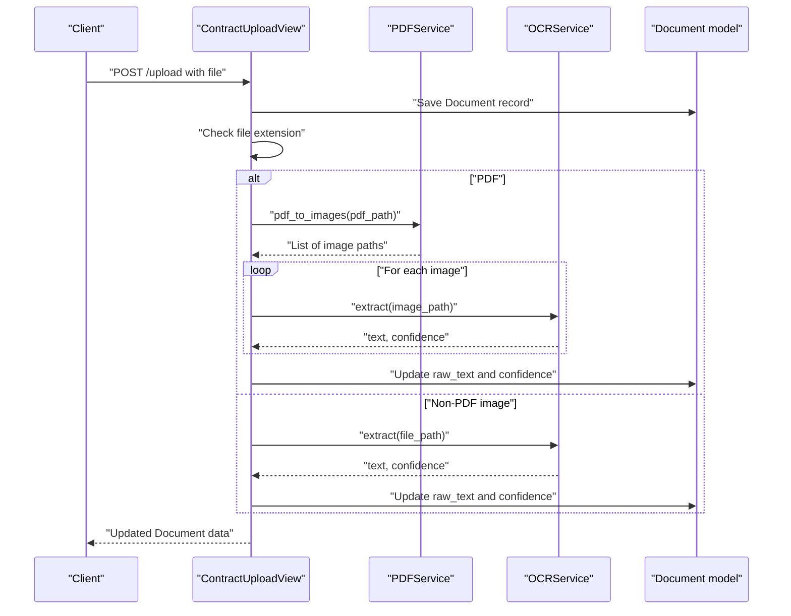
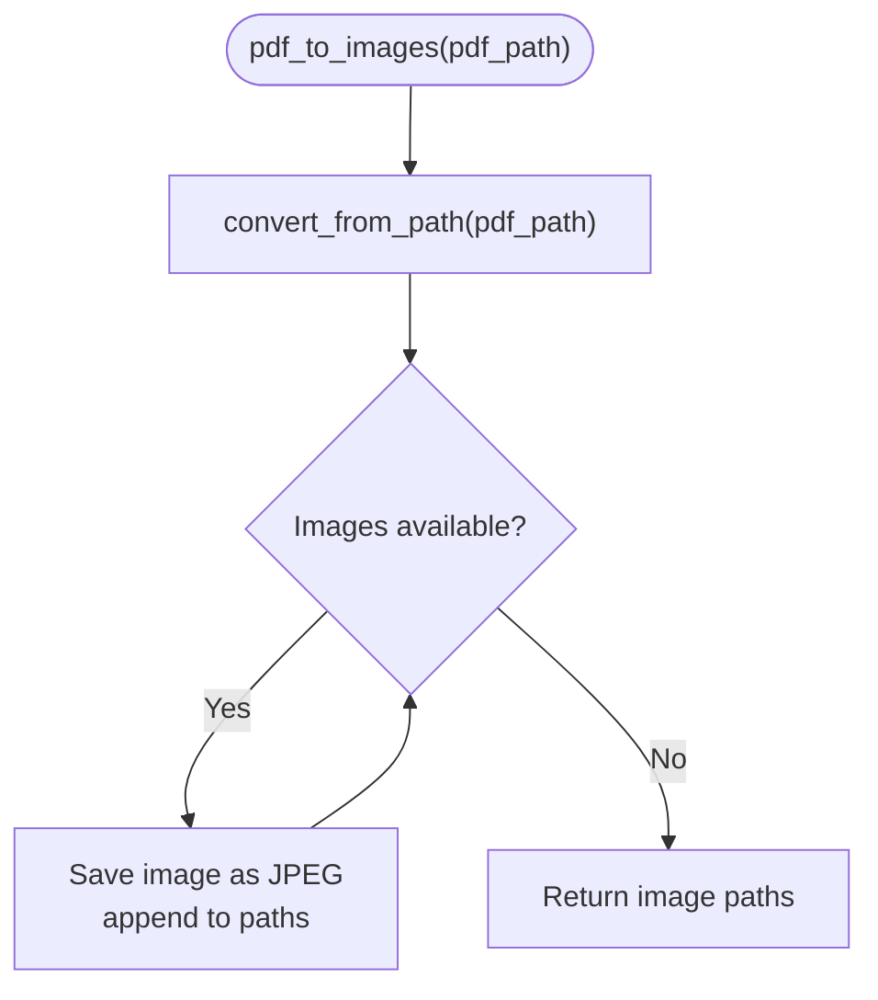
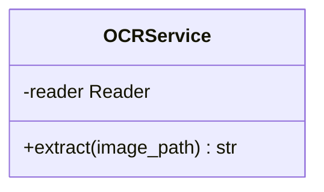
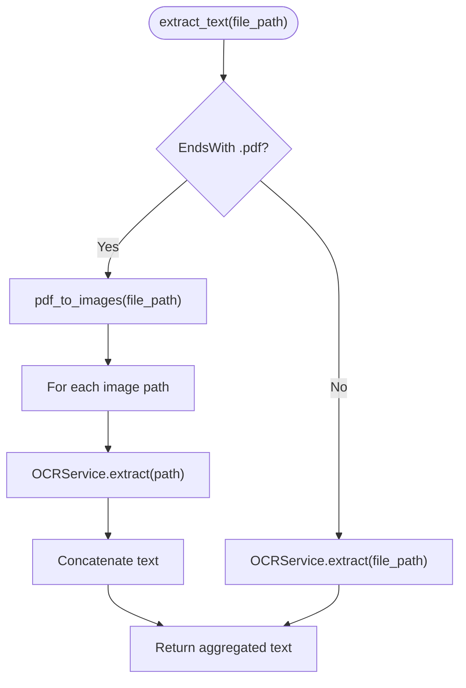
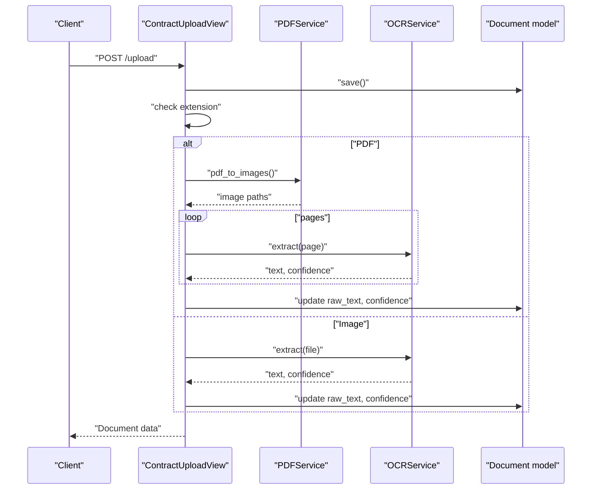
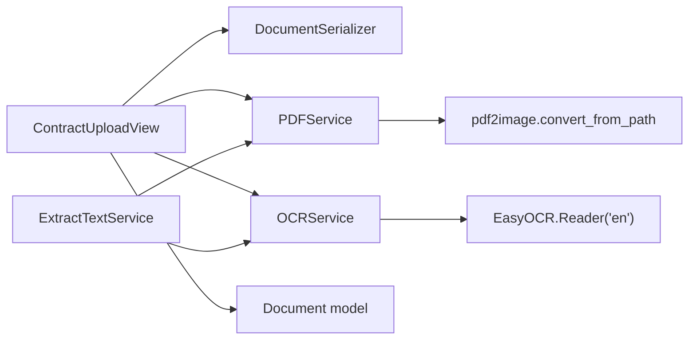

# PDF Processing Pipeline

<cite>
**Referenced Files in This Document**
- [pdf_service.py](file://apps/text_extractor_engine/services/pdf_service.py)
- [ocr_service.py](file://apps/text_extractor_engine/services/ocr_service.py)
- [extract_text.py](file://apps/text_extractor_engine/services/extract_text.py)
- [views.py](file://backupApps/api/views.py)
- [models.py](file://apps/files/models.py)
- [serializers.py](file://apps/files/serializers.py)
- [document_services.py](file://apps/files/services/document_services.py)
- [settings.py](file://config/settings.py)
</cite>

## Table of Contents
1. [Introduction](#introduction)
2. [Project Structure](#project-structure)
3. [Core Components](#core-components)
4. [Architecture Overview](#architecture-overview)
5. [Detailed Component Analysis](#detailed-component-analysis)
6. [Dependency Analysis](#dependency-analysis)
7. [Performance Considerations](#performance-considerations)
8. [Troubleshooting Guide](#troubleshooting-guide)
9. [Conclusion](#conclusion)
10. [Appendices](#appendices)

## Introduction
This document explains the PDF processing pipeline in VeritasShield, focusing on converting PDFs to images, performing OCR extraction, and integrating with the broader document lifecycle. It covers the PDFService implementation, OCRService integration, batch-like processing of multi-page PDFs, and practical guidance for handling encrypted or corrupted PDFs, memory usage, and performance tuning.

## Project Structure
The PDF processing pipeline spans several modules:
- Text extraction engine services: PDF conversion and OCR extraction
- File upload and document model: storage and metadata
- Upload view: orchestrates conversion and OCR, persists results
- Settings: media root and REST framework configuration

**Diagram sources**
- [views.py:14-93](file://backupApps/api/views.py#L14-L93)
- [pdf_service.py:4-14](file://apps/text_extractor_engine/services/pdf_service.py#L4-L14)
- [ocr_service.py:6-17](file://apps/text_extractor_engine/services/ocr_service.py#L6-L17)
- [extract_text.py:5-27](file://apps/text_extractor_engine/services/extract_text.py#L5-L27)
- [models.py:5-17](file://apps/files/models.py#L5-L17)
- [serializers.py:6-61](file://apps/files/serializers.py#L6-L61)
- [settings.py:122-123](file://config/settings.py#L122-L123)

**Section sources**
- [views.py:14-93](file://backupApps/api/views.py#L14-L93)
- [pdf_service.py:4-14](file://apps/text_extractor_engine/services/pdf_service.py#L4-L14)
- [ocr_service.py:6-17](file://apps/text_extractor_engine/services/ocr_service.py#L6-L17)
- [extract_text.py:5-27](file://apps/text_extractor_engine/services/extract_text.py#L5-L27)
- [models.py:5-17](file://apps/files/models.py#L5-L17)
- [serializers.py:6-61](file://apps/files/serializers.py#L6-L61)
- [settings.py:122-123](file://config/settings.py#L122-L123)

## Core Components
- PDFService: Converts a PDF into a sequence of JPEG images, one per page, returning local file paths.
- OCRService: Performs OCR on images and returns extracted text along with an average confidence score.
- ExtractTextService: Orchestrates PDF-to-images conversion and OCR across all pages, aggregating text.
- ContractUploadView: Uploads a document, triggers PDF-to-image conversion and OCR, and updates the document with extracted text and confidence.
- Document model and serializer: Persist file metadata and OCR results.

Key behaviors:
- PDFService saves intermediate images under the same base path as the PDF with page indices.
- OCRService uses EasyOCR with English language support.
- ExtractTextService handles both PDF and non-PDF inputs uniformly.

**Section sources**
- [pdf_service.py:4-14](file://apps/text_extractor_engine/services/pdf_service.py#L4-L14)
- [ocr_service.py:6-17](file://apps/text_extractor_engine/services/ocr_service.py#L6-L17)
- [extract_text.py:5-27](file://apps/text_extractor_engine/services/extract_text.py#L5-L27)
- [views.py:44-67](file://backupApps/api/views.py#L44-L67)
- [models.py:5-17](file://apps/files/models.py#L5-L17)
- [serializers.py:32-61](file://apps/files/serializers.py#L32-L61)

## Architecture Overview
The pipeline converts PDFs to images and runs OCR on each page, aggregating results into a single text string and an average confidence metric. The upload view coordinates the entire flow and persists outcomes to the Document model.

**Diagram sources**
- [views.py:44-67](file://backupApps/api/views.py#L44-L67)
- [pdf_service.py:5-12](file://apps/text_extractor_engine/services/pdf_service.py#L5-L12)
- [ocr_service.py:8-17](file://apps/text_extractor_engine/services/ocr_service.py#L8-L17)
- [models.py:12-13](file://apps/files/models.py#L12-L13)

## Detailed Component Analysis

### PDFService
Responsibilities:
- Convert a PDF into a sequence of images using pdf2image.
- Save each page as a JPEG with a deterministic naming scheme.
- Return a list of generated image paths.

Processing logic:
- Uses convert_from_path to render pages.
- Iterates over returned PIL images and saves them to disk.
- Aggregates output paths for downstream OCR.

Memory and performance considerations:
- Large documents produce many images; consider disk space and temporary storage.
- No explicit DPI or page-range parameters are set in the current implementation.

**Diagram sources**
- [pdf_service.py:5-12](file://apps/text_extractor_engine/services/pdf_service.py#L5-L12)

**Section sources**
- [pdf_service.py:4-14](file://apps/text_extractor_engine/services/pdf_service.py#L4-L14)

### OCRService
Responsibilities:
- Load EasyOCR reader for English.
- Extract text from an image path.
- Compute average confidence across detected text lines.

Processing logic:
- Calls EasyOCR readtext on the image.
- Extracts recognized text parts and confidence scores.
- Returns concatenated text and average confidence.

**Diagram sources**
- [ocr_service.py:6-17](file://apps/text_extractor_engine/services/ocr_service.py#L6-L17)

**Section sources**
- [ocr_service.py:6-17](file://apps/text_extractor_engine/services/ocr_service.py#L6-L17)

### ExtractTextService
Responsibilities:
- Detect file type and route to PDFService or OCRService.
- Aggregate OCR results across all pages for PDFs.
- Provide unified text extraction interface.

Processing logic:
- If the file is a PDF, call PDFService to generate images, then iterate over each image to extract text and concatenate.
- Otherwise, call OCRService directly on the file path.

**Diagram sources**
- [extract_text.py:10-27](file://apps/text_extractor_engine/services/extract_text.py#L10-L27)
- [pdf_service.py:5-12](file://apps/text_extractor_engine/services/pdf_service.py#L5-L12)
- [ocr_service.py:8-17](file://apps/text_extractor_engine/services/ocr_service.py#L8-L17)

**Section sources**
- [extract_text.py:5-27](file://apps/text_extractor_engine/services/extract_text.py#L5-L27)

### ContractUploadView (Upload Orchestration)
Responsibilities:
- Validate and persist a Document.
- Detect file type and trigger PDF conversion or direct OCR.
- Aggregate OCR results and update the Document with raw_text and confidence.
- Return the updated Document.

Processing logic:
- Validates serializer and saves the Document.
- If PDF, generates images and iterates through them to collect text and confidence.
- Computes average confidence across pages.
- Updates the Document and returns serialized data.

**Diagram sources**
- [views.py:44-67](file://backupApps/api/views.py#L44-L67)
- [pdf_service.py:5-12](file://apps/text_extractor_engine/services/pdf_service.py#L5-L12)
- [ocr_service.py:8-17](file://apps/text_extractor_engine/services/ocr_service.py#L8-L17)
- [models.py:12-13](file://apps/files/models.py#L12-L13)

**Section sources**
- [views.py:44-67](file://backupApps/api/views.py#L44-L67)

### Document Model and Serializer
Responsibilities:
- Store file metadata, OCR results, and timestamps.
- Validate supported file types during creation.

Key fields:
- raw_text: Extracted OCR text.
- confidence: Average OCR confidence.
- lang: Language hint for OCR.
- file_extension: Derived from filename.

Validation:
- Enforces allowed extensions (.pdf, .jpg, .png, .jpeg).

**Section sources**
- [models.py:5-17](file://apps/files/models.py#L5-L17)
- [serializers.py:48-52](file://apps/files/serializers.py#L48-L52)

## Dependency Analysis
- ContractUploadView depends on DocumentSerializer, PDFService, OCRService, and Document model.
- PDFService depends on pdf2image.
- OCRService depends on EasyOCR.
- ExtractTextService composes PDFService and OCRService for unified text extraction.

**Diagram sources**
- [views.py:44-67](file://backupApps/api/views.py#L44-L67)
- [pdf_service.py:1](file://apps/text_extractor_engine/services/pdf_service.py#L1)
- [ocr_service.py:1](file://apps/text_extractor_engine/services/ocr_service.py#L1)
- [extract_text.py:1-2](file://apps/text_extractor_engine/services/extract_text.py#L1-L2)

**Section sources**
- [views.py:44-67](file://backupApps/api/views.py#L44-L67)
- [pdf_service.py:1](file://apps/text_extractor_engine/services/pdf_service.py#L1)
- [ocr_service.py:1](file://apps/text_extractor_engine/services/ocr_service.py#L1)
- [extract_text.py:1-2](file://apps/text_extractor_engine/services/extract_text.py#L1-L2)

## Performance Considerations
Current implementation characteristics:
- Batch-like processing: Multi-page PDFs are converted to individual images and processed sequentially.
- No explicit DPI or page-range parameters are configured in PDFService.
- Memory footprint increases with the number of pages and image resolution.

Optimization opportunities:
- DPI tuning: Increase DPI for scanned documents to improve OCR accuracy; reduce for clean text PDFs to lower memory and processing time.
- Page range limiting: Restrict processing to specific page ranges for very large documents.
- Parallelization: Process multiple pages concurrently to reduce total latency.
- Temporary storage: Ensure sufficient disk space for intermediate images; consider cleanup after processing.
- Language model caching: Initialize EasyOCR once and reuse for multiple extractions.

[No sources needed since this section provides general guidance]

## Troubleshooting Guide
Common issues and strategies:
- Encrypted or password-protected PDFs:
  - The current PDFService does not accept passwords. If a PDF is encrypted, conversion will fail. Consider pre-processing with a library that supports decryption or prompting the user for a password before conversion.
- Corrupted PDFs:
  - Conversion may raise exceptions. Wrap conversion and OCR calls in try-except blocks and return structured error messages with document identifiers.
- Out-of-memory errors:
  - Large documents with high-resolution images can exhaust memory. Reduce DPI, limit pages, or process in smaller batches.
- Disk space constraints:
  - Intermediate images consume significant disk space. Ensure MEDIA_ROOT has adequate free space and consider cleaning up temporary files after processing.
- OCR quality:
  - Low-quality scans yield poor OCR results. Adjust DPI and preprocessing steps (e.g., binarization) to improve accuracy.

**Section sources**
- [views.py:69-79](file://backupApps/api/views.py#L69-L79)
- [pdf_service.py:5-12](file://apps/text_extractor_engine/services/pdf_service.py#L5-L12)
- [ocr_service.py:8-17](file://apps/text_extractor_engine/services/ocr_service.py#L8-L17)

## Conclusion
VeritasShield’s PDF processing pipeline converts PDFs to images and performs OCR across all pages, aggregating results into a single text and confidence metric. While the current implementation is straightforward and functional, enhancements such as configurable DPI, page range selection, parallel processing, and robust error handling would significantly improve reliability and performance for large or complex documents.

[No sources needed since this section summarizes without analyzing specific files]

## Appendices

### Optimal DPI Guidelines
- Clean text PDFs: Lower DPI (150–200) to minimize memory and speed up processing.
- Scanned documents: Higher DPI (300–600) to capture fine details for OCR accuracy.
- Mixed content: Evaluate per-page content; consider adaptive DPI or selective enhancement.

[No sources needed since this section provides general guidance]

### Quality vs. Performance Trade-offs
- Higher DPI improves OCR accuracy but increases memory and processing time.
- Limiting pages reduces latency and resource usage at the cost of completeness.
- Parallel processing accelerates throughput but requires careful resource management.

[No sources needed since this section provides general guidance]