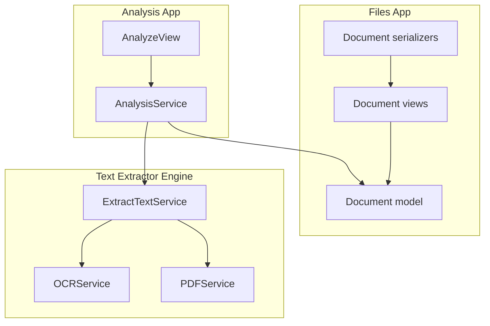
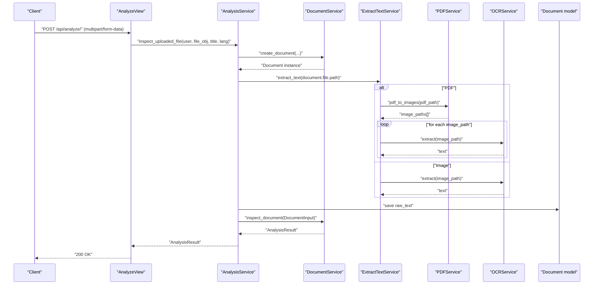
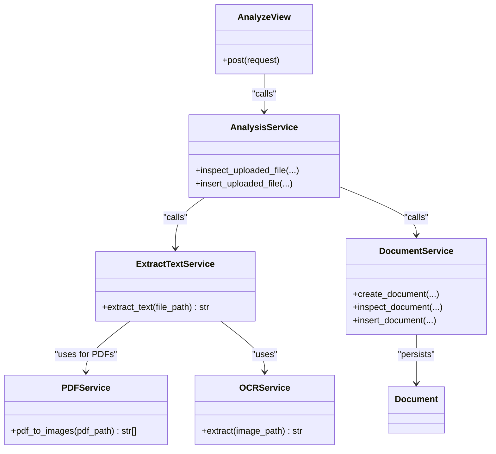
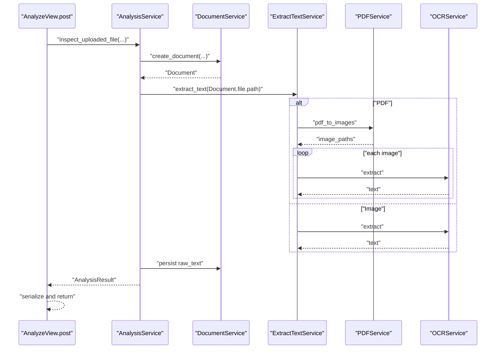

# Performance Optimization & Error Handling

<cite>
**Referenced Files in This Document**
- [extract_text.py](file://apps/text_extractor_engine/services/extract_text.py)
- [ocr_service.py](file://apps/text_extractor_engine/services/ocr_service.py)
- [pdf_service.py](file://apps/text_extractor_engine/services/pdf_service.py)
- [analysis_service.py](file://apps/analysis/services/analysis_service.py)
- [views.py](file://apps/analysis/views.py)
- [models.py](file://apps/files/models.py)
- [document_services.py](file://apps/files/services/document_services.py)
- [serializers.py](file://apps/files/serializers.py)
- [urls.py](file://apps/analysis/urls.py)
</cite>

## Table of Contents
1. [Introduction](#introduction)
2. [Project Structure](#project-structure)
3. [Core Components](#core-components)
4. [Architecture Overview](#architecture-overview)
5. [Detailed Component Analysis](#detailed-component-analysis)
6. [Dependency Analysis](#dependency-analysis)
7. [Performance Considerations](#performance-considerations)
8. [Troubleshooting Guide](#troubleshooting-guide)
9. [Conclusion](#conclusion)
10. [Appendices](#appendices)

## Introduction
This document focuses on performance optimization and error handling in the text extraction engine responsible for OCR processing of uploaded documents. It covers batch processing, memory management, parallel execution strategies, robust error handling for corrupted files and unsupported formats, fallback strategies for low-quality scans, image preprocessing, quality assessment, benchmarking, resource monitoring, scaling, timeouts, retries, and graceful degradation. The goal is to help operators and developers tune the system for high-volume throughput while maintaining reliability and accuracy.

## Project Structure
The text extraction pipeline integrates with the document lifecycle and analysis services:
- File upload and metadata persistence are handled by the files app.
- OCR extraction is encapsulated in the text extractor engine services.
- The analysis app orchestrates end-to-end processing from upload to inspection.

**Diagram sources**
- [extract_text.py:1-28](file://apps/text_extractor_engine/services/extract_text.py#L1-L28)
- [ocr_service.py:1-18](file://apps/text_extractor_engine/services/ocr_service.py#L1-L18)
- [pdf_service.py:1-15](file://apps/text_extractor_engine/services/pdf_service.py#L1-L15)
- [analysis_service.py:1-80](file://apps/analysis/services/analysis_service.py#L1-L80)
- [views.py:1-99](file://apps/analysis/views.py#L1-L99)
- [models.py:1-18](file://apps/files/models.py#L1-L18)
- [serializers.py:1-61](file://apps/files/serializers.py#L1-L61)

**Section sources**
- [urls.py:1-9](file://apps/analysis/urls.py#L1-L9)
- [views.py:1-99](file://apps/analysis/views.py#L1-L99)
- [analysis_service.py:1-80](file://apps/analysis/services/analysis_service.py#L1-L80)
- [extract_text.py:1-28](file://apps/text_extractor_engine/services/extract_text.py#L1-L28)
- [ocr_service.py:1-18](file://apps/text_extractor_engine/services/ocr_service.py#L1-L18)
- [pdf_service.py:1-15](file://apps/text_extractor_engine/services/pdf_service.py#L1-L15)
- [models.py:1-18](file://apps/files/models.py#L1-L18)
- [serializers.py:1-61](file://apps/files/serializers.py#L1-L61)

## Core Components
- ExtractTextService: Orchestrates OCR extraction for PDFs and images. For PDFs, converts pages to images and iterates through them, invoking OCR per page.
- OCRService: Performs OCR using EasyOCR and computes average confidence from detected text lines.
- PDFService: Converts PDFs to a list of JPEG image paths for OCR processing.
- AnalysisService: Coordinates document creation, OCR extraction, and downstream inspection.
- AnalyzeView: Exposes the /analyze endpoint, validates inputs, and handles exceptions.
- Document model and serializers: Persist file metadata, language, raw text, and confidence; enforce supported file types.

Key performance and reliability characteristics:
- Sequential iteration over PDF pages and images introduces linear scaling with page count.
- EasyOCR inference is invoked per page/image; no built-in batching or concurrency.
- No explicit memory cleanup or temporary file management for generated images.
- Basic error handling via generic try/catch blocks; specific OCR failure handling is not implemented.

**Section sources**
- [extract_text.py:1-28](file://apps/text_extractor_engine/services/extract_text.py#L1-L28)
- [ocr_service.py:1-18](file://apps/text_extractor_engine/services/ocr_service.py#L1-L18)
- [pdf_service.py:1-15](file://apps/text_extractor_engine/services/pdf_service.py#L1-L15)
- [analysis_service.py:1-80](file://apps/analysis/services/analysis_service.py#L1-L80)
- [views.py:1-99](file://apps/analysis/views.py#L1-L99)
- [models.py:1-18](file://apps/files/models.py#L1-L18)
- [serializers.py:1-61](file://apps/files/serializers.py#L1-L61)

## Architecture Overview
End-to-end flow from upload to OCR and inspection:

**Diagram sources**
- [views.py:1-99](file://apps/analysis/views.py#L1-L99)
- [analysis_service.py:1-80](file://apps/analysis/services/analysis_service.py#L1-L80)
- [document_services.py:1-124](file://apps/files/services/document_services.py#L1-L124)
- [extract_text.py:1-28](file://apps/text_extractor_engine/services/extract_text.py#L1-L28)
- [pdf_service.py:1-15](file://apps/text_extractor_engine/services/pdf_service.py#L1-L15)
- [ocr_service.py:1-18](file://apps/text_extractor_engine/services/ocr_service.py#L1-L18)
- [models.py:1-18](file://apps/files/models.py#L1-L18)

## Detailed Component Analysis

### ExtractTextService
Responsibilities:
- Detects file type and routes to appropriate extraction path.
- For PDFs: generates page images and iteratively runs OCR.
- For images: runs OCR directly.

Performance implications:
- Iterative processing per page/image; no batching or parallelism.
- Aggregates text sequentially; memory footprint grows with total extracted text length.

Error handling:
- No explicit try/catch around OCR calls; exceptions propagate up.

Scalability:
- Current design scales linearly with number of pages/images.
- Parallelization opportunities exist at page/image level.

**Section sources**
- [extract_text.py:1-28](file://apps/text_extractor_engine/services/extract_text.py#L1-L28)

### OCRService
Responsibilities:
- Runs OCR on a single image.
- Computes average confidence across detected text lines.

Performance implications:
- Single-threaded EasyOCR inference per image.
- Confidence calculation adds minimal overhead.

Quality assessment:
- Uses average confidence as a proxy metric; can be persisted to the Document model.

Error handling:
- No explicit exception handling; relies on upstream error propagation.

**Section sources**
- [ocr_service.py:1-18](file://apps/text_extractor_engine/services/ocr_service.py#L1-L18)

### PDFService
Responsibilities:
- Converts a PDF into a list of JPEG images.
- Saves each page as a separate JPEG file.

Performance implications:
- Disk I/O for writing intermediate images.
- Memory usage during conversion depends on page complexity and DPI settings.
- Temporary files are created and not explicitly cleaned up.

Error handling:
- No explicit error handling for conversion failures.

**Section sources**
- [pdf_service.py:1-15](file://apps/text_extractor_engine/services/pdf_service.py#L1-L15)

### AnalysisService
Responsibilities:
- Creates a Document instance.
- Invokes ExtractTextService to extract raw text.
- Persists raw text to the Document model.
- Constructs a DocumentInput and calls inspection logic.

Error handling:
- Delegates to DocumentService for downstream steps.
- No OCR-specific error handling in this component.

**Section sources**
- [analysis_service.py:1-80](file://apps/analysis/services/analysis_service.py#L1-L80)

### AnalyzeView
Responsibilities:
- Validates multipart/form-data input.
- Calls AnalysisService and serializes results.
- Catches generic exceptions and returns standardized error responses.

Error handling:
- Catches broad exceptions and returns 500 with details.
- No specific handling for OCR failures, corrupted files, or unsupported formats.

**Section sources**
- [views.py:1-99](file://apps/analysis/views.py#L1-L99)

### Document model and serializers
Responsibilities:
- Stores file metadata, language, raw text, and confidence.
- Enforces supported file types in the serializer.

Error handling:
- Serializer raises validation errors for unsupported file types.
- No OCR confidence persistence in current model; could be extended.

**Section sources**
- [models.py:1-18](file://apps/files/models.py#L1-L18)
- [serializers.py:1-61](file://apps/files/serializers.py#L1-L61)

## Dependency Analysis

**Diagram sources**
- [extract_text.py:1-28](file://apps/text_extractor_engine/services/extract_text.py#L1-L28)
- [ocr_service.py:1-18](file://apps/text_extractor_engine/services/ocr_service.py#L1-L18)
- [pdf_service.py:1-15](file://apps/text_extractor_engine/services/pdf_service.py#L1-L15)
- [analysis_service.py:1-80](file://apps/analysis/services/analysis_service.py#L1-L80)
- [views.py:1-99](file://apps/analysis/views.py#L1-L99)
- [document_services.py:1-124](file://apps/files/services/document_services.py#L1-L124)
- [models.py:1-18](file://apps/files/models.py#L1-L18)

**Section sources**
- [extract_text.py:1-28](file://apps/text_extractor_engine/services/extract_text.py#L1-L28)
- [ocr_service.py:1-18](file://apps/text_extractor_engine/services/ocr_service.py#L1-L18)
- [pdf_service.py:1-15](file://apps/text_extractor_engine/services/pdf_service.py#L1-L15)
- [analysis_service.py:1-80](file://apps/analysis/services/analysis_service.py#L1-L80)
- [views.py:1-99](file://apps/analysis/views.py#L1-L99)
- [document_services.py:1-124](file://apps/files/services/document_services.py#L1-L124)
- [models.py:1-18](file://apps/files/models.py#L1-L18)

## Performance Considerations

### Batch Processing
- Current implementation processes each page/image sequentially. To improve throughput:
  - Aggregate multiple pages/images and process in batches.
  - Use a producer-consumer pattern with a bounded queue to limit memory usage.
  - Persist intermediate OCR results to disk or cache to reduce memory pressure.

### Memory Management
- PDFService writes intermediate JPEGs to disk; consider:
  - Configurable temporary directory and automatic cleanup after OCR completion.
  - Limit concurrent conversions to cap peak memory usage.
  - Stream images directly to OCR without saving when feasible.

### Parallel Execution Strategies
- Parallelize OCR calls across pages/images using thread/process pools.
- Use asyncio-compatible OCR libraries if available to avoid GIL contention.
- Apply backpressure to prevent overwhelming downstream systems.

### Image Preprocessing and Quality Assessment
- Preprocess images to improve OCR accuracy:
  - Resize to target DPI/resolution.
  - Convert to grayscale and apply thresholding.
  - Deskew and normalize contrast/brightness.
- Compute quality metrics (e.g., entropy, skew angle) to decide whether to preprocess or skip.
- Store confidence scores per page/image to enable quality-aware fallbacks.

### Fallback Strategies for Poor-Quality Scans
- If average confidence falls below a threshold, re-run OCR with preprocessing enabled.
- For heavily degraded text, attempt alternate OCR engines or languages.
- For partial failures, log page-level errors and continue processing remaining pages.

### Timeout Management and Retries
- Set per-request timeouts in the web server and within OCR service.
- Implement retry with exponential backoff for transient failures.
- Fail fast on unsupported formats or corrupted files to avoid wasted resources.

### Graceful Degradation
- If OCR fails, return partial results and mark the document as partially processed.
- Log detailed diagnostics for later reprocessing.
- Provide a mechanism to reattempt OCR with adjusted parameters.

### Benchmarking Guidelines
- Measure end-to-end latency per document and per page.
- Track OCR throughput (pages/second) under varying loads.
- Monitor memory and CPU utilization during batch runs.
- Record confidence distributions and quality metrics to correlate with accuracy.

### Resource Usage Monitoring
- Instrument ExtractTextService to emit metrics for:
  - Page count per document.
  - OCR latency per page.
  - Memory usage before/after conversions.
- Use application performance monitoring (APM) tools to track hotspots.

### Scaling Considerations
- Horizontal scaling: Deploy multiple workers behind a load balancer.
- Vertical scaling: Increase CPU/GPU resources for OCR workloads.
- Queue-based processing: Offload OCR jobs to a message broker for asynchronous processing.

[No sources needed since this section provides general guidance]

## Troubleshooting Guide

Common issues and mitigation strategies:
- Corrupted files or unsupported formats:
  - Validate file extensions early and reject unsupported types.
  - Catch conversion errors and return structured error messages.
- OCR failures:
  - Wrap OCR calls with timeouts and retries.
  - Log page-level failures and continue processing.
- Memory exhaustion:
  - Limit concurrent conversions and enforce memory caps.
  - Clean up temporary files promptly.
- Slow performance:
  - Profile OCR latency and identify slow pages.
  - Enable preprocessing selectively for low-confidence pages.

Operational checks:
- Verify that PDFService writes temporary images and that cleanup occurs.
- Confirm that AnalyzeView returns appropriate HTTP status codes for different failure modes.
- Ensure AnalysisService persists raw_text and that downstream inspection proceeds.

**Section sources**
- [views.py:1-99](file://apps/analysis/views.py#L1-L99)
- [pdf_service.py:1-15](file://apps/text_extractor_engine/services/pdf_service.py#L1-L15)
- [ocr_service.py:1-18](file://apps/text_extractor_engine/services/ocr_service.py#L1-L18)
- [serializers.py:1-61](file://apps/files/serializers.py#L1-L61)

## Conclusion
The current text extraction engine provides a straightforward OCR pipeline suitable for moderate workloads. To achieve high-volume, reliable performance, introduce batching, parallelism, and robust error handling. Implement preprocessing, quality assessment, and fallback strategies to improve accuracy on poor-quality scans. Establish benchmarking and monitoring practices to continuously optimize throughput and resource usage. With these enhancements, the system can scale effectively while maintaining resilience and accuracy.

[No sources needed since this section summarizes without analyzing specific files]

## Appendices

### End-to-End Processing Flow (Code-Level)

**Diagram sources**
- [views.py:1-99](file://apps/analysis/views.py#L1-L99)
- [analysis_service.py:1-80](file://apps/analysis/services/analysis_service.py#L1-L80)
- [document_services.py:1-124](file://apps/files/services/document_services.py#L1-L124)
- [extract_text.py:1-28](file://apps/text_extractor_engine/services/extract_text.py#L1-L28)
- [pdf_service.py:1-15](file://apps/text_extractor_engine/services/pdf_service.py#L1-L15)
- [ocr_service.py:1-18](file://apps/text_extractor_engine/services/ocr_service.py#L1-L18)