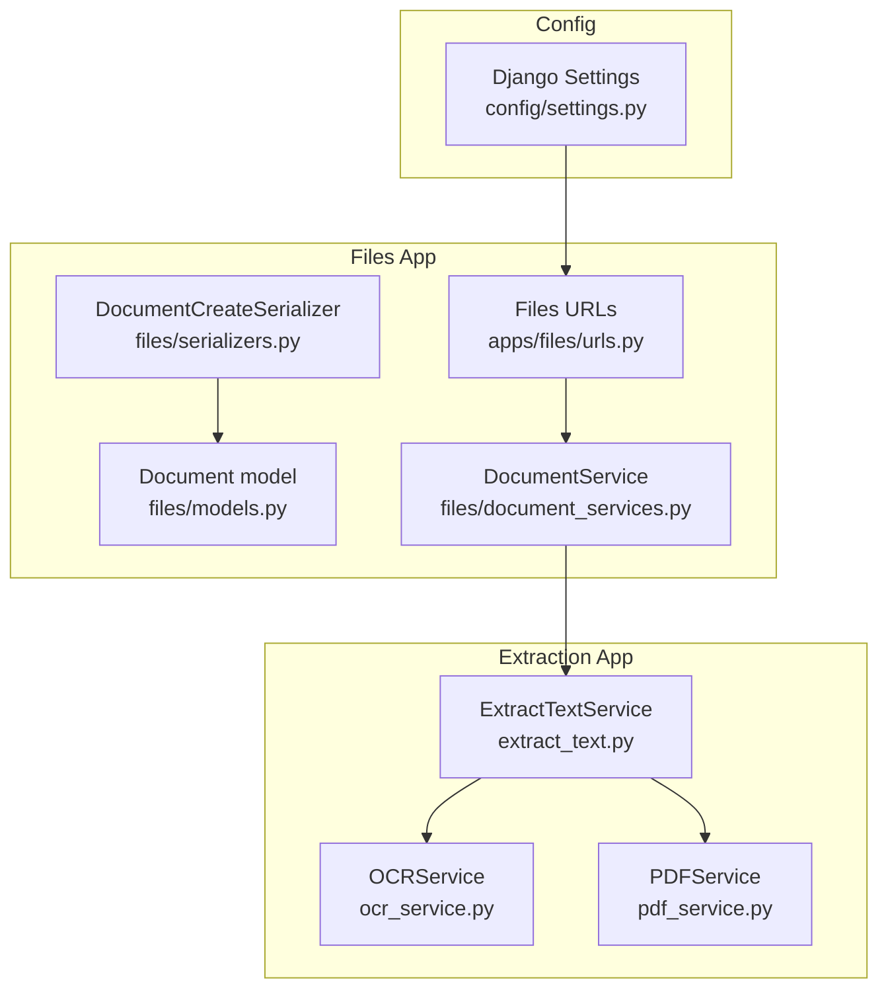
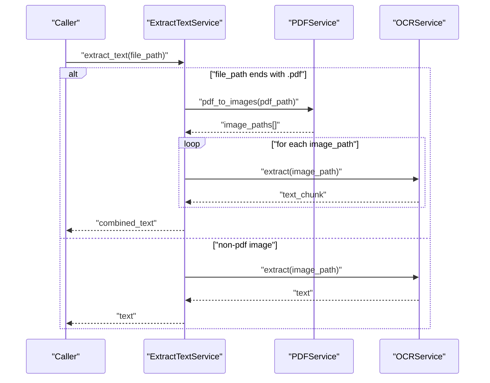
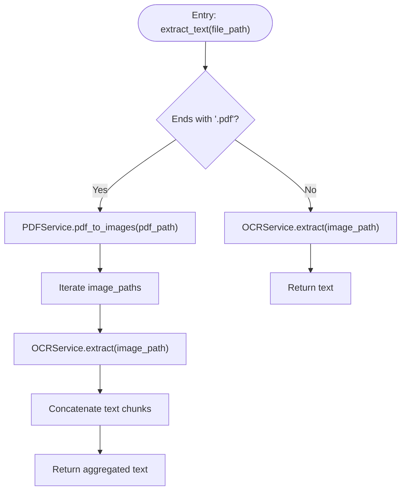
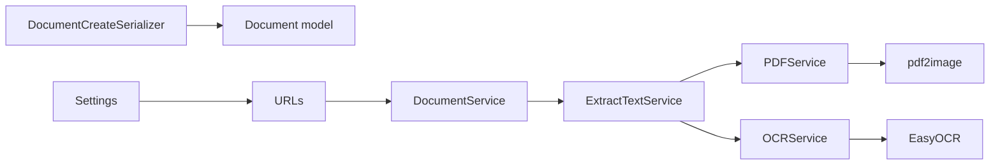

# Text Extraction Engine

<cite>
**Referenced Files in This Document**
- [extract_text.py](file://apps/text_extractor_engine/services/extract_text.py)
- [ocr_service.py](file://apps/text_extractor_engine/services/ocr_service.py)
- [pdf_service.py](file://apps/text_extractor_engine/services/pdf_service.py)
- [models.py](file://apps/files/models.py)
- [document_services.py](file://apps/files/services/document_services.py)
- [serializers.py](file://apps/files/serializers.py)
- [urls.py](file://apps/files/urls.py)
- [settings.py](file://config/settings.py)
</cite>

## Table of Contents
1. [Introduction](#introduction)
2. [Project Structure](#project-structure)
3. [Core Components](#core-components)
4. [Architecture Overview](#architecture-overview)
5. [Detailed Component Analysis](#detailed-component-analysis)
6. [Dependency Analysis](#dependency-analysis)
7. [Performance Considerations](#performance-considerations)
8. [Troubleshooting Guide](#troubleshooting-guide)
9. [Conclusion](#conclusion)
10. [Appendices](#appendices)

## Introduction
This document describes the text extraction engine for VeritasShield, focusing on multi-format text extraction for PDFs, images, and other document types. It explains the OCR service implementation using EasyOCR, the PDF processing pipeline (conversion to images, batch processing), and the extraction service architecture. It also covers performance optimization, error handling strategies for corrupted or low-quality inputs, and integration points with the broader file management system.

## Project Structure
The text extraction engine resides under the dedicated app for extraction and integrates with the files app for document lifecycle management. Key modules:
- Extraction services: ExtractTextService orchestrates OCR and PDF conversion.
- OCR service: EasyOCR-based text recognition from images.
- PDF service: Converts PDF pages to images.
- Files app: Document model, serializers, and upload/view integration.
- Settings: Global configuration and media handling.

**Diagram sources**
- [extract_text.py:1-28](file://apps/text_extractor_engine/services/extract_text.py#L1-L28)
- [ocr_service.py:1-18](file://apps/text_extractor_engine/services/ocr_service.py#L1-L18)
- [pdf_service.py:1-15](file://apps/text_extractor_engine/services/pdf_service.py#L1-L15)
- [models.py:1-18](file://apps/files/models.py#L1-L18)
- [document_services.py:1-137](file://apps/files/services/document_services.py#L1-L137)
- [serializers.py:1-61](file://apps/files/serializers.py#L1-L61)
- [urls.py:1-24](file://apps/files/urls.py#L1-L24)
- [settings.py:1-155](file://config/settings.py#L1-L155)

**Section sources**
- [extract_text.py:1-28](file://apps/text_extractor_engine/services/extract_text.py#L1-L28)
- [ocr_service.py:1-18](file://apps/text_extractor_engine/services/ocr_service.py#L1-L18)
- [pdf_service.py:1-15](file://apps/text_extractor_engine/services/pdf_service.py#L1-L15)
- [models.py:1-18](file://apps/files/models.py#L1-L18)
- [document_services.py:1-137](file://apps/files/services/document_services.py#L1-L137)
- [serializers.py:1-61](file://apps/files/serializers.py#L1-L61)
- [urls.py:1-24](file://apps/files/urls.py#L1-L24)
- [settings.py:1-155](file://config/settings.py#L1-L155)

## Core Components
- ExtractTextService: Central coordinator that decides whether to process a PDF via page-to-image conversion or directly pass non-PDF files to OCR.
- OCRService: Uses EasyOCR to recognize text from images, returning recognized text joined by newlines and computing an average confidence score.
- PDFService: Converts each page of a PDF into a JPEG image and returns a list of generated image paths.
- Document model and serializer: Define storage fields for extracted raw text and confidence, and enforce supported file types.
- DocumentService: Provides upload and inspection workflows; integration points for invoking extraction are available for extension.

Key responsibilities and interactions:
- ExtractTextService delegates to PDFService for PDFs and to OCRService for images.
- OCRService encapsulates EasyOCR initialization and text extraction logic.
- PDFService handles page iteration and image persistence.
- Document model stores extracted raw_text and confidence metrics for downstream analysis.

**Section sources**
- [extract_text.py:10-28](file://apps/text_extractor_engine/services/extract_text.py#L10-L28)
- [ocr_service.py:6-18](file://apps/text_extractor_engine/services/ocr_service.py#L6-L18)
- [pdf_service.py:4-15](file://apps/text_extractor_engine/services/pdf_service.py#L4-L15)
- [models.py:5-15](file://apps/files/models.py#L5-L15)
- [document_services.py:83-110](file://apps/files/services/document_services.py#L83-L110)

## Architecture Overview
The extraction pipeline follows a simple orchestration pattern:
- Input file path is inspected for PDF extension.
- For PDFs: Convert each page to an image, iterate over resulting images, and extract text per image via OCR.
- For non-PDF images: Extract text directly from the image.
- Aggregated text is returned as a single string.

**Diagram sources**
- [extract_text.py:10-28](file://apps/text_extractor_engine/services/extract_text.py#L10-L28)
- [pdf_service.py:5-14](file://apps/text_extractor_engine/services/pdf_service.py#L5-L14)
- [ocr_service.py:8-17](file://apps/text_extractor_engine/services/ocr_service.py#L8-L17)

## Detailed Component Analysis

### ExtractTextService
Responsibilities:
- Route extraction requests based on file extension.
- Coordinate PDF-to-image conversion and batch OCR processing.
- Aggregate OCR outputs into a single text result.

Processing logic highlights:
- PDF branch: invokes PDFService to produce page images, iterates over each image, and concatenates OCR results.
- Non-PDF branch: passes the image path directly to OCRService.

**Diagram sources**
- [extract_text.py:10-28](file://apps/text_extractor_engine/services/extract_text.py#L10-L28)
- [pdf_service.py:5-14](file://apps/text_extractor_engine/services/pdf_service.py#L5-L14)
- [ocr_service.py:8-17](file://apps/text_extractor_engine/services/ocr_service.py#L8-L17)

**Section sources**
- [extract_text.py:10-28](file://apps/text_extractor_engine/services/extract_text.py#L10-L28)

### OCRService
Implementation details:
- Initializes an EasyOCR reader for English by default.
- Performs text recognition from an image path.
- Builds a list of recognized text parts and computes an average confidence across detections.
- Returns newline-separated text.

Optimization considerations:
- Reader initialization cost can be amortized; consider reusing a single reader instance per process.
- Confidence aggregation provides a simple metric for downstream filtering or fallback decisions.

**Section sources**
- [ocr_service.py:1-18](file://apps/text_extractor_engine/services/ocr_service.py#L1-L18)

### PDFService
Implementation details:
- Converts a PDF into a list of PIL images using a conversion library.
- Saves each page as a JPEG with a deterministic naming scheme and collects output paths.
- Returns the list of generated image paths.

Batch processing characteristics:
- Iterates over all pages and saves them individually.
- Suitable for subsequent OCR processing in ExtractTextService.

**Section sources**
- [pdf_service.py:1-15](file://apps/text_extractor_engine/services/pdf_service.py#L1-L15)

### Document Model and Serializers
Fields relevant to extraction:
- raw_text: stores extracted text.
- confidence: stores a numeric confidence metric derived from OCR results.
- file_extension: indicates original file type.
- lang: language hint used during OCR initialization.

Validation and upload:
- Serializer enforces supported file extensions.
- Upload workflow persists the document and prepares it for downstream processing.

Integration hooks:
- DocumentService orchestrates insertion and inspection; extraction can be invoked during these flows.

**Section sources**
- [models.py:5-15](file://apps/files/models.py#L5-L15)
- [serializers.py:48-52](file://apps/files/serializers.py#L48-L52)
- [document_services.py:83-110](file://apps/files/services/document_services.py#L83-L110)

### Extraction Service Architecture
Current architecture:
- ExtractTextService acts as a facade that composes PDFService and OCRService.
- No explicit factory pattern is implemented; routing is based on file extension checks.

Recommended enhancements:
- Introduce a factory or registry keyed by file extension to decouple new formats and enable pluggable processors.
- Support configurable OCR engines and languages via settings.

**Section sources**
- [extract_text.py:19-27](file://apps/text_extractor_engine/services/extract_text.py#L19-L27)

## Dependency Analysis
External dependencies and integrations:
- EasyOCR: OCR engine for text recognition.
- pdf2image: PDF-to-image conversion.
- Django REST Framework: File upload and serialization.
- Django settings: Media root and parser configuration.

**Diagram sources**
- [extract_text.py:1-2](file://apps/text_extractor_engine/services/extract_text.py#L1-L2)
- [ocr_service.py:1](file://apps/text_extractor_engine/services/ocr_service.py#L1)
- [pdf_service.py:1](file://apps/text_extractor_engine/services/pdf_service.py#L1)
- [document_services.py:14-21](file://apps/files/services/document_services.py#L14-L21)
- [serializers.py:32-46](file://apps/files/serializers.py#L32-L46)
- [urls.py:6-23](file://apps/files/urls.py#L6-L23)
- [settings.py:125-137](file://config/settings.py#L125-L137)

**Section sources**
- [ocr_service.py:1](file://apps/text_extractor_engine/services/ocr_service.py#L1)
- [pdf_service.py:1](file://apps/text_extractor_engine/services/pdf_service.py#L1)
- [settings.py:125-137](file://config/settings.py#L125-L137)

## Performance Considerations
- Batch image processing: PDFService generates multiple images; consider asynchronous processing or worker queues for large PDFs.
- OCR caching: Store OCR results keyed by image hash to avoid recomputation.
- Reader reuse: Ensure a single EasyOCR reader instance per process to minimize initialization overhead.
- Memory management: Dispose of intermediate images and close file handles promptly.
- Parallelization: Run OCR on multiple images concurrently with bounded concurrency.
- Preprocessing: Normalize image brightness, contrast, and resolution to improve OCR accuracy.

[No sources needed since this section provides general guidance]

## Troubleshooting Guide
Common issues and mitigations:
- Corrupted PDFs: Wrap PDF conversion in try/catch and return empty text or raise a structured error for retry/fallback.
- Low-quality images: Validate DPI, contrast, and skew; apply preprocessing filters before OCR.
- Unsupported formats: Enforce supported extensions in serializers and return clear error messages.
- Out-of-memory errors: Limit concurrent OCR jobs and process PDFs in smaller batches.
- Language mismatches: Allow configurable language lists in OCR initialization and fall back to default if needed.

Operational hooks:
- ExtractTextService can be extended to catch exceptions and log diagnostics.
- OCRService can compute and expose confidence thresholds for filtering.

**Section sources**
- [serializers.py:48-52](file://apps/files/serializers.py#L48-L52)
- [ocr_service.py:13-17](file://apps/text_extractor_engine/services/ocr_service.py#L13-L17)

## Conclusion
The current text extraction engine provides a straightforward pipeline for PDFs and images using EasyOCR and pdf2image. ExtractTextService orchestrates PDF-to-image conversion and batch OCR processing, while OCRService encapsulates text recognition and confidence computation. The files app defines the document model and upload flow, enabling integration with downstream analysis. Future enhancements should focus on a factory-based architecture, configurable OCR engines, robust error handling, and performance optimizations for large-scale processing.

[No sources needed since this section summarizes without analyzing specific files]

## Appendices

### Example Workflows
- Extract text from a PDF:
  - Invoke ExtractTextService.extract_text with a PDF path.
  - PDFService converts pages to images; OCRService extracts text from each image; results are concatenated.
- Extract text from a scanned image:
  - Invoke ExtractTextService.extract_text with an image path.
  - OCRService performs text recognition and returns the result.
- Upload and prepare a document for analysis:
  - Use DocumentService.create_document to persist the file.
  - Use DocumentService.upload_document to trigger downstream processing (extraction and analysis).

**Section sources**
- [extract_text.py:10-28](file://apps/text_extractor_engine/services/extract_text.py#L10-L28)
- [document_services.py:83-110](file://apps/files/services/document_services.py#L83-L110)