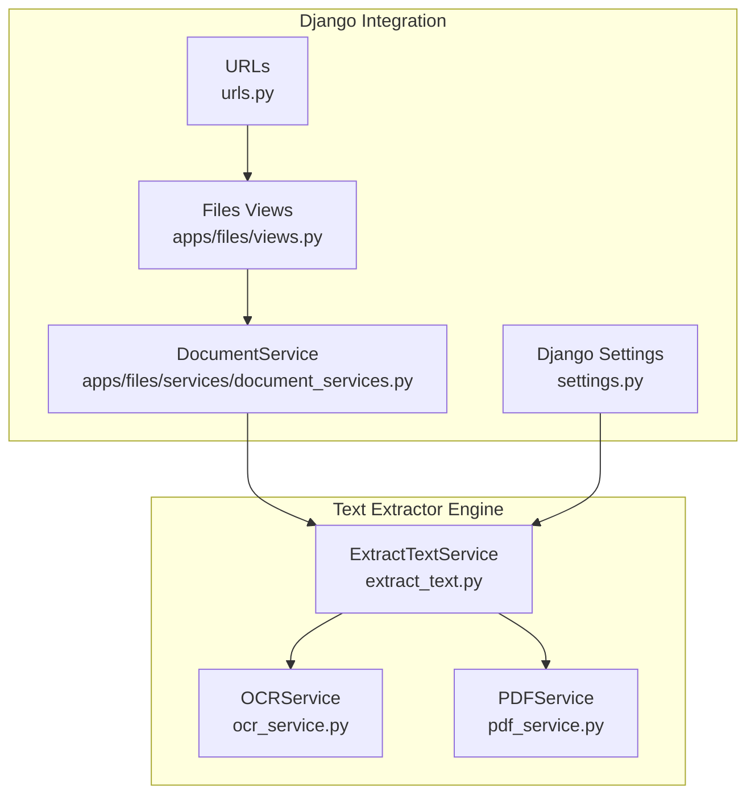
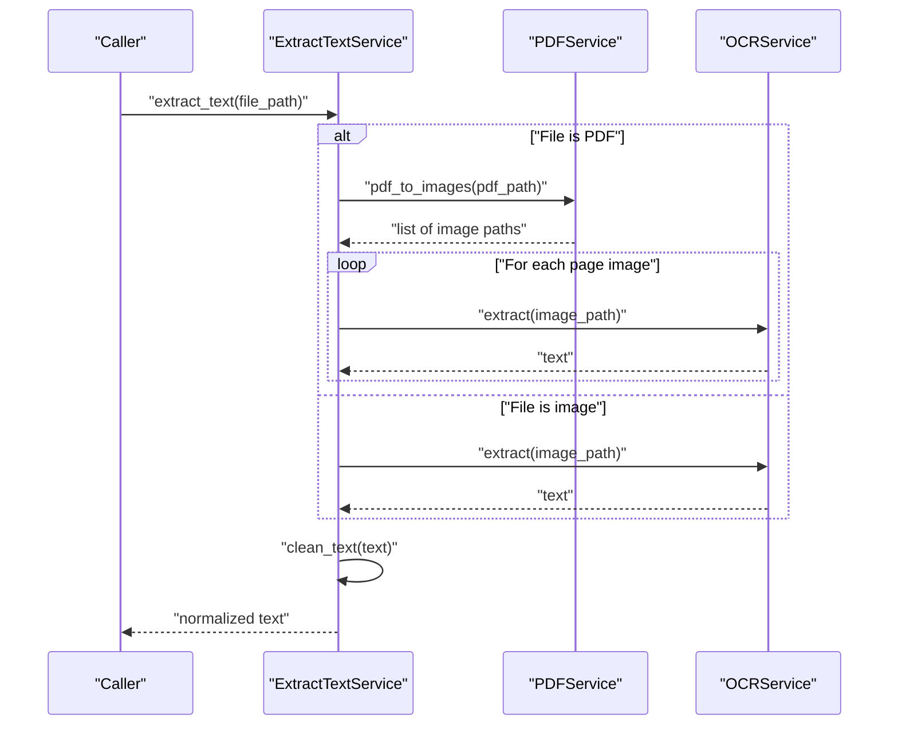
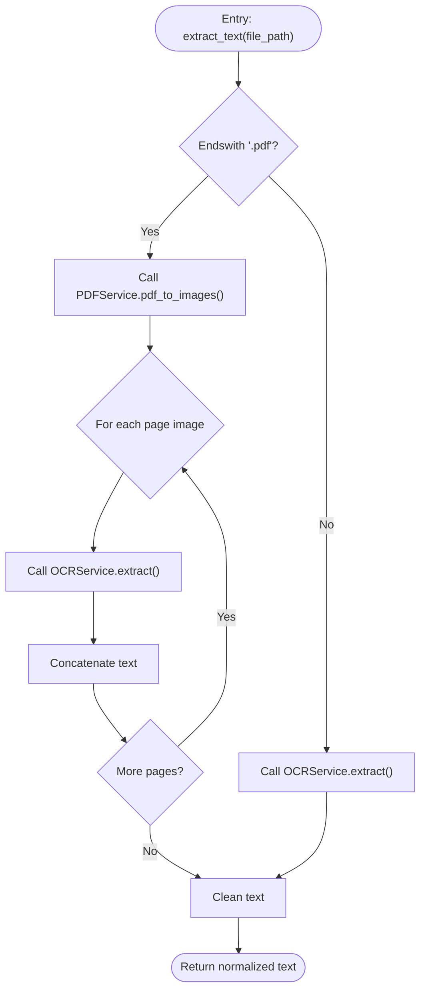
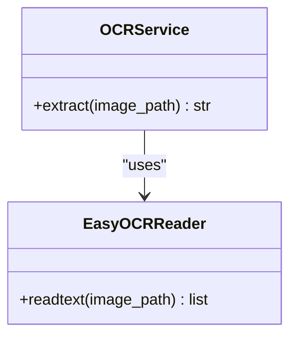
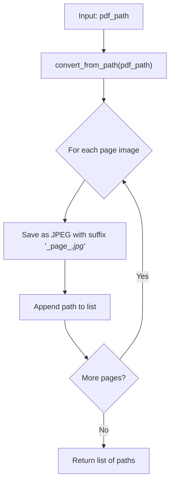
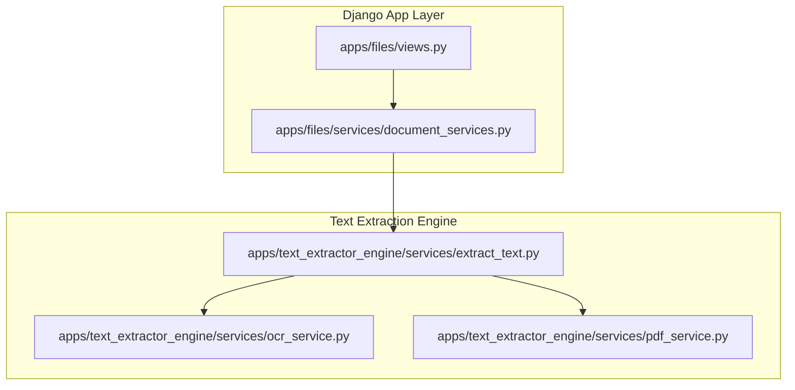
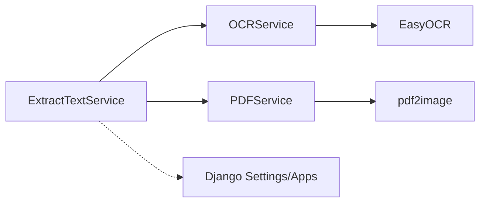

# Text Extraction Engine

<cite>
**Referenced Files in This Document**
- [extract_text.py](file://apps/text_extractor_engine/services/extract_text.py)
- [ocr_service.py](file://apps/text_extractor_engine/services/ocr_service.py)
- [pdf_service.py](file://apps/text_extractor_engine/services/pdf_service.py)
- [settings.py](file://config/settings.py)
- [urls.py](file://config/urls.py)
- [views.py](file://apps/files/views.py)
- [document_services.py](file://apps/files/services/document_services.py)
</cite>

## Table of Contents
1. [Introduction](#introduction)
2. [Project Structure](#project-structure)
3. [Core Components](#core-components)
4. [Architecture Overview](#architecture-overview)
5. [Detailed Component Analysis](#detailed-component-analysis)
6. [Dependency Analysis](#dependency-analysis)
7. [Performance Considerations](#performance-considerations)
8. [Troubleshooting Guide](#troubleshooting-guide)
9. [Conclusion](#conclusion)
10. [Appendices](#appendices)

## Introduction
This document describes the text extraction engine used by Veritas Shield. It focuses on the OCR service built with EasyOCR, PDF processing utilities powered by pdf2image, and the multi-format text extraction pipeline. The pipeline supports single-page and multi-page PDFs as well as direct image inputs. It also outlines error handling strategies, quality assurance measures, configuration options for OCR parameters and language support, and practical guidance for handling degraded images and mixed-content documents.

## Project Structure
The text extraction engine resides under the text extractor engine app and exposes three primary services:
- ExtractTextService orchestrates extraction across formats.
- OCRService wraps EasyOCR for text recognition.
- PDFService converts PDFs to images for OCR processing.

**Diagram sources**
- [extract_text.py:1-55](file://apps/text_extractor_engine/services/extract_text.py#L1-L55)
- [ocr_service.py:1-18](file://apps/text_extractor_engine/services/ocr_service.py#L1-L18)
- [pdf_service.py:1-15](file://apps/text_extractor_engine/services/pdf_service.py#L1-L15)
- [settings.py:1-155](file://config/settings.py#L1-L155)
- [urls.py:1-31](file://config/urls.py#L1-L31)
- [views.py:1-35](file://apps/files/views.py#L1-L35)
- [document_services.py:1-126](file://apps/files/services/document_services.py#L1-L126)

**Section sources**
- [extract_text.py:1-55](file://apps/text_extractor_engine/services/extract_text.py#L1-L55)
- [ocr_service.py:1-18](file://apps/text_extractor_engine/services/ocr_service.py#L1-L18)
- [pdf_service.py:1-15](file://apps/text_extractor_engine/services/pdf_service.py#L1-L15)
- [settings.py:1-155](file://config/settings.py#L1-L155)
- [urls.py:1-31](file://config/urls.py#L1-L31)
- [views.py:1-35](file://apps/files/views.py#L1-L35)
- [document_services.py:1-126](file://apps/files/services/document_services.py#L1-L126)

## Core Components
- ExtractTextService
  - Determines file type and dispatches to appropriate handler.
  - For PDFs: converts each page to an image and runs OCR per page.
  - For images: runs OCR directly.
  - Cleans extracted text by normalizing whitespace and removing escape sequences.
- OCRService
  - Initializes EasyOCR Reader with a default language set.
  - Extracts text lines and computes average confidence from OCR results.
- PDFService
  - Converts a PDF into a sequence of JPEG images, one per page.
  - Returns a list of generated image paths for subsequent OCR processing.

Key behaviors:
- Multi-page PDF handling: Iterates through page images and concatenates OCR results.
- Text normalization: Removes literal and actual escape sequences, collapses extra spaces, and trims output.

**Section sources**
- [extract_text.py:5-55](file://apps/text_extractor_engine/services/extract_text.py#L5-L55)
- [ocr_service.py:6-18](file://apps/text_extractor_engine/services/ocr_service.py#L6-L18)
- [pdf_service.py:4-15](file://apps/text_extractor_engine/services/pdf_service.py#L4-L15)

## Architecture Overview
The extraction pipeline follows a simple, layered design:
- Input detection: Determine whether the input is a PDF or an image.
- PDF conversion: Convert each page to an image using pdf2image.
- OCR processing: Run EasyOCR on each page image.
- Text aggregation: Concatenate per-page results and normalize output.

**Diagram sources**
- [extract_text.py:36-55](file://apps/text_extractor_engine/services/extract_text.py#L36-L55)
- [pdf_service.py:5-14](file://apps/text_extractor_engine/services/pdf_service.py#L5-L14)
- [ocr_service.py:8-17](file://apps/text_extractor_engine/services/ocr_service.py#L8-L17)

## Detailed Component Analysis

### ExtractTextService
Responsibilities:
- Orchestrates extraction across formats.
- Aggregates multi-page OCR results.
- Normalizes extracted text for downstream processing.

Processing logic highlights:
- PDF branch: Calls PDFService to produce page images, iterates over each image, and accumulates OCR text.
- Image branch: Directly calls OCRService.
- Cleaning: Replaces escape sequences with spaces, collapses multiple spaces, and trims.

**Diagram sources**
- [extract_text.py:36-55](file://apps/text_extractor_engine/services/extract_text.py#L36-L55)

**Section sources**
- [extract_text.py:5-55](file://apps/text_extractor_engine/services/extract_text.py#L5-L55)

### OCRService
Responsibilities:
- Performs OCR using EasyOCR.
- Computes average confidence across detected text lines.

Implementation notes:
- Uses a globally initialized EasyOCR Reader configured for a specific language.
- Returns recognized text joined by newlines.
- Confidence calculation averages per-line confidence scores.

**Diagram sources**
- [ocr_service.py:1-18](file://apps/text_extractor_engine/services/ocr_service.py#L1-L18)

**Section sources**
- [ocr_service.py:6-18](file://apps/text_extractor_engine/services/ocr_service.py#L6-L18)

### PDFService
Responsibilities:
- Converts a PDF into a sequence of JPEG images.
- Saves each page as a separate image file and returns the list of paths.

Behavior:
- Uses pdf2image.convert_from_path to render pages.
- Names output images using the original PDF path plus a page index suffix.

**Diagram sources**
- [pdf_service.py:5-14](file://apps/text_extractor_engine/services/pdf_service.py#L5-L14)

**Section sources**
- [pdf_service.py:4-15](file://apps/text_extractor_engine/services/pdf_service.py#L4-L15)

### Integration with Django and Document Workflows
- The text extraction engine is part of the text extractor engine app and is integrated into higher-level document processing via DocumentService.
- Django URL configuration includes the files app, which exposes document-related endpoints; the text extractor engine is leveraged by document processing flows.

**Diagram sources**
- [views.py:1-35](file://apps/files/views.py#L1-L35)
- [document_services.py:1-126](file://apps/files/services/document_services.py#L1-L126)
- [extract_text.py:1-55](file://apps/text_extractor_engine/services/extract_text.py#L1-L55)
- [ocr_service.py:1-18](file://apps/text_extractor_engine/services/ocr_service.py#L1-L18)
- [pdf_service.py:1-15](file://apps/text_extractor_engine/services/pdf_service.py#L1-L15)

**Section sources**
- [urls.py:23-30](file://config/urls.py#L23-L30)
- [views.py:17-35](file://apps/files/views.py#L17-L35)
- [document_services.py:16-126](file://apps/files/services/document_services.py#L16-L126)

## Dependency Analysis
- Internal dependencies:
  - ExtractTextService depends on OCRService and PDFService.
  - OCRService depends on EasyOCR.
  - PDFService depends on pdf2image.
- External dependencies:
  - EasyOCR for OCR.
  - pdf2image for PDF-to-image conversion.
- Django integration:
  - The text extractor engine is installed as an app and is used by document services and views.

**Diagram sources**
- [extract_text.py:1-55](file://apps/text_extractor_engine/services/extract_text.py#L1-L55)
- [ocr_service.py:1-18](file://apps/text_extractor_engine/services/ocr_service.py#L1-L18)
- [pdf_service.py:1-15](file://apps/text_extractor_engine/services/pdf_service.py#L1-L15)
- [settings.py:26-40](file://config/settings.py#L26-L40)

**Section sources**
- [extract_text.py:1-55](file://apps/text_extractor_engine/services/extract_text.py#L1-L55)
- [ocr_service.py:1-18](file://apps/text_extractor_engine/services/ocr_service.py#L1-L18)
- [pdf_service.py:1-15](file://apps/text_extractor_engine/services/pdf_service.py#L1-L15)
- [settings.py:26-40](file://config/settings.py#L26-L40)

## Performance Considerations
- Batch processing:
  - Multi-page PDFs are processed page-by-page; consider batching page conversions and OCR calls for very large PDFs to reduce overhead.
- Memory and disk:
  - PDFService writes intermediate JPEGs to disk; ensure sufficient disk space and monitor temporary file cleanup.
- Language model initialization:
  - Initializing EasyOCR can be expensive; the current implementation initializes a global reader. For multi-language support or dynamic language switching, consider lazy initialization or reconfiguration strategies.
- Parallelization:
  - Current implementation is sequential. For improved throughput, consider parallelizing OCR calls per page image.
- Preprocessing:
  - Applying preprocessing steps (e.g., contrast enhancement, binarization) before OCR can improve accuracy on degraded images.

[No sources needed since this section provides general guidance]

## Troubleshooting Guide
Common issues and solutions:
- Skewed pages:
  - Apply geometric correction or rotation correction before OCR to align text lines.
- Low-quality scans:
  - Enhance contrast, apply noise reduction, and consider binarization to improve OCR accuracy.
- Mixed content documents:
  - Segment content into text and non-text regions; run OCR only on text areas.
- Language mismatch:
  - Configure EasyOCR to use appropriate languages or language packs for the target content.
- Performance bottlenecks:
  - Reduce resolution of input images, process pages in batches, or enable parallel OCR processing.
- Disk space constraints:
  - Ensure adequate storage for intermediate page images; consider cleaning up temporary files after processing.

[No sources needed since this section provides general guidance]

## Conclusion
The text extraction engine integrates EasyOCR and pdf2image to deliver robust multi-format text extraction. ExtractTextService coordinates PDF conversion and OCR, while OCRService and PDFService encapsulate the core OCR and PDF processing logic. The design is modular and extensible, enabling future enhancements such as multi-language support, parallel processing, and advanced preprocessing for degraded content.

[No sources needed since this section summarizes without analyzing specific files]

## Appendices

### Practical Examples
- Extracting text from a PDF:
  - Call ExtractTextService.extract_text with the PDF path. The service converts each page to an image and runs OCR per page, returning normalized text.
- Extracting text from an image:
  - Call ExtractTextService.extract_text with the image path. The service runs OCR directly and returns normalized text.
- Handling degraded images:
  - Preprocess images to improve contrast and readability before passing them to ExtractTextService.extract_text.

[No sources needed since this section provides general guidance]

### Configuration Options
- Language support:
  - The EasyOCR Reader is initialized with a default language set. To support additional languages, configure the Reader accordingly.
- Performance tuning:
  - Adjust EasyOCR parameters (e.g., GPU usage, model selection) and tune PDFService output resolution to balance accuracy and speed.
- Quality assurance:
  - Use confidence thresholds to filter low-confidence OCR results; post-process text to remove artifacts and normalize spacing.

[No sources needed since this section provides general guidance]